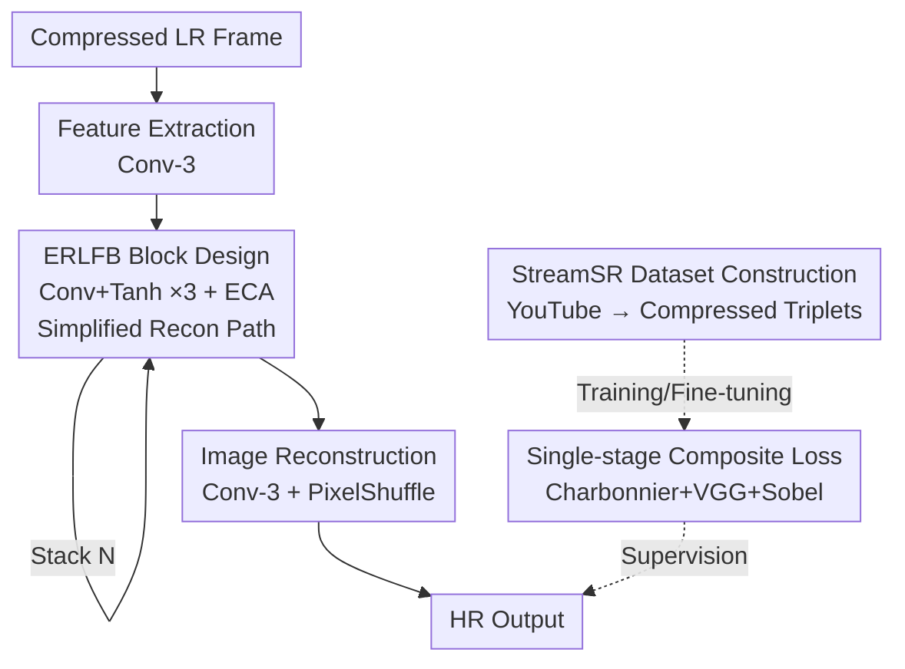

# Exploring Real-Time Super-Resolution: Benchmarking and Fine-Tuning for Streaming Content

**Conference**: ICLR 2026  
**OpenReview**: [https://openreview.net/forum?id=HIG7riDJ9N](https://openreview.net/forum?id=HIG7riDJ9N)  
**Code**: https://github.com/EvgeneyBogatyrev/EfRLFN  
**Area**: Image Restoration / Real-Time Super-Resolution  
**Keywords**: Real-Time Super-Resolution, Streaming, Compression Artifacts, Lightweight Networks, Benchmark Datasets

## TL;DR
Addressing the compressed streaming video super-resolution scenario ignored by existing datasets, this paper constructs StreamSR, a dataset of 5200 compressed video segments collected from YouTube. It systematically evaluates 11 real-time SR models and proposes EfRLFN, a lightweight model based on RLFN featuring tanh activation, ECA attention, and composite loss. EfRLFN achieves a new quality-complexity SOTA while maintaining real-time frame rates (271 FPS).

## Background & Motivation
**Background**: Real-time super-resolution (SR) has gained significant attention due to the explosion of video streaming platforms (YouTube, Twitch, Netflix). The NTIRE series challenges have promoted various lightweight models (RLFN, SPAN, Bicubic++, RT4KSR, etc.), and NVIDIA has integrated VSR into GPU drivers. These models aim to achieve 30+ FPS on consumer GPUs while maximizing image quality.

**Limitations of Prior Work**: In reality, streaming videos are **heavily compressed** by codecs, introducing artifacts like blocking, blurring, and loss of detail. However, most real-time SR models are trained on **clean HR-LR pairs** from datasets like DIV2K or Vimeo90K, and thus fail to handle compression degradation. Consequently, models performing well on standard benchmarks struggle with real-world streaming content—NVIDIA VSR tends to over-smooth textures, and models like SPAN or RLFN are not optimized for compression.

**Key Challenge**: There is a **disconnection** between evaluation benchmarks and real-world deployment scenarios. Existing UGC datasets either lack aligned LR-HR pairs (YouTube-8M, Kinetics, YouTube-VOS) or lack natural compression degradation (REDS, Vimeo90K), leading to "top benchmark rankings" that do not translate to effectiveness in streaming scenarios.

**Goal**: The objective is divided into three sub-problems: (1) Construct a dataset representative of streaming scenarios; (2) Conduct a fair cross-evaluation of existing real-time SR models; (3) Design a real-time SR model specifically for compressed content.

**Key Insight**: Recognizing that video SR models are often too heavy for real-time performance, the authors treat the task as **image super-resolution** (frame-by-frame processing). The focus is shifted toward combining validated effective components from existing architectures and optimizing inference efficiency rather than stacking complex temporal modules.

**Core Idea**: By combining a "compressed streaming dataset + lightweight image SR network (tanh+ECA) + composite loss single-stage training," the authors transition real-time SR from clean data to real streaming scenarios. They demonstrate that fine-tuning existing models on this dataset yields significant performance gains.

## Method

### Overall Architecture
The paper follows two main threads: **Data and Benchmarking** (StreamSR dataset + evaluation of 11 models) and **Modeling** (EfRLFN). The EfRLFN model takes a compressed low-resolution frame as input, passes it through a $3\times3$ convolutional feature extractor, followed by a series of Efficient Residual Local Feature Blocks (ERLFB) for feature refinement, and finally a PixelShuffle upsampling layer for HR reconstruction. The network is trained end-to-end in a single stage using a composite loss (Charbonnier + VGG + Sobel). While the backbone follows RLFN, modifications are made to the ERLFB (tanh activation + ECA attention + streamlined reconstruction path) and the training pipeline.

The StreamSR dataset construction is the other core contribution: using GPT-4o to generate search terms, downloading videos under CC BY 4.0 from YouTube, and aligning them into 360p/720p/1440p compressed triplets. The final dataset includes 5200 videos and over 10M frames, supporting $2\times$ (720p→1440p) and $4\times$ (360p→1440p) tracks.

### Key Designs

**1. StreamSR: Replacing Clean HR-LR Pairs with Real Compressed Triplets**

To address the lack of streaming compression artifacts in existing datasets, the authors collect real encoded videos from YouTube. This ensures LR inputs contain natural degradations like blocking and blurring. The process involves generating 100 diverse search terms across 20 topics (nature, cities, sports, animation, etc.) using GPT-4o. Only CC BY 4.0 videos with stable frame rates and available 360p/720p/1440p streams are selected. Clustering via K-Means (using SI, TI, bitrate, and SigLIP embeddings) ensures test set diversity. The resulting 5200 segments exhibit a broader quality distribution (MDTVSFA 0.41–0.61) than REDS or Vimeo90K.

**2. ERLFB Block: Tanh Activation + ECA Attention + Simplified Reconstruction Path**

These modifications aim to maximize inference efficiency without sacrificing quality. First, **ReLU is replaced by tanh**. Based on observations that odd-symmetric activations (like $\text{Sigmoid}(x)-0.5$ or $\tanh$) preserve both **magnitude and sign** of features, tanh prevents the loss of directional information in attention maps, improving feature refinement. Second, the Enhanced Spatial Attention (ESA) in RLFN is replaced by **Efficient Channel Attention (ECA)**. ECA uses global average pooling and a $1\times1$ convolution, reducing computation from approximately 686 MFlops to 13 MFlops without quality loss. Third, the **reconstruction path is streamlined** by removing redundant skip connections and simplifying feature smoothing to a single $3\times3$ convolution, reducing computational fragmentation. Together, these changes make EfRLFN ~15% faster than RLFN, reducing GFlops from 20.53 to 19.86 and parameters from 82.6K to 75.9K.

**3. Composite Loss + Single-stage Training: Replacing RLFN’s Two-stage Contrastive Loss**

RLFN uses a two-stage training with contrastive loss, which is sensitive to feature extraction layers. This paper adopts a three-part composite loss:
$$L = \lambda_{Charb}L_{Charb} + \lambda_{VGG}L_{VGG} + \lambda_{Sobel}L_{Sobel}$$
$L_{Charb}=\sqrt{\lVert I_{HR}-I_{SR}\rVert^2+\epsilon^2}$ ensures pixel-level fidelity and robustness to outliers. $L_{VGG}=\lVert\phi_{VGG}(I_{HR})-\phi_{VGG}(I_{SR})\rVert_1$ (using VGG-19 conv5_4) provides perceptual supervision without complex pair matching. $L_{Sobel}=\lVert S(I_{HR})-S(I_{SR})\rVert_2^2$ explicitly constrains the gradient map to optimize edge sharpness. This allows for **single-stage end-to-end** training, reducing training time by ~16% while achieving higher quality.

### Loss & Training
The composite loss $L=\lambda_{Charb}L_{Charb}+\lambda_{VGG}L_{VGG}+\lambda_{Sobel}L_{Sobel}$ balances reconstruction fidelity, perceptual consistency, and edge sharpness. Unlike RLFN's two-stage process, this method uses a single-stage approach. Ablation studies show that the combination of all three terms yields the best SSIM (0.865 for $4\times$ SR), outperforming single-term or standard L1/L2/LPIPS losses. For benchmarking, all models are pre-trained or fine-tuned on the StreamSR training set for fair comparison.

## Key Experimental Results

### Main Results
$2\times$ SR track evaluation (StreamSR test set + standard benchmarks; "T" denotes fine-tuning on StreamSR; Subj. denotes Bradley-Terry subjective score):

| Method | Subj.↑ | PSNR↑ | LPIPS↓ | CLIP-IQA↑ | FPS↑ |
| :--- | :--- | :--- | :--- | :--- | :--- |
| NVIDIA VSR | 2.57 | 37.40 | 0.082 | 0.56 | 52 |
| RLFN_T | 2.69 | 37.63 | 0.072 | 0.58 | 225 |
| SPAN_T | 3.13 | 37.73 | 0.063 | 0.61 | 60 |
| **EfRLFN_T (Ours)** | **3.33** | **37.85** | **0.059** | **0.65** | 271 |
| Real-ESRGAN (Non-RT) | 3.87 | 37.65 | 0.048 | 0.66 | 9 |
| BasicVSR++ (Non-RT) | 4.87 | 38.05 | 0.037 | 0.70 | 15 |

EfRLFN achieves the best subjective scores and metrics (PSNR, LPIPS, CLIP-IQA) among real-time models, with a frame rate of 271 FPS. In subjective pairwise comparisons, users preferred EfRLFN over NVIDIA VSR in **77.4%** of cases. Non-real-time models provide higher quality but operate at single-digit frame rates.

### Ablation Study
Activation Function × Attention Module ($4\times$ track):

| Activation | Attention | SSIM↑ | LPIPS↓ | FPS↑ | Params↓ |
| :--- | :--- | :--- | :--- | :--- | :--- |
| **tanh** | **ECA** | **0.865** | 0.173 | **314** | **0.37M** |
| tanh | ESA | 0.863 | **0.171** | 234 | 0.40M |
| $\text{Sigmoid}-0.5$ | ECA | 0.856 | 0.179 | 305 | 0.37M |
| ReLU | ECA | 0.847 | 0.184 | 303 | 0.37M |

The tanh+ECA combination is optimal across SSIM, FPS, and parameters. Replacing tanh with $\text{Sigmoid}-0.5$ or ReLU leads to a significant drop in SSIM.

### Key Findings
- **Activation is a key variable**: Tanh (odd-symmetric) preserves more high-frequency features in ERLFB blocks compared to ReLU, which discards negative activations and results in inferior feature quality.
- **Three-term loss is essential**: Removing Charbonnier or VGG terms harms SSIM convergence. Single-stage training reduces time by 16% compared to two-stage RLFN.
- **Fine-tuning boosts generalization**: Fine-tuning on StreamSR significantly improves both objective and subjective metrics for older models like SPAN and ESPCN, with gains transferring to standard benchmarks like BSD100.
- **Deployment validation**: When exported to ONNX and run with TensorRT, EfRLFN shows lower latency than RLFN and consistently exceeds 30 FPS.

## Highlights & Insights
- **Addressing Evaluation Disconnect**: Rather than just tuning a model, the authors highlight the gap between "clean datasets" and "streaming scenarios." The "fix the benchmark, then fix the model" approach is highly valuable.
- **Utility of Odd-Symmetric Activation**: Using tanh to preserve sign and magnitude is a low-cost trick that yields visible high-frequency detail gains, applicable to other lightweight restoration networks.
- **Composite Loss as a Contrastive Alternative**: Using VGG perceptual and Sobel edge losses replaces the need for complex pair matching in contrastive learning, simplifying the training pipeline.
- **Empirical Value of Fine-tuning**: Demonstrating that the dataset itself serves as a universal fine-tuning set to improve existing models amplifies the contribution's impact.

## Limitations & Future Work
- **Frame-by-frame SR**: To maintain real-time speeds, EfRLFN ignores temporal建模, which may lead to inter-frame flickering in highly dynamic scenes.
- **Dataset Constraints**: StreamSR depends on YouTube's encoding; generalization to different compression pipelines (e.g., low-latency live encoding) remains to be verified.
- **Loss Weights**: The selection of $\lambda$ weights was not exhaustively analyzed; adaptive weighting might provide further improvements.
- **Subjective Evaluation Costs**: While the user study with 3822 participants is robust, pairwise comparisons are expensive and difficult to replicate frequently.

## Related Work & Insights
- **vs. RLFN**: EfRLFN modifies the RLFN backbone by introducing ERLFB (ReLU→tanh, ESA→ECA) and a single-stage composite loss, resulting in faster inference (+15%) and shorter training (−16%) with higher quality.
- **vs. SPAN**: While SPAN uses parameter-free symmetric activation attention, EfRLFN utilizes the "sign preservation" insight with tanh while adopting ECA for channel attention, outperforming SPAN_T on StreamSR.
- **vs. NVIDIA VSR**: Although integrated into drivers, NVIDIA VSR often over-smoothes. EfRLFN wins in 77.4% of user comparisons, proving that compression-targeted design is more effective.
- **vs. Compression-Aware Video SR**: Methods like CAVSR or TAVSR use codec features but are too heavy for real-time use. This paper takes a practical "lightweight image SR + real compressed data" path.

## Rating
- Novelty: ⭐⭐⭐⭐ Model modifications are combinatorial optimizations, but the problem definition and StreamSR data contribution are highly valuable.
- Experimental Thoroughness: ⭐⭐⭐⭐⭐ Comprehensive cross-evaluation (11 models, 7 metrics), large-scale user study (3822 people), and deployment validation.
- Writing Quality: ⭐⭐⭐⭐ Clear structure with well-explained dataset construction and model modifications.
- Value: ⭐⭐⭐⭐⭐ StreamSR is a significant contribution to the community, and the "fine-tuning gain" conclusion is highly practical.

<!-- RELATED:START -->

## Related Papers

- [\[CVPR 2026\] DNF-SR: Dual-Input and Negative-Aware Feature Fine-Tuning for Real-World Image Super-Resolution](../../CVPR2026/image_restoration/dnf-sr_dual-input_and_negative-aware_feature_fine-tuning_for_real-world_image_su.md)
- [\[ICLR 2026\] Test-Time Domain Generalization for Image Super-Resolution](test-time_domain_generalization_for_image_super-resolution.md)
- [\[ICLR 2026\] Learning Heterogeneous Degradation Representation for Real-World Super-Resolution](learning_heterogeneous_degradation_representation_for_real-world_super-resolutio.md)
- [\[ICLR 2026\] Improved Adversarial Diffusion Compression for Real-World Video Super-Resolution](improved_adversarial_diffusion_compression_for_real-world_video_super-resolution.md)
- [\[ICLR 2026\] VARestorer: One-Step VAR Distillation for Real-World Image Super-Resolution](varestorer_one-step_var_distillation_for_real-world_image_super-resolution.md)

<!-- RELATED:END -->
