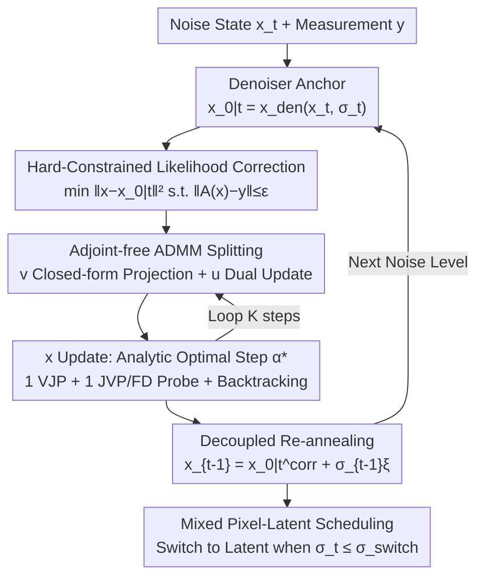

# FAST-DIPS: Adjoint-Free Analytic Steps and Hard-Constrained Likelihood Correction for Diffusion-Prior Inverse Problems

**Conference**: ICLR 2026  
**OpenReview**: [https://openreview.net/forum?id=voMeZVAkKL](https://openreview.net/forum?id=voMeZVAkKL)  
**Code**: The paper states it will be made public (See § of the original text for code and data; no specific repository link provided yet)  
**Area**: Diffusion Models / Image Restoration (Inverse Problems)  
**Keywords**: Diffusion Prior, Inverse Problems, Adjoint-free, ADMM, Analytic Steps

## TL;DR
FAST-DIPS replaces expensive inner MCMC or multi-step gradient loops in training-free diffusion inverse problem solvers with a set of "adjoint-free hard-constrained likelihood corrections." For each noise level, it performs a few-step ADMM correction near the denoiser prediction using closed-form projections and analytically optimal step sizes. This minimizes the per-layer computational budget while achieving comparable or better quality across eight linear/nonlinear restoration tasks, with speedups up to 19.5×.

## Background & Motivation
**Background**: Using pre-trained diffusion models as priors to solve inverse problems $y=A(x_0)+n$ without retraining (e.g., deblurring, super-resolution, inpainting, phase retrieval, HDR) is currently a mainstream approach. These training-free solvers start from an unconditional diffusion prior and inject the measurement $y$ into the reverse denoising trajectory through "data consistency or likelihood updates" to approximate the posterior $p(x\mid y)\propto p(y\mid x)p(x)$.

**Limitations of Prior Work**: The key lies in how "data consistency" is enforced. For a small number of linear degradations, likelihood updates have closed-form structures (relying on explicit adjoint operators, pseudo-inverses, or SVD). However, when $A$ is a complex, ill-conditioned, or simulator-style nonlinear forward operator lacking a closed-form adjoint or pseudo-inverse, the likelihood step usually degrades into an **inner iterative solver**. These run many gradient steps on the data fidelity objective or attach a Langevin/MCMC sub-chain, requiring conservative small step sizes for stability. Consequently, each noise level requires repeated calls to $A$ and its gradient, along with repeated evaluations of the denoiser/score, leading to extremely high wall-clock times (e.g., DAPS for nonlinear deblurring takes 1453 seconds per image on ImageNet).

**Key Challenge**: The cost of the inner loop (number of steps × operator/gradient calls per step) is tied to the reconstruction quality—stability requires many small steps, while speed sacrifices consistency. Furthermore, there is an orthogonal trade-off between **pixel space and latent space**. Latent diffusion reduces sampling costs, but if fidelity is defined in pixel space, latent likelihood updates require backpropagation through the decoder $D$ to compute $\nabla_z\lVert A(D(z))-y\rVert^2$, making decoder backpropagation a throughput bottleneck.

**Goal**: To create a training-free solver that simultaneously satisfies three criteria: (i) enforces data consistency without relying on operator-specific primitives (manual adjoints/pseudo-inverses/SVD); (ii) maintains competitive quality with a lightweight, fixed small budget per layer (fewer inner steps/operator calls); (iii) balances pixel- and latent-space computation, trading early throughput for late-stage fidelity.

**Key Insight**: Reformulate "likelihood correction" as a **hard-constrained MAP problem centered at the denoiser prediction**. Instead of using a quadratic penalty $\lambda\lVert A(x)-y\rVert^2$ which requires parameter tuning and is sensitive to noise, the method uses an interpretable "residual budget" $\varepsilon$ to define a feasible sphere in the measurement space $\lVert A(x)-y\rVert\le\varepsilon$. The projection onto this set is closed-form. Combined with an analytically "model-optimal" step size for the current subproblem, the inner loop can be reduced to a few deterministic updates.

**Core Idea**: Replace "inner MCMC or multi-step gradients" with "few-step ADMM splitting using closed-form measurement space projections and analytic optimal step sizes." The process only uses Vector-Jacobian Products (VJPs) provided by automatic differentiation (along with a JVP or a single forward-difference probe), requiring no manual adjoints, thereby solving nonlinear diffusion inverse problems with a minimal fixed budget.

## Method

### Overall Architecture
The reverse sampling of FAST-DIPS performs a "correct-then-noise" update at each noise level $t$, consisting of three components: (1) **Anchor**: The prediction of the pre-trained denoiser $x_{0\mid t}=x_{\text{den}}(x_t,\sigma_t)$ is used directly as the center of a local Gaussian prior. (2) **Adjoint-free Hard-Constrained Correction**: Within a trust region centered at $x_{0\mid t}$, the measurement residual is forced into the feasible sphere $\lVert A(x)-y\rVert\le\varepsilon$. This is solved using a few-step ADMM split, where the measurement variable is updated via closed-form projection and the image variable is updated via steepest descent with an analytic step size $\alpha^\star$. (3) **Decoupled Re-annealing**: After correction, Gaussian noise for the next variance level is injected, $x_{t-1}=x_{0\mid t}^{\text{corr}}+\sigma_{t-1}\xi$, decoupling the "measurement-aware update" from "diffusion noise injection."

The derivation is built on the conditional decomposition $p(x_0\mid x_t,y)\propto p(x_0\mid x_t)\,p(y\mid x_0)$ with two modeling choices: for the prior, a local Gaussian (Laplace) proxy $\tilde p_t(x_0\mid x_t)\propto\exp(-\frac{1}{2\gamma_t}\lVert x_0-x_{0\mid t}\rVert^2)$ is used, where $\gamma_t=\sigma_t^2$ allows the trust region to tighten during annealing; for the likelihood, a set-valued proxy $\tilde\ell_\varepsilon(y\mid x_0)\propto \mathbf 1\{\lVert A(x_0)-y\rVert\le\varepsilon\}$ is used. Taking the mode of their product yields the hard-constrained proximal problem to be solved at each layer.

### Key Designs

**1. Hard-Constrained Feasibility Likelihood: Indicator Sets instead of Quadratic Penalties**

Addressing the pain point where the quadratic penalty $\lambda\lVert A(x)-y\rVert^2$ requires weight tuning and is sensitive to noise calibration errors, FAST-DIPS replaces the Gaussian likelihood $p(y\mid x_0)\propto\exp(-\frac{1}{2\beta^2}\lVert A(x_0)-y\rVert^2)$ with a set-valued proxy under the AWGN assumption. The statistical reasoning: if the noise standard deviation $\beta$ is known, the $(1-\delta)$ confidence region for the residual $A(x_0)-y$ is precisely the Euclidean ball $\{v:\lVert v-y\rVert\le\varepsilon\}$, where $\varepsilon=\beta\sqrt{\chi^2_{m,1-\delta}}$. If $\beta$ is unknown, profiling it out yields $-\log p(y\mid x_0,\hat\beta)\propto m\log\lVert A(x_0)-y\rVert$, which is a monotonic function of the residual norm, also pointing toward "compressing the residual into a budget $\varepsilon$." Both paths lead to the indicator likelihood $\tilde\ell_\varepsilon$, resulting in the hard-constrained proximal problem for each layer:

$$x_{0\mid t}^{\text{corr}}\in\arg\min_{x}\ \frac{1}{2\gamma_t}\lVert x-x_{0\mid t}\rVert^2\quad\text{s.t.}\quad \lVert A(x)-y\rVert\le\varepsilon.$$

The first term is the trust region (anchored to the denoiser estimate), and the constraint term defines "measurement feasibility" as a budget $\varepsilon$ with clear physical meaning (user-specified data consistency tolerance) rather than a $\lambda$ requiring grid search. The essential difference from PnP-ADMM is that the denoiser is **not** treated as a (proxy) proximal operator; it only provides the anchor, while the hard constraint is enforced explicitly by projection.

**2. Adjoint-free ADMM Splitting + Closed-form Measurement Ball Projection: Replacing MCMC with Deterministic Iterations**

Directly solving the above constrained problem requires the operator's inverse or adjoint. FAST-DIPS uses variable splitting to bypass this: introducing an auxiliary variable $v\approx A(x)$ and a feasible set $C=\{v:\lVert v-y\rVert\le\varepsilon\}$, the problem becomes $\min_{x,v}\frac{1}{2\gamma_t}\lVert x-x_{0\mid t}\rVert^2+\iota_C(v)$ s.t. $A(x)-v=0$, solved via scaled ADMM. The $v$-update is a **closed-form radial contraction projection**—simply pulling $w=A(x)+u$ back to the sphere at almost zero cost:

$$\Pi_C(w)=\begin{cases}w,&\lVert w-y\rVert\le\varepsilon\\ y+\varepsilon\dfrac{w-y}{\lVert w-y\rVert},&\text{otherwise}\end{cases}$$

The dual variable $u\leftarrow u+A(x)-v$ is also $\mathcal{O}(1)$. Critically, the method only runs a small fixed number of $K$ steps and does **not solve the $x$-subproblem exactly**—instead, it uses the steepest descent with an analytic step size from Design 3. Each correction iteration requires: one forward pass of $A$ (often cached), one VJP to form $J_A(x)^\top(A(x)-b_k)$, and one JVP or forward probe. Feasibility is strictly enforced on the split variable $v$ via projection ($v_k\in C$), while ADMM coupling drives $A(x_k)\approx v_k$. The entire path uses no manual adjoints or inner MCMC, resulting in an order of magnitude fewer function calls than long gradient or MCMC inner loops.

**3. Analytic Model-Optimal Step Size + Backtracking: Eliminating Learning Rate Hyperparameters**

The smooth objective for the $x$-subproblem is $F(x)=\frac{1}{2\gamma_t}\lVert x-x_{0\mid t}\rVert^2+\frac{\rho}{2}\lVert A(x)-b_k\rVert^2$, with gradient $g=\frac{1}{\gamma_t}(x-x_{0\mid t})+\rho J_A(x)^\top(A(x)-b_k)$. Instead of using Adam and tuning learning rates, FAST-DIPS linearizes $A$ along the descent direction $A(x-\alpha g)\approx A(x)-\alpha J_A(x)g$ to obtain a 1D quadratic model. Its exact minimum provides the **analytic step size**:

$$\alpha^\star=\frac{\frac{1}{\gamma_t}\langle s,g\rangle+\rho\langle r,J_A(x)g\rangle}{\frac{1}{\gamma_t}\lVert g\rVert^2+\rho\lVert J_A(x)g\rVert^2},\qquad s:=x-x_{0\mid t},\ r:=A(x)-b_k.$$

The paper proves the numerator simplifies to $\lVert g\rVert^2$, so $\alpha^\star\ge 0$ when $g\neq 0$. Proposition 1 further guarantees that using $\alpha^\star$ to initialize Armijo backtracking line search ensures monotonic descent of the $x$-subproblem objective, even if the linearization is only locally accurate. Calculating $\alpha^\star$ requires one forward $A$ (for $r$), one VJP (for $g$), and one JVP (for $J_A(x)g$). When forward-mode JVP is unavailable, a single forward-difference probe $J_A(x)g\approx\frac{A(x+\eta g)-A(x)}{\eta}$ is used instead. This step completely removes "step size hyperparameters," serving as the primary source of stability and efficiency.

**4. Latent Space Variant + One-Switch Pixel-to-Latent Hybrid Scheduling: Early Savings, Late Fidelity**

To balance the cost-effectiveness of latent diffusion with pixel-space fidelity, FAST-DIPS adapts the per-layer construction to latent space by replacing $A \mapsto A \circ D$ (where $D$ is a pre-trained decoder). The same local Gaussian proxy ($\gamma_z=\sigma_t^2$), hard measurement constraint $\lVert A(D(z))-y\rVert\le\varepsilon_z$, ADMM splitting, projection, and analytic step size are applied via the chain rule and automatic differentiation through $D$ and $A$. However, latent-space correction is expensive due to decoder backpropagation. Thus, a **one-switch hybrid schedule** is used: early on (large $\sigma_t$), cheap pixel-space corrections are performed (avoiding decoder backprop); once $\sigma_t\le\sigma_{\text{switch}}$, it switches to latent-space correction to better align with the learned manifold. This "early cheap, late faithful" strategy uses only one switching hyperparameter $\sigma_{\text{switch}}$.

## Key Experimental Results

### Main Results
Evaluated on 100 FFHQ images (256×256) and 100 ImageNet images (256×256) across eight inverse problem types (five linear + three nonlinear) with measurement noise $\beta=0.05$. Metrics: PSNR / SSIM / LPIPS + average runtime per image. Selected results for FFHQ:

| Task | Method | PSNR↑ | SSIM↑ | LPIPS↓ | Runtime (s)↓ |
|------|------|-------|-------|--------|-----------|
| Gaussian deblur (Pixel) | DAPS | 28.895 | 0.775 | 0.253 | 50.40 |
| Gaussian deblur (Pixel) | SITCOM | 28.775 | 0.820 | 0.261 | 32.84 |
| Gaussian deblur (Pixel) | **Ours** | **29.406** | **0.836** | **0.247** | **2.61** |
| Motion deblur (Pixel) | SITCOM | 31.172 | 0.872 | 0.203 | 36.68 |
| Motion deblur (Pixel) | **Ours** | **31.736** | **0.878** | **0.171** | **2.62** |
| Phase retrieval (Pixel) | DAPS | 30.253 | 0.801 | 0.202 | 122.10 |
| Phase retrieval (Pixel) | **Ours** | 29.253 | **0.851** | 0.218 | **10.35** |
| Inpaint random (Latent) | ReSample | 29.950 | 0.842 | 0.201 | 278.50 |
| Inpaint random (Latent) | **Ours** | 30.091 | **0.877** | 0.201 | **45.34** |

Core Conclusions: Quality in pixel space is comparable or superior across almost all tasks, but runtime is significantly lower—approximately 19.4× faster than DAPS on Gaussian/Motion deblurring (FFHQ) and 20.8× faster than SITCOM (ImageNet). Nonlinear phase retrieval is about 11.8× (FFHQ) / 19.3× (ImageNet) faster than DAPS with higher SSIM. Latent space benefits from the hybrid schedule, bypassing the decoder backprop bottleneck and running several times faster than ReSample/LatentDAPS.

### Ablation Study
The study investigates two internal factors under matched computational budgets:

| Dimension | Configuration | Conclusion |
|------|------|------|
| Projection | ADMM + proj. (Default) vs QDP (Penalty solution) | Projection enforces feasibility and **consistently improves quality** under matching budgets. |
| Step Size | Tuned const $\alpha$ vs Analytic $\alpha^\star$ vs Forward Difference $\alpha_{\text{FD}}$ | $\alpha_{\text{FD}}$ cheaply approximates $\alpha^\star$ in linear pixel tasks (Gaussian blur); nonlinear latent tasks (HDR) are sensitive to fixed steps, where JVP-based $\alpha^\star$ is most robust. |

### Key Findings
- **Practical Recipe**: Use $\alpha_{\text{FD}}$ for pixel space (saving one JVP) and $\alpha^\star$ for latent space (more robust).
- A predictable monotonic trade-off exists between computation and quality: more correction steps lead to better reconstruction.
- Speedup is greatest for tasks where baseline inner loops are heaviest (nonlinear deblurring).

## Highlights & Insights
- **"Hard Constraint + Closed Projection" replaces "Soft Penalty + Weight Tuning"**: It transforms data consistency from a $\lambda$ requiring grid search into a residual budget $\varepsilon$ with statistical meaning. The projection is zero-cost and naturally robust to noise calibration errors.
- **Analytic Step Size is a true hyperparameter killer**: The closed-form $\alpha^\star$ from a 1D quadratic model, proven to work with backtracking, replaces an entire inner optimizer (like Adam) with a single deterministic update.
- **Adjoint-free is an Engineering Liberation**: Relying only on VJP/JVP (or a forward-difference probe) allows handling nonlinear, simulator-style forward operators without manual adjoints or SVD.
- **One-Switch Hybrid Scheduling**: This resolves the "expensive decoder backpropagation" issue in latent methods by using pixel-space corrections early on, and it is orthogonal to fast-sampling techniques.

## Limitations & Future Work
- Under a nonlinear $A$, the per-layer problem is non-convex; the paper only provides **local guarantees** (step descent and re-annealing KL bounds), and final quality still depends on a good denoiser anchor.
- Feasibility is strictly guaranteed only for the split variable $v$; the feasibility of the original variable $x$ depends on ADMM coupling, which may leave a residual gap with few steps $K$.
- The residual budget $\varepsilon$ is treated as a user tolerance; it may need resetting across different tasks or noise levels.

## Related Work & Insights
- **vs DAPS / Latent-DAPS**: FAST-DIPS uses the same decoupled re-annealing idea but replaces expensive inner MCMC with hard-constrained ADMM and analytic steps, achieving a magnitude of speedup.
- **vs DPS**: DPS uses coupled score guidance; FAST-DIPS maintains a **decoupled** trajectory, performing diffusion kernel transport after correction to avoid step-size sensitivity in coupled guidance.
- **vs PnP-ADMM**: PnP treats the denoiser as a proximal operator; here, the denoiser is only an **anchor**, and the hard constraint is enforced by explicit projection.

## Rating
- Novelty: ⭐⭐⭐⭐ Combining hard-constrained feasible spheres, analytic optimal steps, and adjoint-free ADMM for diffusion inverse problems is a well-integrated and theoretically supported approach.
- Experimental Thoroughness: ⭐⭐⭐⭐ Eight tasks on two datasets with pixel/latent variants including budget-quality curves.
- Writing Quality: ⭐⭐⭐⭐ Self-consistent derivation with clear design motivations and theoretical propositions.
- Value: ⭐⭐⭐⭐ Up to 19.5× speedup and no manual adjoints; high practical value for nonlinear or simulator-based inverse problems.

<!-- RELATED:START -->

<!-- RELATED:END -->

## Related Papers

- [\[CVPR 2026\] Dual Ascent Diffusion for Inverse Problems](../../CVPR2026/image_restoration/dual_ascent_diffusion_for_inverse_problems.md)
- [\[CVPR 2026\] PnP-CM: Consistency Models as Plug-and-Play Priors for Inverse Problems](../../CVPR2026/image_restoration/pnp-cm_consistency_models_as_plug-and-play_priors_for_inverse_problems.md)
- [\[CVPR 2026\] Outlier-Robust Diffusion Solvers for Inverse Problems](../../CVPR2026/image_restoration/outlier-robust_diffusion_solvers_for_inverse_problems.md)
- [\[ICML 2026\] Triadic Dynamics Aware Diffusion Posterior Sampling for Inverse Problems: Optimizing Guidance and Stochasticity Schedules](../../ICML2026/image_restoration/triadic_dynamics_aware_diffusion_posterior_sampling_for_inverse_problems_optimiz.md)
- [\[ICML 2026\] Solving Inverse Problems with Flow-based Models via Model Predictive Control](../../ICML2026/image_restoration/solving_inverse_problems_with_flow-based_models_via_model_predictive_control.md)

<!-- RELATED:END -->
