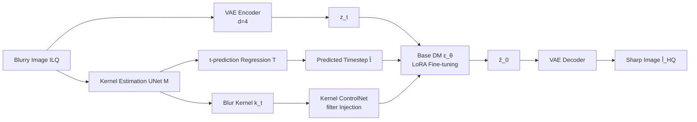

# FideDiff: Efficient Diffusion Model for High-Fidelity Image Motion Deblurring

**Conference**: ICLR 2026  
**OpenReview**: [https://openreview.net/forum?id=AFJMB9SkHT](https://openreview.net/forum?id=AFJMB9SkHT)  
**Code**: [https://github.com/xyLiu339/FideDiff](https://github.com/xyLiu339/FideDiff)  
**Area**: Image Restoration / Motion Deblurring / Diffusion Models  
**Keywords**: Single-step diffusion, motion deblurring, consistency models, Kernel ControlNet, high-fidelity restoration  

## TL;DR
This work reformulates motion deblurring as a diffusion-like process where the "blur level serves as the timestep." By employing consistency training, all timesteps are aligned to predict the same sharp image, achieving **single-step, high-fidelity** deblurring with a pre-trained diffusion model, complemented by a Kernel ControlNet for blur kernel prior injection and adaptive timestep prediction.

## Background & Motivation
- **Background**: CNN and Transformer-based deblurring methods (e.g., Restormer, AdaRevD) achieve high PSNR on synthetic data but often fail to generalize to real-world blurry scenes due to a lack of realistic priors. Large-scale pre-trained Diffusion Models (DMs) possess rich real-world priors and strong generative quality, making them a promising new paradigm for deblurring.
- **Limitations of Prior Work**: Applying DMs to deblurring faces two primary challenges: (a) **Slow inference speed**, often requiring dozens or hundreds of sampling steps; (b) **Poor fidelity**, where many methods sacrifice full-reference metrics like PSNR/LPIPS for non-reference perceptual quality (e.g., CLIPIQA, MUSIQ), producing outputs that "look realistic but do not match the original."
- **Key Challenge**: Existing single-step diffusion acceleration schemes (such as distillation routes like OSEDiff, TSD-SR, FluxSR) **assign a fixed timestep** to all low-quality images. This collapses iterative denoising into a one-time regression, losing the inductive bias of diffusion and failing to distinguish between different blur levels. Furthermore, these methods often target non-reference perceptual metrics for tasks that are inherently full-reference (super-resolution/deblurring).
- **Goal**: To prioritize restoration **fidelity** under the constraint of **single-step inference**, allowing pre-trained DMs to serve industrial-grade image restoration effectively.
- **Core Idea**: **[Blur level as timestep]** Instead of a fixed $t$, the "gradual blurring" process is treated as the forward process, with each timestep corresponding to a specific blur severity. **[Cross-timestep consistency]** is then used to force $f_\theta(z_t,t)$ to predict the same sharp image for all $t$, naturally supporting accurate single-step deblurring.

## Method

### Overall Architecture
FideDiff is based on Stable Diffusion 2.1 and consists of three components: a **deblurring base model** (consistency training + GAN discriminator for fidelity), a **Kernel ControlNet** (injecting blur kernel priors + predicting timesteps), and **reconstructed GoPro training data** (pairing each blurry image with a deterministic blur trajectory). Training proceeds in three stages: base model training, kernel estimation network pre-training, and finally training the Kernel ControlNet while freezing the base. Inference generates the image in one step using the predicted $\hat t$.

### Key Designs

**1. Forward/Backward Reconstruction: Modeling motion blur as a diffusion-like chain by "defining the forward process via blur trajectories."** Motion blur can be approximated as the convolution of a sharp image and a blur kernel: $I_{blur} \approx I_{sharp} * K + n$. The authors denote the sharp image as $z_0$ and the initial kernel as an identity convolution $k_0$. The forward kernel generation is defined as a chain $q(k_{1:T}|k_0)=\prod_t q(k_t|k_{t-1:0})$, where each state $z_t = z_0 * k_t$ represents a level of blur. Since real kernels are pixel-wise and non-Markovian (affected by velocity, impulse, and inertia), $q(k_t|z_t,z_0)$ is generally intractable and cannot be approximated by a Gaussian, making standard diffusion derivation difficult. The breakthrough is returning to the fundamental goal of DM—reconstructing $z_0$—and bypassing explicit kernel distribution modeling by rewriting the objective as cross-timestep consistency regression.

**2. Cross-Timestep Consistency Training: Mapping all timesteps on the same trajectory to the same sharp image.** The core constraint is $z_0 = f_\theta(z_t,t)=f_\theta(z_{t'},t')$, with the optimization objective $\min_\theta \mathbb{E}_{t,z_0}\|f_\theta(z_t,t)-z_0\|^2$. The theoretical basis is that standard diffusion requires multi-step sampling due to the **stochastic pairing** of Gaussian noise and data points during training. If the blur trajectory for each image is known and all points on that trajectory are jointly trained to map to the same sharp target, the model learns intrinsic temporal consistency, enabling single-step sampling. To reuse pre-trained weights, original diffusion coefficients $\alpha_t, \beta_t$ are retained, but $\hat\epsilon=\epsilon_\theta$ is made to satisfy $z_t = k_t * z_0 = \sqrt{\bar\alpha_t}z_0 + \sqrt{1-\bar\alpha_t}\hat\epsilon$ (where $\hat\epsilon$ is not necessarily Gaussian).

**3. Data Reconstruction with Matched Blur Trajectories: Ensuring consistency requires deterministic trajectories.** Each blurry sample must be paired with a deterministic backward trajectory $\{z_0,z_1,...,z_t\}$. The authors utilize the GoPro dataset (240fps, averaging 7–13 consecutive frames to synthesize blur, with the middle frame as the sharp image) to establish a mapping from frame count $n$ to timestep $t$ as $t=g(n)=(n-1)\times 20$, satisfying $g(1)=0$. Due to the uneven distribution in original GoPro (mostly 11 frames), the authors **manually expand** the dataset (from 2,103 to 7,877 pairs), ensuring each blurry image has at least 3 points on its backward trajectory to support consistency training.

**4. Kernel ControlNet: Injecting blur kernels via filtering rather than addition.** Standard ControlNet maps conditions (e.g., depth/pose) and adds them to $z_{in}$. However, pixel-wise blur kernels $k_t=M(I_{HQ})\in\mathbb{R}^{m\times m\times H\times W}$ do not have a direct spatial alignment with the target image, making simple addition ineffective. The authors use a filter-like module: $z_{in2}=\mathrm{Conv}(z_{in1})$, $W=\mathrm{Conv}(\mathrm{Cat}(k_{in},z_{in2}))$, $O=W\otimes z_{in2}$, and $z_{out}=z_{in1}+Z(O)$, where $\otimes$ is element-wise multiplication, $Z$ is a zero-initialized convolution, and $W$ acts as attention weights. $z_{out}$ is then fed into a ControlNet initialized from the DM encoder. Additionally, a regression module $T$ follows the kernel estimation network $M$ to predict the unknown timestep during inference: $\hat t=T(M(I_{HQ}))$—indicative that more complex trajectories and heavier blur correspond to larger $t$.

**5. Fidelity via GAN Discriminator Instead of Distillation: Distillation favors "natural generation" over "reconstruction."** The authors explicitly reject distillation methods like SinSR/OSEDiff designed for content generation, instead using a GAN discriminator $D$ (based on a pre-trained UNet encoder and several convolutional blocks) to distinguish between real high-quality representations $z_{HQ}$ and reconstructions $\hat z_0$. This pulls the generated distribution back toward the ground truth. The base training loss is $L=L_1+\lambda_1 L_{\text{EA-LPIPS}}+\lambda_2 L_G$ (where EA-LPIPS incorporates edge detection). The kernel estimation stage uses a reblur loss $L_{reblur}=L_1(M(I_{HQ})*I_{HQ}, I_{LQ})$, and the third stage adds a timestep regression loss $L_{time}$.

## Key Experimental Results

### Main Results (Full-reference Metrics, Partial Excerpts)

| Dataset | Metric | AdaRevD (Transformer SOTA) | DiffBIR (Diffusion) | OSEDiff-s1 (Single-step) | **FideDiff** |
|--------|------|------|------|------|------|
| GoPro | PSNR↑ | 34.60 | 26.15 | 24.34 | 28.79 |
| GoPro | LPIPS↓ | 0.0712 | 0.2366 | 0.1738 | **0.0831** |
| GoPro | DISTS↓ | 0.0672 | 0.1460 | 0.0834 | **0.0525** |
| RealBlur-J | PSNR↑ | 30.12 | 26.92 | 26.83 | 28.96 |
| RealBlur-J | LPIPS↓ | 0.1408 | 0.2587 | 0.1793 | **0.1142** |
| RealBlur-J | DISTS↓ | 0.1037 | 0.1599 | 0.1198 | **0.0800** |
| RealBlur-R | LPIPS↓ | 0.0621 | 0.3388 | 0.1057 | **0.0584** |

> FideDiff significantly outperforms all diffusion-based methods across four full-reference metrics. In perceptual similarity (LPIPS/DISTS), it even **surpasses the Transformer SOTA**, with particularly stable generalization on the real-world dataset RealBlur. While a gap in PSNR remains compared to Transformers, it is substantially narrowed relative to other diffusion methods.

### Inference Speed (sec/image, GoPro)

| Model | Speed |
|------|------|
| DiffBIR-s50 (Multi-step) | 25.40 |
| Diff-Plugin-s20 | 5.29 |
| AdaRevD (Transformer) | 1.09 |
| **FideDiff (d=4, Full)** | 1.52 |
| **FideDiff (d=8, w/o KCN)** | **0.25** |

> The base model is fastest at $d=8$. To minimize detail loss, $d=4$ with Kernel ControlNet is used, achieving speeds comparable to Transformers and up to **17×** faster than multi-step DMs.

### Ablation Study

| Module | GoPro PSNR↑ | GoPro LPIPS↓ |
|------|------|------|
| base | 28.68 | 0.0854 |
| + vanilla controlnet | 28.73 | 0.0844 |
| + kernel addition | 28.70 | 0.0835 |
| + **Kernel ControlNet (filter)** | **28.79** | **0.0831** |

Consistency Training (CT) vs. None: GoPro LPIPS improved from 0.0871 → 0.0831, and DISTS from 0.0548 → 0.0525, proving that CT significantly aids fidelity.

### Key Findings
- **EA-LPIPS (Edge-enhanced) > LPIPS > DISTS** as perceptual losses; the GAN discriminator is particularly crucial for optimizing DISTS.
- **VAE downsampling $d=4$ is significantly better than $d=8$** (PSNR 26.26 → 27.77): $8\times$ compression in SD causes excessive detail loss for low-resolution datasets; $4\times$ recovers substantial detail.
- Learnable textual embeddings (LE) outperform fixed ones; filter-based injection is superior to direct kernel addition; the custom Kernel ControlNet outperforms motion alignment modules based on MISCFilter.
- Timestep scanning shows optimal PSNR/LPIPS near $t\approx 200$ (corresponding to 11-frame synthesis), consistent with the GoPro test set synthesis.

## Highlights & Insights
- **Redefining Timestep Semantics**: Mapping "blur level" to diffusion timesteps is the most elegant contribution—it restores the ability of single-step diffusion to "distinguish degradation severity" rather than treating all low-quality images uniformly at a fixed $t$.
- **Consistency Training + Matched Trajectory Data**: These are complementary. Theoretically, consistency requires "known trajectories," which the authors rigorously provided by expanding GoPro to ensure $\ge 3$ trajectory points per image.
- **Fidelity-First Valuation**: Amidst single-step diffusion works chasing non-reference perceptual metrics, this paper insists on full-reference fidelity, bringing diffusion methods to a competitive level with Transformers in PSNR/LPIPS and providing a realistic baseline for industrial deployment.
- **Filter-style Kernel Injection**: This highlights an often-overlooked detail: blur kernels are not spatially aligned conditions like depth/pose, and simply following the ControlNet addition paradigm yields limited results.

## Limitations & Future Work
- **PSNR still trails Transformer SOTAs**: There remains a clear gap in pure distortion metrics (e.g., GoPro PSNR 28.79 vs. AdaRevD 34.60). The authors acknowledge the current positioning as a "high-fidelity diffusion baseline" rather than a total replacement.
- **Heavy reliance on matched trajectory data**: The method's validity depends on reconstructing deterministic trajectories for blurry images. While feasible for multi-frame synthetic data like GoPro, for purely real-world data without trajectory info (like RealBlur), it must rely on $t$-prediction, which is less elegant.
- **Manual Data Expansion**: Expanding GoPro from 2k to nearly 8k pairs to satisfy consistency training involves significant engineering effort and reproducibility costs.
- Evaluation is limited to deblurring; the effectiveness of migrating to other low-level vision tasks like denoising or super-resolution remains to be verified (listed as a future direction).

## Related Work & Insights
- **Single-step Diffusion Acceleration**: Distillation routes like OSEDiff, TSD-SR, SinSR, and FluxSR are direct competitors; this work offers an alternative via "Consistency Training instead of distillation + Timestep Semantics."
- **Consistency Models**: Built upon the consistency models of Song et al. (2023) and insights from Schusterbauer/Tong regarding "multi-step sampling originating from stochastic pairing."
- **Kernel-estimated Deblurring**: Representative of kernel prior routes like UFPNet (Normalizing Flows for kernels) and Kim et al. (2024) (kernel pixel classification), this work integrates kernel priors into pre-trained DMs via Kernel ControlNet.
- **ControlNet Variants**: Moving from vanilla ControlNet to IRControlNet (Lin et al. 2024), this work points out that kernel conditions require filter-style injection rather than simple addition, providing a reference for feeding non-spatially aligned conditions into ControlNet.

## Rating
- **Novelty**: ⭐⭐⭐⭐ — The reformulation of "blur level as timestep + cross-timestep consistency training" is highly creative, liberating single-step diffusion from "fixed $t$ regression." Filter-style kernel injection is also a refined innovation.
- **Experimental Thoroughness**: ⭐⭐⭐⭐ — Comprehensive coverage of full-reference metrics across four datasets, speed benchmarks, perception-distortion curves, and three sets of ablations (Base/KCN/Consistency), comparing both Transformer and Diffusion SOTAs.
- **Writing Quality**: ⭐⭐⭐⭐ — Motivation analysis is clear, mathematical derivations are complete, and figures/tables are well-organized. Some theoretical parts regarding the bypass of intractable kernel distributions require careful reading.
- **Value**: ⭐⭐⭐⭐ — Establishes a solid baseline for "high-fidelity + efficient" pre-trained diffusion deblurring, with practical significance for industrial application. The methodology could inspire other low-level vision tasks.

<!-- RELATED:START -->

## Related Papers

- [\[CVPR 2025\] Efficient Visual State Space Model for Image Deblurring](../../CVPR2025/image_restoration/efficient_visual_state_space_model_for_image_deblurring.md)
- [\[CVPR 2026\] FiDeSR: High-Fidelity and Detail-Preserving One-Step Diffusion Super-Resolution](../../CVPR2026/image_restoration/fidesr_high-fidelity_and_detail-preserving_one-step_diffusion_super-resolution.md)
- [\[CVPR 2026\] Spatio-Temporal Difference Guided Motion Deblurring with the Complementary Vision Sensor](../../CVPR2026/image_restoration/spatio-temporal_difference_guided_motion_deblurring_with_the_complementary_visio.md)
- [\[CVPR 2026\] Event-Based Motion Deblurring Using Task-Oriented 3D Gaussian Event Representations](../../CVPR2026/image_restoration/event-based_motion_deblurring_using_task-oriented_3d_gaussian_event_representati.md)
- [\[ICLR 2026\] FreeAdapt: Unleashing Diffusion Priors for Ultra-High-Definition Image Restoration](freeadapt_unleashing_diffusion_priors_for_ultra-high-definition_image_restoratio.md)

<!-- RELATED:END -->
