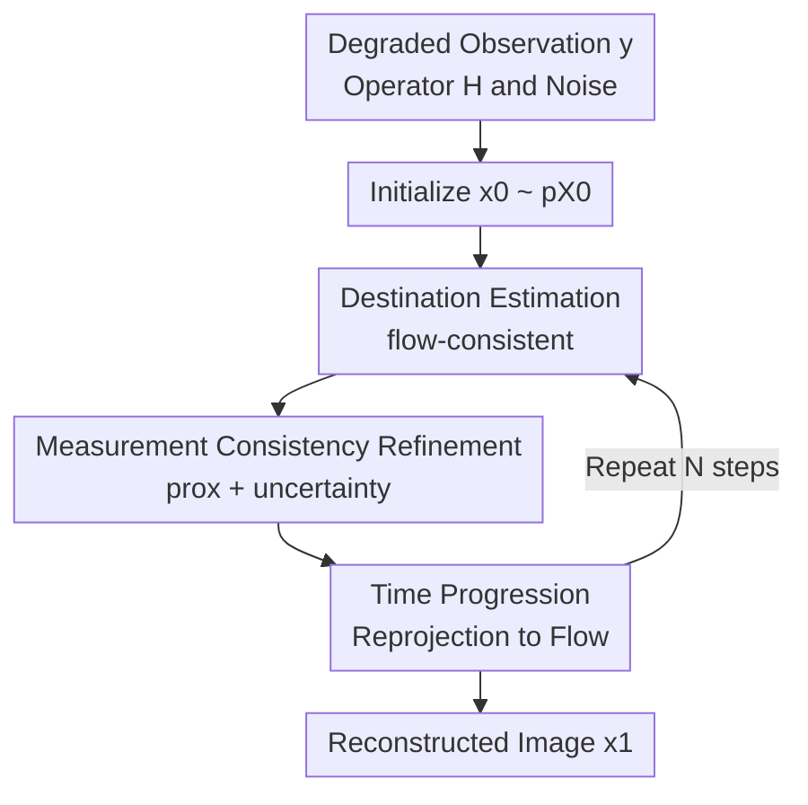

# Flower: A Flow-Matching Solver for Inverse Problems

**Conference**: ICLR2026  
**OpenReview**: [https://openreview.net/forum?id=QGd34p02mI](https://openreview.net/forum?id=QGd34p02mI)  
**Paper**: [OpenReview](https://openreview.net/forum?id=QGd34p02mI)  
**Code**: https://github.com/mehrsapo/Flower  
**Area**: Image Inverse Problems / Image Restoration  
**Keywords**: flow matching, inverse problems, image restoration, posterior sampling, plug-and-play  

## TL;DR
Flower transforms a pre-trained flow-matching generative model into a linear inverse problem solver. At each time step, it predicts the clean destination, applies a proximal projection for data consistency using the observation operator, and then advances along the flow trajectory. It achieves superior results compared to existing flow-based solvers on image restoration tasks such as denoising, deblurring, super-resolution, and inpainting.

## Background & Motivation
**Background**: Image inverse problems typically involve recovering the original image $x$ from a degraded observation $y = Hx + n$, where $H$ can be a blur kernel, downsampling, mask, or Fourier sampling operator. Traditional approaches explicitly design regularization terms, such as TV, sparse priors, or learned patch priors. Following the rise of deep learning, plug-and-play (PnP) methods use a pre-trained denoiser as an implicit proximal operator, alternating with data consistency updates. Recently, diffusion models and flow matching have provided stronger generative priors, shifting inverse problems from "finding a reasonable point estimate" towards "sampling from the posterior $p_{X|Y=y}$."

**Limitations of Prior Work**: Diffusion and flow-based inverse problem solvers often require gradient correction, score approximation, or optimization of latents via ODE backpropagation along the generation path. This leads to two issues: first, the inference process becomes computationally heavy, especially for methods like D-Flow or Flow Priors that require multiple backprops or trace estimations; second, different degradation tasks usually require extensive hyperparameter tuning and lack stability when migrating to new forward operators. Methods like PnP-Flow are more lightweight but primarily offer a plug-and-play interpretation, lacking a probabilistic explanation of why these alternating steps approximate posterior sampling.

**Key Challenge**: Pre-trained flow-matching models excel at generating natural images from a prior $p_{X_1}$, but inverse problems require the conditional distribution $p_{X_1|Y=y}$. Moving solely along the unconditional ODE path yields visually pleasing results that may not honor the observations. Conversely, strictly forcing projections onto the observation-feasible set may sacrifice the natural image structure provided by the generative prior. The key challenge lies in simultaneously maintaining the "progression along the generation trajectory" and "adherence to measurement constraints" at each flow time step.

**Goal**: The authors aim to construct a solver that can be used directly after training without retraining conditional models. It relies solely on a pre-trained velocity network, the known forward operator $H$, and the noise level $\sigma_n$. This solver should cover various linear imaging inverse problems with minimal tuning while providing a Bayesian ancestral sampling interpretation rather than staying at an empirical PnP update level.

**Key Insight**: The straight-line path of flow matching has a useful property: given a sample $x_t$ at time $t$, the optimal velocity can back-infer the conditional expectation of the target terminal $X_1$. In other words, the velocity network does more than dictate the next step; it can be viewed as a "flow-consistent denoiser" that estimates the clean image the current trajectory would eventually reach. The core of Flower is to use this destination estimate as a bridge, apply observation constraints in the destination space, and then project the refined destination back onto the flow trajectory.

**Core Idea**: A three-step loop—"destination estimation → measurement-aware proximal refinement → re-progression along the flow"—is used to transform unconditional flow matching into an image inverse problem solver that approximates posterior sampling.

## Method

### Overall Architecture
Flower takes the degraded observation $y$, the linear forward operator $H$, the noise standard deviation $\sigma_n$, and a pre-trained flow-matching velocity network $v_t^\theta$ as inputs. It samples an initial $x_0$ from the source distribution $p_{X_0}$ (usually standard Gaussian) and discretizes $[0,1]$ into $N$ time steps. Instead of a simple Euler update $x_{t+\Delta t}=x_t+\Delta t v_t^\theta(x_t)$, each step estimates the clean destination, refines it via a proximal projection based on the measurement, and finally interpolates to the next time step using new noise and the refined destination.

These three steps correspond to the three contribution points of the paper: flow-consistent destination estimation provides the generative prior, measurement-aware destination refinement handles data consistency, and time progression places the refined posterior destination sample back onto the flow trajectory. After repeating this process, the final $x_1$ serves as the reconstruction. While retaining refinement uncertainty allows for interpretation as approximate posterior sampling, the authors found that removing this stochasticity generally yields better image restoration metrics in practice.

### Key Designs
**1. Destination Estimation: Velocity Network as a Flow-Consistent Denoiser**

The first step of Flower does not use $v_t^\theta(x_t)$ directly for an Euler update. Instead, it estimates the clean target corresponding to the current $x_t$: $\hat{x}_1(x_t)=x_t+(1-t)v_t^\theta(x_t)$. This formula arises from straight-line flow matching: if $x_t=(1-t)x_0+t x_1$, the velocity is $x_1-x_0$. Thus, adding the remaining time $(1-t)$ multiplied by the velocity to $x_t$ recovers the "destination." The paper further proves that when the velocity network is optimal, this destination is precisely $E[X_1|X_t=x_t]$.

This design addresses the lack of an interface between the flow prior and inverse constraints. Many methods modify the velocity or add likelihood gradients in the $x_t$ space, where variables are intermediate noisy states and data consistency is less intuitive. Flower translates the current state into the target image space $\hat{x}_1$, effectively asking the generative model "what do you think the final clean image will be?" and then checking if it satisfies $y=Hx+n$. Thus, the subsequent proximal projection is an interpretable refinement of a clean image estimate rather than a blind pull on the trajectory.

**2. Measurement-Aware Refinement: Pulling the Destination into the Feasible Posterior**

After obtaining $\hat{x}_1(x_t)$, Flower assumes the uncertainty of the current destination can be approximated by an annealed Gaussian: $\tilde{p}_{X_1|X_t=x_t}=N(\hat{x}_1(x_t),\nu_t^2 I)$, where $\nu_t=(1-t)/\sqrt{t^2+(1-t)^2}$. This variance decreases over time: at early $x_t$, the noise is high and the destination is uncertain; near $t=1$, the trajectory is close to the target, making the estimate more reliable. Combined with the linear Gaussian observation model $p_{Y|X_1=x_1}=N(Hx_1,\sigma_n^2 I)$, the approximate posterior remains Gaussian, with a mean expressed as a proximal problem:

$$
\mu_t(x_t,y)=\operatorname{prox}_{\nu_t^2 F_y}(\hat{x}_1(x_t)),\quad F_y(x)=\frac{1}{2\sigma_n^2}\|Hx-y\|_2^2.
$$

Intuitively, $\mu_t$ balances "staying close to the flow-predicted destination" with "satisfying the observation $y$." For linear tasks like deblurring, super-resolution, and inpainting, this step involves solving a positive-definite linear system rather than tuning manual gradient step sizes. The paper also provides the covariance $\Sigma_t=(\nu_t^{-2}I+\sigma_n^{-2}H^\top H)^{-1}$ and uses $\tilde{x}_1=\mu_t+\gamma\kappa_t$ to control refinement uncertainty; $\gamma=1$ corresponds to theoretical posterior sampling, while $\gamma=0$ yields a stable MAP/MMSE-style refinement.

**3. Time Progression: Reprojecting into the Generative Trajectory**

Simply projecting $\hat{x}_1$ to $\tilde{x}_1$ is insufficient because Flower must still advance along the continuous-time path of flow matching. The third step uses:

$$
x_{t+\Delta t}=(1-t-\Delta t)\epsilon+(t+\Delta t)\tilde{x}_1(x_t,y),\quad \epsilon\sim p_{X_0}
$$

to generate the sample for the next time step. This formula preserves the straight-line interpolation structure: the next state is determined by new source noise and the refined destination. As $t$ increases, the weight of the noise decreases while the weight of the measurement-consistent destination increases. This approach is more consistent with the path assumptions during flow training than simply applying a correction to $x_t$ and continuing the original ODE.

This progression is central to the paper's Bayesian argument. The authors view each step as an approximate sampling from $p_{X_{t+\Delta t}|X_t=x_t,Y=y}$: Step 1 approximates $p_{X_1|X_t=x_t}$, Step 2 incorporates observations to get $\tilde{p}_{X_1|X_t=x_t,Y=y}$, and Step 3 interpolates to obtain the conditional distribution of the next time step. If $X_0$ is independent of $Y$ and an independent coupling flow-matching setting is used, this ancestral sampling recurrence explains why the final $x_1$ approximately comes from the posterior $p_{X_1|Y=y}$.

### Loss & Training
Flower does not require retraining a conditional model for each inverse problem; it utilizes a pre-trained unconditional flow-matching velocity network. The underlying training employs a conditional flow-matching loss: given $t\sim U[0,1]$ and pairs $(x_0,x_1)$ from a coupling $\pi$, the network fits the straight-line velocity $x_1-x_0$:

$$
L_{CFM}(\theta)=E\|v_t^\theta((1-t)x_0+t x_1,t)-(x_1-x_0)\|_2^2.
$$

Experiments primarily use U-Net backbones and mini-batch OT flow-matching weights from the PnP-Flow benchmark. To validate theoretical assumptions, an "independent coupling" version (Flower-IND) was also trained. At inference, Flower has few configurations: number of steps $N$, noise level $\sigma_n$, number of averages $N_{Avg}$, and the refinement uncertainty switch $\gamma$. While theoretical posterior sampling corresponds to $\gamma=1$, the main experiments use $\gamma=0$ for stability and higher PSNR/SSIM with minimal averaging.

## Key Experimental Results

### Main Results
Evaluations were conducted on CelebA $128\times128$ faces and AFHQ-Cat $256\times256$ images across five restoration tasks: Gaussian denoising, deblurring, super-resolution, random inpainting, and box inpainting. Metrics include PSNR, SSIM, and LPIPS. The table below summarizes representative results on 100 CelebA test images, demonstrating Flower's advantage over major flow-based baselines.

| Dataset / Task | Metric | Flower1-OT | PnP-Flow1 | OT-ODE | Previous Best Single | Gain |
|--------|------|------|------|------|------|------|
| CelebA / Denoising | PSNR↑ | 32.28 | 31.80 | 30.54 | PnP-GS 32.64 | -0.36 vs PnP-GS, better than flow baselines |
| CelebA / Deblurring | PSNR↑ | 34.98 | 34.48 | 33.01 | PnP-Flow1 34.48 | +0.50 |
| CelebA / Super-resolution | PSNR↑ | 32.36 | 31.09 | 31.46 | DiffPIR 31.52 | +0.84 |
| CelebA / Random inpainting | PSNR↑ | 33.08 | 33.05 | 28.68 | D-Flow 33.67 | -0.59 vs D-Flow, better speed/memory |
| CelebA / Box inpainting | PSNR↑ | 31.19 | 30.47 | 29.40 | D-Flow 30.70 | +0.49 |

On AFHQ-Cat, where tasks are more difficult and resolutions higher, Flower remains competitive. Particularly in deblurring and box inpainting, Flower1-OT shows significant improvements over PnP-Flow1. While PnP-GS remains strongest in denoising, it is not a flow-matching solver.

### Ablation Study
Ablations focused on coupling, uncertainty, averaging count, and time discretization. Key findings from CelebA coupling: under $\gamma=0, N=100$, the theoretically more consistent independent coupling version generally outperforms OT coupling, although the OT version already achieves strong results.

| Configuration | Key Metric | Note |
|------|---------|------|
| Flower1-OT | Deblurring PSNR 34.98 / Box PSNR 31.19 | Baseline weights, main default configuration |
| Flower5-OT | Deblurring PSNR 35.67 / Box PSNR 31.87 | Averaging 5 reconstructions improves PSNR/SSIM |
| Flower1-IND| Deblurring PSNR 35.22 / Box PSNR 31.90 | Independent coupling matches theory, better single run |
| Flower5-IND| Deblurring PSNR 35.90 / Box PSNR 32.78 | Optimal performance when combining coupling + averaging |

Another crucial ablation is $\gamma$. $\gamma=1$ enables refinement uncertainty, matching posterior sampling theory and covering tails in 2D toy experiments. However, for image restoration, $\gamma=0$ yields higher PSNR by being more stable. In deblurring, a single $\gamma=1$ run achieves 30.84 PSNR, while $\gamma=0$ reaches 33.01.

### Key Findings
- Flower is the most stable among flow-based inverse solvers, particularly strong in deblurring, box inpainting, and CelebA super-resolution. Visual results show fewer artifacts than OT-ODE or D-Flow and less over-smoothing than PnP-Flow.
- The method requires almost no task-specific hyperparameter tuning. Aside from $N$, $N_{Avg}$, $\sigma_n$, and $\gamma$, it lacks the heavy task-dependent step sizes or regularization coefficients found in Flow-Priors or PnP-Flow.
- Independent coupling provides higher performance, supporting the theoretical analysis regarding $p_{X_0}$ and $p_{X_1}$ independence; however, even with OT coupling, Flower maintains high performance via a PnP interpretation.
- Computational overhead is similar to PnP-Flow. In CelebA deblurring, Flower1 takes ~5.6s (0.217 GB), compared to D-Flow’s 142.2s (11.1 GB), making it significantly more practical.
- Adaptive time-stepping shows potential: power schedules (e.g., $\alpha=0.5$) that allocate more steps to the later parts of the trajectory perform better at low total step counts.

## Highlights & Insights
- The most ingenious aspect of Flower is interpreting the velocity network output as the "conditional expectation of the destination" rather than just an ODE velocity. This perspective provides a natural interface for data consistency with flow models.
- Proximal refinement is cleaner than likelihood gradient correction: for linear Gaussian observations, the posterior mean and covariance have closed-form solutions or can be solved via linear systems, avoiding extensive task-specific step-size tuning.
- The paper bridges the gap between empirical PnP alternating updates and Bayesian posterior sampling. Step 1 acts as a denoiser, Step 2 as a proximal projection for data consistency, and Step 3 as a return to the generation trajectory.
- The difference between $\gamma=1$ and $\gamma=0$ is insightful: posterior sampling is not always equivalent to the highest PSNR reconstruction. Retain stochasticity when diversity and uncertainty quantification are needed; remove it for better deterministic restoration benchmarks.

## Limitations & Future Work
- Theoretical derivation relies on strong assumptions: the velocity network must be near-optimal, source and target distributions must be independent, and the observation model must be linear Gaussian.
- The current version focuses on linear inverse problems. While nonlinear extensions are discussed (e.g., using Langevin dynamics for $\tilde{p}_{X_1|X_t,Y}$), they introduce more computational complexity and additional hyperparameters.
- While $\gamma=0$ yields better metrics, it weakens the completeness of posterior sampling. For tasks requiring uncertainty estimation (e.g., medical imaging), $\gamma=0$ might over-concentrate on high-probability modes.
- Experiments are focused on standard face and cat benchmarks. Real-world medical, remote sensing, or MRI data involve more complex noise distributions and domain shifts.
- Proximal refinement requires solving $(\nu_t^{-2}I+\sigma_n^{-2}H^\top H)z=b$ repeatedly. While handled by CG (max 50 iterations) in this paper, linear solver costs may become a bottleneck for larger or more complex operators.

## Related Work & Insights
- **vs DPS / FlowDPS**: DPS-style methods correct dynamics via approximated likelihood gradients. Flower performs a closed-form Bayesian-style update in the estimated destination space instead.
- **vs ΠGDM / OT-ODE**: Flower uses a similar $N(\hat{x}_1,\nu_t^2I)$ approximation as ΠGDM but performs ancestral transition by explicitly refining the destination rather than just constructing a conditional velocity field.
- **vs PnP-Flow**: PnP-Flow also uses the velocity network as a denoiser, but its data consistency is gradient-based. Flower adopts proximal operations, resulting in better reconstruction quality and a stronger Bayesian foundation.
- **Insight**: For other generative inverse solvers, a promising direction is to identify "interpretable clean variables" within the generative model (e.g., denoised estimates in diffusion, destination estimates in flow) and impose observation constraints on these variables rather than directly modifying sampling trajectories.

## Rating
- Novelty: ⭐⭐⭐⭐☆ Linking destination estimation, proximal consistency, and ancestral sampling is very clear. Component-wise it is familiar, but the combination and theoretical framing are valuable.
- Experimental Thoroughness: ⭐⭐⭐⭐☆ Covers various datasets and tasks with thorough ablations. Could benefit from more large-scale real-world imaging verification (e.g., MRI).
- Writing Quality: ⭐⭐⭐⭐⭐ Derivations, probabilistic explanations, and PnP relationships are well-communicated.
- Value: ⭐⭐⭐⭐☆ Highly practical for flow-matching inverse problems, especially when a pre-trained prior is available and low-tuning migration to various linear degradations is desired.

<!-- RELATED:START -->

## Related Papers

- [\[ICML 2026\] Solving Inverse Problems with Flow-based Models via Model Predictive Control](../../ICML2026/image_restoration/solving_inverse_problems_with_flow-based_models_via_model_predictive_control.md)
- [\[ICLR 2026\] Noise-Adaptive Diffusion Sampling for Inverse Problems Without Task-Specific Tuning](noise-adaptive_diffusion_sampling_for_inverse_problems_without_task-specific_tun.md)
- [\[CVPR 2026\] Dual Ascent Diffusion for Inverse Problems](../../CVPR2026/image_restoration/dual_ascent_diffusion_for_inverse_problems.md)
- [\[CVPR 2025\] FiRe: Fixed-points of Restoration Priors for Solving Inverse Problems](../../CVPR2025/image_restoration/fire_fixed-points_of_restoration_priors_for_solving_inverse_problems.md)
- [\[ICLR 2026\] FAST-DIPS: Adjoint-Free Analytic Steps and Hard-Constrained Likelihood Correction for Diffusion-Prior Inverse Problems](fastdips_adjointfree_analytic_steps_and_hardconstrained_likelihood_correction_fo.md)

<!-- RELATED:END -->
