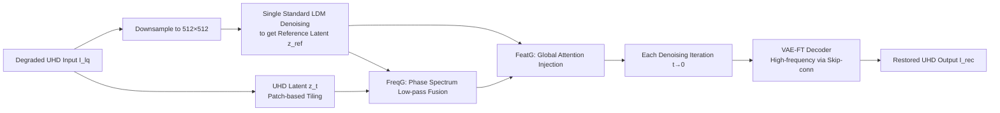

# FreeAdapt: Unleashing Diffusion Priors for Ultra-High-Definition Image Restoration

**Conference**: ICLR 2026  
**OpenReview**: [https://openreview.net/forum?id=OKUGAxu6Ww](https://openreview.net/forum?id=OKUGAxu6Ww)  
**Code**: To be confirmed  
**Area**: Image Restoration / Diffusion Model Priors / Ultra-High-Definition Image Processing  
**Keywords**: UHD Image Restoration, Latent Diffusion Models, Training-free Guidance, Frequency Domain Guidance, VAE Fine-tuning  

## TL;DR
This paper proposes a training-free "Frequency-Feature Collaborative Guidance" (FFSG) mechanism. It utilizes the phase spectrum of a low-resolution reference image and global attention to constrain local generation during each denoising step of patch-based inference. Combined with an optional VAE decoder fine-tuning module, it achieves plug-and-play adaptation of pretrained LDMs for Ultra-High-Definition (4K/8K) image restoration, providing an average PSNR Gain of over 2 dB without modifying the U-Net.

## Background & Motivation
**Background**: With the ubiquity of 4K/8K displays, Ultra-High-Definition Image Restoration (UHD-IR) has become a focal point, requiring simultaneous low-light enhancement, dehazing, and deblurring at massive resolutions while preserving fine-grained textures. Mainstream approaches (e.g., UHDformer, ERR, DreamUHD) improve metrics by stacking network architectures and training paradigms.

**Limitations of Prior Work**: Image restoration is inherently an ill-posed problem, making it difficult to break performance ceilings by simply altering architectures. While pretrained Latent Diffusion Models (LDMs) possess strong generative priors, few have explored their application in UHD-IR. Directly applying LDMs faces three major issues: ① UHD images are too large for GPU memory, forcing patch-based inference which leads to grid artifacts and color inconsistency across blocks; ② The lack of global context between patches amplifies diffusion randomness, generating hallucinated high-frequency details in smooth regions; ③ The lossy compression of VAE inherently discards high-frequency information, limiting reconstruction fidelity.

**Key Challenge**: Generative methods for high-resolution images (e.g., MultiDiffusion, DemoFusion) focus on "visual plausibility" and allow content hallucination. However, restoration tasks require strict fidelity to the degraded input. Any hallucination or modification contradicts the objective—these two requirements are fundamentally opposed.

**Goal**: To solve artifacts, global inconsistency, and detail loss in a plug-and-play manner **without modifying or fine-tuning the denoising U-Net**, enabling pretrained LDMs and their extensions (e.g., ControlNet) to serve UHD-IR effectively.

**Core Idea**: `Training-free inference-time guidance` + `Task-level VAE decoder fine-tuning`. The former injects constraints on "what the global structure should look like" (frequency-domain phase + global attention) into each denoising step. The latter compensates for high-frequency losses in the VAE via skip connections, providing a prior that is universal across different diffusion backbones.

## Method

### Overall Architecture
FreeAdapt first downsamples the degraded UHD input $I_{lq}$ to the native LDM resolution (e.g., 512×512) and runs a standard denoising pass to obtain a structurally coherent "reference image" $I_{ref}$, which is then upsampled back to UHD and re-encoded into a reference latent $z^{ref}_0$. Subsequently, patch-based iterative denoising is performed in the UHD latent space. In each step, two FFSG modules are inserted: Frequency Guidance (FreqG) and Feature Guidance (FeatG), managing global structural consistency and local detail realism, respectively. Finally, a VAE fine-tuned decoder (VAE-FT) enhanced by skip connections can be used during decoding to restore high frequencies. The entire denoising workflow remains training-free; only VAE-FT requires offline training and is independent of specific backbones.

### Key Designs

**1. Frequency Guidance (FreqG): Locking global structure using only the phase of the reference image.** The biggest issue with patch inference is the misalignment of color/structure across blocks. The authors observe that structural information is mainly contained in the phase spectrum, while texture details reside in the amplitude spectrum. Thus, in each step, FFT is performed on the current latent $z_t$ and noisy reference $z^{ref}_t$ to obtain $FFT(z_t)=A_t e^{i\phi_t}$ and $FFT(z^{ref}_t)=A^{ref}_t e^{i\phi^{ref}_t}$. **Only the phases are fused while maintaining original amplitudes**, using a dynamic low-pass filter $K(t)$ to weight the two phases: $\phi_t=\arctan\big((1-K(t))e^{i\phi_t}+K(t)e^{i\phi^{ref}_t}\big)$. $K(t)$ is a central square window that shrinks as denoising progresses (default hyperparameter $c=0.15$)—large windows in early stages (high noise) impose strong global constraints, while smaller windows in later stages (low noise) return detail generation freedom to the model. The corrected latent $z'_t=iFFT(A_t e^{i\phi_t})$ is transformed back using the original amplitude $A_t$ and fused phase $\phi_t$. FreqG proves more stable than spatial skip-residuals (which cause blur) or direct FFT spectrum fusion (which causes color shift).

**2. Feature Guidance (FeatG): Injecting global semantics into U-Net self-attention to suppress hallucinated high frequencies.** FreqG only manages low-frequency structure and cannot control high frequencies generated independently in each patch—causing noise-like false details in smooth regions. FeatG allows each patch to "refer" to the global context during attention calculation. Specifically, the local attention of the current high-res patch is calculated as $Attn_{local}=\text{softmax}(Q_{tile}K^T_{tile}/\sqrt{d})V_{tile}$. Simultaneously, aligned queries $Q^{ref}_{tile}$ and global keys/values are extracted from the reference map to calculate global attention $Attn_{global}=\text{softmax}(U(Q^{ref}_{tile}){K^{ref}_{global}}^T/\sqrt{d})V^{ref}_{global}$ (where $U$ denotes upsampling). Finally, a linear mixture is applied: $Attn_{final}=(1-\alpha)Attn_{local}+\alpha\,Attn_{global}$, with $\alpha$ set to 0.2 by default, acting only on U-Net decoder layers 3–8. This subtle injection enhances cross-patch consistency and texture realism without overpowering local details.

**3. VAE Decoder Fine-tuning (VAE-FT): Restoring high frequencies lost by VAE via skip connections.** Lossy VAE compression naturally discards high frequencies (fine textures, text), creating a bottleneck for UHD-IR. VAE-FT freezes the encoder and U-Net and only enhances the decoder. During training, low-quality and high-quality images share an encoder. While the decoder receives high-quality latents, it also receives residual features extracted from the degraded input via **skip connections**. These residuals pass through AdaIN to suppress degradation and preserve structure, then injected via Zero-Convolution into corresponding upsampling layers. The decoder side only adds LoRA for parameter-efficient fine-tuning. The composite loss is $L=L_{dwt}+L_{lpips}+L_{ssim}+L_{gan}$, where $L_{dwt}$ specifically reconstructs high frequencies in the discrete wavelet transform domain. The key insight is that it learns a **task-level prior** for "detail reconstruction" rather than a specific restoration task, allowing it to be attached to different backbones like LDM, StableSR, or DiffBIR.

## Key Experimental Results

### Main Results (3 Tasks × 3 Backbones, UHD-LL excerpt from Table 1)

| Method | PSNR↑ | SSIM↑ | LPIPS↓ | DISTS↓ | CLIPIQA↑ | MUSIQ↑ | MANIQA↑ |
|------|-------|-------|--------|--------|----------|--------|---------|
| Wave-Mamba | 29.84 | 0.941 | 0.185 | 0.117 | 0.410 | 41.78 | 0.337 |
| ERR | 27.57 | 0.933 | 0.214 | 0.148 | 0.501 | 42.28 | 0.344 |
| LDM-Ours | 22.21 | 0.887 | 0.253 | **0.101** | **0.569** | **49.07** | **0.372** |
| DiffBIR-Ours | 23.99 | 0.900 | 0.233 | **0.092** | 0.564 | 48.37 | 0.364 |

Full-reference metrics (PSNR/SSIM) are lower than non-diffusion end-to-end trained methods (as the latter optimize specifically for these metrics via L2/perceptual loss at the cost of over-smoothing). However, Ours leads significantly in perceptual/no-reference metrics (DISTS, CLIPIQA, MUSIQ, MANIQA). In dehazing, DISTS improved by ~26.3% over SwinIR; in deblurring, LPIPS improved by ~29.6% over ERR.

### Comparison with Training-free Diffusion Adaptation (Table 2 excerpt)

| Configuration | UHD-LL PSNR / LPIPS / MUSIQ |
|------|--------------------------|
| LDM-PI (patch inference) | 18.91 / 0.386 / 44.89 |
| LDM-MultiDiffusion | 20.13 / 0.399 / 32.41 |
| LDM-DemoFusion | 21.74 / 0.417 / 23.09 |
| LDM-Ours w/o VAE-FT | 21.88 / 0.283 / 45.67 |
| **LDM-Ours** | **22.21 / 0.253 / 49.07** |
| FFSG Gain | +2.96 / -0.103 / +0.78 |

Across three backbones, FFSG consistently provides a PSNR Gain of 2–3 dB over standard patch inference and outperforms MultiDiffusion/DemoFusion/PixelSmith—which are designed for generation and struggle to maintain strict fidelity to degraded inputs.

### Ablation Study (Table 3, UHD-LL/LDM)

| FreqG | FeatG | VAE-FT | PSNR↑ | LPIPS↓ |
|:---:|:---:|:---:|-------|--------|
| × | × | × | 18.91 | 0.386 |
| ✓ | × | × | 21.76 | 0.314 |
| ✓ | ✓ | × | 21.88 | 0.283 |
| ✓ | ✓ | ✓ | 22.21 | 0.253 |

FreqG alone improves PSNR from 18.91 to 21.76 (locking global structure is the largest contributor). FeatG primarily reduces LPIPS (0.314→0.283 by suppressing false high frequencies). VAE-FT further enhances perceptual details. In fusion mode comparisons (Table 4), FreqG's DISTS (0.121) significantly outperforms spatial skip-residuals (0.312) and pure FFT fusion (0.187).

### Key Findings
- Phase fusion + dynamic low-pass filtering is a cost-effective training-free solution for UHD patch inference consistency.
- There is a natural trade-off between full-reference and perceptual metrics in restoration; this paper favors "realistic details."
- VAE is the hidden bottleneck for UHD-IR fidelity; adding decoder skip connections yields stable gains across different backbones.

## Highlights & Insights
- **Decoupling Phase and Amplitude**: Implementing the frequency domain concept that "Global Structure = Phase, Texture Details = Amplitude" into step-by-step denoising is elegant. Fusing only the phase ensures consistency without overwriting textures.
- **Modular and Plug-and-play**: FreqG handles low-frequency structure, FeatG suppresses high-frequency artifacts, and VAE-FT ensures reconstruction fidelity. They are orthogonal and can be toggled independently.
- **True "Universal Prior"**: VAE-FT learns task-level rather than model-level priors, allowing one training session to support three different backbones, embodying a design philosophy of "supplementing rather than overwriting diffusion priors."
- **First Plug-and-play Diffusion Prior Framework for UHD-IR**: Provides a low-cost counter-example to " retraining large models."

## Limitations & Future Work
- **Relatively Low Full-Reference Metrics (PSNR/SSIM)**: Diffusion generation naturally deviates from pixel-level alignment, which might be disadvantaged in scenarios where PSNR is the sole KPI (e.g., specific remote sensing or medical metrics).
- **Dependency on Low-Res Reference Quality**: If the degradation at the downsampled resolution is severe enough to distort structural cues, the reference phase may mislead the global structure. Adaptive judgment of reference reliability is missing.
- **Inference Overhead**: Performing multiple FFTs and patch-based global attention at UHD resolutions adds latency and VRAM costs, which were not quantified in the provided notes.
- **VAE-FT Requirement**: It still requires offline training on high-quality/low-quality pairs, meaning it is not strictly zero-shot; its performance on entirely new degradation types without paired data remains to be verified.

## Related Work & Insights
- **Specialized UHD-IR Networks**: UHDformer (efficiency-accuracy balance), ERR (three-stage spectral decomposition), DreamUHD (frequency-enhanced VAE)—this paper demonstrates that architecture changes hit a ceiling due to the ill-posed nature of the problem, and priors are the solution.
- **High-Res Diffusion Adaptation**: MultiDiffusion/DemoFusion/AccDiffusion/PixelSmith use training-free optimization, but are designed for generation and can hallucinate. This paper identifies the need for "strict input consistency" in restoration and designs FFSG accordingly.
- **Diffusion Priors for Restoration**: StableSR (time-aware encoder), DiffBIR (two-stage blind restoration), SeeSR (degradation-aware prompts)—these focus mostly on native resolutions. This work completes the UHD puzzle.

## Rating
- **Novelty**: ⭐⭐⭐⭐ — First plug-and-play diffusion prior framework for UHD-IR; the combination of phase fusion, global attention, and task-level VAE priors is novel.
- **Experimental Thoroughness**: ⭐⭐⭐⭐ — Covers three tasks × three backbones × seven metrics, plus comparisons with training-free methods and clear ablations. Lacks quantification of inference overhead and deeper attribution for low PSNR.
- **Writing Quality**: ⭐⭐⭐⭐ — Motivation is clearly articulated (three bottlenecks vs. three corresponding modules); charts and gain rows are highly readable.
- **Value**: ⭐⭐⭐⭐ — Plug-and-play, cross-backbone compatibility, and no U-Net modification provide a practical paradigm for low-cost reuse of large diffusion models for UHD restoration.

<!-- RELATED:START -->

## Related Papers

- [\[CVPR 2026\] Scan Clusters, Not Pixels: A Cluster-Centric Paradigm for Efficient Ultra-high-definition Image Restoration](../../CVPR2026/image_restoration/scan_clusters_not_pixels_a_cluster-centric_paradigm_for_efficient_ultra-high-def.md)
- [\[CVPR 2026\] UniLDiff: Unlocking the Power of Diffusion Priors for All-in-One Image Restoration](../../CVPR2026/image_restoration/unildiff_unlocking_the_power_of_diffusion_priors_for_all-in-one_image_restoratio.md)
- [\[ICLR 2026\] FideDiff: Efficient Diffusion Model for High-Fidelity Image Motion Deblurring](fidediff_efficient_diffusion_model_for_high-fidelity_image_motion_deblurring.md)
- [\[ICLR 2026\] Energy-oriented Diffusion Bridge for Image Restoration with Foundational Diffusion Models](energy-oriented_diffusion_bridge_for_image_restoration_with_foundational_diffusi.md)
- [\[CVPR 2026\] DreamSR: Towards Ultra-High-Resolution Image Super-Resolution via a Receptive-Field Enhanced Diffusion Transformer](../../CVPR2026/image_restoration/dreamsr_towards_ultra-high-resolution_image_super-resolution_via_a_receptive-fie.md)

<!-- RELATED:END -->
