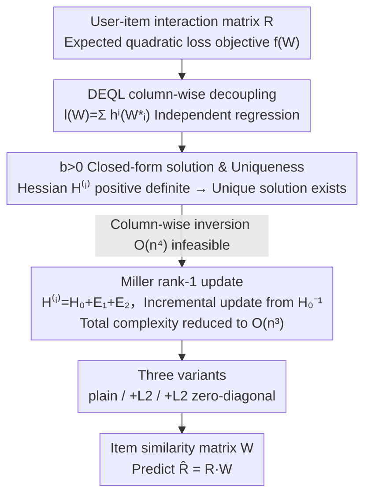

# Generalizing Linear Autoencoder Recommenders with Decoupled Expected Quadratic Loss

**Conference**: ICLR 2026  
**arXiv**: [2603.07402](https://arxiv.org/abs/2603.07402)  
**Code**: [https://github.com/coderaBruce/DEQL](https://github.com/coderaBruce/DEQL)  
**Area**: Image Restoration  
**Keywords**: Linear Autoencoder, Recommender Systems, Collaborative Filtering, Expected Quadratic Loss, Closed-form Solution  

## TL;DR
The objective function of the EDLAE recommendation model is generalized into the Decoupled Expected Quadratic Loss (DEQL). A closed-form solution is derived for a broader range of the hyperparameter $b>0$, and computational complexity is reduced from $O(n^4)$ to $O(n^3)$ using Miller's matrix inversion theorem, outperforming both EDLAE and deep learning models on multiple benchmark datasets.

## Background & Motivation

**Background**: Linear Autoencoder (LAE) recommendation models (such as EASE, EDLAE, ELSA) have demonstrated performance comparable to or better than deep learning models in collaborative filtering tasks due to their simplicity and the reproducibility of closed-form solutions. They learn an item-item similarity matrix $W \in \mathbb{R}^{n \times n}$ to reconstruct the user-item interaction matrix $R$.

**Limitations of Prior Work**: EDLAE aligns the training process better with test scenarios by introducing dropout and an emphasis weight matrix $A$ (with parameters $a$ and $b$). However, the original EDLAE only derived a closed-form solution for the special case where $b=0$, which limits the model's expressiveness.

**Key Challenge**: A superior solution space might exist when $b>0$. However, since the Hessian matrix $H^{(i)}$ varies with the column index $i$, the complexity of direct inversion is $O(n^4)$, making it computationally infeasible.

**Goal**: (a) Derive the closed-form solution for the case where $b>0$; (b) reduce computational complexity for practical use; (c) verify whether the extended solution space can discover superior models.

**Key Insight**: By rewriting the EDLAE objective function in its expected form, the optimization of each column $W_{*i}$ can be decoupled into independent expected quadratic loss problems, thereby obtaining a unified closed-form solution framework.

**Core Idea**: By generalizing the EDLAE objective into DEQL, all closed-form solutions for $b \geq 0$ are derived uniformly. The calculation for $b>0$ is reduced to $O(n^3)$ using the matrix inverse iteration theorem.

## Method

### Overall Architecture
The input is a binary user-item interaction matrix $R \in \{0,1\}^{m \times n}$, and the output is an item similarity matrix $W \in \mathbb{R}^{n \times n}$, with predictions $\hat{R} = RW$. The training objective is to minimize an expected quadratic loss with dropout and emphasis weights:

$$f(W) = \mathbb{E}_\Delta[\|A \odot (R - (\Delta \odot R)W)\|_F^2]$$

where $\Delta$ is a Bernoulli random matrix (dropout), and $A$ is the emphasis matrix (weighting terms dropped out as $a$ and terms not dropped out as $b$). The methodology centers on one core problem: EDLAE only provided a closed-form solution for $b=0$; this work generalizes it to the full range $b \geq 0$. To achieve this, the expected objective is rewritten into a column-wise solvable form (DEQL), it is proven that the solution is unique and exists for $b>0$, and finally, a rank-1 update trick is used to reduce the $O(n^4)$ computation to $O(n^3)$, followed by the integration of $L_2$ regularization and zero-diagonal constraint variants.

### Key Designs

**1. Decoupled Expected Quadratic Loss (DEQL): Splitting the objective into independent regression problems**

Optimizing $W$ directly is hindered by the coupling between columns. Leveraging the column-wise decomposability of the Frobenius norm, the objective is rewritten as $l(W) = \sum_{i=1}^n h^i(W_{*i})$, where each $h^i$ depends only on the $i$-th column $W_{*i}$ and is a standard quadratic function. Thus, each column degrades into an independent expected linear regression problem, with the closed-form solution:

$$W_{*i}^* = \mathbb{E}[X^TX]^{-1}\mathbb{E}[X^TY_{*i}]$$

After decoupling, the optimal solution for each column can be analyzed individually. This perspective also reveals a theoretical property: the solution is not unique when $b=0$ (diagonal elements can take any value), providing the theoretical foundation for discussing the zero-diagonal constraint.

**2. $b>0$ Closed-form Solution and Uniqueness Theorem: Completing the EDLAE solution space**

The original EDLAE only provided solutions for $b=0$, leaving the potentially superior $b>0$ region unexplored. This work explicitly writes the expected expressions for each column's Hessian $H^{(i)} = G^{(i)} \odot R^TR$ and the right-hand side term $v^{(i)}$ via Lemma 3.2, where elements of $G^{(i)}$ are polynomials of $a, b, p$. The key conclusion is: for $b>0$, $G^{(i)}$ is positive definite, hence $H^{(i)}$ is positive definite, and a unique closed-form solution exists. Notably, the solution holds even for $b>a$ (beyond the $a\geq b$ range suggested by EDLAE), and experiments show that some datasets achieve optimal results exactly when $b>a$.

**3. Miller Matrix Inverse Iteration Algorithm: Making $b>0$ computationally feasible**

The difficulty of $b>0$ lies in the fact that Hessian $H^{(i)}$ varies with column index $i$, leading to an $O(n^4)$ complexity for column-wise inversion. This work decomposes $H^{(i)}$ into $H_0 + E_1^{(i)} + E_2^{(i)}$, where $H_0$ is independent of $i$ (requiring only one inversion), and $E_1^{(i)}, E_2^{(i)}$ are rank-1 matrices. Using the rank-1 update formula from Miller's theorem, incremental updates from $H_0^{-1}$ allow each $H^{(i)^{-1}}v^{(i)}$ to be computed in $O(n)$ vector operations, reducing the total complexity from $O(n^4)$ to $O(n^3)$.

### Loss & Training
The final optimization objective supports three variants:
- **DEQL(plain)**: Pure DEQL, Eq. (9)
- **DEQL(L2)**: $W^* = (H^{(i)} + \lambda I)^{-1}v^{(i)}$, reusing the algorithm by replacing $H_0$ with $H_0 + \lambda I$.
- **DEQL(L2+zero-diag)**: Adds a zero-diagonal constraint via the projection in Eq. (17).

## Key Experimental Results

### Main Results (Strong Generalization - LAE Model Comparison)

| Dataset | Metric | DEQL(L2) | EDLAE | EASE | Gain |
|--------|------|----------|-------|------|------|
| Games | R@20 | **0.2891** | 0.2851 | 0.2733 | +1.4% |
| Beauty | R@20 | **0.1408** | 0.1324 | 0.1323 | +6.3% |
| Gowalla-1 | R@20 | **0.2298** | 0.2268 | 0.2230 | +1.3% |
| ML-20M | R@20 | **0.3940** | 0.3925 | 0.3905 | +0.4% |
| Netflix | R@20 | **0.3662** | 0.3656 | 0.3618 | +0.2% |
| MSD | R@20 | **0.3348** | 0.3336 | 0.3332 | +0.4% |

### Main Results (Weak Generalization - Deep Learning Model Comparison)

| Dataset | Metric | DEQL(L2) | SSM (Best DL) | Gain |
|--------|------|----------|-------------|------|
| Amazonbook | R@20 | **0.0629** | 0.0496 | +26.8% |
| Amazonbook | N@20 | **0.0362** | 0.0270 | +34.1% |
| Yelp2018 | R@20 | 0.0746 | **0.0765** | -2.5% |
| Gowalla | R@20 | 0.1824 | **0.1894** | -3.7% |

### Ablation Study

| Configuration | Games R@20 | Beauty R@20 | Description |
|------|-----------|------------|------|
| DEQL(L2) | **0.2891** | **0.1408** | Full model, $b>0$ + L2 |
| DEQL(L2+zero-diag) | 0.2872 | 0.1388 | Slight drop with zero-diagonal constraint |
| DEQL(plain) | 0.2524 | 0.1093 | Significant drop without L2 regularization |
| EDLAE ($b=0$) | 0.2851 | 0.1324 | Original method |

### Key Findings
- $L_2$ regularization is critical for performance; DEQL(plain) is significantly inferior to DEQL(L2).
- Zero-diagonal constraints are not always beneficial; DEQL(L2) often outperforms DEQL(L2+zero-diag).
- On some datasets (e.g., Games), the optimal $b/a$ ratio is greater than 1 ($b>a$), exceeding the $a \geq b$ range suggested by EDLAE.
- Ours shows a 27-34% advantage over deep learning models on Amazonbook but is slightly inferior to SSM on Yelp2018 and Gowalla.

## Highlights & Insights
- The technique of **reducing complexity via Miller matrix inverse iteration** is elegant: decomposing the column dependency in the matrix inverse into two rank-1 perturbations allows for $O(n^3)$ total computation. This logic is transferable to scenarios where the matrix inverse varies by a low-rank amount across indices.
- The **decoupled objective** reveals the non-uniqueness of solutions when $b=0$ (arbitrary diagonal elements), providing a theoretical explanation for the "relaxed zero-diagonal constraint" proposed by Moon et al. (2023).
- Simple linear models still possess significant potential in recommender systems; the key lies in designing training objectives that align with test scenarios.

## Limitations & Future Work
- Performance gains on large-scale datasets are limited (Netflix, MSD gains < 0.5%), suggesting diminishing returns from extending the solution space.
- $b>0$ introduces additional hyperparameters ($a, b, p, \lambda$), increasing grid search costs.
- Only implicit feedback (binary interaction matrices) is considered; extension to explicit ratings is pending.
- In weak generalization settings for Yelp2018 and Gowalla, it falls behind deep models like SSM, indicating weaknesses in modeling graph structural information.

## Related Work & Insights
- **vs EDLAE (Steck 2020)**: EDLAE only solved the special case where $b=0$; this work generalizes it to the full $b \geq 0$ space. Performance gains are small but consistent.
- **vs EASE (Steck 2019)**: EASE is a special case of DEQL where dropout rate $p=0$ and emphasis weights are absent.
- **vs LightGCN**: Deep graph models excel on dense interaction data but underperform compared to DEQL on sparse data (e.g., Amazonbook).

## Rating
- Novelty: ⭐⭐⭐ Extension of existing methods is natural but focuses on hyperparameter space.
- Experimental Thoroughness: ⭐⭐⭐⭐ 9 datasets, multiple baselines, includes statistical significance tests.
- Writing Quality: ⭐⭐⭐⭐ Mathematical derivations are clear but notation-heavy.
- Value: ⭐⭐⭐ Provides theoretical contributions to LAE recommendation models, though practical performance gains are limited.

<!-- RELATED:START -->

## Related Papers

- [\[ICLR 2026\] LinearSR: Unlocking Linear Attention for Stable and Efficient Image Super-Resolution](linearsr_unlocking_linear_attention_for_stable_and_efficient_image_super-resolut.md)
- [\[ICML 2026\] Learning Normalized Energy Models for Linear Inverse Problems](../../ICML2026/image_restoration/learning_normalized_energy_models_for_linear_inverse_problems.md)
- [\[NeurIPS 2025\] Improving Diffusion-based Inverse Algorithms under Few-Step Constraint via Learnable Linear Extrapolation](../../NeurIPS2025/image_restoration/improving_diffusion-based_inverse_algorithms_under_few-step_constraint_via_learn.md)
- [\[ECCV 2024\] Learning Exhaustive Correlation for Spectral Super-Resolution: Where Spatial-Spectral Attention Meets Linear Dependence](../../ECCV2024/image_restoration/learning_exhaustive_correlation_for_spectral_super-resolution_where_spatial-spec.md)
- [\[ICLR 2026\] Energy-oriented Diffusion Bridge for Image Restoration with Foundational Diffusion Models](energy-oriented_diffusion_bridge_for_image_restoration_with_foundational_diffusi.md)

<!-- RELATED:END -->
