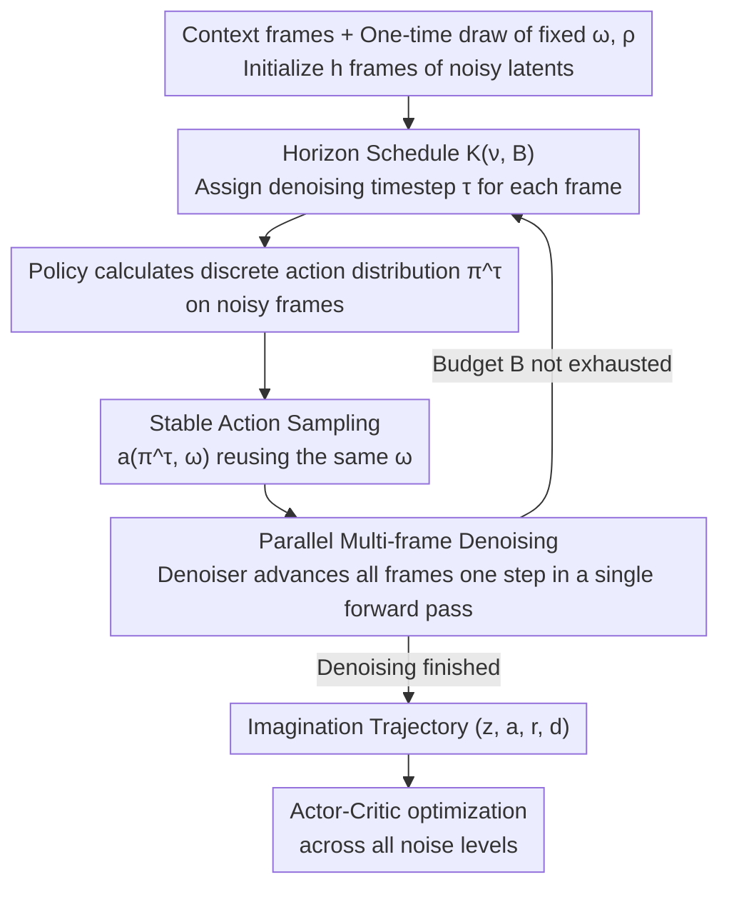

# Horizon Imagination: Efficient On-Policy Rollout in Diffusion World Models

**Conference**: ICLR 2026  
**arXiv**: [2602.08032](https://arxiv.org/abs/2602.08032)  
**Code**: [https://github.com/leor-c/horizon-imagination](https://github.com/leor-c/horizon-imagination)  
**Area**: Image Restoration  
**Keywords**: Diffusion World Models, on-policy rollout, reinforcement learning, sample efficiency, Atari

## TL;DR
The authors propose Horizon Imagination (HI): enabling diffusion world models to **parallel denoise** multi-frame future observations in a single forward pass. Combined with **stable action sampling** to suppress unnecessary action flips on noisy frames and a **Horizon schedule** that decouples the denoising tempo from the total budget, HI maintains on-policy imagination performance even with a sub-frame budget (less than one denoising step per frame) and halved computational costs.

## Background & Motivation

**Background**: World models learn environmental dynamics to generate simulated data. Diffusion world models (e.g., DIAMOND) have gained attention for their superior generation fidelity, but their multi-step denoising process incurs significant overhead.

**Limitations of Prior Work**: On-policy imagination requires sampling actions according to the current policy after generating each step to determine the next state. This creates strict serial dependencies, preventing the exploitation of the parallel denoising capabilities of diffusion models.

**Key Challenge**: Diffusion generation offers high quality but is computationally intensive, and the serial requirements of on-policy RL further amplify this bottleneck.

**Goal**: Significantly reduce the computational cost of diffusion world models while maintaining on-policy imagination quality.

**Key Insight**: It is observed that on-policy imagination does not need to be frame-by-frame serial—the denoiser can advance multiple frames in parallel during a single forward pass by querying the policy on still-noisy frames to obtain the necessary actions for future frames.

**Core Idea**: Use "inverse transform sampling with a single-draw uniform sample" to stabilize actions on noisy frames, and a "Horizon schedule" that decouples budget and decay span to compress the total denoising steps to a sub-frame level.

## Method

### Overall Architecture
HI addresses the slowness of on-policy imagination in diffusion world models. Standard approaches chain "multi-step denoising for one frame $\to$ sampling actions on the clear frame $\to$ action determining the next frame" into a strict sequence where frames must be generated sequentially.

HI transforms this serial chain into a **parallelized** denoising process. It initializes noise latents for future $h$ frames and allows the denoiser to advance all frames simultaneously in a **single forward pass**. To obtain future actions before distant frames are clean, the policy predicts action distributions directly from the current noisy latents **before each denoising step**. To prevent frequent action flipping on noisy frames from destabilizing dynamics, HI employs **stable action sampling** to ensure actions only change when the policy distribution truly shifts, and a **Horizon schedule** to decouple the "denoising rhythm" from the "total budget," allowing the budget to be compressed below one step per frame (sub-frame budget). After the rollout, an actor-critic method optimizes the policy.

### Key Designs

**1. Parallel Multi-frame Denoising: Compressing Serial Generation into a Single Forward Pass**

The root of slow serial imagination is that each frame is generated independently after the previous one. HI uses an action-conditioned causal Diffusion Transformer (causal DiT) to batch the latents of future $h$ frames. Each frame carries its own denoising timestep $\tau_t$, and the model outputs denoising directions (rectified flow velocity field $v_\theta$) for all frames in **one forward pass**. Causal constraints ensure that the $t$-th frame only sees information from timesteps $\le t$. This spreads the total computation across a few "all-frame" steps, significantly reducing latency.

**2. Stable Action Sampling: Preventing Action Instability on Noisy Frames**

Parallel denoising requires distant frames to be denoised before near frames are fully clean. Action dependencies require the policy to predict action distributions $\pi^\tau$ on **noisy** intermediate latents at each step. Independent sampling from $\pi^\tau$ at every step would cause actions to flip frequently due to sampling noise—even if the policy remains unchanged—disturbing future dynamics and collapsing the denoising process.

HI uses inverse transform sampling to solve this: a uniform vector $\omega \sim \mathcal{U}([0,1))^{N-1}$ and an action permutation $\rho$ are **drawn only once** at the start. At each denoising step, the same $\omega$ maps the evolving distribution to an action via a deterministic mapping $a^\tau = a(\pi^\tau, \omega)$. This ensures: (i) The marginal distribution of $a(\pi, \omega)$ is exactly $\pi$ (unbiased); (ii) The probability of an action changing between steps is bounded by the change in distributions. Actions only change when the policy truly shifts, minimizing "unnecessary flips."

**3. Horizon Schedule: Decoupling Denoising Tempo from Total Budget**

To save computation, one must adjust the "total denoising steps." However, existing Pyramidal schedules (Chen 2024) couple the "denoising decay" with the "total budget," causing quality collapse at higher budgets. HI proposes the Horizon schedule using a matrix $\boldsymbol{K}\in[0,1]^{(B+1)\times h}$ to explicitly separate the decay span $\nu$ (how many steps the denoising progress lags across frames) from the total budget $B$. Critically, $B$ can be any integer, including **sub-frame budgets where $B < h$**, allowing an average of less than one denoising step per frame.

### Loss & Training
The world model is trained using rectified flow regression: sampling h-step trajectories, assigning independent denoising times $\tau_t$ per frame, and regressing $v_\theta$ to $\mathbf{z}^1_t-\mathbf{z}^0_t$. A 0.2 probability prefix of clean frames is used to simulate inference conditions. Reward and termination are predicted by a lightweight RNN. The policy and value functions are trained using actor-critic. Since parallel generation requires the policy to be functional at **all noise levels**, the actor is updated using REINFORCE (with entropy regularization) across all imagination noise levels, while the critic uses bootstrap values from fully denoised inputs.

## Key Experimental Results

### Settings
Experiments were conducted on 4 Atari100K environments and 4 Craftium environments (visual input, discrete actions). Each environment used 100K interaction steps (30K for Craftium/SmallRoom). The agent has ~97M parameters. Baselines varied by imagination configuration:

| Baseline Config | Decay Span $\nu$ | Budget $B$ | Meaning |
|---|---|---|---|
| Autoregressive | 1 | 32 | One step per frame, strictly serial |
| HI | 4 | 16 | Sub-frame budget, ~half compute |
| HI | 4 | 32 | Parallel, one step per frame |

### Main Results (5.2)
- Both $\nu=4$ variants matched the performance of the autoregressive baseline across all environments with lower compute. The sub-frame budget ($B=16$) maintained full performance using only half the denoising steps.
- One-step-per-frame denoising ($B=32$) is generally sufficient. In the complex Craftium/ChopTree-v0, $(\nu=4, B=32)$ outperformed the baseline, suggesting higher budgets remain beneficial for high visual complexity.
- Training Time: On Atari, $B=32$ took ~27h/run and $B=16$ took ~19h/run (tokenizer and world model training are unaffected, so total acceleration is less than 2x).

### Ablation Study (5.2.3)
Replacing stable action sampling with naive sampling (independent sampling at each denoising step) led to a significant drop in control performance, particularly in Atari Boxing and Gopher, confirming that suppressing unnecessary action flips is vital for parallel denoising stability.

### Key Findings
- Parallel multi-frame denoising + sub-frame budget preserves control performance while halving computation.
- Stable action sampling is critical for the stability of parallel imagination.
- The Horizon schedule enables sub-frame efficiency and prevents collapse at high budgets by decoupling tempo from budget.

## Highlights & Insights
- **Elegance of Stable Sampling**: Using a single fixed $\omega$ for inverse transform sampling maintains action consistency across evolving distributions without drifting from $\pi^\tau$.
- **Viability of Sub-frame Budgets**: The study proves that an average of less than one denoising step per frame can support on-policy imagination, significantly lowering the deployment cost of diffusion world models.

## Limitations & Future Work
- Designed specifically for discrete action spaces; not applicable to continuous control.
- Systematically verified primarily for $\nu=4$ across 8 environments due to compute limits; other configurations remain largely unexplored.
- Generation quality slightly degrades at very high budgets ($B \ge 128$) for parallel configs compared to autoregressive models.

## Related Work & Insights
- **vs. DIAMOND**: DIAMOND is limited by serial frame-by-frame denoising. HI compresses this via parallel multi-frame denoising and the Horizon schedule.
- **vs. Policy-Guided Imagination**: Works by Rigter/Jackson (2024) use gradients for continuous actions (classifier guidance); HI targets discrete actions using consistent sampling.

## Rating
- Novelty: ⭐⭐⭐⭐ Parallel denoising combined with consistent sampling is intuitive yet novel.
- Experimental Thoroughness: ⭐⭐⭐ Good coverage but lacks continuous control tasks.
- Writing Quality: ⭐⭐⭐⭐ Clear motivation and structure.
- Value: ⭐⭐⭐⭐ Highly significant for the practical deployment of diffusion world models.

<!-- RELATED:START -->

## Related Papers

- [\[ICLR 2026\] Energy-oriented Diffusion Bridge for Image Restoration with Foundational Diffusion Models](energy-oriented_diffusion_bridge_for_image_restoration_with_foundational_diffusi.md)
- [\[ICLR 2026\] Text-Aware Image Restoration with Diffusion Models](text-aware_image_restoration_with_diffusion_models.md)
- [\[ICLR 2026\] Improved Adversarial Diffusion Compression for Real-World Video Super-Resolution](improved_adversarial_diffusion_compression_for_real-world_video_super-resolution.md)
- [\[NeurIPS 2025\] Encoder-Decoder Diffusion Language Models for Efficient Training and Inference](../../NeurIPS2025/image_restoration/encoder-decoder_diffusion_language_models_for_efficient_training_and_inference.md)
- [\[ICLR 2026\] FideDiff: Efficient Diffusion Model for High-Fidelity Image Motion Deblurring](fidediff_efficient_diffusion_model_for_high-fidelity_image_motion_deblurring.md)

<!-- RELATED:END -->
