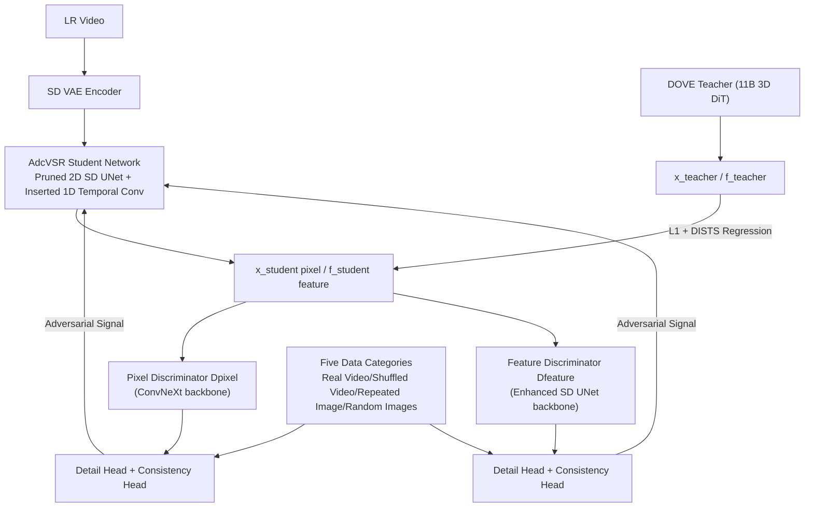

# Improved Adversarial Diffusion Compression for Real-World Video Super-Resolution

**Conference**: ICLR 2026  
**OpenReview**: [https://openreview.net/forum?id=U2SJE6W3wT](https://openreview.net/forum?id=U2SJE6W3wT)  
**Code**: To be confirmed  
**Area**: Video Super-Resolution / Diffusion Model Compression  
**Keywords**: Real-VSR, Diffusion Model Compression, Adversarial Distillation, One-step Diffusion, Temporal Consistency  

## TL;DR
The 11B 3D DiT video super-resolution teacher DOVE is compressed into a 0.57B "2D+1D" student network, AdcVSR. By utilizing dual-head dual-discriminator adversarial distillation, the conflicting objectives of "rich details" and "temporal consistency" are decoupled and optimized, achieving a 95% parameter reduction and an 8x speedup with almost no loss in image quality.

## Background & Motivation
**Background**: Real-world video super-resolution (Real-VSR) has evolved from non-generative/GAN methods to diffusion models, which generate more realistic textural details. One-step diffusion networks (SeedVR2, DOVE, DLoRAL) compress multi-step sampling into a single step, alleviating speed issues.

**Limitations of Prior Work**: Even one-step networks remain heavy—parameters generally exceed 1.3B, with over 4 seconds of latency to generate a 25-frame $512 \times 512$ video. Recent Adversarial Diffusion Compression (ADC, i.e., AdcSR) can compress diffusion networks into compact 2D student networks through pruning and distillation. However, it was designed for image super-resolution (Real-ISR) and causes frame-to-frame flickering when applied directly to video because it lacks temporal modeling capabilities.

**Key Challenge**: In Real-VSR, "rich details" and "temporal consistency" are naturally conflicting goals—synthesizing fine textures requires significant pixel-level changes, while temporal consistency requires constraining these changes from jumping erratically between frames. Generative models emphasizing perceptual quality tend to stack details, leading to flickering, while methods prioritizing propagation/alignment for consistency often smooth out details. Standard single-signal adversarial learning tends to favor one objective at the expense of the other, especially under aggressive pruning.

**Goal**: Design a compression scheme truly suitable for Real-VSR that significantly reduces complexity while maintaining both details and consistency.

**Core Idea**: The authors propose two key hypotheses: **(1) A 2D diffusion backbone is sufficient for synthesizing details** (as the LR video already provides structural layout and temporal continuity, making the global spatio-temporal modeling of 3D attention redundant in SR); **(2) Temporal consistency can be maintained by just a few layers of lightweight 1D temporal convolutions** (constraining inter-frame changes is much simpler than synthesizing details from scratch). This is paired with an adversarial distillation that splits detail and consistency discrimination into two heads to learn from the heavy 3D DiT teacher.

## Method

### Overall Architecture
AdcVSR uses a pruned 2D SD2.1 (UNet + VAE decoder) from AdcSR as the backbone. 1D temporal residual blocks are inserted after each 2D spatial residual block/Transformer block to create a "2D+1D" student network. A dual-head dual-discriminator adversarial distillation is then used to distill from the large teacher DOVE end-to-end, incorporating five categories of video/image data to supervise details and consistency separately. Training consists of two stages: 200K steps of pure regression distillation followed by 200K steps of adversarial learning fine-tuning.

### Key Designs

**1. "2D+1D" network design: Replacing expensive 3D attention with cheap temporal convolutions.** The core insight is that much of the 3D spatio-temporal attention capacity is spent on "inferring global spatio-temporal structures from scratch," which is wasteful in Real-VSR since the LR video already provides structure. Thus, they reuse the pruned SD2.1 backbone of AdcSR (25% channel pruning in UNet, 50% in VAE decoder) and insert a 1D temporal residual block (one 1D temporal convolution + ReLU + second convolution + skip connection, kernel size=3, channels aligned with preceding block, zero initialization) after each UNet block. This "synthesize details by 2D, enforce consistency by 1D" split makes the network much lighter than the 3D teacher DOVE while avoiding complex alignment modules like optical flow. Ablation (Tab. 2) shows: pure 2D achieves DISTS 0.2418 and warping error 4.43; adding 1D reduces DISTS to 0.2112 and warping error to 1.67, narrowing the DISTS gap with the 3D model to 0.0014 using only 7% of the parameters.

**2. Dual-domain end-to-end adversarial distillation: Upgrading from single-point freezing to full-network activation.** Original ADC only distilled in a single feature domain of the VAE decoder with other blocks frozen; this work distills in both the **pixel domain** and the **feature domain of the VAE decoder middle block**, fine-tuning the entire network end-to-end. The teacher DOVE's output pixels $x_{teacher}$ are re-encoded by the SD2.1 VAE and fed into the middle block to obtain aligned features $f_{teacher}$ for supervision. Because the "2D+1D" student is much smaller than the 3D teacher and architecture differences are large, **pure L1 regression cannot achieve a perfect fit**, leading to reconstruction degradation. Therefore, regression is kept as a baseline, and adversarial loss is added to "relax the requirement for exact replication," allowing the student to generate feasible high-quality results within its capacity. The generator loss is:
$$L = \lambda_{pixel}L_{pixel} + \lambda_{feature}L_{feature}$$
$$L_{pixel} = \|x_{student}-x_{teacher}\|_1 + \text{DISTS}(x_{student},x_{teacher}) + \lambda_{adv}\text{Softplus}(-D_{pixel}(x_{student}))$$
$$L_{feature} = \|f_{student}-f_{teacher}\|_1 + \lambda_{adv}\text{Softplus}(-D_{feature}(f_{student}))$$
Using non-saturating adversarial loss, with weights $\lambda_{pixel}=0.1, \lambda_{feature}=1.0, \lambda_{adv}=1.0$.

**3. Dual-head discriminator + five categories of labeled data: Completely decoupling "detail" and "consistency" supervision.** This is key to solving the core contradiction. Each discriminator (using a frozen ConvNeXt backbone for the pixel domain and an enhanced SD UNet backbone for the feature domain, followed by alternating 2D/1D convolutions) branches at the tail into two $1 \times 1$ convolutional linear heads: a "detail head" (192 channels) and a "consistency head" (64 channels), outputting adversarial signals for detail realism and temporal consistency respectively. To supervise these attributes independently, the authors construct five types of data with head-specific labels: ① Student output → both heads labeled "fake"; ② Real video → consistency labeled "real" (detail left unassigned); ③ Frame-shuffled video → consistency labeled "fake"; ④ Static pseudo-video consisting of repeated single rich-detail images → both heads labeled "real"; ⑤ Image sequences sampled randomly without temporal correspondence → detail labeled "real", consistency labeled "fake". The discriminator loss is:
$$L_{disc} = \sum_{(s,y_d,y_c)\in S}\big[\text{Softplus}(-y_d[D(s)]_d) + \text{Softplus}(-y_c[D(s)]_c)\big]$$
where $y_d, y_c \in \{-1, 0, 1\}$ encode "fake/unlabeled/real". This reformulates traditional binary signals into multi-attribute forms, with two dedicated heads providing independent gradients so that **neither objective is ignored or down-weighted**, preventing the generator from collapsing into either "oversmoothing (loss of detail)" or "flickering (loss of consistency)."

## Key Experimental Results

### Main Results
Comparison on the synthetic UDM10 and real VideoLQ datasets (H20 GPU, 25 frames, $512 \times 512$):

| Metric | DOVE (Teacher) | PiSA-SR | AdcSR | HYPIR | **AdcVSR (Ours)** |
|---|---|---|---|---|---|
| UDM10 LPIPS↓ | 0.2645 | 0.3658 | 0.3781 | 0.3736 | **0.3065** |
| UDM10 MUSIQ↑ | 60.68 | 66.42 | 61.30 | 59.85 | 63.88 |
| UDM10 E*warp↓ | 2.22 | 6.96 | 6.19 | 10.68 | **1.67** |
| VideoLQ E*warp↓ | 8.41 | 12.65 | 12.47 | 23.45 | **6.74** |
| #Params (B)↓ | 10.55 | 1.30 | 0.46 | 1.55 | **0.57** |
| Inf. Time (s)↓ | 4.42 | 2.94 | 0.52 | 2.81 | **0.55** |

AdcVSR achieves the **lowest warping error** (best temporal consistency) while having the second-lowest parameters and second-highest speed. Compared to the teacher DOVE, parameters are reduced by 95% and speed is increased by 8x, while image quality remains highly competitive. Real-ISR methods (PiSA-SR/AdcSR/HYPIR) exhibit the worst warping error due to the lack of temporal modeling.

### Ablation Study

| Experiment | Configuration | Key Metric |
|---|---|---|
| Network Design (UDM10) | 3D (Pruned DOVE) / 2D (AdcSR) / **2D+1D** | DISTS 0.2098 / 0.2418 / **0.2112**; E*warp 2.53 / 4.43 / **1.67**; Params 8.36B / 0.52B / **0.55B** |
| Discriminator (YouHQ40) | Single-head Dual-domain / Dual-head Single-domain / **Dual-head Dual-domain** | CLIPIQA 0.6745 / 0.6421 / **0.6861**; E*warp 6.32 / 3.59 / **2.22** |
| Distillation Setup (MVSR4x) | No Adv / No Teacher / SeedVR2 / DLoRAL / **DOVE** | LPIPS 0.3596 / 0.3641 / 0.3489 / 0.3554 / **0.3337**; MUSIQ 54.33 / 50.32 / 60.74 / 54.61 / **61.48** |

### Key Findings
- **1D convolution is the king of efficiency**: Adding just 0.03B parameters reduced the warping error from 4.43 to 1.67, validating the hypothesis that "consistency only requires lightweight temporal convolutions."
- **Dual-head + Dual-domain is indispensable**: Single-head variants show poor consistency; single-domain variants show lower perceptual quality. Only dual-head dual-domain achieves optimality in both metrics.
- **Real-ISR methods have strong per-frame detail**: High MANIQA/CLIPIQA/MUSIQ scores confirm the hypothesis (1) that "2D backbones are sufficient for synthesis." This work builds on this by adding temporal convolutions and dual-head distillation.

## Highlights & Insights
- **The "Divide and Conquer" methodology is elegant**: Splitting SR into "2D for details, 1D for consistency, dual-head discriminator for independent supervision" uses the cheapest means for each task, yet the whole approaches an 11B teacher.
- **Five categories of data + head-specific labels** is a clever weak supervision design: Using "shuffled frames" to create negative consistency samples and "repeated single images" for perfect positive consistency samples allows decoupling attributes without additional manual annotation.
- **Realism in cross-architecture distillation**: The authors recognize that student and teacher architectures are too different for exact fitting, opting for adversarial loss to "relax the imitation requirement" rather than forcing L1 convergence, which is a pragmatic engineering choice.

## Limitations & Future Work
- The teacher DOVE itself is an 11B heavy model. The scheme depends on the existence of a strong teacher—**teacher quality determines the upper bound** (distilling from SeedVR2/DLoRAL yields weaker results).
- The key hypothesis relies on "LR already providing most spatio-temporal structure." For extreme scenarios where degradation is severe and temporal information is nearly lost, it is uncertain if 1D convolutions can maintain consistency.
- AdcVSR is not optimal in fidelity metrics like PSNR/SSIM (UDM10 PSNR 25.36 vs DOVE 26.00), indicating that the perceived quality gained via adversarial distillation comes at some cost to fidelity.
- The main text does not deeply analyze the contribution split of the two-stage training; design choices like the number of 1D convolution layers are relegated to the appendix.

## Related Work & Insights
- **Foundations**: Directly builds on AdcSR (ADC for Real-ISR) and DOVE (3D DiT VSR teacher fine-tuned from CogVideoX), essentially extending ADC from images to video.
- **One-step Diffusion Lineage**: Contrasts with SeedVR2 (progressive distillation from 64 steps to 1 step), DLoRAL (dual-LoRA optimization), and PiSA-SR (one-step residual diffusion). This work follows an "architecture pruning then adversarial distillation" route.
- **Insights**: The idea of using a dual-head discriminator to decouple conflicting objectives can be generalized to any "perceptual quality vs. structural constraint" tasks (e.g., inpainting, style transfer). Extending backbones with lightweight dimensions to fill missing modalities is also a universal low-cost extension paradigm.

## Rating
- **Novelty**: ⭐⭐⭐⭐ While extending ADC to video is incremental, the combination of "2D+1D" hypotheses, dual-head dual-domain discriminators, and five data labels is novel and self-consistent. The perspective of decoupling conflicting goals is insightful.
- **Experimental Thoroughness**: ⭐⭐⭐⭐ Covers 3 synthetic + 3 real datasets, 10 comparison methods, and three sets of ablations (architecture/discriminator/distillation). Both efficiency and quality are well-evidenced, though fidelity metrics are weaker and stage-wise training analysis is in the appendix.
- **Writing Quality**: ⭐⭐⭐⭐ Logic is clear; hypotheses, designs, and validations correspond well. Fig. 1 and Fig. 2 illustrate the core ideas intuitively.
- **Value**: ⭐⭐⭐⭐ A practical Real-VSR model (0.57B / 0.55s) with 95% fewer parameters and 8x more speed. It has direct value for industrial deployment (real-time video enhancement) and provides a systematic recipe for diffusion model compression.

<!-- RELATED:START -->

## Related Papers

- [\[CVPR 2025\] AdcSR: Adversarial Diffusion Compression for Real-World Image Super-Resolution](../../CVPR2025/image_restoration/adversarial_diffusion_compression_for_real-world_image_super-resolution.md)
- [\[ICLR 2026\] Learning Heterogeneous Degradation Representation for Real-World Super-Resolution](learning_heterogeneous_degradation_representation_for_real-world_super-resolutio.md)
- [\[ICLR 2026\] VARestorer: One-Step VAR Distillation for Real-World Image Super-Resolution](varestorer_one-step_var_distillation_for_real-world_image_super-resolution.md)
- [\[CVPR 2026\] One-Step Diffusion Transformer for Controllable Real-World Image Super-Resolution](../../CVPR2026/image_restoration/one-step_diffusion_transformer_for_controllable_real-world_image_super-resolutio.md)
- [\[CVPR 2026\] Time-Aware One Step Diffusion Network for Real-World Image Super-Resolution](../../CVPR2026/image_restoration/time-aware_one_step_diffusion_network_for_real-world_image_super-resolution.md)

<!-- RELATED:END -->
