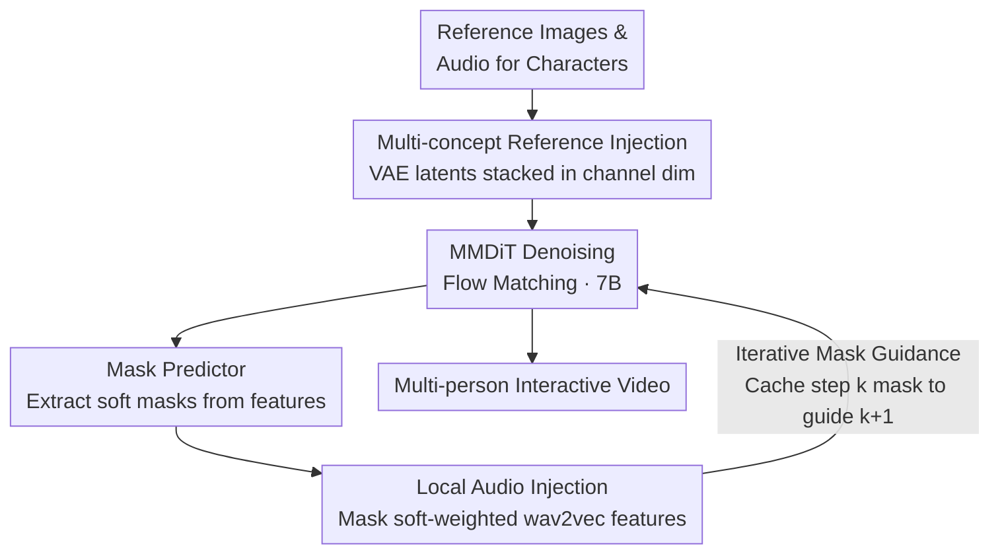

# InterActHuman: Multi-Concept Human Animation with Layout-Aligned Audio Conditions

**Conference**: ICLR 2026  
**arXiv**: [2506.09984](https://arxiv.org/abs/2506.09984)  
**Code**: Partially open-sourced (Reproduction version based on Wan2.1)  
**Area**: Image Restoration  
**Keywords**: Multi-person video generation, Audio-driven animation, Mask prediction, Layout control, DiT

## TL;DR
InterActHuman is proposed to achieve audio-driven video generation in multi-person and human-interaction scenes through an automated spatio-temporal layout-inferring mask predictor and an iterative mask-guiding strategy, supporting independent lip-sync and body movements for each character.

## Background & Motivation

**Background**: Audio-driven human animation has achieved significant progress (CyberHost, OmniHuman), but mainly focuses on single-person scenarios. In multi-person interaction video generation, it is necessary to precisely match different audio tracks to their respective characters.

**Limitations of Prior Work**: The core challenge in multi-person scenarios is a "chicken-and-egg" problem—to inject audio into the correct spatial location, the layout (mask) of each character must be known. However, the mask depends on the final generated video, which does not exist yet. Using fixed masks leads to motion artifacts and unnatural stiffness.

**Key Challenge**: Global audio conditions cannot distinguish which character is speaking in multi-person scenes; fixed masks cannot adapt to movement changes; dynamic masks are required but the video is undetermined during inference.

**Goal**: (a) Audio-character matching in multi-person scenes, (b) Dynamic layout prediction during inference, (c) Multi-concept video generation with identity preservation.

**Key Insight**: During the denoising process of the DiT (Diffusion Transformer), intermediate features are utilized to predict the mask of the current step, which then guides the audio injection for the subsequent step—iterative refinement.

**Core Idea**: A lightweight mask prediction head infers character layouts from DiT intermediate features, utilizing the iterative denoising process to gradually refine both masks and video generation.

## Method

### Overall Architecture
InterActHuman addresses audio-driven video generation in multi-person interaction scenes: given reference images and corresponding audio for each character, individuals speak independently with synchronized lip and body movements. The system is built on a 7B parameter DiT using MMDiT and Flow Matching. Given reference images and audio, the workflow involves: first injecting the identities of multiple reference characters into the DiT with zero extra parameters; during denoising, the **Mask Predictor** extracts the spatio-temporal region currently occupied by each character from intermediate features; this mask is then used for soft-weighted injection of the corresponding audio into the character's location. This process is an **iterative closed-loop** to resolve the "chicken-and-egg" dilemma: for the first 10 steps, the DiT operates without masks to establish a rough layout, after which the mask predicted at step $k$ is cached to guide audio injection at step $k+1$, with masks refining alongside the denoising process.

### Key Designs

**1. Multi-concept Reference Image Injection: Zero-parameter identity embedding**

To preserve multiple identities, standard methods often introduce extra networks like IP-Adapter, increasing parameters and training complexity. This work reuses the DiT's self-attention: reference images $X_i$ are encoded into latent representations $x_i$ via VAE and stacked with the noisy video latent $v$ in the channel dimension. This allows identity information to be injected implicitly through self-attention layers without additional networks, maintaining architectural simplicity.

**2. Mask Predictor: Inferring layouts from intermediate features**

To inject audio into the correct person, the spatio-temporal region occupied by each character must be identified. The mask predictor adds a lightweight head to each DiT layer—consisting of linear projection, 3D RoPE, cross-attention, a 2-layer MLP, and a sigmoid function—enabling cross-attention between video hidden features $h_v$ and reference features $h_i^r$. It outputs a soft mask between 0 and 1, with the final mask being an average of the last few layers. The predictor adds only 56M parameters (negligible relative to the 7B DiT) and increases inference time by only 0.013s per block. Focal loss is used during training to handle the foreground-background imbalance.

**3. Denoising-time Mask Guidance: Solving the "chicken-and-egg" via diffusion**

This is the core design. During inference, predicting a mask requires a video, but the video is yet to be generated. Fixed masks cause artifacts. This work utilizes the progressive nature of diffusion denoising: Stage 1 (first 10 steps) uses no mask, allowing DiT to establish a rough layout; from Stage 2 onwards, the mask predicted at step $k$ is cached to guide audio injection at step $k+1$. Masks refine step-by-step—determining rough positions early and fine-tuning details later—effectively a bootstrap mechanism without external detectors.

**4. Local Audio Condition Injection: Directing audio to the specific person**

With masks, audio injection becomes directional. wav2vec features are injected via cross-attention. Crucially, the mask from the previous step is used for soft weighting, ensuring audio only influences tokens belonging to the corresponding character with soft transitions at mask boundaries. In contrast, global audio injection fails to distinguish speakers (Sync-D as high as 9.482), while mask-weighted local injection reduces Sync-D to 6.670.

### Loss & Training
- Flow matching objective: Velocity prediction loss
- Mask loss: Focal loss (addressing foreground-background imbalance)
- Two-stage training: Single-person audio pre-training followed by multi-concept fine-tuning
- Data: 2.6 million video-mask-caption triplets, annotated via Qwen2-VL dense description and Grounding-SAM2 mask labeling.

## Key Experimental Results

### Main Results (Single-person audio-driven)

| Method | Sync-C (Higher better) | HKV (Higher better) | Sync-D (Lower better) | FVD (Lower better) |
|------|-------------|------------|-------------|----------|
| CyberHost | 6.627 | 24.733 | 8.974 | 54.797 |
| OmniHuman (No mask) | 7.443 | 47.561 | 9.482 | 33.895 |
| OmniHuman (Fixed mask) | - | - | 7.068 | 40.239 |
| **Ours** | **7.272** | **59.635** | **6.670** | **22.881** |

### User Study (Multi-person audio-driven)

| Method | Average Score | Top-1 Selection Rate |
|------|--------|------------|
| Kling | 1.70 | 14.5% |
| OmniHuman | 1.82 | 25.6% |
| **Ours** | **2.48** | **59.9%** |

### Ablation Study

| Audio Injection Strategy | Sync-D (Lower better) | FVD (Lower better) |
|------------|-------------|----------|
| Global Audio Condition | 9.482 | 33.895 |
| ID Embedding | 8.627 | 35.665 |
| Fixed Mask | 7.068 | 40.239 |
| **Predicted Mask** | **6.670** | **22.881** |

### Key Findings
- Predicted masks significantly outperform fixed masks: Sync-D decreased by 5.6%, FVD decreased by 43.1% (40.239 -> 22.881).
- HKV (Hand Keypoint Variance) is the highest among all methods (59.635), indicating richer body movement.
- Multi-concept identity preservation (CLIP-I = 0.744, DINO-I = 0.533) significantly outperforms commercial products like Pika and Vidu.
- Mask predictor overhead is minimal: only 0.4s added per extra reference (vs. 6.5s DiT base).

## Highlights & Insights
- **Iterative Mask Strategy**: Cleverly utilizes the multi-step nature of the diffusion process to refine layout masks during denoising. This is an elegant bootstrap solution requiring no external detectors.
- **Zero-parameter Reference Injection**: Reuses DiT self-attention by stacking reference image VAE latents, keeping the architecture clean.
- **Industrial-grade Data Pipeline**: The annotation pipeline for 2.6 million videos (Qwen2-VL description + Gemini structural parsing + SAM2 masks) is a valuable engineering contribution.

## Limitations & Future Work
- Inference time grows quadratically as the number of characters increases (attention complexity).
- Mask prediction quality depends on DiT intermediate features; masks may be inaccurate in the very early denoising steps.
- Currently supports a maximum of 3 interacting people; scenarios with more people are unverified.
- Audio conditions are limited to speech; driving by music or ambient sound is unexplored.
- The core model is based on an internal 7B DiT, posing barriers to full reproduction.

## Related Work & Insights
- **vs OmniHuman**: Direct competitor, but OmniHuman does not support multi-person audio matching.
- **vs CyberHost**: Early audio-driven method with a significant performance gap.
- **vs Phantom (Multi-concept Customization)**: Phantom excels in multi-concept but lacks audio-driven support; InterActHuman achieves both.

## Rating
- Novelty: ⭐⭐⭐⭐ The iterative mask prediction strategy is novel, though the overall framework integrates existing components.
- Experimental Thoroughness: ⭐⭐⭐⭐⭐ Comprehensive evaluation across single/multi-person and multi-concept scenarios, plus user studies and detailed ablations.
- Writing Quality: ⭐⭐⭐⭐ Clear architectural descriptions, though mathematical notations require careful reading.
- Value: ⭐⭐⭐⭐⭐ High industrial value as a practical system for multi-person interactive video generation.

<!-- RELATED:START -->

## Related Papers

- [\[CVPR 2025\] EchoMimicV2: Towards Striking, Simplified, and Semi-Body Human Animation](../../CVPR2025/image_restoration/echomimicv2_towards_striking_simplified_and_semi-body_human_animation.md)
- [\[CVPR 2026\] Human-Centric Multi-Exposure Fusion: Benchmark and Bi-level Cognition Distillation Framework](../../CVPR2026/image_restoration/human-centric_multi-exposure_fusion_benchmark_and_bi-level_cognition_distillatio.md)
- [\[ICLR 2026\] SuperF: Neural Implicit Fields for Multi-Image Super-Resolution](superf_neural_implicit_fields_for_multi-image_super-resolution.md)
- [\[ICLR 2026\] Learning Domain-Aware Task Prompt Representations for Multi-Domain All-in-One Image Restoration](learning_domain-aware_task_prompt_representations_for_multi-domain_all-in-one_im.md)
- [\[CVPR 2026\] PhaSR: Generalized Image Shadow Removal with Physically Aligned Priors](../../CVPR2026/image_restoration/phasr_generalized_image_shadow_removal_with_physically_aligned_priors.md)

<!-- RELATED:END -->
