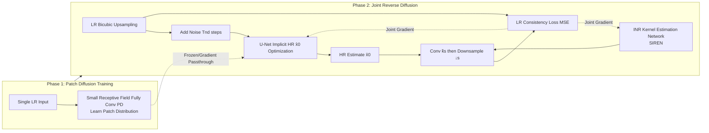

# KernelFusion: Zero-Shot Blind Super-Resolution via Patch Diffusion

**Conference**: ICLR 2026  
**OpenReview**: [https://openreview.net/forum?id=wED9O48qmH](https://openreview.net/forum?id=wED9O48qmH)  
**Code**: To be confirmed  
**Area**: Image Restoration / Blind Super-Resolution  
**Keywords**: Blind Super-Resolution, SR-kernel estimation, Zero-shot diffusion, patch diffusion, internal learning, INR  

## TL;DR
KernelFusion trains a patch-based diffusion model on a single LR image. Based on the principle that the correct kernel is one that maximizes cross-scale patch similarity, it recovers arbitrary (including non-Gaussian) downsampling kernels and corresponding HR images during the reverse diffusion process, pushing blind super-resolution into a zero-shot paradigm entirely free of training distribution assumptions.

## Background & Motivation
- **Background**: Super-resolution (SR) is essentially the inversion of degradation $I_{LR}=(I_{HR}*k_s)\downarrow_s$. Traditional SR assumes the kernel $k_s$ is known (e.g., bicubic). Blind Super-Resolution (Blind-SR) attempts to remove this assumption by training on synthetic degradations, using implicit latent codes for kernels, or designing kernel-robust networks.
- **Limitations of Prior Work**: All externally trained blind SR methods are locked into their training distributions—they can only handle simple low-pass kernels (isotropic/anisotropic Gaussian, motion blur lines). Once they encounter complex out-of-distribution (OOD) kernels, they collapse, with PSNR results even **lower than simple bicubic interpolation** (Ours measured that DPSR/DCLS lose to bicubic on non-Gaussian datasets).
- **Key Challenge**: Prior studies (Levin 2009, Efrat 2013) pointed out that **kernel accuracy is often more critical than the SR algorithm itself or the image prior**. However, mainstream methods focus on stronger SR networks while using the wrong kernels, while pure kernel estimation methods (KernelGAN, Michaeli & Irani) only estimate kernels without performing SR, requiring external independent SR algorithms which leads to error accumulation and inconsistency between kernels and HR images.
- **Goal**: Starting from a single LR image, **simultaneously** recover an image-specific downsampling kernel (unconstrained by kernel shape assumptions) and its corresponding HR image, proving the feasibility of "unconstrained kernel estimation."
- **Key Insight**: **[Zero-shot Internal Learning]** Training a patch diffusion model on a single LR image captures its internal patch statistics, thus the concept of an "out-of-distribution kernel" does not exist. **[Cross-scale Patch Consistency]** The correct kernel should ensure that when the HR image is downsampled back to LR, it maintains the same cross-scale patch distribution as the LR image. Integrating this principle into reverse diffusion enables mutual reinforcement and joint estimation of the kernel and HR image.

## Method

### Overall Architecture
KernelFusion consists of two phases: Phase 1 trains a **fully convolutional patch diffusion model (PD)** with a minimal receptive field (15×15) on a single LR image to learn the unique small patch distribution of that image. Phase 2 freezes the PD and performs reverse diffusion starting from a bicubic upsampled result. A U-Net is used to implicitly optimize the HR estimate $\hat{x}_0$, and an INR network is used to implicitly represent the kernel $\hat{k}_s$. Both are trained jointly under a single LR consistency loss—as long as $(\hat{x}_0 * \hat{k}_s)\downarrow_s$ can reconstruct the input LR, the kernel and HR image are identified correctly.

### Key Designs

**1. Small Receptive Field Patch Diffusion: Turning a single image into a distribution learner for thousands of patches.** Learning distributions directly on a single image can lead to overfitting of global structures. KernelFusion adopts a pure CNN approach for single-image diffusion and pushes the receptive field to the extreme—using a simple stride-less convolutional network (one double 3×3 block + five 3×3+1×1 blocks) with a theoretical receptive field of only $15\times15$. Thus, every random $64\times64$ image crop is equivalent to a batch of thousands of small patches, and the model learns the distribution of these small patches rather than the entire image. The diffusion uses the DDPM framework and predicts velocity $v$ (inspired by Salimans & Ho to improve stability in few-step sampling): the training objective is $\Psi=\arg\min_\psi \lVert PD_\psi(x_t)-v_t\rVert_2^2$, where $x_t=\sqrt{\bar\alpha_t}x_0+\sqrt{1-\bar\alpha_t}\epsilon$, $v_t=\sqrt{\bar\alpha_t}\epsilon-\sqrt{1-\bar\alpha_t}x_0$, and $x_0=I_{LR}$. Clean images can be recovered in closed form from $v$.

**2. INR Kernel Representation: Escaping the smoothing bias of CNN/MLPs to recover non-smooth complex kernels.** The authors observed that explicit kernel estimation methods like KernelGAN or IKR can only recover Gaussian and motion line kernels because the implicit bias of CNN/MLP architectures tends toward smooth results. KernelFusion does not solve directly for discrete weights of $k_s$, but instead uses a **SIREN-style Implicit Neural Representation (INR)** to represent the kernel continuously. Sinusoidal activations naturally fit high-frequency functions, capturing non-natural, non-smooth complex kernel structures like L-shapes, hollow squares, or solid squares, while controlling regularization through the network itself to avoid over-smoothing.

**3. U-Net Implicit HR Optimization + Dual Application for Global Structure preservation.** Since the PD receptive field is only $15\times15$, predicting $\hat{x}_0$ solely with it would lose global structure at high noise steps. KernelFusion does not optimize $\hat{x}_0$ directly but uses a U-Net to generate it implicitly (similar to DIP), imposing a global image prior. The U-Net is **applied twice** at each time step: first to the $x_0$ of the previous step $t+1$ to reconstruct the required $x_t$, and again to the predicted $x_0$ after denoising $x_t$ with PD. Since both the U-Net and INR are trained from scratch, $n_{iter}$ steps of gradient updates are performed at each time step $t$, refining gradually during reverse diffusion.

**4. LR Consistency Loss: Jointly solving kernel and HR under the same constraint.** The only supervision in Phase 2 is the pixel-level LR consistency, $L_{cons}=\mathrm{MSE}\big(I_{LR},\,(\hat{x}_0*\hat{k}_s)\downarrow_s\big)$. This forces the estimated HR, when downsampled with the estimated kernel, to reproduce the input LR, thereby **preventing diffusion from generating hallucinations** not supported by the LR input. This creates a positive feedback loop where "better HR → more accurate kernel → better HR," ensuring consistent joint recovery and avoiding error accumulation from two-step methods.

## Key Experimental Results

### Main Results (4× SR, PSNR↑/SSIM↑)

| Method | Blind144 | DIV2KRK (Gaussian) | DIV2KFK (Non-Gaussian) |
|---|---|---|---|
| Bicubic | 24.865 / 0.637 | 25.075 / 0.671 | 24.101 / 0.639 |
| SwinIR | 23.773 / 0.616 | 25.139 / 0.699 | 23.070 / 0.620 |
| DPSR | 24.824 / 0.637 | 25.317 / 0.682 | 23.977 / 0.637 |
| DCLS-SR | 24.808 / 0.633 | 27.150 / 0.748 | 23.886 / 0.634 |
| DRAT | 24.747 / 0.631 | **27.953** / 0.779 | 23.824 / 0.631 |
| RealDAN | 24.624 / 0.638 | 26.870 / 0.745 | 23.941 / 0.644 |
| KernelGAN+ZSSR | 24.529 / 0.633 | 25.895 / 0.703 | 23.617 / 0.629 |
| **Ours** | **27.191 / 0.719** | 26.761 / 0.715 | **26.426 / 0.720** |

- On the two non-Gaussian (OOD) datasets, Blind144 and DIV2KFK, KernelFusion leads significantly (approx. +2.4dB higher than the runner-up), while almost all SotA blind SR methods **lose to bicubic** on these sets.
- On the Gaussian DIV2KRK (the specialized domain for competitors), KernelFusion remains competitive (26.761) without specialized training.

### Ablation Study (Blind144, PSNR↑)

| Configuration | PSNR |
|---|---|
| DIP (U-Net on pure noise + INR + Consistency Loss) | 23.663 |
| UNet only | 25.804 |
| PD + UNet | 25.481 |
| **KernelFusion (Full)** | **27.191** |

- Pure DIP can achieve some patch distribution adjustment via the powerful INR, but it is insufficient.
- U-Net provides a global prior, PD provides patch distribution constraints; the full combination (PD + UNet + INR + Dual Application + Consistency Loss) yields the maximum gain.

### Key Findings
- **Kernel Accuracy > Algorithm Strength**: Using Ground Truth (GT) kernels with fine interpolation (backprojection + kernel pseudo-inverse) outperforms SotA blind SR by ~1dB on non-Gaussian data, quantitatively confirming that kernel accuracy is more vital than the SR algorithm.
- **Kernel Visualization**: Compared to KernelGAN (strong Gaussian bias), IKR (skewed toward motion lines), and MLMC/DKP (still deviating from GT), KernelFusion accurately recovers extreme non-natural kernels like L-shapes and hollow/solid squares.
- **Real World**: On real degradation images (DSLR shake, historical photos), it clearly recovers text that competitors cannot (e.g., the word "OPPOSES" in a historical photo).

## Highlights & Insights
- **First deep blind SR method capable of recovering arbitrary downsampling kernels**, effectively eliminating the concept of "out-of-distribution kernels" by training only on the input image itself.
- **Joint estimation instead of two-step methods**: The kernel and HR image reinforce each other under the same consistency loss, avoiding the error accumulation and inconsistency of the classic "estimate kernel, then SR" pipeline.
- **INR is the key to complex kernel recovery**: By shifting from "discrete weights + CNN smoothing bias" to "SIREN continuous representation," the method addresses the root cause of non-Gaussian kernel recovery failure.
- It rejuvenates and operationalizes the classic Michaeli & Irani principle of "cross-scale patch similarity" using modern diffusion and INR.

## Limitations & Future Work
- The authors explicitly state the goal is **not to deliver a production-grade blind SR system**, but rather to demonstrate the feasibility of "unconstrained kernel estimation + simultaneous HR recovery."
- **High cost of zero-shot per-image training**: Training a PD and then performing joint reverse diffusion iterations for every image entails much higher inference costs than feed-forward methods, making it difficult for real-time or batch processing.
- Still assumes the kernel is **global** (single image-wide kernel), not covering spatially-varying degradations or composite degradations like noise and compression.
- Tiny PD receptive field favors patch distribution learning, but global structure relies entirely on the U-Net prior, which may be limited in highly complex scenes.

## Related Work & Insights
- **Cross-scale patch principle**: Michaeli & Irani (2013) first proposed that the correct kernel maximizes cross-scale patch similarity; KernelGAN (Bell-Kligler 2019) implemented this via single-image GANs; KernelFusion upgrades this to an end-to-end solution using diffusion.
- **Deep Internal Learning / Single-Image Diffusion**: ZSSR, DIP, SinGAN, and single-image diffusion (Nikankin et al., 2023) provide the paradigm for "training on a single image." This work inherits that and shrinks the receptive field to the patch level.
- **Diffusion for Inverse Problems**: DDRM, DPS, and BlindDPS use pre-trained diffusion priors for SR/deblurring, but BlindDPS relies on pre-training on large-scale synthetic blur datasets; KernelFusion is entirely zero-shot and requires no external kernel or image priors.
- **Insight**: When the bottleneck of a task lies in "degradation operator estimation" rather than "generative priors," per-sample internal learning + continuous representation (INR) may be more effective than scaling up models. Joint estimation under consistency loss is a universal strategy for avoiding error accumulation in blind inverse problems like deblurring, denoising, and camera ISP inversion.

## Rating
- **Novelty**: ⭐⭐⭐⭐⭐ First zero-shot deep blind SR to recover arbitrary (non-Gaussian) kernels, breaking training distribution assumptions at a paradigm level.
- **Experimental Thoroughness**: ⭐⭐⭐⭐ Three datasets + self-built Blind144/DIV2KFK controlled benchmarks + extensive competitors + kernel visualization + real-world images + comprehensive ablation; lacks runtime/complexity comparison and failure case analysis.
- **Writing Quality**: ⭐⭐⭐⭐ Logic flows clearly (Kernel Accuracy > Algorithm Strength → OOD Collapse → Zero-shot Solution), effective diagrams; the method section is slightly dense with two phases and multiple components.
- **Value**: ⭐⭐⭐⭐ Proves the feasibility of unconstrained kernel estimation, offering new ideas for blind inverse problems; however, per-image training costs and "non-production" positioning limit immediate deployment.

<!-- RELATED:START -->

## Related Papers

- [\[ICLR 2026\] Turbo-DDCM: Fast and Flexible Zero-Shot Diffusion-Based Image Compression](turbo-ddcm_fast_and_flexible_zero-shot_diffusion-based_image_compression.md)
- [\[CVPR 2026\] MR. Illuminate: Zero-Shot Low-Light Image Enhancement with Diffusion Prior](../../CVPR2026/image_restoration/mr_illuminate_zero-shot_low-light_image_enhancement_with_diffusion_prior.md)
- [\[CVPR 2026\] Zero-Shot Image Denoising via Hybrid Prior-Guided Pseudo Sample Generation](../../CVPR2026/image_restoration/zero-shot_image_denoising_via_hybrid_prior-guided_pseudo_sample_generation.md)
- [\[ICLR 2026\] Trust but Verify: Adaptive Conditioning for Reference-Based Diffusion Super-Resolution](trust_but_verify_adaptive_conditioning_for_reference-based_diffusion_super-resol.md)
- [\[ICLR 2026\] Improved Adversarial Diffusion Compression for Real-World Video Super-Resolution](improved_adversarial_diffusion_compression_for_real-world_video_super-resolution.md)

<!-- RELATED:END -->
