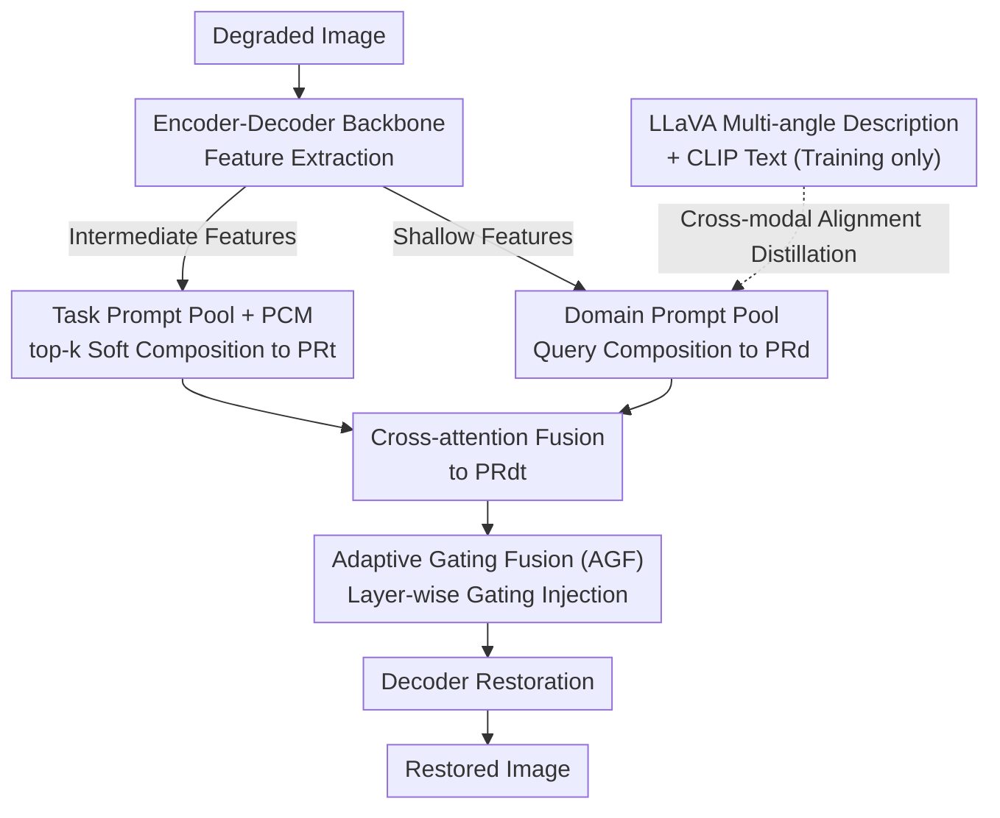

# Learning Domain-Aware Task Prompt Representations for Multi-Domain All-in-One Image Restoration

**Conference**: ICLR 2026  
**arXiv**: [2603.01725](https://arxiv.org/abs/2603.01725)  
**Code**: [GitHub](https://github.com/GuangluDong0728/DATPRL-IR)  
**Area**: Image Restoration  
**Keywords**: All-in-One Image Restoration, Multi-Domain Restoration, Prompt Learning, Dual Prompt Pool, Cross-Modal Alignment

## TL;DR
This work proposes DATPRL-IR, the first multi-domain all-in-one image restoration method. It learns domain-aware task prompt representations via a dual prompt pool (Task Prompt Pool + Domain Prompt Pool), distills domain priors from MLLMs, and guides restoration through adaptive gating fusion, significantly surpassing SOTA across 9 tasks in natural, medical, and remote sensing domains.

## Background & Motivation

**Background**: Existing All-in-One Image Restoration (AiOIR) methods (e.g., PromptIR, MoCE-IR) can handle multiple degradation tasks using a single model. however, they are restricted to a single image domain (e.g., natural or medical images), with no existing method capable of cross-domain multi-task restoration simultaneously.

**Limitations of Prior Work**: (1) Images from different domains (natural, medical, remote sensing) possess unique visual characteristics, preventing single-domain methods from generalizing; (2) Existing methods focus on distinguishing task differences while ignoring shared knowledge between tasks; (3) As the number of tasks and domains increases, model learning difficulty rises sharply.

**Key Challenge**: Under the multi-domain multi-task setting, it is necessary to simultaneously model task specificity, domain specificity, and the shared knowledge between them. Existing single-prompt or single-encoding mechanisms cannot effectively capture this hierarchical knowledge structure.

**Goal**: How to handle multiple restoration tasks across three domains (natural, medical, remote sensing) with a single model? How to effectively utilize shared knowledge between tasks and domains to reduce learning difficulty?

**Key Insight**: Although images from different domains have unique features, they share overlapping visual properties (e.g., "grayscale + human organs" for medicine, "bird's-eye view + buildings" for remote sensing). Domain-aware task prompt representations can be generated by separately encoding task and domain knowledge via dual prompt pools and combining them adaptively at the instance level.

**Core Idea**: Utilize dual prompt pools to learn task-specific and domain-specific/shared knowledge respectively. Generate domain-aware task prompt representations to guide multi-domain restoration through a prompt composition mechanism and cross-attention fusion.

## Method

### Overall Architecture
DATPRL-IR attaches two prompt pools to an encoder-decoder backbone. Intermediate features from the encoder query the Task Prompt Pool to obtain task representations $\mathbf{PR}_t$, while shallow features query the Domain Prompt Pool to obtain domain representations $\mathbf{PR}_d$. These are fused via cross-attention into domain-aware task prompt representations $\mathbf{PR}_{dt}$, which are injected layer-wise into the backbone via Adaptive Gating Fusion (AGF) to guide restoration. Crucially, task and domain knowledge are decoupled into two retrievable "knowledge bases" and dynamically combined at the instance level rather than being forced into a single generic prompt.

### Key Designs

**1. Task Prompt Pool and Prompt Composition Mechanism (PCM): Balancing shared and task-specific knowledge**

Existing methods either encode each task separately (ignoring sharing) or use a single prompt for all degradations (failing to distinguish). This work constructs a task pool with $N_t=15$ key-value pairs $(\mathbf{K}_j^{\text{task}}, \mathbf{V}_j^{\text{task}})$. A learnable projector maps intermediate features to a query $\mathbf{Q}^{\text{task}}$, selects the top-$k$ ($k=3$) most relevant prompts based on cosine similarity, and combines them via temperature-scaled softmax into an instance-level task representation $\mathbf{PR}_t = \sum_{j \in k} \alpha_j^{\text{task}} \mathbf{V}_j^{\text{task}}$. Prompts are optimized end-to-end. This "soft composition" allows tasks with shared requirements (e.g., Super-Resolution and Deblurring both needing sharpening) to reuse prompts while maintaining task specificity through different weighting coefficients.

**2. Domain Prompt Pool and MLLM Knowledge Distillation: Injecting domain semantic priors**

Domain awareness requires understanding high-level semantics (e.g., natural photo, medical slice, or remote sensing overhead), which are difficult to learn directly from degraded images. This work constructs $N_d=15$ domain prompts. During training, LLaVA-1.5-7B generates multi-angle text descriptions (content, color, objects, brightness, perspective) for high-quality images. These are encoded by a CLIP text encoder into $\mathbf{F}_{\text{text}}$, and the domain prior is distilled into the prompt pool via a cross-modal alignment loss $\mathcal{L}_{\text{align}} = 1 - \cos(\mathbf{PR}_d, \mathbf{F}_{\text{text}})$. At inference, LLaVA and CLIP are removed, leaving domain awareness solidified in the prompts with zero extra overhead—leveraging MLLM understanding during training without deployment costs.

**3. Adaptive Gating Fusion (AGF): Layer-specific prompt integration**

Task and domain representations are fused into $\mathbf{PR}_{dt}$ via cross-attention. Since different network depths have varying requirements—shallow layers need domain information for input identification, while deep layers need task information for specific restoration—a fixed fusion ratio is suboptimal. AGF assigns a learnable gate $\alpha_l \in [0,1]$ to each layer to dynamically balance features and prompts: $\mathbf{F}_l^e = \text{CrossAttn}(\alpha_l \mathbf{F}_l, (1-\alpha_l) \mathbf{PR}_{dt})$, allowing each layer to independently learn its optimal fusion strategy.

### Loss & Training
The total loss is a weighted sum of six components: $\mathcal{L} = \lambda_{\text{pix}}\mathcal{L}_{\text{pix}} + \lambda_{\text{fft}}\mathcal{L}_{\text{fft}} + \lambda_{\text{align}}\mathcal{L}_{\text{align}} + \lambda_{\text{div}}\mathcal{L}_{\text{div}} + \lambda_{\text{bal}}\mathcal{L}_{\text{bal}} + \lambda_{\text{con}}\mathcal{L}_{\text{con}}$. $\mathcal{L}_{\text{pix}}$ and $\mathcal{L}_{\text{fft}}$ are $\ell_1$ reconstruction losses in RGB and Fourier domains. $\mathcal{L}_{\text{align}}$ is the cross-modal alignment loss. $\mathcal{L}_{\text{div}}$ encourages prompt diversity via a cosine similarity threshold $\tau=0.1$, and $\mathcal{L}_{\text{bal}}$ ensures balanced prompt utilization by maximizing selection entropy. Optimization uses Adam with a $4 \times 10^{-4}$ learning rate and cosine annealing for 1000K iterations with a batch size of 12.

## Key Experimental Results

### Main Results

| Task/Dataset | Metric | Ours (6T) | Prev. SOTA (MoCE-IR) | Gain |
|--------|------|------|----------|------|
| Natural SR / DIV2K-Val | PSNR | 28.98 | 28.16 | +0.82 |
| Deraining / Rain100L | PSNR | 39.56 | 38.64 | +0.92 |
| MRI SR / IXI MRI | PSNR | 27.88 | 27.75 | +0.13 |
| CT Denoising / AAPM-Mayo | PSNR | 33.80 | 33.74 | +0.06 |
| Remote Sensing SR / UCMerced | PSNR | 28.29 | 28.06 | +0.23 |
| Cloud Removal / CUHK CR1 | PSNR | 26.12 | 26.06 | +0.06 |
| **Average (6 Tasks)** | **PSNR** | **30.77** | **30.40** | **+0.37** |

### Ablation Study

| Configuration | Deraining PSNR | CT Denoising PSNR | RS SR PSNR |
|------|---------|------|------|
| W/o TP + W/o DP (Baseline) | 38.34 | 33.70 | 28.02 |
| TP Pool only | 39.32 | 33.76 | 28.16 |
| DP Pool only | 38.88 | 33.74 | 28.12 |
| TP + DP (Full) | 39.56 | 33.80 | 28.29 |

### Key Findings
- When expanding from 6 tasks to 9 tasks, performance on original tasks improved (e.g., Natural SR: 28.98 $\rightarrow$ 29.05), verifying transferable shared knowledge between domains.
- Switching between different MLLM scales (LLaVA-7B/13B, Qwen3-VL-2B) had minimal impact, suggesting the method only requires coarse-grained domain semantics.
- Replacing the domain prompt pool with fixed text prompts (e.g., "This is an MRI image") reduced performance, validating the need for adaptive selection and shared modeling.
- A prompt pool size of 15 and top-$k=3/5$ were optimal; extreme sizes hindered performance.

## Highlights & Insights
- This work is the first to extend all-in-one restoration to multi-domain scenarios. The dual prompt pool architecture elegantly decouples task and domain knowledge learning, achieving an adaptive balance through PCM. The ability to maintain or improve performance when adding tasks shows excellent scalability.
- The use of MLLM for distilling domain priors is clever: it leverages LLaVA's strong understanding during training but removes the computational burden at inference, achieving "free" domain awareness.

## Limitations & Future Work
- Domain expansion currently covers only natural/medical/remote sensing; scalability to more domains (e.g., underwater, night vision, satellite) remains to be verified.
- Prompt pool size and top-$k$ require manual tuning; an adaptive mechanism is lacking.
- Evaluation is limited to PSNR/SSIM, lacking perceptual metrics (e.g., LPIPS) and downstream task assessments.

## Related Work & Insights
- **vs PromptIR**: PromptIR uses a single learnable prompt for degradation encoding. This work uses a prompt pool + PCM for flexible instance-level representation and introduces the domain awareness dimension.
- **vs MoCE-IR**: MoCE-IR uses Mixture-of-Experts for task allocation. This work achieves similar functionality via a "Query-Retrieve-Combine" paradigm in dual prompt pools but is more lightweight, outperforming it by 0.37dB on average across 6 tasks.

## Rating
- Novelty: ⭐⭐⭐⭐ First multi-domain all-in-one restoration method; dual prompt pool + MLLM distillation is innovative.
- Experimental Thoroughness: ⭐⭐⭐⭐ Comprehensive experiments across 3 domains and 9 tasks with detailed ablation.
- Writing Quality: ⭐⭐⭐⭐ Clear structure, rich visualizations, and well-articulated motivation.
- Value: ⭐⭐⭐⭐ Multi-domain unified restoration is practically significant; the dual prompt pool is transferable to other multi-domain multi-task settings.

<!-- RELATED:START -->

## Related Papers

- [\[ICLR 2026\] RestoreVAR: Visual Autoregressive Generation for All-in-One Image Restoration](restorevar_visual_autoregressive_generation_for_all-in-one_image_restoration.md)
- [\[ICLR 2026\] Rethinking Expressivity and Degradation-Awareness in Attention for All-in-One Blind Image Restoration](rethinking_expressivity_and_degradation-awareness_in_attention_for_all-in-one_bl.md)
- [\[ICLR 2026\] Test-Time Domain Generalization for Image Super-Resolution](test-time_domain_generalization_for_image_super-resolution.md)
- [\[CVPR 2026\] FAPE-IR: Frequency-Aware Planning and Execution Framework for All-in-One Image Restoration](../../CVPR2026/image_restoration/fape-ir_frequency-aware_planning_and_execution_framework_for_all-in-one_image_re.md)
- [\[CVPR 2025\] Degradation-Aware Feature Perturbation for All-in-One Image Restoration](../../CVPR2025/image_restoration/degradation-aware_feature_perturbation_for_all-in-one_image_restoration.md)

<!-- RELATED:END -->
