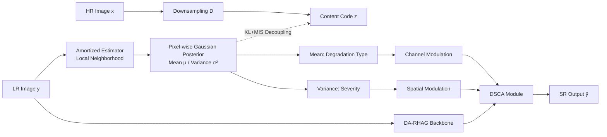

# Learning Heterogeneous Degradation Representation for Real-World Super-Resolution

**Conference**: ICLR 2026  
**OpenReview**: [https://openreview.net/forum?id=IOmPy7P1y4](https://openreview.net/forum?id=IOmPy7P1y4)  
**Code**: TBD  
**Area**: Image Restoration / Real-World Super-Resolution  
**Keywords**: Real-World SR, Degradation Representation, Variational Inference, Mutual Information Suppression, Spatially Heterogeneous Degradation  

## TL;DR
This paper proposes SAVL (Spatially Amortized Variational Learning), which models the degradation of each pixel as a "spatially-varying Gaussian distribution" inferred from local neighborhoods. A mutual information suppression term is employed to decouple degradation from image content, resulting in an implicit representation that is both spatially heterogeneous and highly discriminative of degradation factors. The SR network is subsequently guided by a dual-path posterior of "mean (channel modulation) + variance (spatial modulation)" for reconstruction.

## Background & Motivation
**Background**: Real-world super-resolution (RWSR) aims to recover high-resolution images from low-resolution inputs under complex capturing conditions. Real-world degradation is heterogeneous both across images (due to equipment/ISO/ISP) and within a single image (due to depth-of-field/texture complexity). To handle unknown degradations, mainstream approaches learn a degradation representation to guide upsampling, categorized into two types: explicit estimation (predicting parameters like blur kernels or noise levels), which is limited by predefined degradation spaces, and implicit degradation representation (IDR, via contrastive learning/distillation/meta-learning), which offers higher capacity and generalizability.

**Limitations of Prior Work**: Existing IDR methods suffer from two major drawbacks: (1) **Lack of spatial variation modeling**, assuming uniform degradation across the entire image, which contradicts real-world scenarios. (2) **Insufficient decoupling of degradation and content**. The unconstrained latent space of IDR is often too expressive, tending to encode the entire LR signal (including degradation-irrelevant content like appearance and semantics), making the representation "non-discriminative" and misleading the SR process. Quantifying with MINE revealed that while explicit representations have low content correlation, they also have weak degradation modeling, whereas existing implicit representations are highly correlated with both content and degradation (severe entanglement).

**Key Challenge**: Modeling spatially-varying degradation requires a more complex pixel-wise latent space, yet a more complex latent space is more prone to content leakage. "Spatially heterogeneous modeling" and "degradation-content decoupling" are naturally in conflict. Furthermore, the spatial variation assumption invalidates the premise of contrastive learning that "different patches from the same image share the same degradation," rendering old paradigms ineffective.

**Goal**: To learn an implicit degradation representation that is spatially resolved, decoupled from content, and highly discriminative of degradation factors within a single forward pass and affordable computational cost, and effectively inject it into an SR network.

**Core Idea**: **[Variational Modeling]** Treat pixel-wise degradation as a spatially-varying Gaussian posterior amortized from local neighborhoods (mean = degradation type, variance = degradation severity/uncertainty). **[Information-theoretic Decoupling]** Add a mutual information suppression term to the conditional ELBO to actively filter out degradation-irrelevant content. **[Dual-path Guidance]** Use posterior mean for channel modulation and variance for spatial modulation to drive SR.

## Method

### Overall Architecture
SAVL uses a single amortized estimator (with limited local receptive fields and shared parameters across pixels/images) to infer the pixel-wise Gaussian posterior of degradation. The framework consists of two "lanes" that eventually merge: SAVL-LM learns a spatially-factored conditional likelihood (conditional ELBO), and SAVL-MIS suppresses the mutual information $I(r;z)$ between degradation $r$ and content code $z$ using VIB + Barber–Agakov bounds. Both lanes share the estimator and collapse into a two-term loss consisting of "reconstruction + KL." The learned posterior is directly injected into a degradation-aware SR network (DA-RHAG/DSCA). SAVL and the SR network are first trained jointly; after convergence, the amortized estimator is frozen for further SR fine-tuning.

### Key Designs

**1. Spatially Amortized Gaussian Posterior Modeling**: Mapping degradation to a pixel-wise inferable distribution. Instead of assigning a single degradation vector to the whole image, the paper models each pixel of the degradation field $r(\cdot)=\{r(u)\}_{u\in\Omega}$ as a mean-field Gaussian posterior, inferred solely from local neighborhood evidence $y(N_s(u))$. Specifically, it employs a mean-field Gaussian posterior $q_\psi(r\mid y)=\prod_u \mathcal{N}(r(u);\mu_\psi(u),\mathrm{diag}\,\sigma^2_\psi(u))$ with a spatial white Gaussian prior $p(r)=\prod_u\mathcal{N}(r(u);0,I)$, where $\mu_\psi(u),\log\sigma^2_\psi(u)=g_\psi(y(N_s(u)))$, and $r(u)=\mu_\psi(u)+\sigma_\psi(u)\odot\varepsilon(u)$ via reparameterization. This design has two advantages: the Gaussian posterior naturally captures spatial non-uniformity, while "pixel-shared parameters with limited receptive fields" in amortized inference replaces expensive pixel-wise optimization with a single forward mapping. This aligns with the physical nature of real-world degradation (optics, sensor noise, compression), which acts locally and varies smoothly, reducing variance and saving parameters. The posterior mean characterizes degradation types, and the variance quantifies severity, making the representation interpretable.

**2. SAVL-MIS: Active Suppression of Degradation-Content Entanglement via Mutual Information Upper Bound**: Decoupling is the core challenge. Starting from a constrained objective: $\max \mathbb{E}_{p_{\text{data}}}[\log p_\Theta(y\mid z)]\ \text{s.t.}\ I(r;z)\le\kappa$, the paper uses a Lagrange multiplier to derive the penalty form $\mathcal{L}=\mathbb{E}[\log p_\Theta(y\mid z)]-\lambda I(r;z)$. Since $I(r;z)$ is intractable, the identity $I(r;z)=I(r;y)+I(z;y)-I(y;z,r)+C$ is used. Applying a VIB-style upper bound to $I(r;y)$ and a Barber–Agakov lower bound to $I(y;z,r)$ yields a tractable MIS penalty. The brilliance lies in "estimator sharing": by treating the likelihood term as a critic ($\vartheta\equiv\theta$), reusing the amortized posterior ($\phi\equiv\psi$), and adopting the same white prior, the entire objective elegantly collapses into:

$$J_{\text{SAVL}}(\theta,\psi)=-\mathbb{E}_{q_\psi}[\log p_\theta(y\mid z,r)]+(1+\lambda)\,D_{\text{KL}}(q_\psi(r\mid y)\,\|\,p(r))$$

This results in two terms—"reconstruction + weighted KL"—without requiring additional discriminative networks. In practice, taking Gaussian/Laplacian for the conditional likelihood reduces the reconstruction term to L2/L1 loss. The final training objective is $\min_{\theta,\psi}\alpha L_{\text{rec}}+\beta D_{\text{KL}}$. This combination of white prior and KL/MIS ensures the representation is "well-constrained and discriminative of degradation," preventing pixel-wise latent spaces from leaking content.

**3. DSCA: Dual-path Modulation of the SR Network via Posterior Mean and Variance**: Given that the posterior naturally provides two components—"mean = degradation type" and "variance = severity"—the paper designs Degradation-Guided Spatial–Channel Attention (DSCA) for dual modulation injection into the SR backbone. In the spatial dimension, degradation severity (normalized from variance as $s(u)=1-(\sigma^2_\psi(u)-\mu_{\sigma^2})/\mathrm{Var}[\sigma^2]$) is used to reweight SW-MSA attention scores, encouraging pixels with similar degradation to attend to each other. In the channel dimension, a lightweight convolutional network predicts per-channel modulation vectors from the posterior mean to adjust feature activations based on the inferred degradation type. DSCA is inserted as the first stage before each HAB/OCAB in DA-RHAG (Degradation-Aware Residual Hybrid Attention Group), allowing degradation information to intervene early in reconstruction.

## Key Experimental Results

### Main Results Table (Synthetic + Real SR Benchmarks, ×4)

| Method | Params(M) | RealSR PSNR↑ | DRealSR PSNR↑ | DRealSR SSIM↑ | SVSR PSNR↑ |
|------|-----------|--------------|---------------|---------------|------------|
| RealESRGAN | 16.7 | 24.22 | 26.95 | 0.7812 | 24.36 |
| HAT-GAN | 20.8 | 25.17 | 27.76 | 0.7926 | 25.05 |
| StableSR (Diff) | 919 | 24.60 | 27.39 | 0.7830 | 24.49 |
| KDSR | 18.8 | 25.57 | 27.02 | 0.7787 | 25.09 |
| CDFormer | 25.0 | 25.43 | 27.11 | 0.7792 | 25.07 |
| LightBSR | 3.1 | 24.98 | 27.69 | 0.7893 | 24.93 |
| **Ours** | **14.0** | **25.80** | **28.27** | **0.8139** | **25.13** |

Gains increase with degradation complexity: +0.23dB over KDSR on RealSR, and +0.58dB over LightBSR on the high-complexity DRealSR. Ours outperforms diffusion-based methods in fidelity (DRealSR SSIM 0.8139 vs StableSR 0.7830) while avoiding hallucinations and semantic artifacts common in generative priors.

### Ablation Study Table

| Configuration | Scene-ID Acc↓ | Noise-Level Acc↑ | MINE (Content)↓ | RealSR PSNR↑ |
|------|---------------|------------------|-------------|--------------|
| **Ours (Full)** | **49.97** | **94.80** | **0.1507** | **25.80** |
| Ours w/o SAVL (Det. code) | 94.04 | 81.48 | 1.0254 | — |
| Ours w/o SAVL + CLUB | 36.44 | 20.00 | 0.2700 | — |
| Ours w/o Channel Mod. | — | — | — | 25.13 |
| Ours w/o Spatial Mod. | — | — | — | 25.69 |

Removing SAVL and reverting to deterministic codes causes content separability to surge (Scene-ID 94%) while degradation discriminability drops. Replacing SAVL with the CLUB upper bound causes both to collapse (Noise-level 20% = random). Channel modulation contributes more than spatial modulation (-0.67dB vs -0.11dB when removed).

### Key Findings
- **Effective Decoupling**: SAVL reduces content discriminability to 49.97% (near random) while maintaining 94.80% degradation discriminability. Content MINE is an order of magnitude lower than CDFormer (0.1507 vs 1.2209).
- **Interpretable Spatial Sensitivity**: Severity heatmaps reflect degradation heterogeneity across devices (iPhone has stronger degradation and more concentrated heatmaps, consistent with NIQE) and within images (varying with depth/texture).
- **t-SNE Visualization**: The full model forms clear clusters for ISO/focal length/sensor/texture, whereas the baseline collapses into overlapping embeddings.

## Highlights & Insights
- Successfully unifies "spatially heterogeneous degradation modeling" and "degradation-content decoupling"—two naturally conflicting goals—into a variational framework. Through "estimator sharing," the MIS objective elegantly collapses into two terms, incurring almost zero extra engineering overhead.
- Assigns explicit semantics (type/severity) to the posterior mean/variance and naturally translates them into dual-path channel/spatial modulations, creating a seamless connection between representation learning and downstream usage.
- Uses three independent tools (HSIC + MINE + Linear Probing) to quantify "discriminating degradation vs. suppressing content," providing rigorous evidence beyond simple PSNR metrics.

## Limitations & Future Work
- Supervised by the Real-ESRGAN synthetic degradation pipeline; a gap still exists between real degradation and synthetic pipelines, and generalization to completely OOD degradations has not been fully verified.
- The Gaussian mean-field posterior and local conditional independence assumptions are strong, making it difficult to characterize long-range correlations or complex non-Gaussian degradation structures.
- Employs a two-stage training process (joint training for 200K, followed by frozen estimator fine-tuning for 800K+600K) with significant cost (8×RTX3090). DSCA attention reweighting also adds some inference overhead.
- Validated only on x4 SISR; higher scale factors, video SR, or integration with diffusion priors are directions worth exploring.

## Related Work & Insights
This work follows the lineage of implicit degradation representation (IDR): from contrastive learning (DASR/MoESR) and knowledge distillation (KDSR/LightBSR) to probabilistic/diffusion modeling (CDFormer). It directly addresses two common pitfalls: "degradation-content entanglement" and the "spatial uniformity assumption." Compared to explicit degradation estimation (DASR, spatially-varying kernel estimation), it retains the generalizability of implicit representations while adding missing constraints. Methodologically, it migrates information theory/Bayesian tools (VIB, Barber–Agakov, amortized variational inference) to degradation learning. The insight is: when implicit representations tend to "over-fit," it is better to use information-theoretic constraints to "subtract" irrelevant signals rather than just stacking stronger networks. The SR backbone is built on HAT’s HAB/OCAB, demonstrating a decoupled combination of degradation priors and strong attention backbones.

## Rating
- **Novelty**: ⭐⭐⭐⭐ Unifying spatially-varying Gaussian posteriors and mutual information suppression into degradation learning is novel in both perspective and construction.
- **Experimental Thoroughness**: ⭐⭐⭐⭐ Covers synthetic and multiple real benchmarks, uses multiple tools for decoupling quantification, and includes comprehensive ablations. Lacks some OOD real degradation and multi-scale validation.
- **Writing Quality**: ⭐⭐⭐⭐ Clear chain of logic (motivation—conflict—derivation). Strong visual evidence (scatter plots/severity maps/t-SNE) and standard mathematical derivations.
- **Value**: ⭐⭐⭐⭐ Consistently outperforms SOTA in fidelity while avoiding generative hallucinations. The approach to decoupling latent representations is highly relevant for blind SR and restoration tasks.

<!-- RELATED:START -->

## Related Papers

- [\[ICLR 2026\] Improved Adversarial Diffusion Compression for Real-World Video Super-Resolution](improved_adversarial_diffusion_compression_for_real-world_video_super-resolution.md)
- [\[ICLR 2026\] VARestorer: One-Step VAR Distillation for Real-World Image Super-Resolution](varestorer_one-step_var_distillation_for_real-world_image_super-resolution.md)
- [\[ICLR 2026\] Breaking Scale Anchoring: Frequency Representation Learning for Accurate High-Resolution Inference from Low-Resolution Training](breaking_scale_anchoring_frequency_representation_learning_for_accurate_high-res.md)
- [\[CVPR 2026\] Time-Aware One Step Diffusion Network for Real-World Image Super-Resolution](../../CVPR2026/image_restoration/time-aware_one_step_diffusion_network_for_real-world_image_super-resolution.md)
- [\[CVPR 2026\] TextOVSR: Text-Guided Real-World Opera Video Super-Resolution](../../CVPR2026/image_restoration/textovsr_text-guided_real-world_opera_video_super-resolution.md)

<!-- RELATED:END -->
