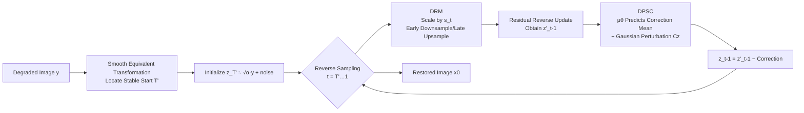

# LearnIR: Learnable Posterior Sampling for Real-World Image Restoration

**Conference**: ICLR 2026  
**OpenReview**: [https://openreview.net/forum?id=aAb26aqU1E](https://openreview.net/forum?id=aAb26aqU1E)  
**Code**: [github.com/gityihang/LearnIR](https://github.com/gityihang/LearnIR)  
**Area**: Image Restoration / Diffusion Models / Posterior Sampling  
**Keywords**: Real-world Image Restoration, Diffusion Posterior Sampling, Residual Diffusion, Dehazing, Deshadowing, Dynamic Resolution  

## TL;DR
LearnIR utilizes a lightweight network to directly learn the "gradient correction term distribution" in diffusion posterior sampling, bypassing the limitation of traditional DPS that requires a known forward degradation operator $A$. Combined with a VAE-free Dynamic Resolution Module (DRM), it achieves end-to-end, high-fidelity image restoration for real-world degradation tasks like dehazing and deshadowing.

## Background & Motivation

**Background**: Modeling image restoration as "generation conditioned on degraded images" is currently mainstream. Diffusion models, with their powerful distribution transformation capabilities, perform prominently in this area. Restoration via diffusion generally falls into three categories: conditional generation, diffusion inversion, and posterior sampling.

**Limitations of Prior Work**: Each approach has critical flaws. ① Conditional generation consistently struggles with the trade-off between "faithful restoration vs. realistic generation." ② Inversion-based methods accumulate errors when projecting degraded images back to the latent space, causing outputs to deviate significantly from inputs, and suffer from low efficiency due to iterative denoising. ③ Posterior sampling (e.g., DPS) theoretically combines generative priors with data consistency constraints to solve ill-posed inverse problems, but it requires an **accurately known forward measurement operator $A$** (e.g., a random mask) to be explicitly reused during inference. Real-world haze, shadows, noise, and blur are often intertwined, making it impossible to analytically define such an $A$.

**Key Challenge**: While posterior sampling is mathematically elegant and ensures data consistency, it is locked into toy scenarios with synthetic, single degradations due to the "known $A$" prerequisite, preventing its application to real-world multi-degraded images.

**Goal**: Construct a diffusion posterior sampling framework **independent of known forward operators**, enabling the data consistency advantages of posterior sampling for real-world dehazing and deshadowing while simplifying the pipeline by removing heavy pre-trained VAEs.

**Core Idea**: **[Learnable Posterior Correction]** Utilizing the closure property of Gaussian distributions, LearnIR proves that the DPS gradient correction term is essentially equivalent to the difference between the "forward posterior distribution" and the "backward predicted distribution," which itself follows a Gaussian. Thus, a lightweight network is trained to predict the mean of this Gaussian, replacing the analytical gradient that necessitates $A$. This is termed **DPSC (Diffusion Posterior Sampling Correction)**, supplemented by **DRM** for coarse-to-fine multi-resolution sampling instead of a VAE.

## Method

### Overall Architecture

LearnIR is built upon residual diffusion (ResFusion / RDDM). It first uses "smooth equivalent transformation" to identify a stable truncation starting point $T'$ (where the state depends approximately only on the degraded image $y$ and is decoupled from the unknown clean image $x_0$), thereby skipping unstable intermediate states of inversion methods. On this basis, two complementary modules are integrated: DRM projects images into a time-varying resolution latent space—capturing global structure at low resolutions early on and refining high-frequency details at original resolution later; DPSC serves as a plug-and-play regularizer, using the learned correction term at each sampling step to pull the diffusion trajectory back to the true posterior. The result is a pixel-space, VAE-free end-to-end restoration pipeline.

### Key Designs

**1. Residual Diffusion + Smooth Equivalent Start: Bypassing unstable intermediate states.** LearnIR does not start from pure noise. Instead, it follows the residual diffusion approach by injecting the residual $R = y - x_0$ into the forward process: $x_t = (2\sqrt{\bar\alpha_t}-1)x_0 + (1-\sqrt{\bar\alpha_t})\,y + \sqrt{1-\bar\alpha_t}\,\epsilon$. The key observation is that as the coefficient $(2\sqrt{\bar\alpha_t}-1)\to 0$, dependence on the unknown $x_0$ vanishes. By finding $T' = \arg\min_i (\sqrt{\bar\alpha_i}-\tfrac12)^2$, a stable timestep $T'$ is identified where $x_{T'}\approx\sqrt{\bar\alpha_{T'}}\,y + \sqrt{1-\bar\alpha_{T'}}\,\epsilon$ depends almost entirely on the degraded image. Reverse sampling starts directly from $T'$, uses fewer steps, and avoids error accumulation seen in inversion methods. The training objective is modified to predict "residual shift noise" $\epsilon^{res}$.

**2. DRM Dynamic Resolution: Training-free interpolation replacing VAE for coarse-to-fine generation.** Drawing from multi-scale generation (MDM, PixelFlow), DRM defines a time-varying downsampling operator $D(\cdot, s(t))$ that maps both clean and degraded images to latent variables at the current scale: $z_0^{(t)} = D(x_0, s(t))$ and $z_y^{(t)} = D(y, s(t))$. Residual diffusion is then performed in this variable-resolution latent space: $q(z_t \mid z_0^{(t)}) = \mathcal{N}\big(\sqrt{\bar\alpha_t}\,z_0^{(t)} + (1-\sqrt{\bar\alpha_t})R_z,\ (1-\bar\alpha_t)I\big)$. During scheduling, a large downsampling factor $s_{down}$ is used in high-noise stages ($t\ge T/2$) to focus on global structure and suppress texture inconsistency artifacts, while switching back to original resolution $s_{up}$ in later stages ($t<T/2$) to refine details. Since scaling uses training-free interpolation, LearnIR gains multi-scale benefits without the computational overhead or alignment issues of a pre-trained VAE.

**3. DPSC Learnable Posterior Correction: Turning "required operator $A$" gradients into predictable Gaussian means.** This is the core design of the paper. Standard denoising loss ensures accurate noise estimation but does not guarantee that the learned reverse posterior $p_\theta(z_{t-1}\mid z_t)$ matches the true forward posterior $q(z_{t-1}\mid z_t, z_0^{(t)})$. This "inconsistency" accumulates across steps as artifacts like color shifts. The authors prove via **Theorem 1** that the guidance gradient for DPS is proportional to the difference between the forward and backward predicted states: $\nabla_{z_t}\log p(z_y^{(t)}\mid z_t) \propto z_{t-1}^{pred} - z_{t-1}^{forward}$. Using Gaussian closure properties, this difference itself follows a Gaussian $z_{t-1}^{pred} - z_{t-1}^{forward} \sim \mathcal{N}\big(\mu(z_t, z_y^{(t)}, t),\ \sigma^2 I\big)$. Thus, instead of an analytical operator $A$, a correction network $\hat\mu_\theta$ is trained to regress the analytical mean $\mu$, supervised by a consistency loss $L_{consistency} = \mathbb{E}\,\|\mu - \hat\mu_\theta\|_2^2$. The total loss is $L_{total} = L_{denoise} + \lambda L_{consistency}$. During inference, a regular update yields $z'_{t-1}$, which is then adjusted using $\mu_\theta$ and a Gaussian perturbation $Cz$ to approximate the DPS gradient, pulling the trajectory back to the true posterior and suppressing structural/color shifts.

## Key Experimental Results

### Main Results

ISTD Deshadowing (256×256, comparison among mask-free methods; purple denotes best mask-free):

| Method | Mask-free | PSNR ↑ | SSIM ↑ | MAE ↓ | LPIPS ↓ |
|------|-----------|--------|--------|-------|---------|
| ShadowFormer | No | 30.47 | 0.928 | 5.34 | 0.075 |
| Resfusion | No | 30.09 | 0.932 | 4.79 | 0.068 |
| ShadowRefiner | Yes | 28.75 | 0.916 | 5.48 | 0.080 |
| **LearnIR (Ours)** | Yes | **29.57** | **0.927** | **5.12** | **0.072** |

Among mask-free methods, LearnIR achieves the best performance: PSNR +0.82 dB, SSIM +0.011, MAE −0.36 compared to similar models, approaching the performance of strong mask-based models.

Dehazing (512×512, three real-world datasets):

| Method | O-HAZE PSNR/SSIM/LPIPS | HazyDet PSNR/SSIM/LPIPS | REVIDE PSNR/SSIM/LPIPS |
|------|------|------|------|
| ConvIR | 25.36 / 0.780 / 0.108 | 25.67 / 0.781 / 0.102 | 25.05 / 0.755 / 0.105 |
| MB-TaylorFormer V2 | 25.43 / 0.792 / 0.105 | 24.97 / 0.755 / 0.120 | 25.25 / 0.775 / 0.118 |
| **LearnIR (Ours)** | **27.70 / 0.832 / 0.055** | **27.32 / 0.905 / 0.065** | **25.43 / 0.795 / 0.085** |

Ours achieves +2.27 dB PSNR / +0.04 SSIM on O-HAZE and +1.65 dB PSNR / +0.124 SSIM on HazyDet, with LPIPS significantly leading (0.055 vs 0.105 on O-HAZE), representing comprehensive SOTA across three sets. On FaceShadow (newly built), Ours outperforms the runner-up by PSNR +2.44 dB, SSIM +0.073, and LPIPS +0.013.

### Ablation Study

Module ablation on the FaceShadow test set:

| Configuration | PSNR ↑ | SSIM ↑ | LPIPS ↓ |
|------|--------|--------|---------|
| w/o DPSC | 24.12 | 0.899 | 0.072 |
| w/o DRM | 27.25 | 0.925 | 0.063 |
| w/o DRM & DPSC | 22.86 | 0.865 | 0.103 |
| **Full Model** | **28.52** | **0.965** | **0.058** |

### Key Findings
- **DPSC is the primary contributor**: Without DPSC, PSNR drops sharply from 28.52 to 24.12 (−4.4 dB), which is far more impactful than removing DRM (27.25). This proves that "learnable posterior correction" is decisive in suppressing trajectory inconsistency and color shifts.
- **Modules are complementary**: Removing both results in only 22.86 dB. The combined effect significantly exceeds individual modules, validating the division of labor: DRM for structure and DPSC for consistency.
- **Strong generalization to real-world multi-degradation**: Consistent superiority over CNN/Transformer/Diffusion SOTAs on O-HAZE, HazyDet, REVIDE, and FaceShadow. LPIPS gains are particularly prominent, indicating significant perceptual quality improvements.

## Highlights & Insights
- **Complete removal of the "known forward operator $A$" constraint in DPS**: Theorem 1 rewrites the analytical gradient as the difference between forward and backward states, and Gaussian closure transforms it into a learnable mean. This is a theoretical and practical breakthrough for applying posterior sampling to the real world.
- **Substitution of VAE with training-free DRM**: Obtains multi-scale coarse-to-fine benefits while avoiding the computational cost and latent space alignment issues of VAEs in pixel-diffusion, representing a practical engineering simplification.
- **Plug-and-play**: DPSC is a lightweight correction branch that can be attached as a regularizer to the residual diffusion backbone with low migration cost.

## Limitations & Future Work
- **Theoretical derivation relies on Gaussian assumptions**: The equivalence of DPS gradients to Gaussian differences is built on the VP-SDE/DDPM Gaussian framework; non-Gaussian or highly non-linear degradations are not fully discussed.
- **Degradation types biased towards dehazing/deshadowing**: While claiming real-world multi-degradation, experiments focus heavily on haze and shadows, with limited validation on motion blur or complex composite noise. FaceShadow is a self-built dataset.
- **Extra cost of the correction network**: DPSC introduces a correction branch called at every inference step. The paper lacks a detailed latency comparison against pure conditional diffusion.
- **Lags behind mask-based models in mask-free settings**: On ISTD, PSNR is still lower than the mask-utilizing ShadowFormer, suggesting a performance gap remains when strong priors (masks) are available.

## Related Work & Insights
- **DPS (Chung et al., 2023)**: The direct starting point; LearnIR's core contribution is removing its dependence on a known $A$.
- **ResFusion / RDDM (Shi et al., 2024; Liu et al., 2024)**: Provides the residual diffusion and stable start $T'$, serving as LearnIR's backbone.
- **MDM / PixelFlow (Gu et al., 2024; Chen et al., 2025)**: Multi-scale generation ideas that inspired DRM's coarse-to-fine resolution scheduling.
- **Inspiration**: When a classical method is bottlenecked by an "unavailable prior" (here, operator $A$), an effective path is to use probabilistic structures (Gaussian closure) to rewrite that prior into a **learnable distribution**, replacing analytical calculation with network regression.

## Rating
- Novelty: ⭐⭐⭐⭐ — Cleverly rewriting DPS gradients as learnable means via Gaussian closure is a substantial breakthrough for real-world posterior sampling.
- Experimental Thoroughness: ⭐⭐⭐⭐ — Covers 5 datasets with multi-SOTA comparisons and clear ablation; points deducted for limited degradation types and missing inference cost analysis.
- Writing Quality: ⭐⭐⭐⭐ — Clear progression from motivation to method; Theorem 1 explains the core relationship thoroughly.
- Value: ⭐⭐⭐⭐ — Removes the core engineering bottleneck of DPS and uses a VAE-free pipeline, offering high utility for real-world diffusion restoration.

<!-- RELATED:START -->

## Related Papers

- [\[ICLR 2026\] A Statistical Benchmark for Diffusion-Posterior-Sampling Algorithms](a_statistical_benchmark_for_diffusion-posterior-sampling_algorithms.md)
- [\[ICLR 2026\] CL-DPS: A Contrastive Learning Approach to Blind Nonlinear Inverse Problem Solving via Diffusion Posterior Sampling](cl-dps_a_contrastive_learning_approach_to_blind_nonlinear_inverse_problem_solvin.md)
- [\[ICML 2026\] Triadic Dynamics Aware Diffusion Posterior Sampling for Inverse Problems: Optimizing Guidance and Stochasticity Schedules](../../ICML2026/image_restoration/triadic_dynamics_aware_diffusion_posterior_sampling_for_inverse_problems_optimiz.md)
- [\[ICLR 2026\] VARestorer: One-Step VAR Distillation for Real-World Image Super-Resolution](varestorer_one-step_var_distillation_for_real-world_image_super-resolution.md)
- [\[ICLR 2026\] Learning Heterogeneous Degradation Representation for Real-World Super-Resolution](learning_heterogeneous_degradation_representation_for_real-world_super-resolutio.md)

<!-- RELATED:END -->
