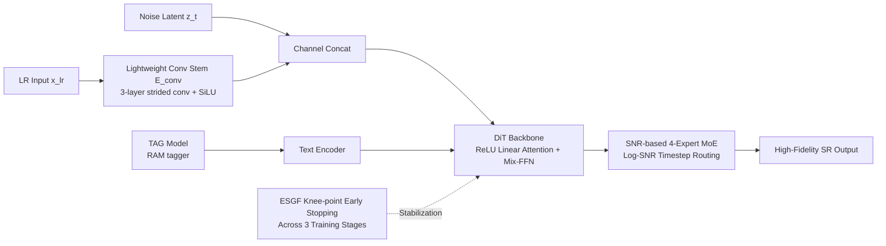

# LinearSR: Unlocking Linear Attention for Stable and Efficient Image Super-Resolution

**Conference**: ICLR 2026  
**OpenReview**: [https://openreview.net/forum?id=41Pdz4r5aB](https://openreview.net/forum?id=41Pdz4r5aB)  
**Code**: TBD  
**Area**: Image Restoration / Super-Resolution (Generative SR, Diffusion Models, Efficient Attention)  
**Keywords**: Linear Attention, Image Super-Resolution, Diffusion Transformer, Flow Matching, Mixture-of-Experts, Training Stability

## TL;DR
LinearSR successfully applies $O(N)$ linear attention to photo-realistic diffusion super-resolution for the first time. By integrating "Early Stopping at the Knee-point Fine-tuning (ESGF), SNR-based Mixture-of-Experts (MoE), and Tag-based Guidance (TAG)", it simultaneously addresses training collapse, perception-distortion trade-offs, and guidance signal selection. The framework achieves SOTA 1-NFE efficiency (0.036s core diffusion forward pass for 1024×1024) while maintaining SOTA perceptual quality.

## Background & Motivation
**Background**: Generative image super-resolution (SR) is currently dominated by diffusion models. These models rely on self-attention to synthesize photo-realistic textures, which is computationally expensive because the $O(N^2)$ complexity of self-attention becomes a severe bottleneck for high-resolution inputs. Linear attention offers an $O(N)$ alternative and has been validated for efficient global dependency capture in general image generation (e.g., SANA).

**Limitations of Prior Work**: Although linear attention is theoretically elegant, applying it to SR tasks—which demand extreme fidelity—is exceptionally difficult due to several interconnected issues: (1) **Training Collapse**: Loss often diverges to NaN during fine-tuning from converged models (a standard industry practice). (2) **Perception-Distortion Trade-off**: Enhancing perceptual realism (fine textures) often necessitates sacrificing reconstruction fidelity (PSNR), representing a major barrier to peak performance. (3) **Guidance Signal Choice**: High-resolution data with high-precision annotations is scarce; it remains unclear whether models should be fed rich external text descriptions or precise features extracted from the LR input itself.

**Key Challenge**: A long-standing conflict exists between the "efficiency" of linear attention and the "high fidelity + training stability" required for SR. Previous acceleration efforts (distillation, diffusion inversion) did not address the quadratic complexity of the architecture itself, while direct replacement with linear attention triggers systemic collapses.

**Goal**: To provide the first robust and reproducible methodology that makes linear attention viable in the high-fidelity SR domain, balancing efficiency, stability, and performance.

**Core Idea**: The problem is decomposed into three independent fronts: **healing training collapse with ESGF, managing the perception-distortion trade-off with SNR-MoE, and implementing the "Precision over Magnitude" principle via TAG**. These components are integrated into a conditional Diffusion Transformer (DiT) backbone called LinearSR.

## Method

### Overall Architecture
LinearSR is a conditional diffusion SR framework utilizing a **ReLU Linear Attention DiT backbone** trained with a Flow Matching objective. The LR image is encoded via a lightweight convolutional stem and concatenated with the noise latent in the channel dimension to provide structural conditioning. Guidance signals are provided by a TAG labeling model. Training occurs in three stages (Pre-training → MoE Continued Pre-training → SFT), with each stage utilizing ESGF to select checkpoints at the "knee-point" to ensure stability. The coordination of components is summarized below:

### Key Designs

**1. ReLU Linear Attention Backbone + Mix-FFN: Decomposing O(N²) into O(N) Global Summaries.** Standard self-attention calculates an $N\times N$ pairwise similarity matrix with $O(N^2)$ complexity. Linear attention rearranges the operation order using the associative property of matrix multiplication. For query/key/value $q_i, k_j, v_j \in \mathbb{R}^d$, the output is $o_i = \frac{\phi(q_i)\sum_{j=1}^{N}\phi(k_j)^T v_j}{\phi(q_i)\sum_{j=1}^{N}\phi(k_j)^T}$, where $\phi(\cdot)=\mathrm{ReLU}(\cdot)$. Crucially, $\sum_j \phi(k_j)^T v_j$ and its normalization term are pre-computed as a fixed-size "global summary" tensor. Each query then interacts with this context, reducing complexity to $O(N)$. To compensate for the weaker local modeling of linear attention, the backbone includes a Mix-FFN module with $3\times3$ depth-wise separable convolutions. LR conditions are injected via $z'_t = \mathrm{Concat}(z_t, E_{conv}(x_{lr}))$, where $E_{conv}$ is a 3-layer strided convolutional stem providing superior multi-scale structural guidance compared to fixed bilinear interpolation.

**2. ESGF Knee-point Early Stopping: Using "Knee-points" of Validation Metrics Rather Than Loss to Fix Collapse.** It was observed that fine-tuning linear attention SR models almost inevitably leads to collapse. The root cause is the model converging into "sharp minima" in the loss landscape—regions with poor generalization where the model overfits to artifacts. By tracking validation metrics alongside decreasing training loss, a pattern was identified: performance metrics improve, plateau, and then enter a "Plateau and Oscillation Phase." The iteration point just before this oscillation, defined as the **knee-point**, represents optimal generalization. Comparing feature maps at the knee-point (48k steps) versus an "unstable peak" (224k steps) reveals that the former maintains coherent structures while the latter is dominated by noise. ESGF dictates that **all fine-tuning must initialize from a knee-point checkpoint**, as it resides in a flatter, more robust loss region. Ablations show that starting from a 224k step peak leads to collapse within 2k steps, whereas the 48k step knee-point remains stable, improving MUSIQ from 60.39 to 64.59.

**3. SNR-based 4-Expert MoE: Dynamic Trade-offs via Signal-to-Noise Ratio Segments.** The key insight into the perception-distortion trade-off is that it varies dynamically across denoising stages. Early high-noise (low SNR) stages require coarse structure generation, while late low-noise (high SNR) stages require detail refinement. The generation trajectory is segmented in the log-SNR space $\lambda(t)$. Within the range $[\lambda_{min}, \lambda_{max}]$, a hierarchical bisection is performed: a main anchor $\lambda_{anchor}$ at $t_2$ splits the trajectory into high-noise (structure) and low-noise (refinement) regimes. These are further bisected in log-SNR space, mapping midpoints back to the time domain at $t_1$ and $t_3$. This $\{t_1, t_2, t_3\}$ set assigns the trajectory to four experts: Structural Generation → Structural Refinement → Texture Generation → Detail Polishing. A gating network routes inputs **deterministically** based on these boundaries. Since only one expert is active per timestep, specialization occurs with near-zero inference overhead.

**4. TAG Label Guidance + "Precision over Magnitude" Principle: Effective Small-scale Guidance.** The model is a vector field prediction network $v_\theta(z_t, t, c)$ trained with a Conditional Flow Matching (CFM) objective: $\mathcal{L}_{CFM} = \mathbb{E}_{t,z_1,z_0}\left[\|(z_1-z_0) - v_\theta((1-t)z_0 + tz_1, t, c)\|^2\right]$. The design focuses on the conditional context $c$. Unlike text-to-image tasks, SR possesses strong visual priors in the LR input. Research contrasted CLIP (vision-language aligned features), DINO (self-supervised visual features), and TAG (concise object tags via RAM tagger). Surprisingly, TAG labels outperformed both pure visual features and long sentence descriptions across major metrics (PSNR 24.85, MUSIQ 63.93). This validates the principle of **"Precision over Magnitude"**—the core challenge in SR is information utilization rather than volume. A concise, high-recall set of object tags is more effective than heavy external context.

## Key Experimental Results

### Main Results (Quantitative comparison on RealLQ250 + DrealSR, Excerpts)

| Dataset/Metric | SeeSR | SUPIR | DreamClear | OSEDiff | AdcSR | InvSR | TSD-SR | **LinearSR** |
|---|---|---|---|---|---|---|---|---|
| RealLQ250 MANIQA↑ | 0.502 | 0.393 | 0.450 | 0.433 | 0.450 | 0.421 | 0.470 | **0.515** |
| RealLQ250 MUSIQ↑ | 70.912 | 65.476 | 67.126 | 70.013 | 70.534 | 66.831 | 71.505 | **71.914** |
| RealLQ250 CLIPIQA↑ | 0.703 | 0.574 | 0.688 | 0.692 | 0.677 | 0.704 | — | **0.720** |
| DrealSR MANIQA↑ | 0.495 | 0.403 | 0.350 | 0.475 | 0.495 | 0.461 | 0.469 | **0.510** |
| DrealSR MUSIQ↑ | 67.429 | 63.125 | 57.164 | 68.051 | 69.025 | 68.046 | 68.495 | **69.073** |

LinearSR achieves the top rank in all three no-reference perceptual metrics (MANIQA/MUSIQ/CLIPIQA) on RealLQ250. It also leads in MANIQA/MUSIQ on DIV2K-Val and DrealSR. Like other generative SR methods, full-reference metrics (PSNR/SSIM) are not superior.

### Efficiency Comparison (1024×1024 SR, NVIDIA H-series GPU)

| Metric (Lower is better) | StableSR | SUPIR | OSEDiff | AdcSR | InvSR | TSD-SR | **LinearSR** |
|---|---|---|---|---|---|---|---|
| Inference Time (s) | 78.405 | 13.632 | 1.086 | 0.561 | 0.667 | 12.635 | **0.830** |
| 1-NFE Forward Time (s) | 0.428 | 2.662 | 0.150 | 0.046 | 0.613 | 9.434 | **0.036** |

The 1-NFE forward time of 0.036s sets a new SOTA, quantifying the architectural efficiency contribution of linear attention. The overall multi-step inference time (0.830s) is highly competitive and orders of magnitude faster than SUPIR.

### Ablation Study

| Ablation | Configuration | Key Result |
|---|---|---|
| Guidance (Tab.3) | Origin/CLIP/DINO/**TAG** | PSNR 22.05→23.79→23.83→**24.85**; MUSIQ 60.10→60.75→62.76→**63.93** |
| ESGF (Tab.4) | Unstable Peak (224k) vs **Knee-point (48k)** | Peak collapses within 2k steps; Knee-point is stable, MUSIQ 60.39→**64.59** |
| MoE Config (Tab.5) | Baseline/2-Expert/**4-Expert SNR**/4-Expert Uniform | 4-Expert SNR MUSIQ **64.02** outperforms 2-expert (63.18) and uniform splitting. |

### Key Findings
- **The 0.036s 1-NFE is a pure architectural dividend**: This is orthogonal to distillation or sampling optimizations, suggesting further compression potential with added distillation.
- **ESGF is an "Enabler" not an "Optimization"**: Without ESGF, multi-stage linear attention SR training fails to converge and collapses.
- **"Less is More" for Guidance**: Tags > Pure visual features > Text descriptions.

## Highlights & Insights
- **Systematically overturns the consensus that linear attention cannot perform high-fidelity SR**, providing a reproducible methodology.
- **Solid insight in "Knee-point Early Stopping"**: Utilizes dual evidence (feature map degradation + metric oscillation) to prove that relying solely on loss is misleading. This is relevant for all unstable fine-tuning scenarios.
- **SNR-MoE reframes the perception-distortion trade-off**: It shifts from a "static compromise" to a "dynamic temporal division of labor" with deterministic zero-overhead routing.
- **"Precision over Magnitude" principle**: Provides a new perspective for conditional design in generative restoration; the bottleneck is information utilization, not volume.

## Limitations & Future Work
- **Weak Full-reference Fidelity**: Like all generative SR, PSNR/SSIM are not leading, which may be unsuitable for pixel-level fidelity requirements (e.g., medical imaging).
- **High Multi-stage Training Cost**: The three stages + four experts require significant resources (trained on 6× A800 GPUs).
- **Manual Knee-point Detection**: Identification of the "knee-point" requires validation metrics and empirical judgment; automation of this process is not yet formalized.
- **Absence of Distillation**: Distillation is left for future work; the current 0.830s inference time has substantial room for further reduction.
- **TAG Dependency**: Relies on external taggers (RAM), limiting performance by the quality of the tagger.

## Related Work & Insights
- **Efficiency Comparison**: Previous SR acceleration relied on post-processing (OSEDiff, AdcSR, InvSR, TSD-SR) without addressing the quadratic architectural complexity. LinearSR solves the root cause and is orthogonal to these methods.
- **Linear Attention Lineage**: Originates from NLP (Linformer) → Dense Prediction (Cai et al.) → Generation (SANA). LinearSR is the first successful application in high-fidelity SR.
- **Guidance Paradigm**: Extends the tag-based approach of SeeSR but provides a direct comparison with CLIP/DINO, proposing the "Precision over Magnitude" principle.
- **Training Stability**: Connects with the theory that "sharp minima generalize poorly" (Keskar et al.), engineering flat-minima views into an actionable checkpoint selection strategy.

## Rating
- **Novelty**: ⭐⭐⭐⭐ — First systematic use of linear attention for high-fidelity diffusion SR; original insights in ESGF and SNR-MoE.
- **Experimental Thoroughness**: ⭐⭐⭐⭐ — Comprehensive comparison across 4 datasets and 10 SOTAs; thorough efficiency and quality ablations.
- **Writing Quality**: ⭐⭐⭐⭐ — Clear breakdown of the three challenges; intuitive mechanism diagrams.
- **Value**: ⭐⭐⭐⭐ — Establishes a new architectural paradigm for efficient generative SR; the 0.036s 1-NFE is highly significant for high-resolution deployment.

<!-- RELATED:START -->

## Related Papers

- [\[ICCV 2025\] Emulating Self-Attention with Convolution for Efficient Image Super-Resolution](../../ICCV2025/image_restoration/emulating_self-attention_with_convolution_for_efficient_image_super-resolution.md)
- [\[NeurIPS 2025\] Spiking Meets Attention: Efficient Remote Sensing Image Super-Resolution with Attention Spiking Neural Networks](../../NeurIPS2025/image_restoration/spiking_meets_attention_efficient_remote_sensing_image_super-resolution_with_att.md)
- [\[ECCV 2024\] Learning Exhaustive Correlation for Spectral Super-Resolution: Where Spatial-Spectral Attention Meets Linear Dependence](../../ECCV2024/image_restoration/learning_exhaustive_correlation_for_spectral_super-resolution_where_spatial-spec.md)
- [\[ICLR 2026\] Trust but Verify: Adaptive Conditioning for Reference-Based Diffusion Super-Resolution](trust_but_verify_adaptive_conditioning_for_reference-based_diffusion_super-resol.md)
- [\[ICLR 2026\] Texture Vector-Quantization and Reconstruction Aware Prediction for Generative Super-Resolution](texture_vector-quantization_and_reconstruction_aware_prediction_for_generative_s.md)

<!-- RELATED:END -->
