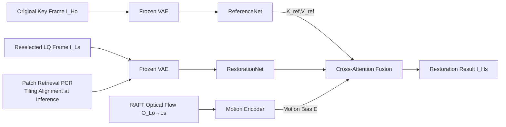

# LiveMoments: Reselected Key Photo Restoration in Live Photos via Reference-guided Diffusion

**Conference**: ICLR 2026  
**OpenReview**: [https://openreview.net/forum?id=02mgFnnfqG](https://openreview.net/forum?id=02mgFnnfqG)  
**Code**: To be confirmed  
**Area**: Image Restoration / Reference-guided Super-Resolution  
**Keywords**: Live Photo, Reference-guided restoration, Diffusion model, Dual-branch network, Motion alignment, Optical flow  

## TL;DR
Addressing the real-world pain point of significant quality degradation when "reselecting a key frame" in Live Photos, LiveMoments utilizes an SD3-based dual-branch diffusion network. It treats the original high-quality key frame as a same-sequence reference and employs a two-layer motion alignment strategy—"latent-space motion-guided attention + image-level patch correspondence retrieval"—to restore blurry and misaligned reselected frames to a quality comparable to the original.

## Background & Motivation
**Background**: A Live Photo simultaneously stores one high-quality (HQ) key photo that has passed through a complete ISP pipeline and a low-quality preview video of approximately 3 seconds. Users often wish to select a frame with better expressions or timing from the video to serve as the new key frame. However, these frames originate from a compressed, low-latency preview stream and are plagued by motion blur and sensor noise, resulting in significantly lower quality.

**Limitations of Prior Work**: The authors define this requirement as a new task—**Reselected Key Photo Restoration**, which is essentially a sub-category of Reference-based Image Super-Resolution (RefSR). Existing solutions are inadequate:
- **Traditional RefISR** (e.g., C2-Matching, DATSR) involves small models lacking strong priors, failing to handle the diverse degradations and large motion misalignments in Live Photos;
- **Diffusion-based RefISR** has only two main types: ReFIR (fixed-coefficient gating, poor robustness) and CoSeR (using CLIP embeddings for reference generation while ignoring local detail alignment), which often produce unnatural textures;
- **RefVSR** (e.g., RefVSR, ERVSR) can only handle small misalignments, cannot perform 4K restoration, and relies on datasets collected via synchronized triple-camera setups;
- **Single-Image SISR** (e.g., StableSR, SeeSR, SUPIR, OSEDiff) ignores the reference entirely, failing to preserve structure and details in high-motion scenes.

**Key Challenge**: The reselected frame and the original key frame belong to the **same sequence** and share scene semantics (a strong exploitable prior). However, there is a **massive quality gap** and **obvious motion misalignment** (subject movement or camera shake) between them. The goal is to borrow details from the reference without introducing erroneous content due to misalignment.

**Goal**: Guided by a single original key frame, restore a single low-quality reselected frame to a quality equivalent to the original at 4K ultra-high resolution, while maintaining content fidelity.

**Core Idea**: (1) **Same-sequence reference + dual-branch diffusion** — Using a mirrored-backbone ReferenceNet to preserve high-resolution details, injected into the main branch via cross-attention instead of relying on coarse semantic alignment from CLIP; (2) **Unified motion alignment** — Guided attention using motion bias encoded from optical flow in the latent space, paired with image-level patch retrieval to ensure patch alignment during tiling inference.

## Method

### Overall Architecture
LiveMoments is built on a dual-branch architecture using Stable Diffusion 3 (MM-DiT). The **RestorationNet** performs conditional denoising on the noisy latent of the reselected LQ frame $I_{Ls}$, while the **ReferenceNet** (a mirrored structure capable of loading pre-trained weights) encodes the original key frame $I_{Ho}$ to provide high-fidelity detail guidance. The two are fused via cross-attention. On top of this, a **Unified Motion Alignment module** is integrated: the latent space uses a motion bias encoded by RAFT optical flow to correct attention, and the image level utilizes Patch Correspondence Retrieval for patch alignment before tiling inference. Training follows the bridge matching approach, directly learning the velocity field between the distributions of $I_{Ls}$ and $I_{Hs}$.

### Key Designs

**1. Same-sequence dual-branch reference injection: Prioritizing "detail-level" over "semantic-level" alignment**. Unlike CLIP-based approaches that only capture low-resolution global semantics, ReferenceNet completely mirrors the denoising backbone. This allows it to be initialized from pre-trained checkpoints and align with RestorationNet in a shared feature space. Detailed features extracted from the original key frame are injected into the main branch by concatenating reference keys and values into the cross-attention:
$$\text{Cross attn} = \text{Softmax}\left(\frac{Q[K, K_{ref}]^\top}{\sqrt{d}}\right)[V, V_{ref}]$$
where $Q$ comes from RestorationNet, and $K_{ref}, V_{ref}$ come from ReferenceNet. This allows the model to adaptively select and transfer well-aligned textures and structures from the reference rather than being forced to consume the entire reference image.

**2. Latent-space motion-guided attention: Optical flow as spatial bias for attention**. Implicit matching between the two branches is insufficient when the reselected frame is both blurry and misaligned—motion blur and subject displacement make correspondences hard to establish, and the huge quality gap further interferes with fusion. The authors use frozen RAFT to estimate a dense displacement field $O_{Lo\to Ls}$ from the degraded original key frame $I_{Lo}$ to the reselected frame $I_{Ls}$ (at inference, the same degradation is applied to $I_{Ho}$ to narrow the quality gap and make optical flow more reliable). This is processed by a lightweight Motion Encoder (convolution + SiLU) into a motion embedding $E_{Lo\to Ls}$, injected as an **additive bias** into the reference keys:
$$\text{Cross attn}_{opt} = \text{Softmax}\left(\frac{Q[K, K_{ref}+E_{Lo\to Ls}]^\top}{\sqrt{d}}\right)[V, V_{ref}]$$
This bias explicitly informs the query which aligned regions to attend to, making fusion more coherent in misaligned scenes.

**3. Image-level Patch Correspondence Retrieval: Aligning reference patches via displacement during tiling inference**. Live Photos are typically ultra-high resolution (e.g., 3072×4096), requiring tiling inference due to VRAM constraints. However, subject motion causes content misalignment between patches at the same position in $I_{Ls}$ and $I_{Ho}$. PCR intervenes before VAE encoding: first, optical flow $I_{Ls}\to I_{Lo}$ is estimated. For each standard patch $P^i_{Ls}$, the **average displacement** within the patch is calculated as $(\Delta x_i,\Delta y_i)=\big(\tfrac{1}{p^2}\sum f^j_{x_i},\ \tfrac{1}{p^2}\sum f^j_{y_i}\big)$. The top-left corner is then shifted to $(\hat x_i,\hat y_i)=(x_i+\Delta x_i,\ y_i+\Delta y_i)$ to crop an aligned reference patch $\hat P^i_{Ho}$ from $I_{Ho}$. This patch-level alignment (rather than pixel-wise warping) naturally fits the tiling pipeline and preserves spatial consistency, serving as an image-level complement to latent motion attention.

**4. Task-specific relative no-reference metrics**. Real Live Photos lack HQ ground truth for reselected frames, and conventional no-reference metrics tend to favor high-quality but hallucinated results that deviate from the reference. Leveraging the availability of the original key frame $I_{Ho}$, the authors adapt NIQE/MUSIQ/CLIPIQA/MANIQA into a relative form:
$$\text{metric}_{re}=\frac{|\text{metric}(\tilde I_{Hs})-\text{metric}(I_{Ho})|}{\text{metric}(I_{Ho})}$$
(lower is better, indicating proximity to the reference). Additionally, CLIP-Q and DINO-Q are used to measure perceptual consistency with the reference, ensuring evaluations truly reflect the goal of "reference-guided restoration."

## Key Experimental Results

### Main Results (Real Live Photos; relative metrics: lower is better / CLIP-Q, DINO-Q: higher is better)

| Method | vivoLive144 $NI_{re}$↓ | $MU_{re}$↓ | $CA_{re}$↓ | CLIP-Q↑ | DINO-Q↑ | iPhoneLive90 $NI_{re}$↓ | CLIP-Q↑ | DINO-Q↑ |
|---|---|---|---|---|---|---|---|---|
| C2-Matching | 0.2047 | 0.3512 | 0.1929 | 0.9623 | 0.8298 | 0.3147 | 0.9505 | 0.8685 |
| CoSeR | 0.1953 | 0.1865 | 0.2752 | 0.9658 | 0.9197 | 0.1774 | 0.9608 | 0.8618 |
| SUPIR | 0.2703 | 0.2545 | 0.8275 | 0.9407 | 0.8559 | 0.1805 | 0.9422 | 0.7908 |
| OSEDiff | 0.2694 | 0.3191 | 0.8206 | 0.9541 | 0.8536 | 0.2750 | 0.9444 | 0.7525 |
| **Ours** | **0.0990** | **0.0893** | **0.0809** | **0.9805** | **0.9629** | **0.0801** | **0.9842** | **0.9466** |

Ours achieves SOTA across all metrics on two real-world datasets, with relative no-reference metrics an order of magnitude lower than the second-best method.

### Synthetic Dataset SynLive260 (Including full-reference metrics)

| Method | PSNR↑ | SSIM↑ | LPIPS↓ | DISTS↓ | FID↓ | CLIP-Q↑ | DINO-Q↑ |
|---|---|---|---|---|---|---|---|
| C2-Matching | 31.85 | 0.8782 | 0.2419 | 0.1250 | 18.51 | 0.9619 | 0.8391 |
| CoSeR | 27.60 | 0.8136 | 0.2436 | 0.1135 | 13.92 | 0.9699 | 0.8924 |
| OSEDiff | 26.81 | 0.7882 | 0.2915 | 0.1412 | 27.17 | 0.9566 | 0.8220 |
| **Ours** | 31.65 | **0.8990** | **0.0828** | **0.0365** | **4.00** | **0.9950** | **0.9740** |

LPIPS/DISTS/FID leads significantly (FID 4.00 vs. 13.92 runner-up). PSNR is slightly lower, but the authors note this is an inherent limitation of full-reference metrics in generative restoration tasks (also seen with SUPIR).

### Ablation Study (vivoLive144)

| Configuration | $NIQE_{re}$↓ | $CLIPIQA_{re}$↓ | $MANIQA_{re}$↓ | CLIP-Q↑ | DINO-Q↑ |
|---|---|---|---|---|---|
| RestorationNet only | 0.1677 | 0.2348 | 0.1105 | 0.9690 | 0.9081 |
| + ReferenceNet | 0.1097 | 0.0823 | 0.0631 | 0.9792 | 0.9539 |
| + warp RefImage | 0.1034 | 0.0873 | 0.0573 | 0.9774 | 0.9480 |
| + warp RefLatent | 0.1130 | 0.0850 | 0.0622 | 0.9774 | 0.9437 |
| **Ours (full)** | **0.0990** | **0.0809** | **0.0556** | **0.9805** | **0.9629** |

### Key Findings
- Adding ReferenceNet yields the most significant performance jump ($CLIPIQA_{re}$ 0.2348 → 0.0823), proving the value of same-sequence references.
- Directly warping the reference (image/latent/KV) is less effective than the combination of motion-guided attention + PCR, suggesting that explicit bias + patch-level alignment is more robust than "hard" warping.
- Conventional no-reference metrics reward artifact-laden results with high sharpness but low fidelity; relative metrics more accurately reflect faithfulness.

## Highlights & Insights
- **The problem definition itself is a contribution**: Extracting the "poor quality of reselected key frames" in smartphones as a new task between RefISR and RefVSR has clear practical value (the paper claims to outperform flagship phone results).
- **Same-sequence reference** is more elegant than external database references—it ensures natural content consistency, effectively resolving the difficulty of "finding similar references."
- **Two-layer motion alignment** is well-conceived: soft bias for latent attention and hard patch retrieval for image-level tiling consistency serve as complementary functions.
- **Comprehensive Benchmark & Metrics**: The SynLive260 + vivoLive144 + iPhoneLive90 datasets and relative no-reference metrics establish a complete evaluation system for this new task.

## Limitations & Future Work
- Dependency on **frozen RAFT optical flow**: Inaccurate flow under massive motion or severe blur directly degrades both levels of alignment.
- PCR only uses **average intra-patch displacement** for translational alignment, failing to account for non-rigid deformation or rotation within a patch.
- Tiling + dual-branch SD3 leads to high **computational overhead**, remaining heavy for on-device deployment (despite being more efficient than RefVSR).
- Real-world datasets are limited in scale (vivo 144 + iPhone 90) and lack real GT, relying heavily on relative metrics and visual assessment.

## Related Work & Insights
- **Diffusion SISR** (StableSR, SeeSR, SUPIR, etc.) provides generative priors and distillation but ignores references and lacks fidelity—the specific gap this paper aims to fill.
- **RefSR** (C2-Matching, DATSR, CoSeR, etc.) provides reference matching/texture transfer paradigms; this paper redesigns them for a "same-sequence single-reference + 4K + large misalignment" setting.
- **Reference-guided generation** (e.g., AnimateAnyone dual-branch ReferenceNet) is successfully migrated to restoration, exemplifying how video generation tech can benefit image restoration.
- Insight: When "references" are naturally available (same sequence, multi-camera setups), utilizing temporal/spatial co-occurrence for detail-level alignment is superior to pursuing semantic retrieval.

## Rating
- **Novelty**: ⭐⭐⭐⭐ Defines a high-value new task; logically combines dual-branch diffusion and two-layer motion alignment, though individual components are largely adaptations of existing tech.
- **Experimental Thoroughness**: ⭐⭐⭐⭐ Balanced across three datasets, 10+ SOTA comparisons, clear ablations, and custom relative metrics. Lack of real GT is a minor drawback.
- **Writing Quality**: ⭐⭐⭐⭐ Motion, method stratification, and metric design are clearly articulated; illustrations are effective.
- **Value**: ⭐⭐⭐⭐ Directly addresses a real smartphone industry need; the benchmarks and metrics are foundational for future research.

<!-- RELATED:START -->

## Related Papers

- [\[ICLR 2026\] Trust but Verify: Adaptive Conditioning for Reference-Based Diffusion Super-Resolution](trust_but_verify_adaptive_conditioning_for_reference-based_diffusion_super-resol.md)
- [\[ICLR 2026\] LucidFlux: Caption-Free Photo-Realistic Image Restoration via a Large-Scale Diffusion Transformer](lucidflux_caption-free_photo-realistic_image_restoration_via_a_large-scale_diffu.md)
- [\[CVPR 2026\] ZeroIDIR: Zero-Reference Illumination Degradation Image Restoration with Perturbed Consistency Diffusion Models](../../CVPR2026/image_restoration/zeroidir_zero-reference_illumination_degradation_image_restoration_with_perturbe.md)
- [\[ICLR 2026\] PlantRSR: A New Plant Dataset and Method for Reference-based Super-Resolution](plantrsr_a_new_plant_dataset_and_method_for_reference-based_super-resolution.md)
- [\[ICLR 2026\] Energy-oriented Diffusion Bridge for Image Restoration with Foundational Diffusion Models](energy-oriented_diffusion_bridge_for_image_restoration_with_foundational_diffusi.md)

<!-- RELATED:END -->
## Related Papers

- [\[ICLR 2026\] Trust but Verify: Adaptive Conditioning for Reference-Based Diffusion Super-Resolution](trust_but_verify_adaptive_conditioning_for_reference-based_diffusion_super-resol.md)
- [\[ICLR 2026\] Energy-oriented Diffusion Bridge for Image Restoration with Foundational Diffusion Models](energy-oriented_diffusion_bridge_for_image_restoration_with_foundational_diffusi.md)
- [\[CVPR 2026\] ZeroIDIR: Zero-Reference Illumination Degradation Image Restoration with Perturbed Consistency Diffusion Models](../../CVPR2026/image_restoration/zeroidir_zero-reference_illumination_degradation_image_restoration_with_perturbe.md)
- [\[ICLR 2026\] Text-Aware Image Restoration with Diffusion Models](text-aware_image_restoration_with_diffusion_models.md)
- [\[CVPR 2026\] From Events to Clarity: The Event-Guided Diffusion Framework for Dehazing](../../CVPR2026/image_restoration/from_events_to_clarity_the_event-guided_diffusion_framework_for_dehazing.md)

<!-- RELATED:END -->
