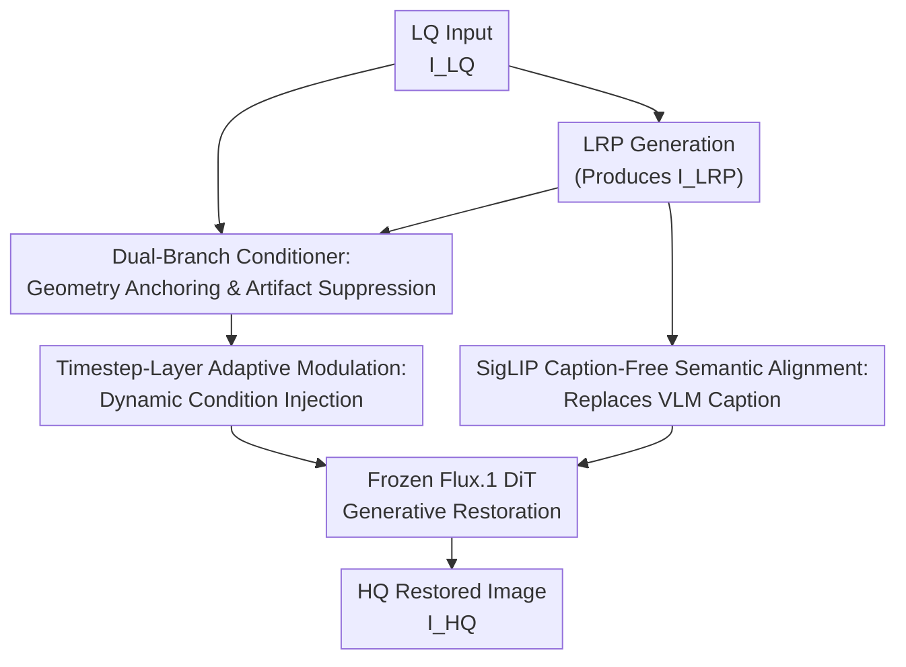

# LucidFlux: Caption-Free Photo-Realistic Image Restoration via a Large-Scale Diffusion Transformer

**Conference**: ICLR2026  
**OpenReview**: [https://openreview.net/forum?id=qrCAGOE483](https://openreview.net/forum?id=qrCAGOE483)  
**Code**: https://github.com/W2GenAI-Lab/LucidFlux  
**Area**: Image Restoration  
**Keywords**: Image Restoration, Diffusion Transformer, Caption-Free Semantic Alignment, Flux.1, Data Filtering

## TL;DR
LucidFlux utilizes a frozen 12B Flux.1 large-scale Diffusion Transformer for real-world image restoration. By employing a dual-branch conditioner, timestep-layer adaptive modulation, SigLIP-based caption-free semantic alignment, and large-scale high-quality data filtering, it achieves superior perceptual quality and semantic consistency across multiple real-world and synthetic degradation benchmarks.

## Background & Motivation
**Background**: Real-world image restoration aims to remove mixed degradations—such as noise, blur, compression artifacts, and lens distortion—from low-quality images while preserving the original semantic and geometric structures. Traditional CNN/Transformer-based discriminative restoration models are often effective on synthetic degradations but tend to smooth textures or only partially remove visible artifacts when encountering unknown mixed degradations in the wild.

**Limitations of Prior Work**: Diffusion priors have introduced new possibilities for this problem, as text-to-image diffusion models excel at generating realistic textures and details. UNet-based restoration methods from the Stable Diffusion/SDXL families have become more natural than pure discriminative models. However, UNet capacity and inductive bias gradually saturate under complex mixed degradations. Recent DiT methods like DreamClear demonstrate the potential of Transformer priors but typically use smaller DiTs or heavy ControlNet-style adapters, failing to fully exploit the global modeling capabilities of large models like Flux.1.

**Key Challenge**: Utilizing a large-scale DiT for image restoration is not straightforward. Low-quality (LQ) inputs provide edges and layouts but also inject noise, compression blocks, and blur into the model. While cleaner, proxy images from lightweight restoration may lose fine details. Furthermore, many diffusion restoration methods rely on VLMs to generate captions for LQ images as semantic conditions. However, captioning is slow and may mistakenly include degradation descriptions (e.g., "blurry," "damaged"), which misleads the generative restoration process.

**Goal**: The authors seek to address "at which timestep, in which layer, and using what conditional signals" large DiTs should be utilized, rather than merely adding more trainable parameters. Specifically, LucidFlux aims to achieve three things simultaneously: anchoring geometry and details from LQ images, obtaining cleaner structural cues from lightweight restoration proxies, and maintaining semantic consistency without invoking captions or VLMs.

**Key Insight**: The paper observes that different timesteps in diffusion sampling and different layers in Transformers naturally specialize: early timesteps focus on global structure while later timesteps focus on details; shallow layers handle low-level edges while deep layers manage semantics. Therefore, condition injection should not be uniform across all layers and timesteps; instead, the weights of the LQ branch and the proxy branch should be dynamically adjusted based on the timestep and layer index.

**Core Idea**: Replace caption conditions with "LQ image + Light Restoration Proxy (LRP) + SigLIP semantic features" and inject these signals into the frozen Flux.1 via timestep-layer adaptive modulation, enabling large-scale DiTs to perform caption-free real-world image restoration.

## Method
### Overall Architecture
The backbone of LucidFlux is a frozen Flux.1 large-scale Diffusion Transformer. During training, only task-related condition modules are learned. Given an LQ input $I_{LQ}$, the model first uses a lightweight restorer to generate a proxy image $I_{LRP}$, then extracts condition tokens from both $I_{LQ}$ and $I_{LRP}$. Simultaneously, SigLIP extracts semantic features from $I_{LRP}$, which are projected into the space originally intended for text conditions in Flux.1. Finally, guided by these caption-free conditions, Flux.1 recovers the high-quality image $I_{HQ}$ from noise.

The key to this framework is "freezing the large model while training small modules." Flux.1 and the VAE remain frozen to avoid damaging the original generative prior, while the dual-branch conditioner, modulation heads, and SigLIP Connector handle task adaptation. This allows LucidFlux to leverage a 12B-level generative prior without the risks of catastrophic forgetting or training instability associated with full fine-tuning.

### Key Designs
**1. Dual-Branch Conditioner: Decoupling detail anchoring and artifact suppression**

Information in real-world degraded images is contradictory: the original $I_{LQ}$ preserves direct edges, text, and local textures but contains noise and blur. The lightweight restoration proxy $I_{LRP}=LRP(I_{LQ})$ is cleaner and better for structural reference but might erase high-frequency details. LucidFlux encodes them separately using a dual-branch conditioner:

$$
\phi_{LQ}=DBC(I_{LQ}), \quad \phi_{LRP}=DBC(I_{LRP}).
$$

Each branch uses an 8-layer $3\times3$ convolutional encoder to map to the VAE latent space, undergoes patchification with positional encoding, and passes through two MMDiT layers. The branches do not share weights as they learn different cues: the $I_{LQ}$ branch acts as a "detail-preserving but noise-tolerant" observer, while the $I_{LRP}$ branch acts as an "artifact-free but potentially conservative" observer.

**2. Timestep-Layer Adaptive Modulation (TLCM): Routing conditions based on DiT's functional division**

Injecting conditions with uniform intensity across all stages leads to issues: premature detail focus before structure is settled, or structural constraints limiting texture refinement. The paper encodes timestep $t$ and layer index $l$ into sinusoidal positional representations, from which a modulation head predicts channel-wise scale and bias for each branch:

$$
\alpha^{t,l}_m,\beta^{t,l}_m = Modulation(PE(t/T,l/L)), \quad m\in\{LQ,LRP\}.
$$

AdaptiveLN-style modulation is applied to both branches:

$$
\tilde{\phi}^{t,l}_{LQ}=\alpha^{t,l}_{LQ}\odot\phi_{LQ}+\beta^{t,l}_{LQ}, \quad
\tilde{\phi}^{t,l}_{LRP}=\alpha^{t,l}_{LRP}\odot\phi_{LRP}+\beta^{t,l}_{LRP},
$$

fusing them into $Cond^{t,l}=\tilde{\phi}^{t,l}_{LQ}+\tilde{\phi}^{t,l}_{LRP}$. This explicitly delegates "when to look at what" to the modulator: cleaner proxies are prioritized for global layout, while original details from the LQ input are reintroduced for high-frequency texture refinement.

**3. SigLIP Caption-Free Semantic Alignment: Replacing unstable captions with image semantics**

Many generative restoration methods use VLMs to write captions for inputs. In real restoration, VLMs often describe the degradations. Analysis on RealLQ250 showed 17% of captions from LLaVA-v1.6-Vicuna-13B and 24% from Qwen2.5-VL-7B-Instruct contained degradation-related words. Furthermore, inconsistent captions for the same image lead to fluctuating restoration quality.

LucidFlux bypasses captions by extracting frozen SigLIP image features from $I_{LRP}$, projected via a Connector into the Flux.1 text condition space:

$$
z_s=Connector(SigLIP(I_{LRP})), \quad Context=Concat(z_s,c).
$$

Here, $c$ consists of a few default prompt tokens, while actual semantics come from $z_s$. This saves ~10s of captioning overhead and reduces the risk of "degradation-as-semantics."

**4. Reproducible Large-Scale High-Quality Data Filtering**

Large DiT capacity requires high-quality training data with structural diversity. LucidFlux collects ~2.9M candidate images from Pexels, Unsplash, and Photo-Concept-Bucket, then applies a three-stage filter. First, blur detection via Laplacian variance $S_{blur}(I)=Var(\nabla^2 I)$ retains images with $150\le S_{blur}(I)\le8000$. Second, texture richness is measured via Sobel gradient variance; patches with $S_{flat}<800$ are discarded if they exceed 50% of the image. Third, CLIP-IQA ranks the remaining images to keep the top 20%. Combined with LSDIR samples, a final set of 342K high-quality images is used to generate 1.36M training pairs via the Real-ESRGAN degradation pipeline.

### Loss & Training
LucidFlux employs the flow-matching velocity prediction objective common in the Flux series, utilizing a standard $L_2$ loss in latent space to train the new task modules. The Flux.1 backbone and VAE are frozen.

Training is conducted on 8 NVIDIA A800 GPUs using DeepSpeed ZeRO-2 and the Adafactor optimizer. The learning rate is $2\times10^{-5}$ with a weight decay of 0.01. The effective batch size is 32. Training at $1024\times1024$ resolution takes approximately 7 GPU-days. SwinIR serves as the LRP, and the SigLIP Connector is initialized from Flux.1-alpha-Redux.

## Key Experimental Results

### Main Results
Comparisons were performed on DRealSR, RealSR, RealLQ250 (real-world), and DIV2K-Val, LSDIR-Val (synthetic) against ResShift, StableSR, SeeSR, DreamClear, and SUPIR.

| Dataset | Metric | Ours | Prev. SOTA | Gain |
|--------|------|-----------|--------------|------|
| DRealSR | CLIP-IQA+ ↑ | 0.6748 | DiffBIR 0.6475 | +0.0273 |
| DRealSR | MUSIQ ↑ | 66.6833 | SeeSR 61.3222 | +5.3611 |
| DRealSR | NIQE ↓ | 4.7034 | SUPIR 5.9091 | -1.2057 |
| RealSR | CLIP-IQA+ ↑ | 0.7074 | SeeSR 0.6731 | +0.0343 |
| RealSR | MUSIQ ↑ | 70.20 | SeeSR 67.57 | +2.63 |
| RealLQ250 | CLIP-IQA+ ↑ | 0.7406 | SeeSR 0.7034 | +0.0372 |
| RealLQ250 | Q-Align ↑ | 4.3935 | SeeSR 4.1423 | +0.2512 |

LucidFlux excels in perceptual quality and semantic consistency. It outperforms SeeSR/SUPIR/DreamClear on RealLQ250 metrics. While PSNR/SSIM on synthetic sets are not always the highest (e.g., PSNR 15.4393 on DIV2K vs DiffBIR 20.0389), this is typical for generative restoration where realistic texture often trades off pixel-wise error for superior perceptual naturalness.

Comparison with commercial systems on RealLQ250:

| Method | CLIP-IQA+ ↑ | Q-Align ↑ | MUSIQ ↑ | NIQE ↓ |
|------|-------------|-----------|---------|--------|
| Seedream 4.0 | 0.5002 | 3.6931 | 52.3771 | 4.9393 |
| MeiTu SR | 0.6653 | 4.1464 | 66.5936 | 5.4125 |
| Ours | 0.7406 | 4.3935 | 73.01 | 3.6742 |

Regarding efficiency, while the 12B backbone results in a 23.6s inference time, the absence of VLM captioning (0.012s vs ~10s) makes the total pipeline faster than DreamClear (37.6s).

### Ablation Study
| Configuration | CLIP-IQA | CLIP-IQA+ | MUSIQ | Description |
|------|----------|-----------|-------|------|
| Dual-Branch Conditioner Only | 0.585 | 0.609 | 61.582 | Baseline trained on LSDIR |
| + SigLIP Alignment | 0.600 | 0.620 | 62.000 | Improved semantic stability |
| + TLCM | 0.622 | 0.635 | 65.500 | Better utilization of DiT hierarchy |
| + Large HQ Data | 0.7122 | 0.7406 | 73.0088 | Largest gain from high-quality data |

Ablation of captioning strategies on RealSR shows the caption-free approach (CLIP-IQA+ 0.7074) performs on par with Oracle GT captions (0.7111) and better than VLM captions (0.7060), while being significantly faster.

### Key Findings
- The dual-branch conditioner establishes the interface between the task and Flux.1, but SigLIP, TLCM, and data filtering provide essential cumulative gains.
- The largest performance jump comes from large-scale high-quality data, confirming that 12B-level restoration models rely heavily on structured, quality-controlled datasets.
- Caption-free paths are equal to or better than caption-based paths in quality while being much more efficient.
- LucidFlux is best suited for scenarios requiring photo-realism rather than strict pixel-wise fidelity.
- Visual comparisons show LucidFlux recovers clearer hair, text, and high-frequency textures where other methods leave artifacts or over-smooth.

## Highlights & Insights
- The primary highlight is reframing large-scale generative prior adaptation for restoration as a "when/where/what to condition" problem. This is more fundamental than increasing adapter size.
- The intuition behind the dual-branch conditioner is practical: LQ and LRP have different biases. Decoupling their encoding and dynamic fusion is a design transferable to other restoration tasks.
- The SigLIP caption-free path is insightful; when captions introduce degradation bias, bypassing text for direct image semantics is more robust.
- Data filtering is treated as a core method rather than a preprocessing detail, providing a reproducible recipe for training large-scale restoration models.

## Limitations & Future Work
- Computational cost remains high due to the 12B Flux.1 backbone, making it unsuitable for mobile or real-time deployment.
- The method currently focuses on single-image restoration; extending it to video would require handling temporal consistency.
- Data filtering thresholds are currently heuristic; future work could explore task-feedback-driven sample selection.
- As a generative method, there is an inherent risk of "hallucination" where textures look real but are not pixel-faithful, requiring stricter structural constraints for fields like medical imaging.

## Related Work & Insights
- **vs SUPIR**: SUPIR relies on SDXL and heavy prompting/text mechanisms. LucidFlux uses a larger DiT (Flux.1) and a more sophisticated routing of image-based conditions.
- **vs SeeSR**: SeeSR uses VLMs for semantic awareness. LucidFlux achieves similar or better semantic consistency without VLM latency by using SigLIP features.
- **vs DreamClear**: LucidFlux scales the backbone to 12B and replaces the heavy ControlNet-style replication with a lightweight dual-branch conditioner and TLCM.
- **Insight**: For generative vision tasks with "noisy" inputs, constructing multi-source conditions (Original + Proxy + Semantic) and letting the model dynamically choose which to trust based on time and depth is a superior alternative to simple concatenation.

## Rating
- Novelty: ⭐⭐⭐⭐☆
- Experimental Thoroughness: ⭐⭐⭐⭐⭐
- Writing Quality: ⭐⭐⭐⭐☆
- Value: ⭐⭐⭐⭐⭐

<!-- RELATED:START -->

...

<!-- RELATED:END -->

## Related Papers

- [\[ICLR 2026\] LiveMoments: Reselected Key Photo Restoration in Live Photos via Reference-guided Diffusion](livemoments_reselected_key_photo_restoration_in_live_photos_via_reference-guided.md)
- [\[CVPR 2026\] VoDaSuRe: A Large-Scale Dataset Revealing Domain Shift in Volumetric Super-Resolution](../../CVPR2026/image_restoration/vodasure_a_large-scale_dataset_revealing_domain_shift_in_volumetric_super-resolu.md)
- [\[ICLR 2026\] Vivid-VR: Distilling Concepts from Text-to-Video Diffusion Transformer for Photorealistic Video Restoration](vivid-vr_distilling_concepts_from_text-to-video_diffusion_transformer_for_photor.md)
- [\[ICLR 2026\] Analyzing the Training Dynamics of Image Restoration Transformers: A Revisit to Layer Normalization](analyzing_the_training_dynamics_of_image_restoration_transformers_a_revisit_to_l.md)
- [\[ECCV 2024\] Seeing the Unseen: A Frequency Prompt Guided Transformer for Image Restoration](../../ECCV2024/image_restoration/seeing_the_unseen_a_frequency_prompt_guided_transformer_for_image_restoration.md)

<!-- RELATED:END -->
