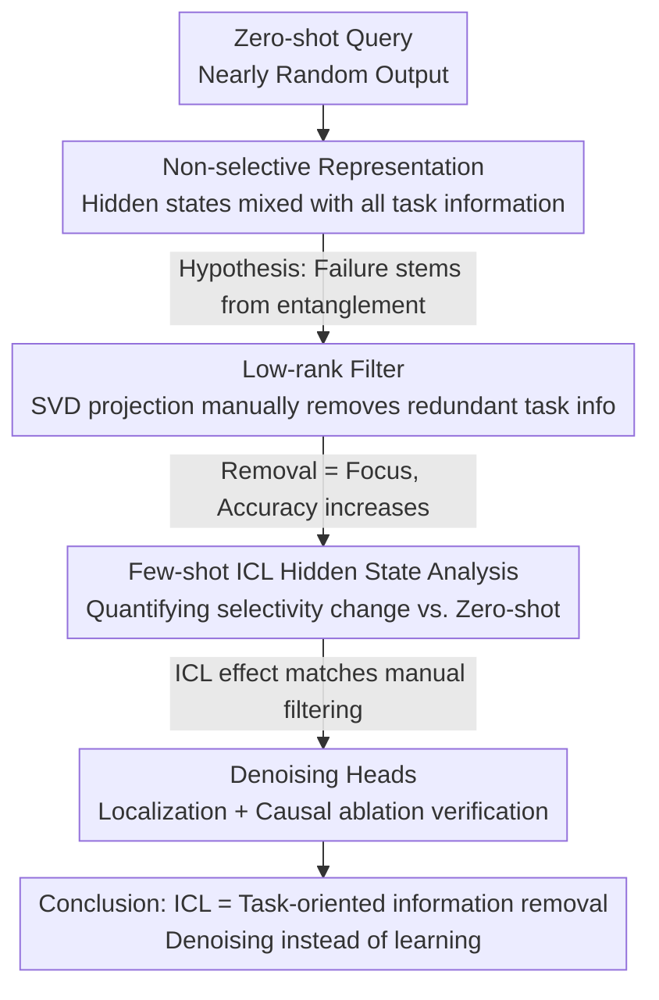

# Mechanism of Task-oriented Information Removal in In-context Learning

**Conference**: ICLR 2026  
**arXiv**: [2509.21012](https://arxiv.org/abs/2509.21012)  
**Code**: None  
**Area**: Image Restoration  
**Keywords**: in-context learning, information removal, denoising heads, mechanistic interpretability, low-rank filter

## TL;DR
This work explains the internal mechanism of In-context Learning (ICL) from a new perspective of "Information Removal." It finds that Language Models (LMs) encode queries into "non-selective representations" containing information of all possible tasks during zero-shot (leading to random outputs). The core role of few-shot ICL is to simulate a "task-oriented information removal" process—identifying "Denoising Heads" that selectively remove redundant task information from entangled representations to guide the model toward the target task. Ablation studies confirm that blocking these Denoising Heads significantly decreases ICL accuracy.

## Background & Motivation

**Background**: In-context Learning (ICL) is a hallmark capability of Large Language Models (LLMs)—enabling them to perform new tasks without fine-tuning by providing a few demonstrations in the prompt. Although ICL is widely used, the internal mechanism of "how it works" remains unclear.

**Limitations of Prior Work**:
   - **Limited theoretical perspectives**: Existing explanations include "ICL as implicit gradient descent," "ICL as Bayesian inference," or "induction heads performing copy-pasting." However, these are often verified on simplified models or only cover specific task types, lacking a unified and deep understanding.
   - **Unclear zero-shot failure**: In zero-shot scenarios without demonstrations, the accuracy of LMs on many tasks is near zero. The models possess the knowledge but produce random outputs—the reason for this remains unknown.
   - **Unclear role of demonstrations**: How few-shot demonstrations change the model's internal representations to guide it from "trying to perform all tasks" to "performing only the target task" is not well understood.

**Key Challenge**: Pre-training endows LMs with the ability to handle various tasks, but these abilities exist in an "entangled" form within hidden states. In zero-shot settings, the hidden state of a query contains information for all possible tasks, resulting in chaotic output. Demonstrations in ICL do not necessarily "add information" but rather "remove interference."

**Goal**: To explain the core mechanism of ICL from the novel perspective of "information removal"—how demonstrations help the model remove redundant task information from entangled representations to focus on the target task.

**Key Insight**:
   - First, prove that LM hidden states are "non-selective" (containing all task information) during zero-shot.
   - Then, manually simulate information removal using low-rank filters to verify that removing redundant information improves task accuracy.
   - Measure few-shot ICL hidden states to show their effect is quantitatively equivalent to task-oriented information removal.
   - Finally, identify the specific components responsible for the removal operation (Denoising Heads).

**Core Idea**: The mechanism of ICL is not "learning new knowledge using demonstrations," but "removing redundant information from entangled representations using demonstrations"—denoising rather than learning.

## Method

### Overall Architecture

This is a mechanistic interpretability study. Rather than proposing a new model, it aims to answer a long-standing puzzle: why does a pre-trained LM, which already possesses various task capabilities, produce nearly random outputs in zero-shot but work correctly with a few demonstrations? The answer provided is: the role of demonstrations is not to "teach the model new knowledge," but to "help the model remove redundant task information from entangled representations"—denoising instead of learning.

The analysis progresses through four sequential findings. It first proves that the hidden state of the query token in zero-shot is "non-selective," encoding information from all possible tasks simultaneously. Then, a manual low-rank filter is used to simulate "information removal," verifying that removing redundant information indeed allows the model to focus on the target task. Next, few-shot ICL hidden states are analyzed and found to be quantitatively equivalent to this task-oriented information removal. Finally, the specific components executing the removal are localized to a small set of attention heads called Denoising Heads, verified via causal ablation. The analytical tools used throughout include: linear probing to detect task information in hidden states; SVD low-rank projection as a controllable means of information removal; causal ablation to intervene on individual components; and comparative experiments like flipped labels or random labels to distinguish ICL behaviors.

### Key Designs

**1. Non-selective Representation: Explaining Zero-shot Failure**

The first step addresses the root cause of zero-shot failure. The authors conduct probing on query token hidden states in zero-shot scenarios and design metrics to measure the presence of different task information—for example, checking if the hidden state of a sentiment classification query contains activation signals for "sentiment classification," "topic classification," and "translation" simultaneously. Results show these representations are indeed "non-selective": information from different tasks is mixed together, leaving the model unable to determine which task to execute, resulting in nearly random outputs. This reframes zero-shot failure from "the model cannot do it" to "the model wants to do everything"—the capability exists but is not focused.

**2. Low-rank Filter: Manually Simulating Information Removal**

If the problem is information entanglement, can redundant information be manually removed? The authors design a low-rank projection operation $P$ to filter the hidden state $h$ as $h' = P \cdot h$, selectively removing information from specific task dimensions. Specifically, SVD is performed on hidden state matrices to identify principal components associated with different tasks, and representations are projected onto a low-rank subspace related to the target task. This is equivalent to erasing task information in the orthogonal directions of that subspace. Applying this filter to zero-shot hidden states immediately enables the model to "focus" on the target task, significantly increasing accuracy. This tool serves as a controllable baseline to validate the "Information Removal = Task Induction" hypothesis.

**3. Few-shot ICL Hidden State Analysis: Proving Demonstrations are Equivalent to Information Removal**

With the manual filter as a reference, the authors examine what natural ICL actually does. By comparing few-shot and zero-shot hidden states using "selectivity" metrics, they observe whether redundant task information is compressed and target task information is enhanced. The results show that as the number of demonstrations increases, hidden states gradually become "selective"—redundant information is suppressed, and target task information dominates. This change quantitatively aligns with the effects observed in the low-rank filter experiments. Thus, natural ICL and manual filtering are functionally equivalent; demonstrations act as an "information remover."

**4. Denoising Heads: Localizing Removal to Specific Heads and Causal Verification**

The final step moves from "functional description" to "component localization." The authors analyze the contribution of each attention head to the "selectivity" metric and identify a small subset of heads with the highest contribution, named Denoising Heads. Their attention patterns show these heads primarily focus on target-task-related parts of the demonstrations (e.g., label tokens) and use this information to modulate the query's hidden state. To verify their causal role, these heads are "blocked" during inference (setting output to zero or replacing it with the original hidden state), which leads to a significant drop in ICL accuracy. This drop is particularly severe in "flipped label" settings where correct labels are absent, as the model relies more heavily on information removal than on copying labels.

## Key Experimental Results

### Experimental Setup
- **Models**: Verified across multiple LMs (GPT-2 series, LLaMA, etc., of varying scales).
- **Tasks**: Text classification (sentiment analysis, topic classification, etc.)—chosen for their clear label spaces, facilitating the measurement of "task information."
- **Scale**: 87 pages, 90 figures, 7 tables—extremely detailed experimentation.

### Main Results

**Finding 1: Non-selective Representation**

| Scenario | Accuracy | Hidden State Selectivity | Notes |
|------|--------|-------------|------|
| Zero-shot | ~0% | Low (Multi-task info mixed) | Model "tries to do everything" |
| Manual Low-rank Filter | Significant Increase | High (Target task info dominates) | Removing redundant info = Task induction |
| Few-shot ICL (4-shot) | High | High | Demonstrations naturally achieve info removal |

**Finding 2: ICL ≈ Information Removal**
- The effects of the low-rank filter and few-shot ICL are quantitatively consistent across metrics.
- Both make the hidden state "more selective" by compressing redundant task information.

**Finding 3: Denoising Heads Ablation**

| Configuration | Change in ICL Accuracy | Notes |
|------|---------------|------|
| Normal ICL | Baseline | — |
| Block Denoising Heads | Significant Decrease (↓15-30%) | Information removal is blocked |
| Block Non-denoising Heads | Minor Impact | Non-critical heads do not affect ICL |
| Flipped Labels + Block Denoising Heads | Most Severe Degradation | Information removal is more critical without correct labels |

### Ablation Study

| Configuration | Key Metric | Notes |
|------|---------|------|
| Number of demonstrations | Info removal degree increases monotonically | More examples = Stronger denoising |
| Model scale | Larger models have more Denoising Heads | Scale ↑ → Info removal capability ↑ |
| Task types | Consistent info removal mechanism | Verified across sentiment, topic, and other tasks |
| Label space size | More labels require more info removal | Verified: More possible tasks = More redundant info to remove |

### Key Findings
- **ICL is "filtering interference" rather than "learning new skills"**: This is the core finding. LMs already possess task capabilities; demonstrations help the model "focus" on the correct one.
- **Denoising Heads are few but critical**: Only a few attention heads handle information removal, but blocking them has a huge impact on ICL.
- **Information removal is more critical in flipped label scenarios**: In "flipped label" settings (wrong labels provided), the model still partially functions—indicating demonstrations primarily signal "which task to do" (by removing others) rather than providing correct labels.
- **Denoising Heads locations vary by model but functions are consistent**: Validates the universality of the mechanism.

## Highlights & Insights

- **A new perspective on ICL**: Compared to "ICL = Implicit Gradient Descent" or "ICL = Bayesian Inference," "ICL = Information Removal" is more intuitive and operational—it suggests demonstrations function by "telling the model what NOT to do."
- **Discovery of non-selective representations**: Systematically shows that zero-shot hidden states contain all task information, explaining why knowledgeable models output randomly.
- **The concept of Denoising Heads**: Localizing the removal operation to specific attention heads marks a significant advance in mechanistic interpretability—moving from functional description to component localization.
- **Low-rank filter as an analytical tool**: Provides an elegant experimental framework to simulate information removal manually, offering a new methodology for ICL research.
- **Depth and Thoroughness**: With 87 pages and extensive data, the authors provide a rigorous, multi-angled validation of every discovery.

## Limitations & Future Work

- **Primary focus on classification tasks**: Whether the information removal mechanism applies to generative tasks (e.g., dialogue, summarization, translation) where "task information" is harder to define is unknown.
- **Linear probing and low-rank projection constraints**: Information removal might involve non-linear transformations; linear approximations might only capture part of the mechanism.
- **Model scale limitations**: Detailed hidden state probing restricts experiments mainly to medium-scale models (GPT-2, smaller LLaMA); applicability to 100B+ models is unknown.
- **Formation of Denoising Heads**: The paper identifies these heads but does not explain how they form during pre-training—requiring further study of training dynamics.
- **Unification with other ICL theories**: The relationship (complementary or contradictory) between the information removal perspective and other theories like Bayesian inference lacks explicit unification.

## Related Work & Insights

- **Induction Heads** (Olsson et al.): Identified heads for "copy-paste." Denoising Heads represent another functional class for "information filtering."
- **Task Vectors**: Previous work found vectors representing task directions. Information removal can be viewed as projecting states onto these correct task vector directions.
- **Bayesian Perspective of ICL** (Xie et al. 2022): ICL performs implicit Bayesian inference to select the most likely task. Information removal can be seen as the implementation of this inference at the attention head level.
- **Mechanistic Interpretability**: This work follows the standard paradigm of localizing components, causal verification, and ablation.
- **Insight**: The information removal perspective could practically guide prompt engineering—a good prompt should help the model "filter out irrelevant task interpretations" rather than just "providing task information."

## Rating
- Novelty: ⭐⭐⭐⭐⭐
- Experimental Thoroughness: ⭐⭐⭐⭐⭐
- Writing Quality: ⭐⭐⭐⭐
- Value: ⭐⭐⭐⭐⭐

<!-- RELATED:START -->

## Related Papers

- [\[CVPR 2026\] Event-Based Motion Deblurring Using Task-Oriented 3D Gaussian Event Representations](../../CVPR2026/image_restoration/event-based_motion_deblurring_with_unpaired_data.md)
- [\[ICLR 2026\] Learning Domain-Aware Task Prompt Representations for Multi-Domain All-in-One Image Restoration](learning_domain-aware_task_prompt_representations_for_multi-domain_all-in-one_im.md)
- [\[ICLR 2026\] Energy-oriented Diffusion Bridge for Image Restoration with Foundational Diffusion Models](energy-oriented_diffusion_bridge_for_image_restoration_with_foundational_diffusi.md)
- [\[CVPR 2025\] Tokenize Image Patches: Global Context Fusion for Effective Haze Removal in Large Images](../../CVPR2025/image_restoration/tokenize_image_patches_global_context_fusion_for_effective_haze_removal_in_large.md)
- [\[CVPR 2026\] IAFMNet: Information-Aware Feature Modulation for Efficient Super-Resolution](../../CVPR2026/image_restoration/iafmnet_information-aware_feature_modulation_for_efficient_super-resolution.md)

<!-- RELATED:END -->
