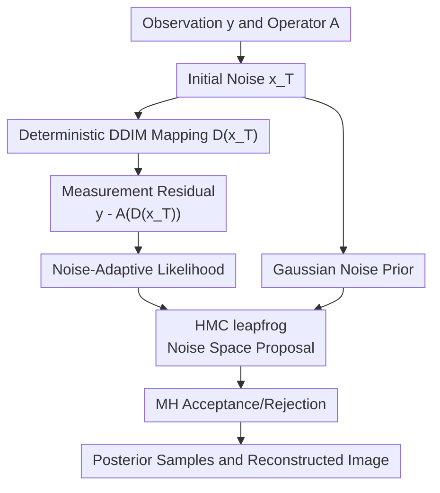

# Noise-Adaptive Diffusion Sampling for Inverse Problems Without Task-Specific Tuning

**Conference**: ICLR2026  
**OpenReview**: [https://openreview.net/forum?id=Yfk4ex3Z1G](https://openreview.net/forum?id=Yfk4ex3Z1G)  
**Code**: https://github.com/NA-HMC/NA-HMC  
**Area**: Image Restoration  
**Keywords**: Diffusion Inverse Problems, Posterior Sampling, Hamiltonian Monte Carlo, Unknown Noise, Image Restoration

## TL;DR
This paper transforms the solution of diffusion model inverse problems from "adding data consistency gradients to intermediate image states" to "performing HMC posterior sampling in the initial DDIM noise space." By marginalizing unknown measurement noise to derive NA-NHMC, the method achieves robust reconstruction quality across super-resolution, inpainting, deblurring, phase retrieval, and HDR without task-specific parameter tuning.

## Background & Motivation

**Background**: Diffusion models have become a powerful prior for image inverse problems. Given an observation $y=A(x)+\eta$, core tasks include super-resolution, random inpainting, deblurring, phase retrieval, and HDR reconstruction. The main objective is to satisfy measurement consistency while ensuring the reconstructed image remains within the natural image distribution. Existing diffusion inverse problem methods are generally divided into two categories: guidance-based methods that use likelihood gradients to correct intermediate states during reverse diffusion, and MAP optimization methods that treat the diffusion model as a regularizer or generator.

**Limitations of Prior Work**: The first category (guidance) requires approximating $p(y|x_t)$, often adding measurement consistency gradients directly to the noisy intermediate state $x_t$. The problem is that the diffusion denoiser has only seen states near the noise manifold of the training distribution, and likelihood gradients may point off-manifold, leading to accumulated artifacts. The second category (MAP) can produce sharp images but easily fits noise to satisfy observations; when noise levels are high or unknown, parameters like early stopping, step size, and data consistency weights must be retuned for every task. Methods like DMPlug, which optimize in the initial noise space, avoid intermediate state drift but deterministic optimization can get stuck in a single local mode, particularly in multimodal problems like phase retrieval.

**Key Challenge**: The central contradiction identified in this paper is that inverse problems require "exploration" of the full posterior without destroying the data manifold learned by the diffusion model. Forcing the image to fit observations in image space or intermediate diffusion states causes off-manifold issues, while single-point optimization leads to local optima or noise overfitting. An ideal solution should move only within the natural latent space of the diffusion model while explicitly sampling $p(x|y)$ rather than just seeking a MAP solution.

**Goal**: The authors aim to solve three specific problems: 1) avoiding intermediate diffusion states being pushed off the training manifold by measurement gradients; 2) exploring multiple possible solutions in ill-posed or multimodal inverse problems instead of getting stuck in a local mode; 3) eliminating dependence on task-specific likelihood weights, early-stopping thresholds, or manual tuning when the measurement noise type and level are unknown.

**Key Insight**: A critical observation from DDIM deterministic sampling is that if the reverse diffusion process is fixed as a deterministic mapping $D$, the initial noise $x_T$ can be viewed as the unique latent variable, where the clean image is $\hat{x}_0=D(x_T)$. Thus, the inverse problem does not need to approximate $p(y|x_t)$ at each intermediate timestep but can instead evaluate $p(y|D(x_T))$ directly in the initial noise space.

**Core Idea**: Utilize Hamiltonian Monte Carlo (HMC) to sample the posterior in the DDIM initial noise space and marginalize the unknown noise variance using a Jeffreys non-informative prior, allowing data consistency strength to auto-normalize with the residual.

## Method

### Overall Architecture
N-HMC treats the pre-trained diffusion model as a deterministic generator: starting from standard Gaussian noise $x_T\sim\mathcal{N}(0,I)$, a few-step DDIM process produces $\hat{x}_0=D(x_T)$, which is then passed through a known forward operator $A$ to generate predicted measurements $A(\hat{x}_0)$. Consequently, solving the inverse problem becomes sampling $p(x_T|y)$ in the $x_T$ space, rather than directly updating the image or intermediate diffusion states.

NA-NHMC is the version for unknown noise. For known Gaussian noise, the potential energy includes a standard squared residual term; for unknown noise, the authors treat $\sigma_y^2$ as a latent variable and integrate it out using the Jeffreys prior, resulting in a data term that does not require a specified noise level. In each HMC round, momentum is sampled, a proposal is advanced in the noise space using leapfrog integration, and Metropolis-Hastings (MH) acceptance/rejection is used to correct discretization errors. An early noise schedule is also used to facilitate exploration before entering the true noise-adaptive sampling phase.

The primary contributions of this framework are noise-space posterior modeling, the HMC exploration mechanism, and the adaptive likelihood under unknown noise. DDIM, the forward operator, and the final reconstruction serve as the underlying structure that enables these designs.

### Key Designs

**1. Posterior Sampling in Noise Space: From "Fixing Images" to "Sampling Initial Noise"**

The problem with traditional guidance methods is their reliance on $\nabla_{x_t}\log p(y|x_t)$ on the intermediate state $x_t$. Since $x_t$ is not a clean image, $p(y|x_t)$ itself requires approximation; once the gradient pushes $x_t$ away from the high-probability manifold of the corresponding noise level, the subsequent denoiser processes inputs never seen during training. This paper defines the DDIM reverse process as a deterministic mapping $\hat{x}_0=D(x_T)$, allowing the observation likelihood to be written directly as $p(y|x_T)=p(y|D(x_T))$. For known Gaussian noise, this corresponds to:

$$
\log p(y|x_T)=-\frac{\|y-A(D(x_T))\|^2}{2\sigma_y^2}+\text{const}.
$$

The advantage is that all HMC updates occur on the initial noise $x_T$, while every proposal is mapped back to a clean image through the full DDIM trajectory. In other words, the method does not "force" states in intermediate diffusion layers but only modifies the generator input. As long as the DDIM mapping comes from a pre-trained diffusion model, the output is naturally constrained by the data manifold. Furthermore, the noise prior $p(x_T)=\mathcal{N}(0,I)$ is simple, with a score of simply $-x_T$.

**2. HMC instead of MAP Optimization: Exploring Multimodal Spaces with Momentum**

Performing gradient descent only on $x_T$ results in a deterministic MAP optimization similar to DMPlug: it reduces residuals but may get stuck in a local mode. This paper uses HMC because high-dimensional image inverse problems often have many feasible solutions, especially when the forward operator loses phase, masks many pixels, or involves heavy downsampling, making the posterior multi-modal. HMC introduces auxiliary momentum $p$ to $x_T$ and moves along orbits in a Hamiltonian composed of potential and kinetic energy, making it more suitable for high-dimensional spaces than random-walk MCMC.

In N-HMC, the Hamiltonian consists of three terms: noise prior energy $\frac{1}{2}\|x_T\|^2$, measurement residual energy $\frac{1}{2\sigma_y^2}\|y-A(D(x_T))\|^2$, and momentum energy $\frac{1}{2}p^\top p$. Leapfrog updates alternately update momentum and position, followed by an MH acceptance probability $\min(1,\exp(H_0-H_1))$. If a proposal is rejected, the step size is decayed by a factor $\gamma$ to avoid repeated failures in low-posterior initial regions.

**3. Noise-Adaptive Likelihood: Marginalization instead of Manual Weighting**

A major difficulty in real-world inverse problems is that the type and level of measurement noise are often unknown. Many methods transfer this uncertainty to hyperparameters, such as data consistency weights or early stopping thresholds. NA-NHMC addresses this via Bayesian modeling: assuming $\sigma_y^2$ follows a Jeffreys prior $p(\sigma_y^2)\propto 1/\sigma_y^2$ and integrating out the noise variance.

After marginalization, the likelihood transforms from a fixed-variance Gaussian to:

$$
p(y|x_T)\propto \left(\frac{1}{2}\|y-A(D(x_T))\|^2\right)^{-m/2},
$$

where $m$ is the measurement dimension. The corresponding Hamiltonian no longer requires $\sigma_y$ and uses $\frac{m}{2}\log\|y-A(D(x_T))\|^2$ as the data term. Its gradient is effectively auto-normalized by the current residual magnitude: it does not over-amplify the data term when residuals are large, nor does it infinitely chase noise when residuals are small.

**4. Early Noise Annealing: Broad Exploration before Posterior Convergence**

When HMC is initialized from random $x_T$, the initial point may be in a very low posterior region. Using the target noise level immediately would create a steep measurement term, forcing HMC to use very small step sizes to maintain acceptance rates, which slows exploration. The authors use a larger effective noise $\sigma_{y,k}$ in the early stages to weaken the data term, allowing the trajectory to cover more distance in the noise space. The system then switches to the target or noise-adaptive likelihood once the chain enters a more plausible region.

### Loss & Training
The paper does not train a new diffusion model but uses a pre-trained model as a prior. Thus, the "training strategy" is essentially the inference-time sampling configuration. DDIM is restricted to two denoising steps at timesteps $[375, 750]$ to manage VRAM and time costs during backpropagation through the denoising trajectory. The two-step DDIM baseline costs approximately 90 seconds and 3.63GB VRAM; each additional step adds about 45 seconds and 1.84GB.

The potential energy for known-noise N-HMC is:

$$
U(x_T)=\frac{1}{2}\|x_T\|^2+\frac{1}{2\sigma_y^2}\|y-A(D(x_T))\|^2.
$$

For unknown-noise NA-NHMC, it is replaced by:

$$
U_{NA}(x_T)=\frac{1}{2}\|x_T\|^2+\frac{m}{2}\log\left(\|y-A(D(x_T))\|^2\right).
## Key Experimental Results

### Main Results
Evaluation was conducted on FFHQ and ImageNet (256x256) using 100 images. Metrics include PSNR, SSIM, and LPIPS.

| Dataset / Noise | Task | Metric | Ours (NA-NHMC) | Prev. SOTA | Gain / Observation |
|--------|------|------|------|------|------|
| FFHQ, $\sigma_y=0.05$ | Nonlinear Deblurring | PSNR / SSIM / LPIPS | 27.66 / 0.792 / 0.249 | DMPlug 27.15 / 0.784 / 0.266 | All metrics better |
| FFHQ, $\sigma_y=0.05$ | Phase Retrieval | PSNR / SSIM / LPIPS | 19.30 / 0.554 / 0.482 | DAPS 18.52 / 0.414 / 0.528 | Significant gain in multimodal task |
| FFHQ, $\sigma_y=0.20$ | Nonlinear Deblurring | PSNR / SSIM / LPIPS | 24.89 / 0.705 / 0.317 | DiffPIR 23.34 / 0.641 / 0.374 | Advantage grows at high noise |
| ImageNet, $\sigma_y=0.05$ | HDR Reconstruction | PSNR / SSIM / LPIPS | 25.86 / 0.779 / 0.253 | DPS 25.31 / 0.763 / 0.248 | PSNR/SSIM better |

### Ablation Study
- **HMC step size**: Performance is insensitive to step size, as MH acceptance/rejection and step size decay mitigate tuning pressure.
- **Leapfrog steps**: More steps (up to 30) provide more thorough exploration with diminishing returns.
- **HMC iterations**: Quality plateaus after roughly 120 rounds; unlike MAP methods, continued sampling does not cause significant overfitting degradation.
- **Diffusion steps**: Two-step DDIM was chosen for efficiency (90s / 3.63GB).

### Key Findings
- NA-NHMC represents a significant advantage in non-linear, high-noise, and unknown noise scenarios, aligning with its "posterior exploration + noise-adaptive" design.
- In phase retrieval, the annealing schedule is critical to avoid local modes; NA-NHMC shows lower pixel-level standard deviation across independent runs compared to DPS.
- In unknown impulse/speckle noise, NA-NHMC maintains strong results without hyperparameter changes, confirming that marginalizing noise variance provides auto-normalized data terms.

## Highlights & Insights
- Moving the "manifold feasibility" problem to the latent/noise space is ingenious: measurement gradients no longer contaminate intermediate states, as DDIM initial noise effectively acts as a generator input.
- HMC is a natural choice for the multimodality of inverse problems. Momentum trajectories and MH correction are better suited for navigating high-dimensional posteriors than deterministic optimization.
- The use of the Jeffreys prior transforms an engineering tuning problem into an interpretable Bayesian marginalization, avoiding typical overfitting tendencies at various noise levels.

## Limitations & Future Work
- Computational cost is higher than simple guidance methods like DPS since each HMC proposal requires backpropagation through the full DDIM mapping.
- The method requires the forward operator $A$ to be differentiable.
- Current experiments are limited to 256x256 images; higher resolutions or complex 3D/medical imaging models would increase the memory and time pressure on HMC.

## Related Work & Insights
- **vs DPS/DDNM**: These methods perform guidance on intermediate states $x_t$, which often destroys manifold feasibility. NA-NHMC avoids this by defined likelihood on $D(x_T)$.
- **vs DMPlug**: DMPlug also uses the noise space but relies on deterministic optimization, making it prone to mode collapse. NA-NHMC preserves the noise-space benefits while enabling full posterior exploration.
- **Insight**: For diffusion inverse problems, "where to apply data consistency" (latent space vs. image space) may be more critical than the specific form of the consistency term.

## Rating
- Novelty: ⭐⭐⭐⭐⭐ 
- Experimental Thoroughness: ⭐⭐⭐⭐⭐ 
- Writing Quality: ⭐⭐⭐⭐☆ 
- Value: ⭐⭐⭐⭐⭐

<!-- RELATED:START -->

## Related Papers

- [\[ICLR 2026\] Flower: A Flow-Matching Solver for Inverse Problems](flower_a_flow-matching_solver_for_inverse_problems.md)
- [\[ICLR 2026\] Adaptive Moments are Surprisingly Effective for Plug-and-Play Diffusion Sampling](adaptive_moments_are_surprisingly_effective_for_plug-and-play_diffusion_sampling.md)
- [\[CVPR 2026\] Outlier-Robust Diffusion Solvers for Inverse Problems](../../CVPR2026/image_restoration/outlier-robust_diffusion_solvers_for_inverse_problems.md)
- [\[ICML 2026\] Triadic Dynamics Aware Diffusion Posterior Sampling for Inverse Problems: Optimizing Guidance and Stochasticity Schedules](../../ICML2026/image_restoration/triadic_dynamics_aware_diffusion_posterior_sampling_for_inverse_problems_optimiz.md)
- [\[ICLR 2026\] CL-DPS: A Contrastive Learning Approach to Blind Nonlinear Inverse Problem Solving via Diffusion Posterior Sampling](cl-dps_a_contrastive_learning_approach_to_blind_nonlinear_inverse_problem_solvin.md)

<!-- RELATED:END -->
