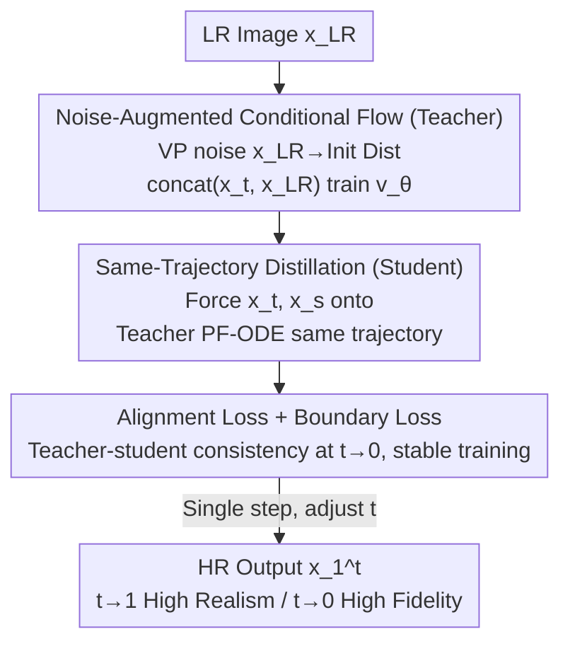

# One-Step Flow for Image Super-Resolution with Tunable Fidelity-Realism Trade-offs

**Conference**: ICLR2026  
**OpenReview**: [https://openreview.net/forum?id=5iaeagjfjK](https://openreview.net/forum?id=5iaeagjfjK)  
**Code**: [https://github.com/yuanzhi-zhu/OFTSR](https://github.com/yuanzhi-zhu/OFTSR)  
**Area**: Image Super-Resolution / Image Restoration / Diffusion & Flow Model Distillation  
**Keywords**: One-step SR, rectified flow, diffusion distillation, perception-distortion trade-off, noise augmentation

## TL;DR
OFTSR distills a noise-augmented conditional rectified flow teacher into a one-step student model, requiring the student's predictions at various time points $t$ to fall on the same PF-ODE trajectory of the teacher. This allows the model to continuously slide between fidelity and realism by adjusting a single parameter $t$ in a **single forward pass**, achieving SOTA one-step SR performance on FFHQ, DIV2K, ImageNet, and real-world datasets.

## Background & Motivation
**Background**: Diffusion and flow models have produced higher perceptual quality in image super-resolution (SR) than GAN/VAE-based methods. Mainstream approaches are divided into training-free methods (decomposing conditional probability into prior + likelihood, using pre-trained unconditional diffusion as a regularizer) and training-based methods (directly learning conditional distributions with paired data or adding control modules to large generative priors).

**Limitations of Prior Work**: These methods either require dozens to thousands of iterations for high perceptual quality (high computational cost) or compress the model into a single step via standard distillation, which **fixes the fidelity-realism trade-off** to a single point, losing flexibility.

**Key Challenge**: The perception-distortion trade-off (Blau & Michaeli 2018) mathematically proves that an output cannot simultaneously achieve high fidelity and high realism. Multi-step diffusion utilizes "NFE (Number of Function Evaluations) tuning" to navigate this trade-off (fewer steps $\rightarrow$ regression to mean, low distortion; more steps $\rightarrow$ rich details, high perception). Once distilled into a single step, this adjustment knob disappears, which is problematic for fields like medical imaging, remote sensing, and film restoration that require different fidelity-realism ratios.

**Goal**: To achieve both "single-step inference efficiency" and the "flexibility to continuously adjust fidelity-realism," two naturally conflicting objectives.

**Key Insight**: The authors observed that along the teacher's ODE sampling trajectory, single-step estimations from different intermediate states $x_t$ naturally lie on a fidelity-realism curve—$t$ closer to 1 yields richer details (low LPIPS, high realism), while $t$ closer to 0 yields smoother results (low MMSE, high PSNR, high fidelity). By training the student to "memorize" this curve, the entire trade-off can be reproduced via a single parameter.

**Core Idea**: First train a noise-augmented conditional rectified flow as a teacher, then distill it into a one-step student using a "same ODE trajectory constraint." This ensures the student's single-step predictions at any $t$ align with the corresponding points on the teacher's PF-ODE, thereby preserving the tunable trade-off.

## Method

### Overall Architecture
OFTSR is a two-stage pipeline. **Stage 1** trains a noise-augmented conditional rectified flow $v_\theta$ as the teacher: the noisy LR image is treated as the initial distribution of the flow, with the clean LR as a condition. The model learns to reconstruct diverse HR images from a single LR. This stage also serves as a standalone multi-step SR model. **Stage 2** distills the teacher into a one-step student $v_\phi$. The core constraint is that, given the same input, implicit intermediate states $x_t, x_s$ provided by the student at times $t < s$ must fall on the teacher's PF-ODE trajectory (i.e., $x_s = x_t + (s-t)v_\theta$). Alignment and boundary losses are added for stability. **During inference**, the student outputs $x_1^t = x_0 + v_\phi(x_0, x_{LR}, t)$ in one forward pass, sliding between fidelity and realism by adjusting $t$.

### Key Designs

**1. Noise-Augmented Conditional Rectified Flow: Injecting Diversity into One-to-One Collapse**

Directly learning a flow that maps an LR distribution to an HR distribution seems natural, but initial experiments (Tab. 7, $\sigma_p=0$) showed poor results: the LR$\rightarrow$HR mapping collapses, pushing every LR toward the same HR during inference, resulting in blurry details (FID 110, LPIPS 0.244). This is because the support of the initial LR distribution is too "narrow." To address this, Variance Preserving (VP) noise is added to the LR to expand the support: $x_0 = \sqrt{1-\sigma_p^2}x_{LR} + \sigma_p\epsilon$. Clean $x_{LR}$ is concatenated along the channel dimension as a condition to compensate for information loss. The training objective is $L_{flow}(\theta) = \mathbb{E} \int_0^1 D(v_\theta(x_{t,LR}, t), x_1 - x_0) dt$, where $x_{t,LR} = \text{concat}(x_t, x_{LR})$. This VP form is unified: $\sigma_p=0$ degrades to minimal augmentation (InDI), and $\sigma_p=1$ equals the SR3 strategy. Ablations show noise is the "perceptual quality" switch ($\sigma_p$ from 0 to 0.001 drops LPIPS from 0.244 to 0.115), but excessive noise makes PF-ODE curvier, requiring more NFE. The authors set $\sigma_p=0.1$ to balance quality/efficiency, with $\ell_1$ loss outperforming $\ell_2$.

**2. One-Step Distillation with Same ODE Trajectory Constraint**

Standard distillation only learns endpoints, fixing the trade-off. This paper constrains "the student's intermediate predictions to lie on the teacher's PF-ODE." Specifically, the student provides implicit states at any time via a single step: $x_t = x_0 + t v_\phi(x_0, x_{LR}, t)$. For $t < s$, it is required that $x_s = x_t + (s-t)v_\theta(x_{t,LR}, t)$ (one Euler step of the teacher). Combining these yields: $s(v_\phi(x_{0,LR}, s) - v_\phi(x_{0,LR}, t)) = (s-t)(v_\theta(x_{t,LR}, t) - v_\phi(x_{0,LR}, t))$. Following BOOT, let $dt = s - t$ and apply stop-gradient for stability:

$$L_{distill}(\phi) = \mathbb{E} \left\| v_\phi(x_{0,LR}, s) - \text{SG} \left[ v_\phi(x_{0,LR}, t) + \frac{dt}{s}(v_\theta(x_{t,LR}, t) - v_\phi(x_{0,LR}, t)) \right] \right\|_2^2 .$$

Since $dt = s-t$ and $t > 0$, there is no "division by zero" issue as in PINN distillation. The teacher $v_\theta$ is solved using Euler or RK2 (midpoint). Unlike BOOT's Signal-ODE, OFTSR directly constrains the student's implicit prediction $x_t$ onto the teacher's PF-ODE, yielding simpler derivation and a smaller distillation gap (Tab. 8: $0.064$ vs $0.483$ LPIPS). Tunability is a byproduct—since the student memorizes the entire trajectory, changing $t$ at inference selects a different trade-off point.

**3. Alignment Loss + Boundary Loss**

$L_{distill}$ alone is insufficient. The authors require visual consistency between the student output $x_0 + v_\phi(x_{0,LR}, t)$ and the teacher output pushed from $x_t$: $x_t + (1-t)v_\theta(x_{t,LR}, t)$, yielding $L_{align}(\phi) = \mathbb{E} \| (1-t)(v_\phi(x_{0,LR}, t) - v_\theta(x_{t,LR}, t)) \|_2^2$. At $t=0$, this degrades to the BOOT-style boundary loss $L_{BC}(\phi) = \mathbb{E} \| v_\phi(x_{0,LR}, 0) - v_\theta(x_{0,LR}, 0) \|_2^2$. Since $t=0$ is rarely sampled exactly, $L_{BC}$ is added separately. The final objective is $L(\phi) = L_{distill} + \lambda_{align}L_{align} + \lambda_{BC}L_{BC}$.

### A Complete Example
For a $4\times$ face SR (Fig. 3): the single-step student takes a fixed input and only changes $t$. The output slides along a curve: at $t=0$, LPIPS/PSNR = 0.438/27.48 (smoothest/highest fidelity, but blurry). As $t$ increases, it yields 0.157/30.02, 0.142/29.88, 0.120/29.56, 0.090/28.92, and finally at $t=1$, 0.055/27.66 (richest detail/realism, lower PSNR). This entire transition comes from **one forward pass** of the same network plus a scalar $t$, without retraining or multi-step sampling.

### Loss & Training
Stage 1 optimizes $L_{flow}$ ($\ell_1$ discrepancy, $\sigma_p=0.1$, VP noise + LR condition). Stage 2 optimizes $L(\phi)$ with step $dt=0.05$, teacher solved via Midpoint RK2, and stop-gradient on $\text{SG}$ terms. The teacher can be self-trained (Guided Diffusion/ResShift backbone) or off-the-shelf (DiT4SR/ResShift). The framework is applicable to any pre-trained conditional diffusion or flow PF-ODE.

## Key Experimental Results

### Main Results
On $4 \times$ SR, comparing PSNR / LPIPS / FID and NFE. OFTSR distilled requires **1 step**:

| Dataset | Method | NFE | PSNR↑ | LPIPS↓ | FID↓ |
|---------|--------|-----|-------|--------|------|
| DIV2K | InDI | 100 | 26.45 | 0.136 | 15.39 |
| DIV2K | **Ours distilled (t=1)** | 1 | 26.87 | **0.127** | 14.58 |
| DIV2K | **Ours distilled (t=0)** | 1 | **28.99** | 0.271 | 18.07 |
| FFHQ ($\sigma=0$) | DiffPIR | 100 | 29.13 | 0.073 | 44.49 |
| FFHQ ($\sigma=0$) | **Ours distilled (t=1)** | 1 | 28.98 | **0.055** | 36.02 |
| FFHQ ($\sigma=0$) | **Ours distilled (t=0)** | 1 | **31.25** | 0.150 | 66.76 |
| ImageNet | CDDB | 100 | 23.64 | 0.191 | 58.25 |
| ImageNet | **Ours distilled (t=1)** | 1 | 24.20 | **0.135** | 52.69 |

Key takeaway: One-step LPIPS/FID at $t=1$ generally outperforms training-free methods requiring 20–100 steps. At $t=0$, PSNR leads significantly (e.g., 31.25 dB on FFHQ). On RealSR/ImageNet degradation, one-step $t=1$ also outperforms 15-step ResShift and 1-step SinSR in non-reference metrics (NIQE, etc.).

### Ablation Study

| Configuration | Key Metrics | Note |
|---------------|-------------|------|
| $\sigma_p=0$ (No noise) | LPIPS 0.244 / FID 110.3 | Map collapse, perceptual fail |
| $\sigma_p=0.1$ (Final choice) | LPIPS 0.053 / FID 30.5 | Quality-efficiency balance |
| $\sigma_p=0.1$ no cond | LPIPS 0.073 / FID 42.5 | Performance drops without LR condition |
| Loss = BOOT | LPIPS 0.483 | $0.1+$ worse than ours |
| Loss = PINN | LPIPS 0.250 | Significantly lags behind |

### Key Findings
- **Noise is the perceptual switch**: Moving $\sigma_p$ from 0 to 0.001 drops LPIPS from 0.244 to 0.115. However, excessive noise curves the PF-ODE too much, increasing NFE requirements for the teacher.
- **Same-trajectory constraint is superior**: Our loss improves LPIPS by $0.1+$ over BOOT/PINN, as constraining the student's implicit states onto the teacher's PF-ODE is more effective than standard endpoint learning.
- **LR condition is essential**: Removing concatenation increases LPIPS from 0.053 to 0.073, proving its role in compensating for noise-induced information loss.

## Highlights & Insights
- **Translating "NFE knobs" to "Scalar $t$"**: Fidelity-realism trade-offs originally dependent on sampling steps are compressed into a single network parameter $t$.
- **Geometric Intuition**: Constraining student states onto the teacher's trajectory provides tunability while avoiding numerical issues like PINN's division by zero.
- **Unified VP Noise**: The VP form covers InDI ($\sigma_p=0$) and SR3 ($\sigma_p=1$), allowing systematic analysis of noise vs. quality.
- **Transferability**: The framework applies to any conditional diffusion/flow (distilling DiT4SR or ResShift) and can be extended to other one-step image translation tasks.

## Limitations & Future Work
- **Teacher-Dependent Curves**: The tunable range is bounded by the teacher's PF-ODE; if the teacher's curve is narrow, the student's flexibility is limited.
- **Performance Drop at extreme $t$ in Real SR**: On RealSR/ImageNet degradation, non-reference metrics (NIQE) degrade at $t=0.5$ or $t=0$, suggesting the tuning is more reliable toward $t \rightarrow 1$.
- **Requires Teacher Training**: Unlike training-free methods, OFTSR requires a conditional teacher; distilling from large-scale priors (e.g., SD-based) is computationally expensive.

## Related Work & Insights
- **vs. BOOT**: BOOT targets Signal-ODE and text-to-image; OFTSR targets teacher PF-ODE in rectified flow for SR, yielding simpler derivation and significantly lower distillation gap (LPIPS 0.064 vs. 0.483).
- **vs. SinSR**: SinSR achieves high performance by simulating entire teacher ODE trajectories during training; OFTSR simplifies this to single-step alignment.
- **vs. InDI / SR3**: These represent special cases of the VP noise form used in OFTSR.

## Rating
- Novelty: ⭐⭐⭐⭐⭐ Distilling tunable fidelity-realism via same-trajectory constraints is a new capability for one-step models.
- Experimental Thoroughness: ⭐⭐⭐⭐⭐ Extensive datasets and systematic ablations of $\sigma_p$, losses, and solvers.
- Writing Quality: ⭐⭐⭐⭐ Clear derivations, though notation is dense.
- Value: ⭐⭐⭐⭐⭐ One-step efficiency with tunable trade-offs is highly practical for diverse imaging domains.

<!-- RELATED:START -->

## Related Papers

- [\[CVPR 2026\] IFCSR: Inference-Free Fidelity-Realism Control for One-Step Diffusion-based Real-World Image Super-Resolution](../../CVPR2026/image_restoration/ifcsr_inference-free_fidelity-realism_control_for_one-step_diffusion-based_real-.md)
- [\[ICLR 2026\] SoFlow: Solution Flow Models for One-Step Generative Modeling](soflow_solution_flow_models_for_one-step_generative_modeling.md)
- [\[CVPR 2026\] FiDeSR: High-Fidelity and Detail-Preserving One-Step Diffusion Super-Resolution](../../CVPR2026/image_restoration/fidesr_high-fidelity_and_detail-preserving_one-step_diffusion_super-resolution.md)
- [\[ICML 2026\] One-Step Residual Shifting Diffusion for Image Super-Resolution via Distillation](../../ICML2026/image_restoration/one-step_residual_shifting_diffusion_for_image_super-resolution_via_distillation.md)
- [\[ICLR 2026\] VARestorer: One-Step VAR Distillation for Real-World Image Super-Resolution](varestorer_one-step_var_distillation_for_real-world_image_super-resolution.md)

<!-- RELATED:END -->
