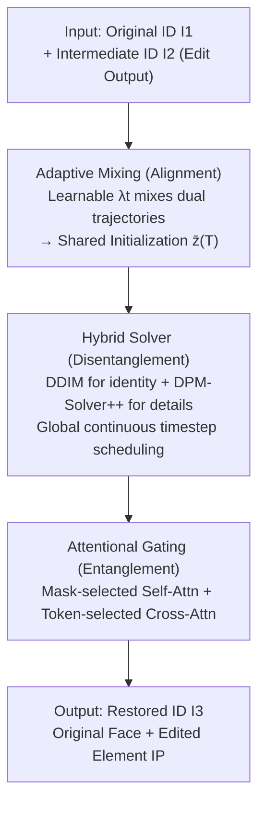

# Optimizing ID Consistency in Multimodal Large Models: Facial Restoration via Alignment, Entanglement, and Disentanglement

**Conference**: ICLR 2026  
**OpenReview**: [https://openreview.net/forum?id=ohpsnceMSb](https://openreview.net/forum?id=ohpsnceMSb)  
**Code**: https://github.com/NDYBSNDY/EditedID  
**Area**: Image Restoration / Diffusion Models / Face Editing  
**Keywords**: Facial Identity Consistency, Diffusion Inversion, Cross-source Feature Disentanglement, Plug-and-play, Training-free

## TL;DR
EditedID is a training-free, plug-and-play diffusion inversion framework that restores facial identity lost during editing by multimodal large models through a three-step "Alignment-Disentanglement-Entanglement" process without any fine-tuning. It preserves edited accessories/clothing (Element IP) while achieving SOTA ID consistency in both single-person and multi-person open scenarios.

## Background & Motivation

**Background**: Multimodal large models represented by GPT-4o Plus, Flux.1 Kontext, In-Context Edit, and InstructPix2Pix can perform image editing (e.g., changing hairstyles, adding hats, swapping clothes) based on natural language instructions. While they maintain identity reasonably well for cartoons/illustrations, they struggle with realistic fashion editing.

**Limitations of Prior Work**: When instructions become long and complex (e.g., "give him a light gray jacket with black-rimmed glasses"), significant facial artifacts and identity drift occur. Academic models (In-Context Edit, InstructPix2Pix) suffer from limited fine-tuning data and weak facial feature extraction, leading to gradual facial degradation under long instructions. Industrial models (GPT-4o Plus, Qwen-Image-Edit, Flux.1 Kontext) emphasize LLM text controllability but ignore facial geometric constraints, often generating random identities. Human sensitivity to faces makes even slight identity shifts unacceptable, and the confidentiality of real face datasets makes "targeted fine-tuning" nearly unfeasible.

**Key Challenge**: The authors attribute the failure of existing facial consistency methods (ID preservation, blind restoration, ID fusion, face swapping) to two types of cross-source issues—**Cross-source Distribution Bias**: identity features learned from low-resolution/limited data do not match the high-resolution distribution of the base diffusion model, leading to blurred details, cartoonization, or random faces; **Cross-source Feature Contamination**: mutual interference when merging "original face" and "edited element" features, causing the loss of fine-grained attributes like "black-rimmed glasses" or dropping the original ID during swapping.

**Goal**: Achieve plug-and-play facial identity reconstruction without training, fine-tuning, or data collection—ensuring the face is consistent with the **Original ID** ($I_1$) while edited elements like glasses/hats remain consistent with the **Intermediate ID** ($I_2$, the output of the editing model).

**Key Insight**: Inspired by 3D face processing (separating elements like glasses and faces from different sources and re-synthesizing them with simulated lighting/position), the authors propose the core principle of **Alignment–Disentanglement–Entanglement** in 2D scenarios. Each step is supported by a systematic analysis of diffusion trajectories, sampler behaviors, and attention properties (referred to as Observation 1/2/3).

**Core Idea**: Instead of retraining, the method **reuses the inversion dynamics of pretrained diffusion models**. It first aligns the latent space trajectories of the dual IDs to a unified initialization point, then uses a hybrid solver to disentangle their respective identities and details, and finally employs attentional gating to "entangle" the original face and new elements into the restored result.

## Method

### Overall Architecture

EditedID is a restoration pipeline based on "Diffusion Inversion + Reconstruction Trajectory." The input consists of two images: the **Original ID** $I_1$ (real face to maintain identity) and the **Intermediate ID** $I_2$ (editing model output with desired elements but degraded face; low-resolution inputs are first upscaled via DiffBIR). The output is the restored $I_3$—where the face comes from $I_1$ and elements come from $I_2$. The pipeline comprises three core components addressing challenges C1/C2/C3: first, aligning the DDIM inversion trajectories of $I_1$ and $I_2$ using learnable weights into a shared initial noise $\bar z^{(T)}$ (Alignment, solving distribution bias); then, using a hybrid solver to reconstruct both ID paths from this shared starting point to preserve identity and detail respectively (Disentanglement, solving feature contamination); finally, selectively replacing $I_1$’s facial attention and $I_2$’s element attention using masks/tokens during parallel diffusion generation of $I_3$ (Entanglement, for controllable synthesis). The entire process is training-free, requires only 6 diffusion steps, and runs on a single GPU.

### Key Designs

**1. Adaptive Mixing: Aligning Dual ID Inversion Trajectories with Learnable Weights (Addressing Cross-source Distribution Bias)**

Linearly mixing the inversion latents of $I_1$ and $I_2$ with fixed weights fails because excessive averaging early in inversion (near $z^{(0)}$) erases source features, while a lack of adaptation late in inversion (near $z^{(T)}$) leads to contamination. Based on Observation 1 (diffusion trajectories have "multi-solution" properties and "controllability"), the authors propose Adaptive Mixing: assigning a **learnable weight** $\lambda_t \in [0, 0.5]$ to each timestep. Alignment loss $L_{align} = \lVert \hat z^{(t)}_1 - \hat z^{(t)}_2 \rVert_2^2$ is minimized via gradient descent (learning rate $\eta=0.01$). During inversion, the dual latents are updated cross-wise: $\hat z^{(t+1)}_1 = (1-\lambda_t)\hat z^{(t)}_1 + \lambda_t \hat z^{(t)}_2$, with $\hat z^{(t+1)}_2$ symmetric. Smaller initial $\lambda_t$ ensures smooth transitions; at $t=T$, $\lambda_t$ is forced to 0.5 to converge trajectories to a unified $\bar z^{(T)} = (\hat z^{(t)}_1 + \hat z^{(t)}_2)/2$. This yields a shared start with smooth merging paths, preserving individual features while mitigating distribution bias.

**2. Hybrid Solver: Disentangling Identity and Detail via DDIM and DPM-Solver++ (Addressing Cross-source Feature Contamination)**

After aligning to a shared initialization, both ID paths must be reconstructed. The authors extend Null-text optimization, optimizing unconditional embeddings $\{\varnothing^{(t)}_i\}$ for each ID to minimize the MSE between reconstructed latents and aligned states. A key insight from Observation 2 is that **DDIM favors identity over detail** (stable ID but loss of detail at high steps), whereas **DPM-Solver++ favors detail over identity** (high fidelity but ID drift at low steps). The Hybrid Solver dynamically switches between them: DDIM is used in early steps (near $\bar z^{(T)}$) to establish robust identity, while DPM-Solver++ is used in late steps (near $\bar z^{(0)}$, interval $[s_1, s_2]$) to restore texture (Eq. 5). To prevent latent divergence and color shifts at the transition boundary (e.g., $t=4$), a **Global Timestep Pre-scheduling Strategy** is used. Full timestep sequences $\{\tau_t\}$ and $\{\sigma_t\}$ for both schedulers are pre-computed, then $\sigma_t$ is selected if $t \in [s_1, s_2]$, otherwise $\tau_t$ (Eq. 6), ensuring continuous and smooth evolution.

**3. Attentional Gating: Entangling Multiple Elements via Selective Attention Replacement (Ensuring Controllable Synthesis)**

Finally, $I_1, I_2$, and target $I_3$ are generated in parallel from $\bar z^{(T)}$. Observation 3 reveals that **Self-attention encodes single-element structure**, while **Cross-attention encodes multi-element interaction**. Two types of replacement are used: (i) **Mask-based Self-attention Replacement**: Semantic masks $M_1$ (face) and $M_2$ (glasses) are used to fuse target regions from $S_1$ and $S_2$: $S^{(t)}_3 = \sum_i S^{(t)}_i \odot W_i + S^{(t)}_3 \odot W_3$ (Eq. 7). Replacement is restricted to down/mid layers to maintain element-wise generatability. (ii) **Token-based Cross-attention Replacement**: Based on target token sets $T_1$ ("face") and $T_2$ ("glasses"), indicator functions selectively replace cross-attention maps (Eq. 9) across all $t \in [0, T]$ for semantic coherence. Combined with BlendDiffusion, this allows for identity-consistent restoration with context-aware interactions without additional training.

### Loss & Training
The method is **training-free** and requires no fine-tuning. Two types of lightweight optimization occur during inference: Alignment loss $L_{align}=\lVert\hat z^{(t)}_1-\hat z^{(t)}_2\rVert_2^2$ to optimize $\lambda_t$ ($\eta=0.01$), and a joint reconstruction loss $L_{rec}=\sum_{i=1}^{2}\lVert\hat z^{(t-1)}_i - z_{t-1}(\bar z^{(t)}_i,\varnothing^{(t)}_i,C_i)\rVert_2^2$ to optimize unconditional embeddings. The process takes approx. 6 diffusion steps, averaging 4.2 seconds per ID on an RTX 4090.

## Key Experimental Results

### Main Results
Compared against 9 SOTA methods for ID preservation, fusion, restoration, and swapping across three metrics: ID-Sim (identity similarity, >0.7 for same ID), CLIP-S (Element IP preservation), and I-Reward (human expectation/artifact check).

| Method | ID-Sim↑ | CLIP-S↑ | I-Reward↑ |
|------|---------|---------|-----------|
| IP-Adapter (Ye 2023a) | 0.35 | 20.42 | 1.02 |
| DiffBIR (Lin 2024) | 0.34 | 25.43 | 1.65 |
| DeepFaceSwap | 0.52 | 28.02 | 1.69 |
| Ye et al. 2025 | 0.65 | 26.11 | 1.73 |
| **EditedID (Ours)** | **0.73** (+0.27) | **28.14** (+2.43) | **1.82** (+0.27) |

When integrated as a plug-and-play module for large editing models, ID consistency improved significantly:

| Multimodal Editing Model | ID-Sim↑ |
|------------------|---------|
| In-ContextEdit | 0.56 |
| Doubao | 0.63 |
| **In-Con w/ EditedID** | **0.72** (+0.16) |
| **Doubao w/ EditedID** | **0.75** (+0.12) |

### Ablation Study

| Configuration | Phenomenon | Explanation |
|------|------|------|
| Full model | Both ID + Elements preserved | Complete framework |
| w/o Alignment | ID mismatch, artifacts, jumps | No Adaptive Mixing → Distribution bias unresolved |
| w/o Disentanglement | Artifacts / Facial distortion | No Hybrid Solver → ID-Detail imbalance |
| w/o Entanglement | Edit elements (hats/glasses) lost | No Attentional Gating → Element IP not preserved |

### Key Findings
- **Modular Synergie**: Alignment prevents artifacts, Disentanglement prevents distortion, and Entanglement preserves Element IP. Removed any component significantly degrades performance.
- **Efficiency**: 4.2s per ID, roughly 6× faster than diffusion-based DiffFace. Unlike baselines where time scales with ID count, EditedID maintains **constant inference time** via parallel architecture.
- **Robustness**: In real-world scenarios (45° side profiles, complex lighting, obstructions), EditedID maintains stability via Adaptive Mixing, where others like IP-Adapter or DeepSwap fail.

## Highlights & Insights
- **Bypassing Data Scarcity**: Instead of fine-tuning on sensitive/private face data, the method reuses pretrained dynamics for restoration—requiring 0MB of training data.
- **Mechanism-Driven Design**: Every design choice maps to a foundational observation of the diffusion process (trajectories, sampler bias, and attention roles).
- **Global Timestep Trick**: Pre-scheduling full sequences instead of segment-wise stitching avoids boundary divergence/color issues when mixing samplers.
- **Byproduct**: High ID consistency allows EditedID to act as a "pre/post-edit calibrator" for facial datasets, enabling the generation of multiple edited versions of a single sample to alleviate data scarcity.

## Limitations & Future Work
- **Upstream Dependence**: Highly dependent on the "Intermediate ID" having reasonably correct elements. Low-quality or misaligned upstream edits limit the restoration ceiling.
- **Hyperparameter Sensitivity**: The reliance on semantic masks $M_1/M_2$, token sets $T_1/T_2$, fusion weights $\hat w$, and the DPM-Solver++ interval $[s_1, s_2]$ involves sensitivities mostly detailed in the Appendix.
- **Ethical Risks**: ID-consistent editing can be misused for deepfakes or privacy violations. The authors declare they do not provide ID retrieval components.

## Related Work & Insights
- **vs. Identity Preservation (IP-Adapter)**: These fuse coarse-grained features with high-res diffusion features, causing distribution mismatch (blurring/cartoonization). EditedID aligns trajectories in latent space.
- **vs. Blind Restoration (DiffBIR)**: These focus on SR but ignore ID consistency, generating random sharp faces. EditedID uses the original ID as an explicit reconstruction constraint.
- **vs. Identity Fusion**: Fusion often contaminates fine-grained attributes; EditedID isolates contamination via Hybrid Solver + Attentional Gating.
- **vs. Face Swapping (FaceDancer/DeepSwap)**: Swapping is sensitive to artifacts and fails in multi-person or occluded scenarios; EditedID performs parallel restoration on facial patches.

## Rating
- Novelty: ⭐⭐⭐⭐⭐ Systematically maps "Alignment-Disentanglement-Entanglement" to diffusion layers (trajectory/sampler/attention).
- Experimental Thoroughness: ⭐⭐⭐⭐ Extensive comparisons and ablation, though some hyperparameter sensitivities are deferred to the appendix.
- Writing Quality: ⭐⭐⭐⭐ Clear logic chain from observation to design, though notation density is high.
- Value: ⭐⭐⭐⭐⭐ High engineering value as a plug-and-play module for any multimodal editing model.

<!-- RELATED:START -->

## Related Papers

- [\[NeurIPS 2025\] Adaptive Discretization for Consistency Models](../../NeurIPS2025/image_restoration/adaptive_discretization_for_consistency_models.md)
- [\[ICLR 2026\] Text-Aware Image Restoration with Diffusion Models](text-aware_image_restoration_with_diffusion_models.md)
- [\[CVPR 2026\] ZeroIDIR: Zero-Reference Illumination Degradation Image Restoration with Perturbed Consistency Diffusion Models](../../CVPR2026/image_restoration/zeroidir_zero-reference_illumination_degradation_image_restoration_with_perturbe.md)
- [\[ICLR 2026\] Energy-oriented Diffusion Bridge for Image Restoration with Foundational Diffusion Models](energy-oriented_diffusion_bridge_for_image_restoration_with_foundational_diffusi.md)
- [\[CVPR 2026\] PnP-CM: Consistency Models as Plug-and-Play Priors for Inverse Problems](../../CVPR2026/image_restoration/pnp-cm_consistency_models_as_plug-and-play_priors_for_inverse_problems.md)

<!-- RELATED:END -->
