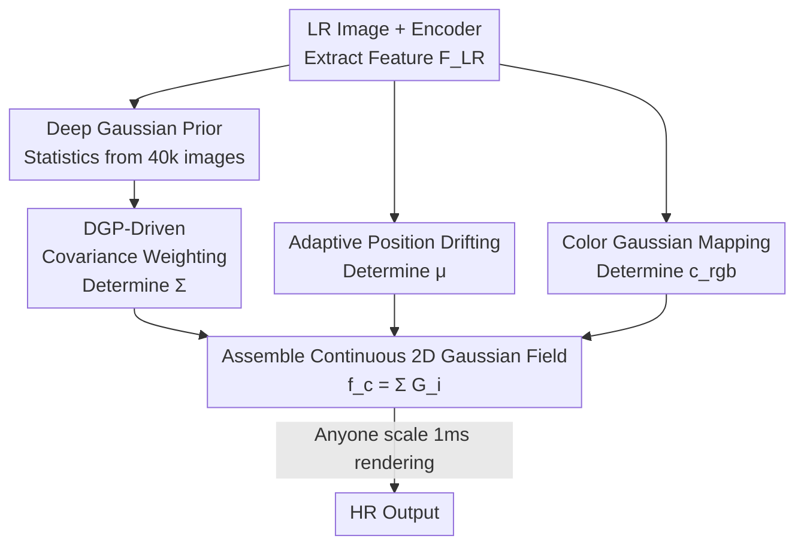

# Pixel to Gaussian: Ultra-Fast Continuous Super-Resolution with 2D Gaussian Modeling

**Conference**: ICLR 2026  
**OpenReview**: [https://openreview.net/forum?id=SZvhmFntRA](https://openreview.net/forum?id=SZvhmFntRA)  
**Code**: https://github.com/peylnog/ContinuousSR  
**Area**: Image Restoration / Arbitrary-Scale Super-Resolution  
**Keywords**: Arbitrary-Scale SR, 2D Gaussian, Gaussian Splatting, Continuous Signal Reconstruction, Efficient Inference

## TL;DR
This paper proposes ContinuousSR, which reconstructs a low-resolution image into a continuous 2D Gaussian field at once via the "pixel-to-Gaussian" paradigm. Any subsequent magnification is achieved through a single fast rendering (approx. 1ms), surpassing SOTA in quality across seven benchmarks (+0.18 dB on Manga109) while achieving a 19.5× speedup when continuously scaling across 40 levels.

## Background & Motivation
**Background**: Arbitrary-Scale Super-Resolution (ASSR) aims to handle any magnification (e.g., $\times 2$, $\times 3.7$, $\times 8$) with a single model, avoiding the need to train separate models for each fixed scale. The current mainstream approach is Implicit Neural Representation (INR), represented by LIIF, which uses MLPs to learn a continuous mapping of "coordinates $\to$ pixel values," followed by upsampling and decoding at arbitrary scales.

**Limitations of Prior Work**: The INR approach has two major drawbacks. First is low efficiency—its pipeline ($F_{LR}=E(I_{LR})$, $F^s_{HR}=U(F_{LR},s)$, $I^s_{HR}=D(F^s_{HR})$) requires re-running the time-consuming upsampling $U$ and decoding $D$ for every target scale $s$; this repeated computation is extremely expensive for multiple scales. Second is limited fidelity—coordinate-based implicit functions have limited expressive power, making it difficult to explicitly characterize high-quality continuous high-resolution signals, which limits reconstruction quality. Later works using Gaussian representations (GaussianSR building Gaussians in feature space, GSASR predicting scale-conditioned Gaussians in RGB space) still suffer: they either require individual decoding per scale or re-generating Gaussians for each scale, which is slow and harms cross-scale consistency.

**Key Challenge**: Imaging is essentially the discrete sampling of a continuous real-world signal $f_c(x,y)$ into $I[m,n]=f_c(m\Delta x,n\Delta y)$. The goal of ASSR is actually to recover $f_c(x,y)$ in reverse. However, implicit modeling neither explicitly expresses this continuous function nor decouples "continuous signal recovery" from "scale-dependent sampling," leading to losses in both quality and efficiency.

**Goal**: Is it possible to directly reconstruct a continuous HR signal from an LR image once, and then perform lightweight sampling for any desired scale?

**Key Insight**: Use Gaussian functions as continuous basis functions. According to Gaussian Mixture Models, any complex continuous function can be represented by a superposition of multiple Gaussians ($f_c(x,y)=\sum_{i=1}^{N}G_i(x,y)$), which is theoretically complete. Combined with the mature rendering engineering from the Gaussian Splatting community, implementation efficiency is also high. The problem is that direct end-to-end learning of Gaussian parameters is extremely difficult to converge—the authors observed PSNR getting stuck at a local optimum of 10 dB.

**Core Idea**: First, a "Deep Gaussian Prior (DGP)" was discovered through statistics on 40,000 natural images—the distribution of Gaussian field parameters is regular and traceable. This prior transforms the challenge of "direct regression of Gaussian parameters" into "learning weighted coefficients on a predefined Gaussian dictionary + learning position drifting," allowing for stable one-time mapping from LR to a continuous Gaussian field.

## Method

### Overall Architecture
The core of ContinuousSR is splitting super-resolution into two stages: "once construction + multiple rendering." Given an LR image $I_{LR}$, a backbone encoder $E$ (SwinIR / HAT) extracts features $F_{LR}$. Then, three parallel branches determine the three types of parameters for each Gaussian kernel—covariance $\Sigma$ (shape/anisotropy), position $\mu$, and RGB color $c_{rgb}$. These are assembled into a continuous 2D Gaussian field $f_c(x,y)=\sum_i G_i(x,y)$ covering the entire image. This field only needs to be constructed in a single forward pass; subsequently, whether $\times 4$ or $\times 33.6$ is required, it is just a fast rendering (raster sampling) of approx. 1ms from this continuous field, completely replacing the INR pipeline of repeated scale-dependent upsampling and decoding.

Each Gaussian kernel has 8 parameters: covariance matrix $\Sigma=\begin{bmatrix}\sigma_x^2 & \rho\sigma_x\sigma_y\\ \rho\sigma_x\sigma_y & \sigma_y^2\end{bmatrix}$, position $\mu=(\mu_x,\mu_y)$, and color $c_{rgb}=(c_r,c_g,c_b)$. The kernel value is $G_i(x,y)=c_{rgb}\frac{1}{2\pi|\Sigma_i|}\exp(-\tfrac12 d^\top\Sigma_i^{-1}d)$, where $d$ is the offset from the sampling point to $\mu$. The three branches correspond to three key designs: covariance via DGP-Driven Covariance Weighting, position via Adaptive Position Drifting, and color via Color Gaussian Mapping; their feasibility is rooted in the statistically discovered Deep Gaussian Prior.

### Key Designs

**1. Pixel-to-Gaussian Paradigm and Deep Gaussian Prior: Making Gaussian Space Learnable**

Why does direct end-to-end regression of Gaussian parameters from LR fail? The authors attribute this to two points: **High Complexity**—parameter domains for position, covariance, and RGB are essentially unbounded (covariance only needs to be positive definite), making the solution space much larger than the image space with many local traps; and **High Sensitivity**—small perturbations in Gaussian space affect the entire image, whereas changing one pixel in image space only affects itself. Control experiments showed that with the same noise distribution, the image space maintained a PSNR of 26.31 dB, while the Gaussian space dropped to 13.83 dB, confirming extreme sensitivity.

To break this, the authors used an optimization method $\psi$ (~1 minute per image, 700+ GPU hours total) to convert ~40,000 HR images into Gaussian fields. By analyzing the distribution of $\sigma_x^2, \sigma_y^2, \rho\sigma_x\sigma_y$, they derived the **Deep Gaussian Prior (DGP)**: ~99% of covariances fall within narrow intervals of $0\sim2.4$, $0\sim2.2$, and $-0.9\sim1.5$ respectively, approximating Gaussian distributions. DGP is a **fixed statistical prior** extracted once from large-scale natural images and is not updated during training—it constraints the unbounded, sensitive Gaussian space into a well-behaved, traceable region, serving as the foundation for stable convergence.

**2. DGP-Driven Covariance Weighting: From Regression to Dictionary Weighting**

Covariance is the hardest to learn. The authors transformed it from "direct regression" to "dictionary weighting" using DGP. Specifically, covariance parameters $\sigma_{i,x}^2, \sigma_{i,y}^2, \rho_i\sigma_{i,x}\sigma_{i,y} \sim P(\cdot)$ are sampled from DGP to construct a dictionary $K=\{G_i(\Sigma_i)\}_{i=1}^N$ of $N$ predefined kernels covering most covariance types in natural images. A convolutional network $M_{weight}$ predicts normalized weights $W=\mathrm{Softmax}(M_{weight}(F_{LR}))$ from $F_{LR}$ to linearly combine the dictionary into the target kernel $G_{target}=\sum_{i=1}^N w_i \cdot G_i$.

**3. Adaptive Position Drifting: Content-Adaptive Clustering of Gaussian Kernels**

Directly learning positions is also difficult. A naive solution fixates each kernel at the LR pixel center, but this limits expressiveness—it cannot allocate more kernels to texture-rich areas. Ours uses **APD**: taking the LR pixel center as the initial position $P_{init}$, a 5-layer MLP $M_{pos}$ learns a dynamic offset from $F_{LR}$, restricted to $-1\sim1$ via Tanh. The final position is $P_{final}=P_{init}+P_{off}$.

**4. Color Gaussian Mapping and Fast Rendering: Realizing Efficiency**

RGB values are in $[0,1]$ and relatively easy to optimize. A **Color Gaussian Mapping (CGM)** using a 5-layer MLP predicts color parameters directly. The efficiency advantage is realized through the rendering method: the continuous HR signal is built only once, after which any scale requires only one lightweight rendering step (~1ms), whereas MetaSR/LIIF must re-generate scale-dependent features. This is why our method is nearly 124× faster than GSASR on DIV2K when averaging over 45 scales; also, because it does not rely on scale-dependent feature maps, VRAM usage is nearly scale-independent (~2.5G from $\times 4$ to $\times 16$), whereas LIIF and CiaoSR suffer from OOM at large scales.

### Loss & Training
Two configurations: The base version uses SwinIR as the backbone, trained on DIV2K with L1 loss. GT is cropped to $256\times256$, LR is downsampled via bicubic with scales sampled from $U(4,8)$. Adam optimizer, initial LR $1\times10^{-4}$ decaying by 0.5 every 100 epochs, total 1000 epochs, batch size 128 on 8 H20 GPUs. The enhanced version **Ours+** uses the HAT backbone, switches the dataset to DF2K, and includes frequency loss (L1 + frequency loss) supervision with a batch size of 64.

## Key Experimental Results

### Main Results
Seven benchmarks, PSNR / SSIM / FID / DISTS metrics, covering 45 scales from $\times 4$ to $\times 48$. Average inference time AT is in milliseconds.

| Dataset/Scale | Metric | Ours | Prev. SOTA (GSASR) | Note |
|---------------|--------|------|--------------------|------|
| Urban100 $\times 4$ | PSNR↑ | 27.65 | 27.56 | +0.09 dB |
| DIV2K $\times 4$   | PSNR↑ | 29.71 | 29.63 | Leading at large scales |
| LSDIR $\times 4$   | PSNR↑ | 26.95 | 26.88 | — |
| Urban100 $\times 4$ | SSIM↑ | 0.8211 | 0.8151 | +0.0060 |
| Urban100 $\times 4$ | FID↓  | 3.06  | 4.17   | -0.68 magnitude |
| Urban100 $\times 4$ | DISTS↓ | 0.1415 | 0.1474 | Better perception |
| Urban100 Avg AT | Time(ms)↓ | 3.3 | 89.1 | ~19.5× Speedup |
| DIV2K Avg AT | Time(ms)↓ | 3.5 | 434.1 | ~124× Speedup |

The enhanced version Ours+ further improves results on all datasets (e.g., Urban100 $\times 4$ to 28.22 dB).

### Ablation Study (Urban100 $\times 4$)

| Config | PSNR | Description |
|--------|------|-------------|
| DDCW only (no APD) | 10.5 | Fails without adaptive position |
| APD only (no DDCW) | 12.3 | Fails without covariance prior |
| DDCW + APD | 28.2 | Complete, modules are complementary |
| $P_{init}$ only | 27.8 | Fixed centers, limited expressiveness |
| $P_{off}$ only | 10.5 | Fails without stable initialization |
| $P_{init}+P_{off}$ | 28.2 | Best: Stable init + limited offset |
| Dictionary $K_1$ ([0,1]) | 27.7 | Crude range without DGP |
| Dictionary $K_2$ ([0,10]) | 27.1 | Large range is worse |
| Dictionary $K_{DCP}$ (DGP) | 28.2 | DGP provides better basis functions |

### Key Findings
- **DDCW and APD are tightly coupled**: Removing either drops PSNR to 10~12 dB, showing that covariance priors and stable position initialization are both essential to escape local optima.
- **DGP is the anchor for convergence**: Without it, covariance learning fails; the more unreasonable the range (e.g., $[0,10]$), the worse the results.
- **Strong Generalization**: Performs well on medical images (BRATS) without fine-tuning ($\times 4$ PSNR 29.93 vs GSASR 28.02) and rainy scenarios, showing potential for broad low-level vision tasks.
- **Scale-Independent VRAM**: Memory usage remains ~2.5G from $\times 4$ to $\times 16$, a direct benefit of the "once construction, multiple rendering" paradigm.

## Highlights & Insights
- **Translating "Hard-to-Optimize" Problems**: The core isn't just a larger network, but using statistical priors (DGP) to constrain a sensitive space and replacing regression with dictionary weighting. This "weighted combination instead of regression" approach is transferable to other sensitive parameter spaces.
- **"Once Construction, Multiple Rendering" Decoupling**: Completely separating "signal recovery" from "scale-dependent sampling" is the key to achieving both quality and efficiency.
- **Tanh-Limited Offset Trick**: Using "fixed center + Tanh-limited offset" ensures both stability and flexibility.

## Limitations & Future Work
- **High Cost of DGP Acquisition**: Obtaining the prior requires 700+ GPU hours of optimization; the authors plan to explore deriving Gaussian patterns directly from physical imaging data.
- **Idealized Degradation**: Training/evaluation mostly uses bicubic downsampling; performance under real-world degradations (noise, blur) remains to be verified.
- **Hyperparameters**: Relationship between kernel count $N$ and dictionary size with extreme scales is not fully explored.

## Related Work & Insights
- **vs INR (LIIF / CiaoSR / LTE / SRNO)**: These repeat decoding per scale and are limited by coordinate function capacity; Ours explicitly builds a Gaussian field, yielding better quality and speed (124× faster on DIV2K).
- **vs GaussianSR**: It builds Gaussians in feature space and still requires per-scale decoding; Ours works in RGB signal space for 1ms rendering.
- **vs GSASR**: It predicts scale-conditioned Gaussians, which harms consistency; Ours uses one field for all scales, superior in both PSNR and speed.

## Rating
- Novelty: ⭐⭐⭐⭐⭐ First to realize LR $\to$ Continuous HR Gaussian field learning with DGP.
- Experimental Thoroughness: ⭐⭐⭐⭐⭐ Comprehensive 7 benchmarks, 45 scales, and speed/VRAM/generalization/ablation tests.
- Writing Quality: ⭐⭐⭐⭐ Clear motivation; some modules (CGM) described briefly.
- Value: ⭐⭐⭐⭐⭐ 19.5× speedup with better quality and scale-independent VRAM; highly attractive for deployment.

<!-- RELATED:START -->

## Related Papers

- [\[CVPR 2026\] Gaussian Splatting-based Low-Rank Tensor Representation for Multi-Dimensional Image Recovery](../../CVPR2026/image_restoration/gaussian_splatting-based_low-rank_tensor_representation_for_multi-dimensional_im.md)
- [\[ICLR 2026\] Continuous Space-Time Video Super-Resolution with 3D Fourier Fields](continuous_space-time_video_super-resolution_with_3d_fourier_fields.md)
- [\[CVPR 2026\] Event-Based Motion Deblurring Using Task-Oriented 3D Gaussian Event Representations](../../CVPR2026/image_restoration/event-based_motion_deblurring_using_task-oriented_3d_gaussian_event_representati.md)
- [\[CVPR 2026\] DVAR: Dynamic Visual Autoregressive Modeling for Image Super-Resolution](../../CVPR2026/image_restoration/dvar_dynamic_visual_autoregressive_modeling_for_image_super-resolution.md)
- [\[NeurIPS 2025\] The Effect of Optimal Self-Distillation in Noisy Gaussian Mixture Model](../../NeurIPS2025/image_restoration/the_effect_of_optimal_self-distillation_in_noisy_gaussian_mixture_model.md)

<!-- RELATED:END -->
