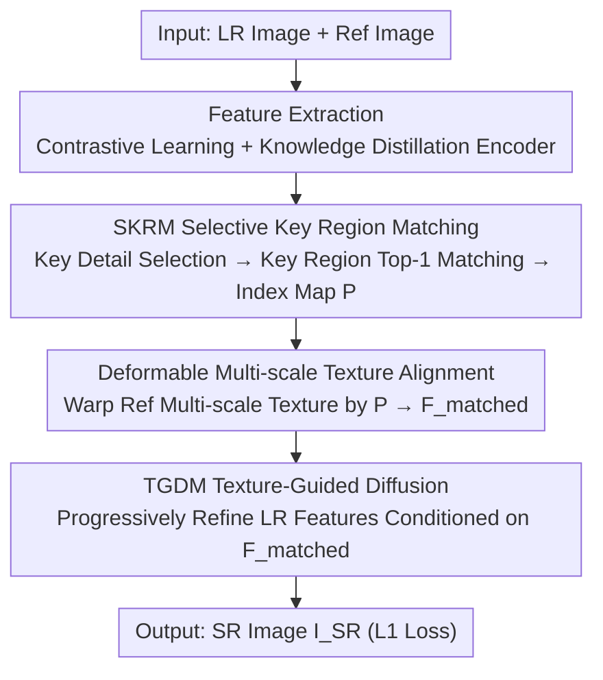

# PlantRSR: A New Plant Dataset and Method for Reference-based Super-Resolution

**Conference**: ICLR 2026  
**OpenReview**: [https://openreview.net/forum?id=puJNiR7JhP](https://openreview.net/forum?id=puJNiR7JhP)  
**Code**: https://github.com/edbca/PlantRSR  
**Area**: Image Super-Resolution / Reference-based Super-Resolution / Diffusion Models  
**Keywords**: Reference Super-Resolution, Plant Images, Selective Matching, Texture-Guided Diffusion, Dataset

## TL;DR
This paper constructs PlantRSR, the first reference-based super-resolution (RefSR) dataset for plant scenes (containing 16,585 pairs of manually aligned HR–Ref training patches). It proposes a method specifically designed for irregular plant textures: Selective Key Region Matching (SKRM) performs matching only in texture-rich areas to significantly reduce computational costs, and the Texture-Guided Diffusion Module (TGDM) progressively refines LR features conditioned on matched reference textures. The method achieves state-of-the-art performance across PlantRSR and multiple public benchmarks with only 11.1M parameters.

## Background & Motivation

**Background**: Single Image Super-Resolution (SISR) faces challenges in recovering high-frequency details from severely degraded LR images because the degradation erases original information, forcing the network to "hallucinate." Reference-based Super-Resolution (RefSR) adopts a different approach: it utilizes an additional high-quality reference image (Ref) to "transfer" real textures to the LR image, bypassing the bottleneck of detail synthesis. Recent mainstream RefSR methods employ feature alignment, attention, or implicit correspondence learning to fuse Ref textures (e.g., SRNTT, TTSR, C2-Matching, DATSR).

**Limitations of Prior Work**: Existing RefSR datasets (CUFED5 focused on daily activities, LMR focused on architectural landmarks) cover scenes with **rigid structures and limited geometric variations**, lacking fine-grained natural plant scenes. Plant images present unique difficulties—significant morphological deformation, subtle and varied textures (leaf veins, fuzz, petals), and backgrounds often blurred due to shallow depth of field. Even though DRefSR includes some plant images based on CUFED5, the quantity and species diversity are insufficient, leading to poor generalization of existing methods in plant scenes.

**Key Challenge**: On one hand, RefSR training requires "semantically aligned" patch pairs between HR and Ref. However, random or keypoint-based automatic cropping in plant images often captures blurred backgrounds or semantically mismatched regions. Combined with large variations in color, scale, and deformation, **establishing reliable automatic correspondences is nearly impossible**. On the other hand, key plant textures occupy only a small portion of the image; exhaustive matching across the full image is computationally wasteful and prone to background noise interference.

**Goal**: (1) Create a large-scale and diverse RefSR dataset specifically for plants; (2) Design a RefSR method capable of efficiently locating key textures and accurately reconstructing irregular fine textures.

**Key Insight**: The authors observe the "texture-rich foreground, blurred background" characteristic of plant images. Since blurred backgrounds are easy to reconstruct and do not require precise matching, matching should **occur only in key texture regions**. Furthermore, diffusion models excel at reconstructing irregular fine textures, making it ideal to use matched Ref textures as conditions to drive diffusion refinement.

**Core Idea**: Replace "exhaustive full-image matching + one-time feature fusion" with "Selective Key Region Matching + Texture-Guided Diffusion Refinement," supported by a large-scale, manually aligned plant dataset.

## Method

### Overall Architecture
Given a low-resolution image $I_{LR}$ and a reference image $I_{Ref}$, the goal is to generate a texture-rich super-resolved image $I_{SR}$. The pipeline consists of three steps: first, a feature extractor trained via contrastive learning and knowledge distillation (following C2-Matching) encodes the Ref and the upsampled LR to obtain $\psi_{Ref}(I_{Ref})$ and $\psi_{LR}(I_{LR\uparrow})$. Next, SKRM performs matching only between the key texture regions of both, outputting a correspondence index map $P$. Multi-scale Ref texture features $F^{Ref}_l$ (scales $l=1,2,4$) are then warped and aligned into $F^{Ref}_{matched}$ using deformable convolutions guided by $P$. Finally, TGDM treats $F^{Ref}_{matched}$ as a condition for a diffusion process to progressively enhance LR features and complete multi-scale fusion to generate $I_{SR}$. Training utilizes $L_1$ loss.

### Key Designs

**1. SKRM Selective Key Region Matching: Matching only in texture-rich areas to save computation and resist background interference.**

To address the inefficiency of exhaustive matching on plant images with blurred backgrounds, SKRM uses a **key detail selection metric** to identify regions worth matching. Given a feature map $F\in\mathbb{R}^{H\times W\times C}$, the selection metric is defined by whether the absolute difference between the original feature and its "bilinear downsampled then upsampled" reconstruction exceeds a threshold:

$$M_F = S(F) = \mathbb{I}\!\left(\sum_C |F - F_{\downarrow s\uparrow s}| > \tau\right),$$

where the sampling rate $s=2$, and the threshold $\tau$ is the mean absolute difference plus one standard deviation. $\mathbb{I}(\cdot)$ returns 1 when the threshold is exceeded. The intuition is that regions preserved after down-and-up sampling are smooth/low-frequency, while large differences indicate high-frequency textures—the key regions for matching. This step produces masks $M_{LR}$ and $M_{Ref}$, which are multiplied back to obtain key texture features $F^{key}_{LR}$ and $F^{key}_{Ref}$. These are collapsed into patch descriptors $d_{LR}=[q_1,...,q_n]$ and $d_{Ref}=[k_1,...,k_m]$. For each LR patch, the corresponding Ref patch is established via the highest normalized cosine similarity: $P_i = \mathrm{Top1}\!\big(\frac{q_i}{\|q_i\|}\cdot\frac{k_j}{\|k_j\|}\big)$. Restricting matching to key regions reduces computation by over 150x compared to exhaustive search (SKRM uses 77.86 GFLOPs vs. 11990 GFLOPs) and improves accuracy by excluding blurred backgrounds.

**2. Deformable Multi-scale Texture Alignment: Precisely transferring matched Ref textures across multiple scales.**

Following correspondence indexing, Ref textures must be aligned with LR geometry. Due to significant color, scale, and deformation variations in plants, simple position-based copying causes misalignment. This work follows the multi-scale RefSR approach, extracting Ref texture features $F^{Ref}_l$ at scales $l=1,2,4$ using a VGG encoder $\Phi_{Ref}$, then warping them based on indices:

$$F^{Ref}_{matched,l} = \mathrm{DConv}(F^{Ref}_l, P_i) = \sum w\,F^{Ref}_l(P + P_0 + P_i + \Delta p)\,\Delta m,$$

where $P_0$ is a fixed $3\times3$ offset, and $\Delta p, \Delta m$ are learnable sampling offsets and modulation scalars. Deformable convolution adaptively samples neighborhoods to absorb local misalignments caused by plant deformations, ensuring Ref textures are accurately aligned for subsequent fusion.

**3. TGDM Texture-Guided Diffusion Module: Progressively refining irregular textures using diffusion conditioned on matched textures.**

Standard RefSR uses one-time feature aggregation, which has limited capacity for modeling irregular and fragmented plant textures. TGDM adopts **diffusion refinement conditioned on matched textures**. LR features $F^{LR}_l$ serve as the diffusion starting point $Z_T$. In each reverse denoising step, the denoising network $DN$ predicts noise $\hat\epsilon_\theta(Z_t, t, F^{Ref}_{matched,l})$ conditioned on matched textures, following the standard DDPM posterior sampling:

$$\hat Z_0 = \tfrac{1}{\sqrt{\bar\alpha_t}}\Big(Z_t - \sqrt{1-\bar\alpha_t}\cdot\hat\epsilon_\theta(Z_t, t, F^{Ref}_{matched,l})\Big).$$

Iterating from $t=T$ to $t=1$ yields the latent $Z_0$ refined by Ref textures. To further enhance texture, $Z_0$ passes through a Residual State Space Block $\bar Z_0 = \mathrm{RSSB}(Z_0)$, is combined with the original LR feature residual, and upsampled via sub-pixel convolution: $F^{LR}_{2l} = \mathrm{upsample}(F^{LR}_l + \bar Z_0)$. Finally, $F^{SR} = F^{LR}_4 + \bar Z_0$ generates the SR representation. Using diffusion as a "step-by-step texture injector" better captures irregular details than one-time fusion. The diffusion steps $T$ are compressed to only 4 to avoid high inference costs.

### Loss & Training
The training objective is the $L_1$ reconstruction loss. Diffusion steps $T=4$; ADAM optimizer ($\beta_1=0.9, \beta_2=0.999$), initial learning rate $10^{-4}$ with a 0.5 decay every 100k iterations, for 400 epochs. Patches of $160\times160$ are used, where LR is 4× bicubic downsampled from HR. Training is performed on a single NVIDIA RTX A6000.

## Key Experimental Results

### Main Results
Comparing various SOTA RefSR methods on the PlantRSR test set (each method trained independently on CUFED5, DRefSR, and PlantRSR). The proposed method achieves the best performance across all four metrics under every training set configuration, with only 11.1M parameters—substantially smaller than RRSR (21.5M) and MRefSR (23.7M). Table below shows comparisons on the PlantRSR training set:

| Method | Parameters | PSNR↑ | M-PSNR↑ | SSIM↑ | LPIPS↓ | DISTS↓ |
| :--- | :--- | :--- | :--- | :--- | :--- | :--- |
| C2-Matching | 8.9M | 38.43 | 31.20 | 0.9523 | 0.1300 | 0.0851 |
| DATSR | 18.0M | 38.48 | 31.26 | 0.9527 | 0.1304 | 0.0835 |
| SSMTF | 13.9M | 38.49 | 31.25 | 0.9528 | 0.1297 | 0.0831 |
| **Ours** | **11.1M** | **38.62** | **31.53** | **0.9538** | **0.1288** | **0.0826** |

A notable observation: every method shows consistent performance gains when trained on PlantRSR compared to CUFED5/DRefSR. Furthermore, the gain in M-PSNR (calculated only on texture regions) is significantly higher than standard PSNR, validating the dataset's targeted value for complex textures.

### Ablation Study

| Ablation Target | Configuration | Key Metrics | Note |
| :--- | :--- | :--- | :--- |
| Matching Module | MEM | 620.72 GFLOPs, 38.36 | High computation, low precision |
| Matching Module | CFE-PatchMatch | 124.73 GFLOPs, 38.58 | Compromise |
| Matching Module | Full Exhaustive | 11990.39 GFLOPs, 38.62 | High precision but compute explosion |
| Matching Module | **SKRM** | **77.86 GFLOPs, 38.62** | Same precision, lowest compute |
| Fusion Module | DA | 38.43 / 0.9513 / 31.18 | Dynamic Aggregation |
| Fusion Module | RFA | 38.48 / 0.9521 / 31.25 | Residual Feature Aggregation |
| Fusion Module | TGDM (w/o Diff) | 38.52 / 0.9531 / 31.33 | Removing diffusion drops 0.10 PSNR |
| Fusion Module | **TGDM** | **38.62 / 0.9538 / 31.53** | Full module is optimal |

### Key Findings
- SKRM achieves the same PSNR (38.62) as exhaustive matching (11990 GFLOPs) using only 77.86 GFLOPs, reducing computation by over 150x.
- Removing diffusion from TGDM causes PSNR to drop from 38.62 to 38.52 and M-PSNR to drop from 31.53 to 31.33, indicating diffusion refinement contributes most to texture regions.
- Performance plateaus after $T=4$ diffusion steps, justifying the fixed choice of $T=4$ to balance quality and inference cost.
- Training on PlantRSR yields immediate gains for any method. The proposed method also leads on CUFED5 and WR-SR, demonstrating cross-scenario value.

## Highlights & Insights
- **"What not to match" is also information**: The key detail selection metric identifies smooth areas by checking reconstruction quality after down-upsampling. This explicitly excludes blurred backgrounds from matching, saving computation and improving robustness. This zero-parameter criterion can be migrated to other sparse matching tasks.
- **Diffusion as a "Texture Refiner" rather than "Generator"**: Unlike generative diffusion, TGDM performs lightweight refinement conditioned on real matched Ref textures in only 4 steps. This is a strong example of "lightweight conditional refinement" for low-level vision.
- **Dataset as Methodology**: Utilizing 16,585 manually annotated, semantically aligned plant patches proves that in scenes where automatic correspondence fails, high-quality aligned data provides more consistent gains than architectural tricks.

## Limitations & Future Work
- The dataset relies on **manual annotation** for 16,585 patch pairs, which is costly and difficult to scale to more species.
- Optimization uses only $L_1$ loss; lack of perceptual or adversarial losses might leave room for improvement in visual realism (though LPIPS/DISTS are already leading).
- The threshold $\tau$ for detail selection uses a fixed rule, which might not be optimal for images with extreme blur or density.
- Diffusion steps are fixed at 4; while the saturation trend was shown, adaptive diffusion steps based on texture complexity could be explored.

## Related Work & Insights
- **vs. C2-Matching / DATSR (Alignment & Matching)**: These perform exhaustive full-image matching and use attention/Transformers for fusion. Ours introduces selectivity (SKRM) for efficiency and conditional diffusion (TGDM) for irregular textures.
- **vs. CoSeR / Ref-Diff (Diffusion-based RefSR)**: These often use diffusion to "generate" semantic references. Ours uses diffusion to "transfer" **actually matched Ref textures** in a lightweight refinement process.
- **vs. CUFED5 / LMR / DRefSR (Datasets)**: Former focus on rigid scenes. DRefSR lacks plant diversity. PlantRSR is the first plant-specific RefSR benchmark covering five types of variations (color, scale, rotation, deformation, background) at 2K–8K resolution.

## Rating
- Novelty: ⭐⭐⭐⭐ The combination of selective matching and conditional diffusion refinement is well-suited for plant textures, though individual components are evolutionarily related to existing ideas.
- Experimental Thoroughness: ⭐⭐⭐⭐⭐ Comprehensive cross-dataset comparisons and multi-metric evaluations. Ablations cover computation and sampling steps.
- Writing Quality: ⭐⭐⭐⭐ Clear motivation, complete formulas, and well-defined modules.
- Value: ⭐⭐⭐⭐ The first plant RefSR benchmark plus an efficient method provides practical value for plant phenotyping and precision agriculture.

<!-- RELATED:START -->

## Related Papers

- [\[ICLR 2026\] Energy-oriented Diffusion Bridge for Image Restoration with Foundational Diffusion Models](energy-oriented_diffusion_bridge_for_image_restoration_with_foundational_diffusi.md)
- [\[ICLR 2026\] Trust but Verify: Adaptive Conditioning for Reference-Based Diffusion Super-Resolution](trust_but_verify_adaptive_conditioning_for_reference-based_diffusion_super-resol.md)
- [\[ICLR 2026\] Taming Score-Based Denoisers in ADMM: A Convergent Plug-and-Play Framework](taming_score-based_denoisers_in_admm_a_convergent_plug-and-play_framework.md)
- [\[ICLR 2026\] Sharpness-Aware Machine Unlearning](sharpness-aware_machine_unlearning.md)
- [\[ICLR 2026\] FideDiff: Efficient Diffusion Model for High-Fidelity Image Motion Deblurring](fidediff_efficient_diffusion_model_for_high-fidelity_image_motion_deblurring.md)

<!-- RELATED:END -->
