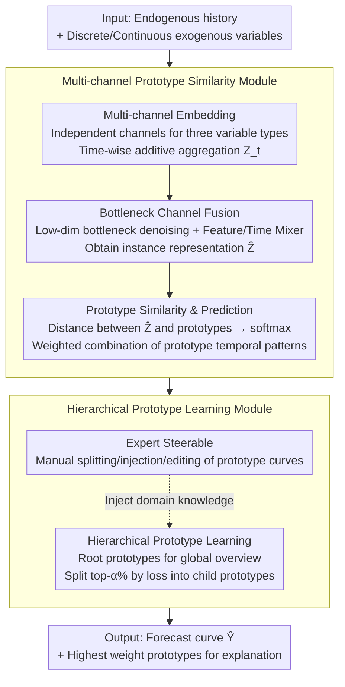

# ProtoTS: Learning Hierarchical Prototypes for Explainable Time Series Forecasting

**Conference**: ICLR 2026  
**arXiv**: [2509.23159](https://arxiv.org/abs/2509.23159)  
**Code**: [Available](https://github.com/SKURA502/ProtoTS)  
**Area**: Image Restoration  
**Keywords**: Explainable forecasting, hierarchical prototypes, exogenous variables, multi-channel embedding, expert-steerable

## TL;DR

This paper proposes ProtoTS, which achieves explainable time series forecasting through hierarchical prototype learning: a few coarse-grained prototypes provide a global pattern overview, while successive levels of sub-prototypes capture local variations. It combines multi-channel embedding with bottleneck fusion to handle heterogeneous exogenous variables. On the LOF dataset, it reduces MSE by 48.3% and MAE by 20.9%, while supporting expert editing of prototypes to further enhance performance.

## Background & Motivation

Time series forecasting is widely applied in high-stakes scenarios such as power scheduling, energy management, and weather forecasting. In these domains, accurate predictions alone are insufficient—understanding the reasoning behind a forecast is crucial to preventing significant financial loss and established trust.

Existing explainable methods suffer from two core limitations:

- **C1 (Output side)**: Methods like TFT and DiPE-Linear only explain individual time-step predictions and cannot explain overall trend patterns (e.g., "why the power load curve shows three decreasing peaks at noon, afternoon, and evening"). Power scheduling experts require an understanding of the overall pattern to decide on external power purchases.
- **C2 (Input side)**: Current explanations only focus on a subset of input variables (e.g., CycleNet only focuses on endogenous variables). However, forecast results are determined by the interaction of diverse heterogeneous variables (e.g., high temperature + summer → AC peak), necessitating an understanding of their joint impact.

**Key Insight**: Each prototype corresponds to a typical temporal pattern (e.g., "Spring Festival mode", "summer weekday mode"), and forecasts are formed through similarity matching between instances and prototypes. A small number of prototypes provide a global overview, while the hierarchical structure supports gradual deep-dives and expert intervention.

## Method

### Overall Architecture

ProtoTS encodes each instance into an embedding vector and calculates its similarity to a set of learnable "prototypes." The final prediction is a weighted combination of the temporal patterns carried by these prototypes. The architecture consists of two integrated modules: the Multi-channel Prototype Similarity Module processes heterogeneous input variables and calculates instance-prototype similarities, while the Hierarchical Prototype Learning Module organizes prototypes in a tree structure from coarse to fine. This allows root prototypes to summarize global patterns and child prototypes to characterize local details. The overall data flow involves multi-channel embedding of heterogeneous inputs followed by bottleneck denoising to produce a clean instance representation $\hat{\mathbf{Z}}$. This representation is compared with the prototype library for weighted prediction, while the library itself is organized hierarchically and allows expert editing at a semantic level.

### Key Designs

**1. Multi-channel Embedding: Independent encoding channels for heterogeneous variables**

Forecast results are often jointly determined by variables of entirely different natures—endogenous history, discrete exogenous variables (e.g., day of week, holiday markers), and continuous exogenous variables (e.g., temperature). Feeding them indiscriminately into the same encoder causes semantic interference between discrete/continuous and endogenous/exogenous data. ProtoTS establishes independent channels for these three categories: endogenous values are processed via an MLP with activation functions to yield $\gamma(\mathbf{y}_t)$; each discrete exogenous variable utilizes its own embedding table $\mathbf{E}_j(\mathbf{x}_{t,j}^{\text{dis}})$; and each continuous exogenous variable passes through a variable-specific non-linear projection $\psi_j(\mathbf{x}_{t,j}^{\text{con}})$. The complete embedding at time $t$ is aggregated additively: $\mathbf{Z}_t = \gamma(\mathbf{y}_t) + \sum_{j=1}^{C_{\text{dis}}} \mathbf{E}_j(\mathbf{x}_{t,j}^{\text{dis}}) + \sum_{j=1}^{C_{\text{con}}} \psi_j(\mathbf{x}_{t,j}^{\text{con}})$. Notably, since true endogenous values $\mathbf{y}_t$ are unavailable within the prediction window, that segment relies solely on exogenous variables, making their modeling quality critical for forecast accuracy.

**2. Bottleneck Channel Fusion: Denoising aggregated features before interaction**

While additive aggregation in multi-channel embedding is concise, it also incorporates noise from irrelevant variables. Direct feature/time interaction in high-dimensional space can amplify this noise. ProtoTS inserts a bottleneck layer $\mathbb{R}^d \to \mathbb{R}^{d_{\text{bottle}}} \to \mathbb{R}^d$ ($d_{\text{bottle}} \ll d$) within the MLP-Mixer architecture. This forces the model to retain only dominant information before restoring dimensions for fusion across feature and time axes: $\mathbf{Z}_{1:L+H}^{(l+1)} = \text{MLP}_{\text{time}}(\text{MLP}_{\text{feature}}(\mathbf{Z}_{1:L+H}^{(l)})^T)^T$. After multiple layers, a linear transformation aggregates the time dimension into a single instance representation $\hat{\mathbf{Z}} = \mathbf{Z}_{1:L+H}^T \mathbf{W} \in \mathbb{R}^d$ for prototype comparison. Ablation studies show that removing the bottleneck causes the average MAE to rise from 0.106 to 0.143, identifying it as the most critical component and validating the necessity of this denoising step.

**3. Prototype Similarity and Prediction: Forecasts as "weighted sums of typical patterns"**

Each prototype consists of two parts: an embedding $\boldsymbol{\mu} \in \mathbb{R}^d$ used for distance comparison with instances, and a temporal pattern $\mathbf{p} \in \mathbb{R}^T$ representing the full forecast curve for that pattern; both are learnable parameters. The Euclidean distance between instance representation $\hat{\mathbf{Z}}$ and each prototype embedding is calculated and normalized via softmax to obtain similarity $f(\hat{\mathbf{Z}}|\boldsymbol{\mu}_c) = \frac{\exp(-d(\hat{\mathbf{Z}}, \boldsymbol{\mu}_c))}{\sum_{i=1}^N \exp(-d(\hat{\mathbf{Z}}, \boldsymbol{\mu}_i))}$. The final forecast is a weighted combination of prototype patterns by similarity: $\hat{\mathbf{Y}} = \sum_{i=1}^N f(\hat{\mathbf{Z}}|\boldsymbol{\mu}_i) \cdot \mathbf{p}_i$. The interpretability is inherent: identifying which prototype has the highest weight and observing its $\mathbf{p}$ reveals which typical pattern the model has assigned to the current instance. Decoding prototypes as entire sequences (rather than single class labels) distinguishes this approach from traditional prototype classification networks.

**4. Hierarchical Prototype Learning: Coarse prototypes for overview, refinement for local details**

A small number of prototypes can summarize the global view but lack local detail, while a large number of prototypes can lead to fragmented explanations. ProtoTS balances this using a tree structure: the root level uses a small set of prototypes (e.g., 6) to capture coarse-grained patterns like seasonality or holidays until convergence. Subsequently, leaf prototypes are ranked by the average MAE loss of their associated instances. The top $\alpha$% of prototypes with high loss—indicating that a single temporal pattern is insufficient for its cluster—are split into $M$ child prototypes for refinement. With the hierarchical structure, prediction becomes a nested weighted similarity: $\hat{\mathbf{Y}} = \sum_{i=1}^N f(\hat{\mathbf{Z}}|\boldsymbol{\mu}_i) \sum_{j=1}^M f(\hat{\mathbf{Z}}|\boldsymbol{\mu}_{i,j}) \cdot \mathbf{p}_{i,j}$. This maintains a global perspective ("understand the big picture by looking at 6 root prototypes") while allowing the user to drill down into specific local patterns.

**5. Expert Steerable: Direct editing of prototypes over black-box fine-tuning**

Because each prototype corresponds to a readable temporal pattern, experts can perform semantic-level interventions without modifying underlying weights: selectively splitting a prototype (e.g., splitting a "Spring Festival" prototype into "Pre-festival" and "During-festival"), injecting a new prototype into the root level, or directly editing a prototype's temporal curve. In experiments, manually splitting the "Spring Festival" prototype reduced MSE by 0.009 during that period, demonstrating that such human-in-the-loop editing can low-costly incorporate domain knowledge into the model.

### Loss & Training

The training objective is an L1 prediction loss combined with a similarity entropy regularization term: $\mathcal{L} = \|\hat{\mathbf{Y}} - \mathbf{Y}\|_1 - \lambda \sum_{i=1}^N f(\hat{\mathbf{Z}}|\boldsymbol{\mu}_i) \log(f(\hat{\mathbf{Z}}|\boldsymbol{\mu}_i))$. The entropy term encourages instance similarities to concentrate on a few prototypes, ensuring cleaner "one instance ≈ one typical pattern" explanations. The training follows a staged strategy: training the root level to convergence, splitting into child levels based on loss, and then refining, consistent with the "coarse-to-fine" structure.

## Key Experimental Results

### Main Results

**LOF Dataset** (Electric load forecasting, 22 exogenous variables, 4 regions):

| Model | RE | YC | EA | PC | Avg MAE | vs ProtoTS |
|------|-----|-----|-----|-----|---------|-----------|
| **Ours** | **0.198** | **0.055** | **0.059** | **0.112** | **0.106** | - |
| TiDE | 0.253 | 0.057 | 0.061 | 0.164 | 0.134 | +21% |
| iTransformer | 0.279 | 0.080 | 0.097 | 0.139 | 0.149 | +29% |
| TimeXer | 0.272 | 0.079 | 0.096 | 0.182 | 0.157 | +32% |
| XGBoost | 0.405 | 0.084 | 0.092 | 0.230 | 0.203 | +48% |

**EPF Dataset** (Electricity price forecasting, 5 markets):

| Model | NP | PJM | BE | FR | DE | Avg MAE |
|------|-----|-----|-----|-----|-----|---------|
| **Ours** | **0.213** | **0.152** | **0.226** | **0.183** | **0.318** | **0.218** |
| TimeXer | 0.240 | 0.173 | 0.241 | 0.192 | 0.343 | 0.238 |

ProtoTS reduced MSE by 48.3% and MAE by 20.9% on LOF; on EPF, both MSE and MAE were reduced by 8%.

### Ablation Study

| Component | PC MSE | YC MSE | RE MSE | EA MSE | Avg MAE |
|------|--------|--------|--------|--------|---------|
| w/o bottleneck | 0.044 | 0.013 | 0.089 | 0.129 | 0.143 |
| w/o multi-channel | 0.034 | 0.006 | 0.108 | 0.007 | 0.117 |
| w/o hierarchy | 0.026 | 0.006 | 0.089 | 0.007 | 0.110 |
| **Ours (Full)** | **0.025** | **0.006** | **0.085** | **0.007** | **0.106** |

### Key Findings

- **Data Efficiency**: When training data is reduced from 100% to 50%, ProtoTS performance degrades minimally, whereas TimeXer and iTransformer show significant deterioration.
- **Root Prototype Quantity**: Performance saturates at 12-15 prototypes, suggesting typical patterns are finite in number.
- **Quantitative Interpretability Evaluation**: In a study with 24 users, ProtoTS achieved a User Precision of 77% (vs. 64% for TFT and 62% for NBEATSx) and a significantly higher SUS score of 73.36.
- **Expert Editing Case Study**: Manually splitting the "Spring Festival" prototype into "Pre-festival" and "During-festival" reduced MSE by 0.009 during the holiday.

## Highlights & Insights

1. **Prototypes as Temporal Patterns**: For the first time, prototypes are decoded into output sequences (e.g., a 96-step forecast curve) rather than single class labels.
2. **Global + Local Dual-level Explanation**: Coarse-grained prototypes provide global understanding, while fine-grained ones provide local detail.
3. **Expert-in-the-Loop**: Interpretability goes beyond "visualization," allowing experts to actively edit prototypes to optimize the model.
4. **Handling Heterogeneous Exogenous Variables**: Multi-channel embedding combined with bottleneck denoising prevents noise variables from interfering with forecasts.

## Limitations & Future Work

- Currently, "naming" prototypes (e.g., "Spring Festival mode") requires manual summarization; integrating LLMs for automated semantic labeling is a potential solution.
- Hierarchical depth and splitting strategies rely on heuristic rules (top $\alpha$% loss); adaptive schemes warrant exploration.
- Validation is limited to power load and price datasets; applicability to other high-stakes scenarios (healthcare, finance) needs verification.
- Integrating with Foundation Models (e.g., using ProtoTS prototypes to explain large model forecasts) is a compelling direction.

## Related Work & Insights

- **Prototype Network Family**: Extending from classification to regression sequence output represents a significant advancement for prototype-based methods.
- **CycleNet**: While it identifies periodic patterns in endogenous variables, ProtoTS simultaneously models interactions with exogenous variables.
- **TFT Attention-based Explanation**: While providing step-wise local explanations, ProtoTS prototypes offer a more intuitive global perspective.
- **Insight**: In time series forecasting, "interpretability" is not just an additive feature; prototype learning can simultaneously improve accuracy.

## Rating

- Novelty: ⭐⭐⭐⭐⭐ (Hierarchical prototypes → sequence output, expert-steerable design; pioneering work)
- Experimental Thoroughness: ⭐⭐⭐⭐ (LOF + EPF datasets, comprehensive ablation, valuable user study)
- Writing Quality: ⭐⭐⭐⭐⭐ (Detailed power scenario cases, highly convincing hierarchy visualizations)
- Value: ⭐⭐⭐⭐⭐ (Balances accuracy and interpretability; expert-steerable design addresses core industrial needs)

<!-- RELATED:START -->

## Related Papers

- [\[ICML 2025\] TimeDART: A Diffusion Autoregressive Transformer for Self-Supervised Time Series Representation](../../ICML2025/image_restoration/timedart_a_diffusion_autoregressive_transformer_for_self-supervised_time_series_.md)
- [\[ICLR 2026\] Test-Time Domain Generalization for Image Super-Resolution](test-time_domain_generalization_for_image_super-resolution.md)
- [\[NeurIPS 2025\] Luminance-Aware Statistical Quantization: Unsupervised Hierarchical Learning for Illumination Enhancement](../../NeurIPS2025/image_restoration/luminance-aware_statistical_quantization_unsupervised_hierarchical_learning_for_.md)
- [\[CVPR 2026\] Time Without Time: Pseudo-Temporal Representation for Space-Time Super-Resolution](../../CVPR2026/image_restoration/time_without_time_pseudo-temporal_representation_for_space-time_super-resolution.md)
- [\[ICLR 2026\] Mechanism of Task-oriented Information Removal in In-context Learning](mechanism_of_task-oriented_information_removal_in_in-context_learning.md)

<!-- RELATED:END -->
