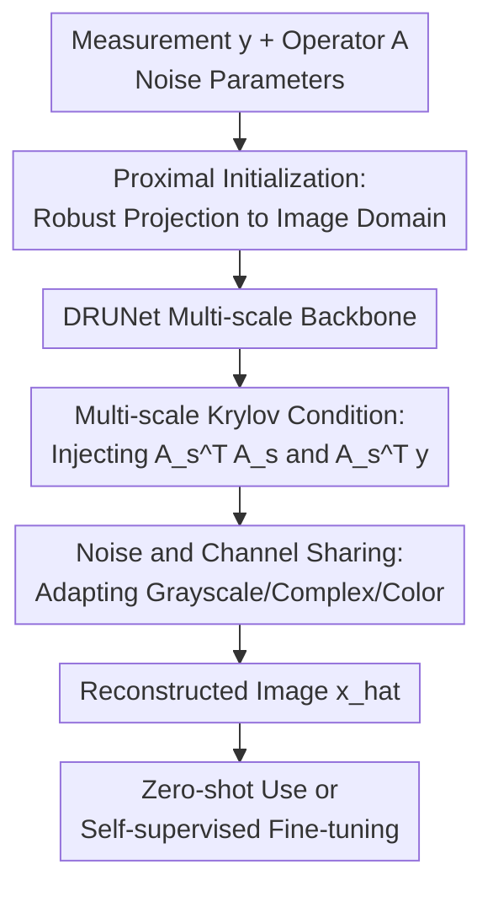

# Reconstruct Anything Model: A Lightweight General Model for Computational Imaging

**Conference**: ICLR 2026  
**OpenReview**: [https://openreview.net/forum?id=Ks9zNS6OsU](https://openreview.net/forum?id=Ks9zNS6OsU)  
**Code**: https://github.com/matthieutrs/ram  
**Area**: Image Restoration / Computational Imaging  
**Keywords**: Computational Imaging, Inverse Problem Reconstruction, Krylov Subspace, Self-Supervised Fine-Tuning, Multi-Task Reconstruction  

## TL;DR
This paper proposes the Reconstruct Anything Model (RAM), which utilizes a lightweight 36M-parameter non-iterative DRUNet-based reconstruction network to directly inject imaging operators, measurements, and noise parameters into feature layers. It achieves strong zero-shot reconstruction across tasks like deblurring, MRI, CT, super-resolution, inpainting, and low-photon imaging, while supporting self-supervised fine-tuning using only few measurements without ground truth.

## Background & Motivation

**Background**: Many tasks in computational imaging can be formulated as the same inverse problem: the observation $y$ is obtained from an unknown image $x$ via a known imaging operator $A$ and a noise model $p(y|Ax)$. MRI k-space sampling, CT Radon projections, deblurring kernels, inpainting masks, and super-resolution downsampling all essentially ask the same question: how to recover a clean image from incomplete, noisy, or compressed measurements.

**Limitations of Prior Work**: Mainstream learning methods generally fall into two categories. The first is iterative methods like Plug-and-Play (PnP) or diffusion models, which insert pre-trained denoisers into optimization algorithms. They generalize to many tasks but are slow, computationally expensive, and may produce blurry results due to mismatches between priors and measurements. The second is unrolled networks, which unfold several optimization steps into a learnable network to explicitly use $A$ and $y$. However, these are typically tied to specific tasks, channel counts, and measurement forms, requiring retraining for multi-coil MRI, Poisson CT, or different image distributions.

**Key Challenge**: General image restoration models aim for a single backbone to solve multiple degradations but often assume both input and output are in the image domain. Scientific and medical imaging, however, must respect real physical measurements, where observations might be in the frequency domain, projection domain, or compressed measurements. That is, a model needs to be as light and fast as a general UNet while "knowing" the current $A$, $y$, and noise conditions like an unrolled method.

**Goal**: The authors aim to train a single, lightweight, non-iterative foundational model for computational imaging that covers grayscale, color, and complex-valued images across various Gaussian / Poisson-Gaussian noise levels. It should be usable zero-shot within the training distribution and support self-supervised fine-tuning with a few or even a single measurement image outside the distribution, avoiding the need to redesign unrolled architectures for every inverse problem.

**Key Insight**: The paper observes that the true value of unrolled methods lies not in "must unfold K optimization steps," but in the introduction of physics-related operations like $A^\top y$ and $A^\top A$ into the network. RAM therefore stops unfolding the complete optimization algorithm and instead inserts Krylov subspace modules into the multi-scale features of a DRUNet, allowing a standard convolutional backbone to "see" the imaging physics directly.

**Core Idea**: By using "proximal initialization + multi-scale Krylov physical condition injection + noise and channel sharing," a standard low-level vision backbone is transformed into a lightweight general-purpose reconstructor capable of handling various computational imaging inverse problems.

## Method

### Overall Architecture

The input to RAM consists of measurements $y$, a known imaging operator $A$, and noise parameters $(\sigma, \gamma)$, with the output being the reconstructed image $\hat{x}$. It first uses a proximal estimate to project the measurements back into a reasonable initial image-domain value, then follows a DRUNet encoder-decoder backbone. Crucially, features at each scale are decoded into the image domain, processed by a Krylov subspace module based on $A_s^\top A_s$ and $A_s^\top y$, and luego encoded back into the feature domain. In this way, the network does not blindly map degraded images to clean ones but understands the "physical constraints of the current inverse problem" at every scale.

From a computational graph perspective, RAM remains a non-iterative model with a single forward pass, requiring neither the 8 HQS steps of DPIR nor the multiple sampling steps of diffusion-based inverse methods. Its "generality" stems from two design layers: training on mixed tasks and datasets to learn shared image priors, and using $A, y$, noise parameters, and channel heads at inference time to inform the model about the specific measurement process.

### Key Designs

**1. Proximal Initialization: Balancing $A^\top y$ and pseudo-inverse for a noise-robust start**

The first step in a computational imaging network is critical: directly using $A^\dagger y$ provides an inverted image where noise can severely amplify unstable directions, while using $A^\top y$ is stable but often very blurry. RAM uses a proximal estimate as a compromise:

$$
\operatorname{prox}_{\lambda f}(A^\top y)=\arg\min_u \lambda\|Au-y\|^2+\|u-A^\top y\|^2.
$$

Here, $f$ is the data consistency term, and $\lambda$ is related to the input SNR, set as $\lambda=\sigma\eta/\|y\|_1$ where $\eta$ is learnable. Intuitively, lower noise allows the model to trust measurements more and lean toward the pseudo-inverse; higher noise makes it more conservative, staying near the stable $A^\top y$. This initialization provides the DRUNet backbone with a starting point that is in the image domain without being destroyed by pseudo-inverse noise.

**2. Multi-scale Krylov Condition: Turning unrolled physics into feature-layer conditions**

Unrolled networks typically inject data consistency through gradient steps $x_{\ell+1}=x_\ell-\gamma A^\top(Ax_\ell-y)$ or proximal steps. The paper views these updates as linear combinations within a Krylov subspace:

$$
x_{\ell+1}=\sum_{k=0}^{K}\alpha_k(A^\top A)^k x_\ell+\beta_k(A^\top A)^k A^\top y.
$$

Instead of actual optimization unfolding, RAM decodes intermediate features into the image domain at each scale, stacks $\{(A_s^\top A_s)^k x_\ell,(A_s^\top A_s)^kA_s^\top y\}$, and uses $3\times3$ convolutions to learn combination coefficients before encoding back to features. This module allows the convolutional backbone, which normally recovers textures locally, to see "what would happen if we re-project based on the current measurement physics." This preserves the useful inductive bias of unrolled methods without the cost of multiple network calls or task-specific architectures.

The multi-scale version further mitigates ill-posedness. For a fixed number of measurements $m$, a finer image grid (larger $n$) increases the null space of $A$; inverse problems are more stable at coarser scales. RAM defines $A_s=A U_s$, where $U_s$ is an anti-aliasing upsampling operator, and normalizes $\|A_s\|_2=1$ at each scale. For problems like blur and inpainting, $A_s^\top A_s$ can be calculated directly on coarse grids using downsampled kernels or masks, avoiding expensive fine-scale physics operations.

**3. Noise and Channel Sharing: Reusing the same backbone across modalities**

Computational imaging tasks vary not only in degradation but also in data format: natural images are 3-channel RGB, CT is usually grayscale, and MRI may be 2-channel complex. Standard end-to-end networks often require retraining for different channel counts. RAM only makes the input/output convolution layers and the encoder/decoder blocks in the KSM channel-dependent, while sharing the rest of the backbone weights, allowing the model to reuse priors across 1, 2, and 3 channels.

Noise conditions are also explicitly input. While DRUNet originaly concatenates the Gaussian noise level as a constant feature map, RAM expands this to two noise maps corresponding to the Poisson-Gaussian model:

$$
y=\gamma z+\sigma n,\quad z\sim\mathcal{P}(x/\gamma),\quad n\sim\mathcal{N}(0,I).
$$

Additionally, the authors removed network biases to make the model closer to equivariant regarding scale changes in $\sigma$ and $\gamma$. This architectural detail is crucial for generalizing across noise levels: the model perceives measurement reliability through condition maps rather than memorizing noise intensities as separate tasks.

**4. Self-Supervised Fine-Tuning: Adapting to new tasks via measurement consistency**

The RAM base model is pre-trained with supervised multi-task data, but real-world scientific imaging often lacks ground truth. The paper treats RAM as a differentiable reconstructor, fine-tuning it with a measurement-only loss:

$$
L(\theta)=\sum_{i=1}^{N}L_{MC}(\theta,y_i)+\omega L_{NULL}(\theta,y_i).
$$

$L_{MC}$ ensures measurement consistency (making the reconstruction match observations when passed through $A$), using SURE, UNSURE, or splitting losses based on noise knowledge. $L_{NULL}$ handles null-space information of non-invertible operators by utilizing multiple forward operators or equivariance to transform groups. This allows RAM to improve significantly on out-of-distribution tasks like Cryo-EM, low-photon LinoSPAD, compressed sensing, and demosaicing using only 1 to 10 measurement images without ground truth.

### A Complete Example

Take accelerated MRI as an example: observations are masked Fourier measurements $y=\operatorname{diag}(m)Fx+\sigma n$. Traditional restoration networks looking only at zero-filled results struggle to distinguish real observations from network "guesses." Unrolled MRI networks can use the mask and Fourier operator but are tied to a specific MRI setup.

The RAM process: First, the proximal module produces a stable initial image from $A^\top y$. Inside DRUNet, $A_s=A U_s$ is constructed at various scales, allowing the KSM to use $(A_s^\top A_s)^k$ to check if the current feature-domain image satisfies k-space constraints. The network then combines noise maps to judge how much to trust the observations versus image priors. For CT, $A$ becomes the Radon transform; for inpainting, $A$ becomes a mask. While channel heads change for complex-valued MRI, the core backbone remains shared. Thus, a single RAM forward pass serves different imaging physics without separate training.

### Loss & Training

In the supervised stage, each task $g$ is represented by a dataset $D_g=\{x_{i,g}\}$, an operator $A_g$, and a Poisson-Gaussian noise distribution. The model minimizes a task-weighted $\ell_1$ reconstruction loss:

$$
L_g(\theta,x_{i,g})=\mathbb{E}_{(\sigma_g,\gamma_g)}\mathbb{E}_{y|x_{i,g}}\omega_g\|R_\theta(y,A_g,\sigma_g,\gamma_g)-x_{i,g}\|_1.
$$

$\ell_1$ is chosen over $\ell_2$ for better test quality in low-level vision. The weights $\omega_g=\|A_g^\top y\|_2/\sigma_g$ balance different noise levels and task difficulties.

Training data includes LSDIR (natural images), LIDC-IDRI (CT), and fastMRI (brain). Models are initialized with a pre-trained DRUNet denoiser, using a batch size of 16 per inverse problem, trained for 200k steps with an Adam learning rate of $10^{-4}$ (decaying by 10x after 180k steps).

## Key Experimental Results

### Main Results

Experimental coverage includes both in-distribution and out-of-distribution tasks. RAM generally outperforms or matches unrolled baselines in MRI, CT, and various non-image domain measurements, while showing significantly lower parameters and FLOPs compared to untied unrolled networks.

| Task | Metric | RAM | Prev. SOTA | Gain / Conclusion |
|--------|------|------|----------|------|
| MRI ×4 | PSNR / SSIM | 34.39 / 0.853 | uDPIR-tied 34.14 / 0.851 | RAM slightly superior; non-iterative physics is effective |
| MRI ×8 | PSNR / SSIM | 31.50 / 0.813 | uDPIR-tied 30.86 / 0.805 | +0.64 dB; advantage grows with sparser sampling |
| CT Gaussian | PSNR / SSIM | 28.83 / 0.798 | uDPIR-tied 28.35 / 0.779 | +0.48 dB with better detail recovery |
| SR ×4 Clean | PSNR | 26.04 | SWINIR 26.16 | Slightly below task-specific SR models |
| Multi-coil MRI ×8 | PSNR / SSIM | 35.62 / 0.889 | uDPIR-tied 36.06 / 0.894 | Close to strong unrolled baseline even out-of-distribution |
| Poisson CT | PSNR / SSIM | 28.83 / 0.798 | uDPIR-tied 14.67 / 0.462 | Very strong migration across noise models |

Deblurring results follow a similar trend. RAM achieves 34.04 / 28.22 / 25.64 dB on CBSD68 motion blur (easy/medium/hard), outperforming PDNet, Restormer, and uDPIR-untied, and matching uDPIR-tied.

### Ablation Study

Architecture ablations highlight the contribution of specific components: proximal initialization provides the first major boost, and the Krylov condition provides the largest single gain.

| Configuration | Training PSNR | Params | Note |
|------|---------|------|------|
| base (DRUNet backbone) | 25.83 dB | 32.6M | Standard backbone lacking physics conditions |
| base + prox | 26.64 dB | 32.6M | Proximal initialization adds +0.81 dB |
| base + prox + embed y | 26.71 dB | 33.4M | Small gain from embedding measurement alone |
| base + prox + embed y + Krylov (RAM) | 27.61 dB | 35.6M | Krylov module adds another +0.90 dB |

| Fine-tuning Samples | CS RAM (Self-sup) | Demosaicing RAM (Self-sup) | Comparison |
|------|------|------|------|
| zero-shot | 32.84 dB | 29.49 dB | Base model significantly better than random/DRUNet |
| N = 1 | 30.40 dB | 33.89 dB | Single measurement allows adaptation in demosaicing |
| N = 10 | 32.29 dB | 34.73 dB | Few-shot self-supervised approaches supervised |
| N = 100 | 33.57 dB | 35.10 dB | Minimal gap between self-supervised and supervised |

### Key Findings

- **Krylov Impact**: The Krylov module's contribution of ~+0.9 dB is the most significant architectural improvement, proving the effectiveness of embedding $A^\top A$ operations into multi-scale features.
- **Initialization**: Proximal initialization is crucial, demonstrating that foundational models for inverse problems cannot rely purely on end-to-end learning; the first projection back to the image domain determines subsequent recovery difficulty.
- **Multi-task Stability**: Multi-task training does not severely degrade single-task performance, suggesting that proper physical conditioning mitigates task interference.
- **Out-of-distribution Capability**: Strength comes from "explicit operator conditioning + self-supervised fine-tuning," allowing migration to multi-coil MRI and Poisson CT despite being trained on different distributions.
- **Efficiency**: DPIR requires ~8x the FLOPs and is 3.7x slower than RAM. Untied uDPIR requires ~8x the parameters and FLOPs.

## Highlights & Insights

- RAM bridges "general image restoration" and "physical inverse problems." Unlike all-in-one restoration models that handle only image-domain degradations, it avoids task-specific structures by turning physical conditions into pluggable feature conditions.
- The Krylov subspace module is ingenious: instead of mechanically replicating optimization iterations, it extracts the most informative $A^\top A$ and $A^\top y$ operations, letting the CNN learn how to combine these physical responses.
- Multi-scale conditioning explains the model's stability. In coarse scales where the null space is smaller and pseudo-inverses are more stable, the network gains initial physical constraints before recovering fine textures.
- Self-supervised fine-tuning provides high practical value for scientific and medical imaging where ground truth is scarce, making the "base model + adaptation" workflow feasible.

## Limitations & Future Work

- Training RAM requires substantial GPU resources and multi-task data construction, despite lightweight inference.
- The model focuses on low-distortion reconstruction (PSNR/SSIM). It may not outperform generative/diffusion methods regarding perceptual quality or texture realism.
- The method is most natural for non-blind linear inverse problems. Extensions for blind deblurring or phase retrieval currently rely on estimating operators or iterative wrappers.
- Real-world deployment requires further validation against complex hardware-specific noise and calibration errors.

## Related Work & Insights

- **vs Plug-and-Play / DPIR**: RAM avoids the slow iterations of PnP/DPIR by using a single forward pass with physical conditions embedded in features.
- **vs Diffusion Methods**: While diffusion provides higher perceptual quality, RAM offers better low-distortion metrics and is much faster for medical/microscopy scenarios.
- **vs Unrolled Networks**: RAM borrows the $A^\top A$ insights from unrolling but removes the fixed step count and task-specific architecture, making it easier to share across modalities.
- **vs All-in-one Restoration**: While models like PromptIR handle image-domain noise/rain/haze, RAM is designed for measurements that may not be in the image domain.

## Rating

- Novelty: ⭐⭐⭐⭐⭐ Embedding Krylov physical conditions into a general backbone while avoiding full unrolling is a distinct and effective idea.
- Experimental Thoroughness: ⭐⭐⭐⭐⭐ Covers a vast range of tasks including MRI, CT, SR, Cryo-EM, and low-photon imaging with detailed ablations.
- Writing Quality: ⭐⭐⭐⭐☆ Clear structure and solid formulas, though the sheer volume of tasks and appendices requires background knowledge to follow quickly.
- Value: ⭐⭐⭐⭐⭐ Highly valuable for medical and scientific imaging, particularly the "foundational model + self-supervised adaptation" pipeline.

<!-- RELATED:START -->

## Related Papers

- [\[ICLR 2026\] FideDiff: Efficient Diffusion Model for High-Fidelity Image Motion Deblurring](fidediff_efficient_diffusion_model_for_high-fidelity_image_motion_deblurring.md)
- [\[CVPR 2026\] UniSER: A Foundation Model for Unified Soft Effects Removal](../../CVPR2026/image_restoration/uniser_a_foundation_model_for_unified_soft_effects_removal.md)
- [\[ECCV 2024\] BAMM: Bidirectional Autoregressive Motion Model](../../ECCV2024/image_restoration/bamm_bidirectional_autoregressive_motion_model.md)
- [\[ICML 2026\] Solving Inverse Problems with Flow-based Models via Model Predictive Control](../../ICML2026/image_restoration/solving_inverse_problems_with_flow-based_models_via_model_predictive_control.md)
- [\[CVPR 2026\] Language-Guided One-Step Diffusion Model for Nighttime Flare Removal](../../CVPR2026/image_restoration/language-guided_one-step_diffusion_model_for_nighttime_flare_removal.md)

<!-- RELATED:END -->
