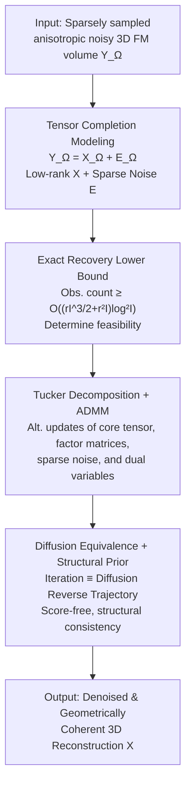

# Recover Cell Tensor: Diffusion-Equivalent Tensor Completion for Fluorescence Microscopy Imaging

**Conference**: ICLR 2026  
**OpenReview**: [https://openreview.net/forum?id=AzZB0BaeT4](https://openreview.net/forum?id=AzZB0BaeT4)  
**Code**: None  
**Area**: Image Restoration / Fluorescence Microscopy / Tensor Completion / Diffusion Models  
**Keywords**: Fluorescence microscopic imaging, tensor completion, Tucker decomposition, conditional diffusion, low-rank prior

## TL;DR
This paper reframes the restoration of 3D fluorescence microscopy (FM) live-cell imaging from an "inverse problem deblurring" perspective to a "tensor completion" perspective. By treating equidistant sparse sampling along the Z-axis as uniform random sampling for low-rank tensor completion, the authors derive a lower bound for the number of observations required for exact recovery. They further prove that the iterative process of solving this completion problem using Tucker decomposition and ADMM is mathematically equivalent to a reverse trajectory of conditional diffusion. This allows for denoised, geometrically coherent 3D cellular reconstruction without training a score network, achieving state-of-the-art performance in PSNR, SSIM, and LPIPS across SR-CACO-2 and three real-world live C. elegans datasets.

## Background & Motivation
**Background**: Observing live cell division requires layer-by-layer scanning of the cell body along the Z-axis. To minimize lethal phototoxicity, scanning is restricted to equidistant sparse sampling on the Z-axis, resulting in 3D volumetric data characterized by **anisotropic resolution (Z-axis much sparser than XY plane), spatially varying intense noise, and incomplete signals**. Most existing restoration algorithms follow the "inverse problem" route: assuming the degradation operator $D(\cdot)$ is known or learnable, they train a model $\hat{I}_y = F(I_x;\theta)$ to approximate the inverse of degradation. Representative methods include supervised approaches like SRCNN, FSRCNN, and DDPM, as well as unsupervised methods like CycleGAN and Deep Image Prior.

**Limitations of Prior Work**: The inverse problem approach is ill-suited for FM imaging. First, it typically requires paired high/low-quality reference volumes, which are practically unattainable in 3D fluorescence microscopy. Second, the FM imaging process is inherently **non-linear**, influenced by excitation, fluorescence emission, sample heterogeneity, and scattering attenuation, making it far more complex than the "linear downsampling $D(I_y)=(I_y)\downarrow_s$" often assumed in inverse problems. Third, under high noise and incomplete signal conditions, inverse problems often become ill-posed; small input perturbations can lead to significant reconstruction errors and hallucinated structures or residual noise, as shown by the false bright spots and fake edges from CycleGAN/IPG in Fig. 1.

**Key Challenge**: Inverse problem modeling assumes "degradation is known, stable, and linear," whereas FM imaging is "unknown, non-linear, and contains sparse deletions." Fitting models with incorrect physical assumptions naturally leads to unstable and untrustworthy reconstructions.

**Goal**: To find a restoration framework that fits the **intrinsic properties of FM imaging (non-linear + incomplete)**, does not rely on high-quality references, remains robust to noise, and provides theoretical guarantees for recoverability.

**Key Insight**: The authors observe that equidistant sparse sampling along the Z-axis is essentially "uniform random sampling" on a 3D tensor. Since cell bodies possess strong structural redundancy (low-rank) across multiple dimensions, restoring missing slices can be reformulated as a **robust low-rank tensor completion** problem with sparse noise, bypassing the need for a known degradation operator.

**Core Idea**: Replace "inverse problems" with "robust tensor completion" to model FM restoration. By proving that the Tucker+ADMM solution is equivalent to a conditional diffusion reverse process, the method leverages theoretical recovery bounds and a diffusion framework to inject structural priors, resulting in denoised and geometrically coherent reconstructions.

## Method

### Overall Architecture
The methodology consists of a chain: "Re-modeling $\to$ Theoretical Guarantees $\to$ Optimization $\to$ revealing Equivalence with Diffusion and Adding Priors." The input is a sparsely sampled, anisotropic, and noisy 3D FM live cell volume $Y_\Omega$ (where $\Omega$ is the index set of observed voxels), and the output is a denoised, isotropic, and geometrically coherent 3D cellular reconstruction $X$.

The process involves four steps: first, reformulating restoration as **robust tensor completion**, where the observed tensor is decomposed into a low-rank clean signal $X$ and sparse noise $E$. Second, **deriving an exact recovery lower bound** to prove that exact recovery occurs with high probability if the number of observed voxels exceeds a threshold of $O((rI^{3/2}+r^2 I)\log^2 I)$. Third, using **Tucker Decomposition + ADMM** to decompose the non-convex optimization into alternating updates of the core tensor, factor matrices, sparse noise, and dual variables. Finally, establishing the **mathematical equivalence between ADMM iterations and conditional diffusion reverse trajectories**, treating low-rank projection as score-guided denoising and the sparse term as forward noise, while overlaying structural consistency priors to guide the generation.

### Key Designs

**1. Reformulating FM Restoration as Robust Tensor Completion: Using Low-Rank + Sparsity instead of Inverse Problems**

To address the failure of inverse problems in fitting non-linear FM degradation, the authors decompose the observed tensor into a structurally consistent clean signal and random deviations: $Y_\Omega = X_\Omega + E_\Omega$. $X$ represents the low-rank volumetric fluorescence signal, and $E$ represents sparse noise/corruption. The restoration objective is a convex optimization—aligning observations while enforcing low-rankness for $X$ and sparsity for $E$:

$$\min_{X,E}\ \|X\|_* + \lambda_1\|E\|_1 \quad \text{s.t.}\quad P_\Omega(X+E)=Y_\Omega,\ X\ge 0$$

Here, $\|X\|_*$ is the tensor nuclear norm (e.g., tubal nuclear norm) to enforce low-rankness, $\|E\|_1$ penalizes sparse corruption, and $P_\Omega$ is the projection operator onto the observed set. The **Key Insight** is shifting away from explicit degradation estimation toward utilizing cross-slice low-rank redundancy to fill gaps and using the sparse term to absorb noise.

**2. Exact Recovery Lower Bound: Answering "Is restoration possible?"**

The authors prove that when sampling $\Omega$ is a uniform random subset of $[I_1]\times\cdots\times[I_k]$, there exists a constant $c_k$ such that if the number of observations satisfies the lower bound, exact recovery $P\{\hat T = T\}\ge 1-I^{-\beta}$ occurs with high probability. For the low-rank + sparse case (Theorem 2), the requirement is:

$$|\Omega|\ \ge\ C\cdot\big(rI^{3/2}+s\big)\cdot\log^2 I$$

Where $r$ is the tensor rank, $s=\|E\|_0$ is sparsity, and $I=\max_j I_j$. This provides a **recoverability criterion**. Experiments show that confocal microscopy sampling rates exceed this threshold, theoretically validating the feasibility of exact 3D cellular reconstruction.

**3. Tucker Decomposition + ADMM: Solving Non-convex Completion via Sub-problems**

Using Tucker decomposition, the clean tensor is written as $X=\mathcal{G}\times_1 U^{(1)}\times_2 U^{(2)}\times_3 U^{(3)}$. The optimization minimizes $\|\mathcal{G}\|_F^2 + \lambda_1\|E\|_1$ via ADMM with five alternating steps: (1) Core tensor $\mathcal{G}^{(t+1)}$ update via least squares; (2) Factor matrix $U^{(n)}$ update; (3) Sparse noise $E^{(t+1)}$ update via soft thresholding $\mathrm{SoftThreshold}_{\lambda_1/\rho}(\cdot)$; (4) Dual variable $\Lambda^{(t+1)}$ update; and (5) Reconstruction of $X^{(t+1)}$. The multilinear rank $(r_1, r_2, r_3)$ is fixed by retaining $>95\%$ energy via truncated HOSVD.

**4. Equivalence with Conditional Diffusion + Structural Consistency Prior: Score-free Generative Reconstruction**

The authors identify that the multi-step iterative refinement resembles the reverse trajectory of diffusion models. The Tucker projection step is identified as MAP inference on a low-rank manifold, corresponding to the learned score function $\nabla\log p_\theta(X^{(t)}|Y_\Omega)$. The sparse noise estimation corresponds to denoising Gaussian noise in DDPM. This forms a deterministic Markov transition $(X^{(t)},E^{(t)})\to(X^{(t+1)},E^{(t+1)})$ approximating a reverse sampling trajectory:

$$x_{t-1}=\frac{1}{\sqrt{\alpha_t}}\Big(x_t-\frac{1-\alpha_t}{\sqrt{1-\bar\alpha_t}}\,\epsilon_\theta(x_t,c)\Big)+\sigma_t z$$

The method requires **no trained score models**, using manifold projection instead. A **structural consistency prior** is added to enforce global structural redundancy across planes, ensuring membrane integrity and topological consistency in the YZ/XZ planes.

### Loss & Training
This is an **unsupervised, score-network-free** optimization method. The core objective is the low-rank nuclear norm + sparse $\ell_1$ constraint from Eq. 4. Hyperparameters include sparse weight $\lambda_1$ and ADMM penalty $\rho$. The multilinear rank is pre-determined and not tuned during testing.

## Key Experimental Results

### Main Results
Evaluated on 3D super-resolution (sparse Z-sampling) and low-SNR denoising.

| Dataset | Metric | Ours | Best Baseline | Description |
|--------|------|------|----------|------|
| C. elegans-1 | PSNR↑ / SSIM↑ | **33.18 / 0.6682** | 32.37 / 0.6338 (Cycle+HAT/IPG) | Ranked 1st in both |
| C. elegans-1 | LPIPS↓ | **0.3773** | 0.3941 (DBPN) | Best perceptual quality |
| C. elegans-2 | PSNR↑ / SSIM↑ | **40.95 / 0.9868** | 39.86 / 0.9766 (Cycle+HAT/DDPM) | Overall lead |
| SR-CACO-2 | PSNR↑ / SSIM↑ | **40.30 / 0.9476** | 40.24 / 0.9447 (DDPM) | Slightly better |
| SR-CACO-2 | LPIPS↓ / NRQM↑ | **0.2305 / 4.09** | 0.3036 / 3.97 | Significantly better perceptual quality |

### Ablation Study
Robustness test on C. elegans-1 across noise levels and downsampling factors:

| Configuration | PSNR↑ | SSIM↑ | LPIPS↓ | Description |
|------|-------|-------|--------|------|
| Original (Clean) | 33.18 | 0.6682 | 0.3773 | Clean input |
| + Gaussian σ=0.1 | 29.34 | 0.5921 | 0.4606 | Strong noise; graceful degradation |
| + Downsampling ×2 | 31.53 | 0.6354 | 0.4051 | Observations above threshold |
| + Downsampling ×4 | 29.01 | 0.5955 | 0.4755 | Below threshold; largest drop |

### Key Findings
- **Theory-Experiment Consistency**: Performance drops significantly when observations fall below the exact recovery threshold, validating Theorem 2.
- **Noise Robustness**: PSNR/SSIM degrade gracefully as noise increases, proving low-rank + sparse modeling inhibits instability.
- **Hallucination Suppression**: Low-rank priors maintain membrane integrity in YZ/XZ planes, avoiding the biologically impossible bright spots common in GAN-based methods.

## Highlights & Insights
- **Power of Perspective**: Shifting from "inverse problems" to "tensor completion" bypasses the need for references and non-linear degradation estimation.
- **Trio of Theory, Algorithm, and Equivalence**: Providing a recovery bound, a solvable ADMM algorithm, and a proof of diffusion equivalence offers far superior interpretability over end-to-end black-box models.
- **Score-free Diffusion**: Treating manifold projection as denoising allows for a deterministic, optimization-driven "diffusion" that uses generative priors without needing training data.

## Limitations & Future Work
- **Fixed Rank**: Multilinear rank is pre-determined via HOSVD; adaptive low-rank modeling might better handle complex samples.
- **Uniform Sampling Assumption**: The lower bound assumes equidistant sampling effectively approximates uniform random sampling.
- **Additive Noise Approximation**: Actual imaging is a Poisson process; while the $Y=X+E$ decomposition works for missing slices, it may be less precise for extremely low photon counts.

## Related Work & Insights
- **vs. Inverse Problems**: Unlike SRCNN/HAT, this method does not assume linear degradation or require paired data.
- **vs. Unsupervised GANs**: GANs generate sharp but often "fake" biological structures; this method prioritizes geometric consistency over extreme sharpness.
- **vs. DDPM**: Does not require training a score network and uses a deterministic optimization approach that outperforms DDPM in LPIPS/NRQM.

## Rating
- Novelty: ⭐⭐⭐⭐⭐ 
- Experimental Thoroughness: ⭐⭐⭐⭐ 
- Writing Quality: ⭐⭐⭐⭐ 
- Value: ⭐⭐⭐⭐⭐

## Related Papers

- [\[CVPR 2026\] Self-Attention Driven Tensor Representation for High-Order Data Recovery](../../CVPR2026/image_restoration/self-attention_driven_tensor_representation_for_high-order_data_recovery.md)
- [\[CVPR 2026\] Gaussian Splatting-based Low-Rank Tensor Representation for Multi-Dimensional Image Recovery](../../CVPR2026/image_restoration/gaussian_splatting-based_low-rank_tensor_representation_for_multi-dimensional_im.md)
- [\[NeurIPS 2025\] scSplit: Bringing Severity Cognizance to Image Decomposition in Fluorescence Microscopy](../../NeurIPS2025/image_restoration/scsplit_bringing_severity_cognizance_to_image_decomposition_in_fluorescence_micr.md)
- [\[CVPR 2026\] Statistical Characteristic-Guided Denoising for Rapid High-Resolution Transmission Electron Microscopy Imaging](../../CVPR2026/image_restoration/statistical_characteristic-guided_denoising_for_rapid_high-resolution_transmissi.md)
- [\[CVPR 2026\] Self-Diffusion Driven Blind Imaging](../../CVPR2026/image_restoration/self-diffusion_driven_blind_imaging.md)

<!-- RELATED:END -->

<!-- RELATED:START -->

## Related Papers

- [\[CVPR 2026\] Self-Attention Driven Tensor Representation for High-Order Data Recovery](../../CVPR2026/image_restoration/self-attention_driven_tensor_representation_for_high-order_data_recovery.md)
- [\[CVPR 2026\] Gaussian Splatting-based Low-Rank Tensor Representation for Multi-Dimensional Image Recovery](../../CVPR2026/image_restoration/gaussian_splatting-based_low-rank_tensor_representation_for_multi-dimensional_im.md)
- [\[NeurIPS 2025\] scSplit: Bringing Severity Cognizance to Image Decomposition in Fluorescence Microscopy](../../NeurIPS2025/image_restoration/scsplit_bringing_severity_cognizance_to_image_decomposition_in_fluorescence_micr.md)
- [\[CVPR 2026\] Statistical Characteristic-Guided Denoising for Rapid High-Resolution Transmission Electron Microscopy Imaging](../../CVPR2026/image_restoration/statistical_characteristic-guided_denoising_for_rapid_high-resolution_transmissi.md)
- [\[ICLR 2026\] Reconstruct Anything Model: A Lightweight General Model for Computational Imaging](reconstruct_anything_model_a_lightweight_general_model_for_computational_imaging.md)

<!-- RELATED:END -->
