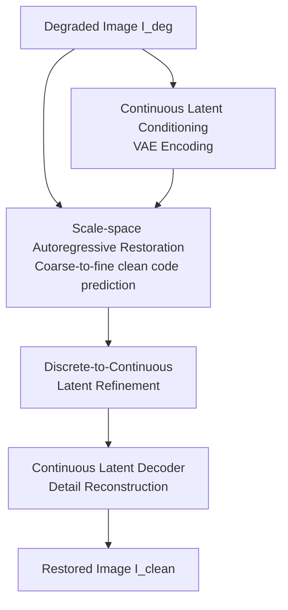

# RestoreVAR: Visual Autoregressive Generation for All-in-One Image Restoration

**Conference**: ICLR 2026  
**OpenReview**: [https://openreview.net/forum?id=yvXtCn2zfz](https://openreview.net/forum?id=yvXtCn2zfz)  
**Code**: Not yet public  
**Area**: Image Restoration / All-in-One Image Restoration  
**Keywords**: Visual Autoregressive, All-in-One Image Restoration, Multi-scale Quantization, Latent Space Refinement, Generative Restoration

## TL;DR
RestoreVAR adapts the visual autoregressive model VAR from pure image generation into an all-in-one image restoration model. It utilizes continuous latents of degraded images as cross-attention conditions, further supplemented by a latent refiner and a continuous latent decoder to recover details. It achieves superior restoration quality among generative AiOR methods while reducing the multi-second inference time of LDM-based methods to approximately 0.201 seconds.

## Background & Motivation
**Background**: All-in-One Image Restoration (AiOR) aims to handle diverse degradations—such as haze, snow, rain, low-light, and blur—simultaneously using a single model. Traditional non-generative methods like PromptIR, InstructIR, AWRaCLe, DCPT, and DFPIR typically learn a deterministic mapping from degraded to clean images. While fast and strong in pixel-wise metrics, their generalization to real-world, mixed, or unseen degradations is often unstable. Recent generative AiOR approaches introduce latent diffusion models (LDM) to enhance perceptual quality and generalization via large-scale generative priors.

**Limitations of Prior Work**: The primary cost of LDM-based AiOR is latency. These models require multiple denoising steps during inference (e.g., ~20 steps for Diff-Plugin, ~100 for AutoDIR, ~60 for PixWizard), resulting in times of 2.04s, 8.477s, and 8.247s per image under this paper's settings. Such speeds are unacceptable for time-sensitive scenarios like video surveillance or autonomous driving. Another bottleneck arises from VAEs: LDMs and VARs often operate in latent space, but VAEs and vector quantization (VQ) are biased towards generative diversity, failing to preserve the precise structures required for low-level vision, often leading to distorted textures or edges.

**Key Challenge**: Image restoration requires both natural image distribution knowledge from generative priors and high fidelity to the input scene without the hallucinations tolerated in pure generation. It demands outputs that are semantically plausible, spatially structurally consistent, and detailed at the pixel level. Diffusion models offer priors but are slow; non-generative models are fast but generalize poorly. Original VAR is fast but not designed for conditional generation from degraded images and is limited by discrete latent space and VAE decoding detail loss.

**Goal**: The authors aim to address three specific problems: First, whether VAR's scale-space autoregression can replace the iterative denoising of LDMs to significantly reduce generative AiOR overhead. Second, how to stably inject degraded image information into VAR to prevent the model from hallucinating based on priors. Third, how to mitigate detail loss caused by VQ and VAE decoding to reach competitive pixel-level restoration metrics.

**Key Insight**: A key observation stems from the multi-scale residual quantization of VAR. By swapping VQ-VAE multi-scale codes between clean and degraded images, the authors found that coarse-scale codes primarily carry degradations (haze, rain, snow, blur), whereas fine-scale codes control scene details. For restoration, the model does not necessarily need to reconstruct everything point-by-point like pixel-level autoregression; it can first remove degradations at coarse scales and then recover details at fine scales. This aligns perfectly with VAR's mechanism of predicting the next scale from coarse to fine.

**Core Idea**: Replace the multi-step denoising of LDM with VAR's multi-scale autoregressive generation. Transform a fast image generation backbone into a generative restoration framework via continuous latent conditioning, a latent refiner, and a continuous latent decoder.

## Method

### Overall Architecture
RestoreVAR takes a degraded image $I_{deg}$ as input to produce a clean image resembling $I_{gt}$. During training, the clean image passes through a multi-scale VQ-VAE to obtain ground-truth code-book indices. The VAR transformer learns to predict these clean discrete codes scale-by-scale via teacher forcing. Simultaneously, the continuous latent of the degraded image is injected via cross-attention in every transformer block. During inference, the model predicts discrete refined latents once through 10 scales, which are then converted to continuous latents by a latent refinement transformer and decoded by a fine-tuned VAE decoder.

Training is divided into three relatively independent stages. The first stage trains the RestoreVAR transformer: it reads multi-scale teacher-forcing inputs from clean images while conditioning on degraded continuous latents to predict clean codes. The second stage trains the Latent Refinement Transformer (LRT): it receives the discrete latents and the last-layer representations from RestoreVAR to predict a residual that maps discrete latents toward continuous ones. The third stage fine-tunes the VAE decoder: the encoder and quantizer are frozen, and the decoder learns to reconstruct high-fidelity images from continuous latents.

### Key Designs
**1. Utilizing VAR Scale-Space for Restoration**

The original VAR performs next-scale prediction on multi-scale VQ-VAE latents rather than pixel-wise scanning. Given a continuous latent $f_{cont}$, VQ-VAE performs residual quantization across $K$ scales: the $k$-th scale quantizes the downsampled residual to get an index map $r_k$. The image is represented as a sequence of code maps $\{r_1, r_2, \ldots, r_K\}$. VAR learns:

$$
p(r_1, r_2, \ldots, r_K)=\prod_{k=1}^{K}p(r_k \mid r_1, r_2, \ldots, r_{k-1}).
$$

The core insight is that this scale-space decomposition naturally fits image restoration. When coarse-scale codes of a clean image are replaced by those of a degraded image, degradations reappear. Replacing only fine-scale codes leaves the image clean but loses detail. This suggests degradations like haze and blur occupy coarse scales, while scene details occupy fine scales. Projecting restoration as predicting clean coarse codes first allows RestoreVAR to be more direct and faster than diffusion models.

**2. Continuous Latent Conditioning via Layer-wise Cross-Attention**

To prevent the model from hallucinating content irrelevant to the scene, RestoreVAR incorporates cross-attention in every transformer block. Specifically, the FFN output of the $i$-th block, $x_{block_i}$, acts as the query, while the continuous latent of the degraded image $f^{deg}_{cont}$ (reshaped as tokens) acts as key/value:

$$
x_{blockCA}=x_{block_i}+g_i\times CA(x_{block_i}, f^{deg}_{cont}).
$$

The gate $g_i$ is initialized to 0 to stabilize training by initially preserving pretrained VAR behavior before learning to leverage the condition. The authors found that continuous latent conditioning significantly outperforms discrete conditioning, as quantization discards structural nuances required for restoration. For higher resolution support (512×512), 2D RoPE is used instead of absolute positional embeddings, and AdaLN is removed to reduce parameters.

**3. Latent Refinement for Resolving VQ Bottlenecks**

VAR predicts discrete latents $f^{pred}_{quant}$. Directly decoding these leads to lost edges and textures due to quantization error. RestoreVAR introduces a lightweight non-generative Latent Refinement Transformer (LRT) to map discrete latents back to continuous space:

$$
\hat f_{cont}=f^{pred}_{quant}+LRT(f^{pred}_{quant}, z),
$$

where $z$ is the last-layer output of the RestoreVAR transformer, serving as pseudo-continuous guidance. Ablations show that LRT performance drops significantly without $z$ (from 24.67/0.821 to 21.23/0.660). Unlike HART's diffusion-based refiner, LRT is non-iterative, adding only 22.97M parameters and 0.0061s overhead.

**4. Fine-tuning VAE Decoder on Continuous Latents**

To avoid VAE-induced distortions or "over-texturing" common in generative models, the authors fine-tune only the decoder while freezing the encoder and quantizer. The training objective for the decoder combines pixel, structural, perceptual, and adversarial losses:

$$
L_{dec}=\lambda_1L_{L1}+\lambda_2L_{SSIM}+\lambda_3L_{percep}+\lambda_4L_{adv}.
$$

Weights are set as $\lambda_1=2.0, \lambda_2=0.4, \lambda_3=0.2, \lambda_4=0.01$. The PatchGAN discriminator ensures sharper reconstructions compared to using L1/SSIM alone. This fine-tuning improves reconstruction PSNR/SSIM from 22.59/0.679 to 28.14/0.842.

### Loss & Training
The components are trained separately. The RestoreVAR transformer uses a depth-16 pretrained VAR backbone (1024 dim, 16 heads) predicting 10 scales from $1\times1$ to $32\times32$. It is trained using cross-entropy loss on clean code-book indices with AdamW ($10^{-4}$ LR, batch size 48, 100 epochs). 

LRT (depth 12, 6 heads) is trained using L1 loss toward continuous latents ($L_{LRT}=L1(\hat f_{cont}, f^{gt}_{cont})$). The VAE decoder is fine-tuned for 5 epochs. Training data includes RESIDE (haze), Snow100k (snow), Rain13K (rain), LOLv1 (low-light), and GoPro (blur), performed on 8 RTX A6000 GPUs.

## Key Experimental Results

### Main Results
RestoreVAR outperforms LDM-based generative baselines across five restoration tasks in PSNR.

| Dataset / Degradation | Metric | RestoreVAR | Top LDM Baseline | Gain |
|--------|------|------|----------|------|
| RESIDE / Haze | PSNR↑ | 24.67 | AutoDIR 24.48 | +0.19 dB |
| Snow100k / Snow | PSNR↑ | 24.05 | PixWizard 21.24 | +2.81 dB |
| Rain13K / Rain | PSNR↑ | 23.97 | AutoDIR 23.02 | +0.95 dB |
| LOLv1 / Low-light | PSNR↑ | 21.72 | AutoDIR 19.43 | +2.29 dB |
| GoPro / Blur | PSNR↑ | 23.96 | AutoDIR 23.55 | +0.41 dB |

RestoreVAR is $10\times$ to $40\times$ faster than diffusion-based methods.

| Method | Inference Steps | Time / Img | TFLOPs | Params |
|------|---------|----------|--------|--------|
| Diff-Plugin | 20 | 2.04s | 16.08 | 859.50M |
| AutoDIR | 100 | 8.477s | 67.80 | 859.50M |
| PixWizard | 60 | 8.247s | 19.27 | 2011.40M |
| **Ours** | 10 | **0.201s** | 1.05 | 296.95M |

### Ablation Study
| Configuration | Key Metrics | Note |
|------|---------|------|
| No Refiner | 21.71 / 0.690 | Direct decoding of discrete latents loses detail |
| HART Refiner | 23.48 / 0.777 | Slower diffusion-based MLP refiner |
| LRT w/o Last-Block | 21.23 / 0.660 | Removing $z$ guidance degrades results |
| **Proposed LRT** | **24.67 / 0.821** | Best PSNR/SSIM with minimal overhead |

### Key Findings
- The RestoreVAR transformer is the primary engine for restoration; feeding degraded latents directly to LRT fails to remove degradations, proving LRT acts only as a detail compensator.
- Coarse scales handle the bulk of degradation removal as hypothesized.
- Generalization on real-world/unseen data is strong, outperforming non-generative models in perceptual metrics (MUSIQ/CLIPIQA).
- Computational bottlenecks reside in the transformer (0.1863s) rather than VAE (0.0086s) or LRT (0.0061s).

## Highlights & Insights
- The mapping between VAR's scale-space and restoration tasks provides a structural justification for the model choice beyond speed.
- Continuous latent conditioning avoids premature discretization of inputs, preserving spatial fidelity.
- LRT offers a non-iterative alternative to diffusion-based refinement, balancing speed and detail recovery.

## Limitations & Future Work
- RestoreVAR is limited by the upper bound of the LRT and VAE decoder; it does not yet reach the performance of decoding ground-truth continuous latents directly.
- Performance on extreme degradations (e.g., massive information loss in very dark scenes) remains challenging.
- While it beats generative baselines, it still trails some specialized non-generative models in pure pixel-wise PSNR.
- Future work could explore scaling the VAR backbone or incorporating text-based prompts for instruction-based restoration.

## Related Work & Insights
- **vs. LDM Methods (Diff-Plugin/AutoDIR/PixWizard)**: RestoreVAR replaces diffusion denoising with scale-space autoregression, achieving better metrics and significantly lower latency.
- **vs. Non-generative Methods (PromptIR/InstructIR)**: Non-generative models excel at pixel metrics on seen datasets, but RestoreVAR demonstrates superior perceptual quality and generalization.
- **Insight**: Tokenization is not a neutral choice for low-level vision. Identifying which latent scales or token subspaces contain degradation vs. structure allows for more targeted architectural design.

## Rating
- Novelty: ⭐⭐⭐⭐⭐ Adapting VAR scale-space for AiOR with empirical motivation is highly original.
- Experimental Thoroughness: ⭐⭐⭐⭐⭐ Comprehensive coverage across tasks, generalizations, and ablations.
- Writing Quality: ⭐⭐⭐⭐ Clear figures and organization, though some comparison caveats require close reading.
- Value: ⭐⭐⭐⭐⭐ Provides a fast and faithful generative restoration path, suitable for real-time applications.

<!-- RELATED:START -->

<!-- RELATED:END -->

## Related Papers

- [\[ICLR 2026\] Rethinking Expressivity and Degradation-Awareness in Attention for All-in-One Blind Image Restoration](rethinking_expressivity_and_degradation-awareness_in_attention_for_all-in-one_bl.md)
- [\[CVPR 2025\] Visual-Instructed Degradation Diffusion for All-in-One Image Restoration](../../CVPR2025/image_restoration/visual-instructed_degradation_diffusion_for_all-in-one_image_restoration.md)
- [\[ICLR 2026\] Learning Domain-Aware Task Prompt Representations for Multi-Domain All-in-One Image Restoration](learning_domain-aware_task_prompt_representations_for_multi-domain_all-in-one_im.md)
- [\[CVPR 2026\] DVAR: Dynamic Visual Autoregressive Modeling for Image Super-Resolution](../../CVPR2026/image_restoration/dvar_dynamic_visual_autoregressive_modeling_for_image_super-resolution.md)
- [\[CVPR 2025\] Degradation-Aware Feature Perturbation for All-in-One Image Restoration](../../CVPR2025/image_restoration/degradation-aware_feature_perturbation_for_all-in-one_image_restoration.md)

<!-- RELATED:END -->
