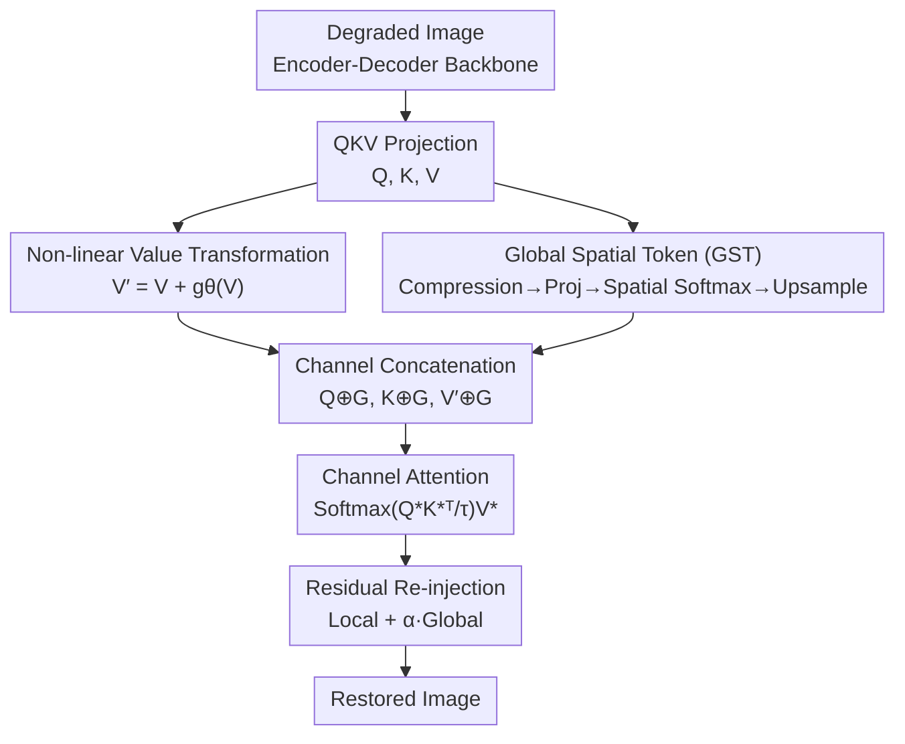

# Rethinking Expressivity and Degradation-Awareness in Attention for All-in-One Blind Image Restoration

**Conference**: ICLR 2026  
**OpenReview**: [https://openreview.net/forum?id=IBzmQVia88](https://openreview.net/forum?id=IBzmQVia88)  
**Paper**: [Project Page ExDA](https://amazingren.github.io/ExDA/)  
**Code**: The paper promises to open-source upon acceptance (not yet released)  
**Area**: Image Restoration / Attention Mechanism  
**Keywords**: All-in-One Image Restoration, Blind Restoration, Restormer, Non-linear Value, Global Spatial Token

## TL;DR
Addressing two overlooked bottlenecks of Restormer-style channel attention in All-in-One blind image restoration—the purely linear value path and the lack of explicit global slots—this paper proposes two minimalist, backbone-agnostic primitives (non-linear value transformation + global spatial tokens). These upgrade attention from a "feature selector" to a "selector-transformer" while providing degradation-awareness at nearly zero extra cost, consistently outperforming larger SOTA models across six All-in-One benchmarks.

## Background & Motivation

**Background**: All-in-One image restoration requires **a single model** to simultaneously handle multiple degradations such as noise, blur, rain, haze, and low light, which are often mixed and unknown in real-world scenarios. This is inherently more difficult than single-task restoration—it is not about learning a fixed inverse mapping, but approximating **a family of heterogeneous inverse functions**. Continuous state-of-the-art architectures follow the Restormer style: using Multi-DConv Head Transposed Attention (MDTA) to reduce complexity to linear and pairing it with Gated-Dconv Feed-forward Networks (GDFN), which has become the de facto standard for high-resolution restoration.

**Limitations of Prior Work**: The authors re-examine this design through the lens of All-in-One restoration and identify two long-ignored structural flaws. First, the **value path of attention is purely linear**: while Q and K interact non-linearly through softmax, V is merely aggregated via linear weighting, constraining the output to the span (convex hull) of input features. Compounding this, one branch of GDFN is also essentially linear, allowing information to bypass non-linear transformations and weakening the entire block’s expressivity. Second, channel attention **completely discards explicit global slots**: standard ViTs use CLS tokens for global semantics, but in low-level vision, such tokens are often discarded as "useless for pixel-level prediction," a practice Restormer follows by relying solely on local depth-wise convolutions.

**Key Challenge**: These flaws are minor in **single-task** scenarios where the inverse function is fixed and the degradation type does not need to be inferred. However, in **All-in-One** scenarios, they become fundamental bottlenecks: the model must navigate distinct inverse mappings—such as high-frequency denoising versus low-frequency dehazing (requiring **expressivity**)—and must infer the current degradation from the input itself (requiring **degradation-awareness**). The linear value limits expressivity, while the absence of global slots forces degradation context to be implicitly scattered across channels.

**Goal**: Without introducing prompt modules or stacking complex multi-stage structures, this work returns to the backbone itself to fill the gaps in "expressivity" and "degradation-awareness."

**Key Insight**: Contrary to recent trends shifting toward multi-modal large models or external prompt modules, the authors argue that degradation principles are still not fully understood and require **rethinking the attention primitive itself**. From a function approximation perspective, placing non-linearity **before** aggregation is necessary to expand the achievable function family. Diagnostic analysis further shows that explicit global tokens can capture meaningful degradation context.

**Core Idea**: Upgrade any Restormer-style attention with two minimalist, backbone-agnostic primitives—**non-linear value transformation before aggregation** to break linear span constraints, and **Global Spatial Tokens (GST)** to provide explicit slots for degradation-awareness.

## Method

### Overall Architecture
ExDA does not alter the macro encoder-decoder shape of Restormer (the authors even argue that a simple encoder-decoder backbone is sufficiently strong for All-in-One). Instead, it performs two "surgeries" inside each channel attention operator. After a standard QKV projection from a degraded image: first, a lightweight residual non-linear transformation $V'=V+g_\theta(V)$ is applied to the value, allowing features to escape the input span before aggregation. Simultaneously, a set of content-adaptive Global Spatial Tokens $G$ is generated from the input features. $G$ is concatenated with $Q, K, V'$ along the channel dimension for attention. Finally, the local channel output and global token output are re-fused using a learnable residual coefficient $\alpha$. These modifications are backbone-agnostic with negligible overhead, yet simultaneously improve expressivity and degradation-awareness.

### Key Designs

**1. Non-linear Value Transformation: Upgrading Attention from "Selector" to "Selector-Transformer"**

This design targets the first bottleneck—linear value locking the output within the input span. The authors demonstrate this through diagnostic experiments on synthetic function approximation and MNIST restoration: linear value attention fails systematically in critical regions (50.4% worse convergence), while non-linear value leads to a 5.92 dB PSNR gain (19.2→25.1 dB) on MNIST. The solution adds a lightweight non-linear branch to the value **before** aggregation, using a residual form to balance fidelity and transformation:

$$V' = V + g_\theta(V),\quad g_\theta = \text{Conv}_{1\times1}\to\text{DWConv}_{3\times3}\to\text{GELU}\to\text{Conv}_{1\times1}$$

Two details are crucial. **Position must be before aggregation**: Attention $\text{Softmax}(QK^\top/\sqrt{d})V'$ can only perform linear combinations; if non-linearity is placed after aggregation, the output still cannot escape the fundamental constraint of the linear span. Only modifying $V'$ truly expands the function family. **The form must be residual and learnable**: Ablations show that the residual form ($V+g_\theta(V)$) consistently outperforms replacement ($g_\theta(V)$), and learnable mappings significantly outperform parameter-free non-linearities like Sigmoid/GELU. This transforms channel attention from a linear selector that merely "picks and weights existing features" into a non-linear transformer capable of "picking and transforming new features," bridging the expressivity gap between single-task and All-in-One restoration.

**2. Global Spatial Token (GST): An Explicit Slot for Degradation-Awareness**

This design addresses the second bottleneck—the lack of explicit global slots, forcing degradation context to scatter across local channel interactions. The authors re-introduce the CLS token concept but make it **content-adaptive** rather than a fixed global average pooling. The process (Alg. 1): apply efficient spatial compression with stride $s$ to input features $\tilde X=\text{AvgPool}_s(X)$, obtain multi-head projection $\Phi$, perform softmax normalization along the spatial dimension $G_{\text{compact}}=\text{Softmax}_{\text{spatial}}(\Phi)$, and finally use bilinear upsampling back to the original resolution to get $G\in\mathbb{R}^{B\times h\times K\times HW}$.

The core is "content-adaptive pooling": each token naturally develops different spatial emphasis patterns via learnable projection + spatial softmax. During training, **without any degradation labels or supervision**, they spontaneously specialize—noise tokens focus on scattered high-frequency regions, blur tokens emphasize smooth low-frequency areas, and haze tokens respond to large-scale lighting structures. The generated $G$ is concatenated into the attention:

$$[Q^*,K^*,V^*]=[Q\oplus G,\ K\oplus G,\ V'\oplus G]$$

After attention, local channel contributions and global token contributions are separated and re-injected using a learnable residual coefficient $\alpha$ (initialized at 0.1 to prevent overpowering local features initially):

$$\text{Output}=\text{Attn}[:,:,:C,:]+\alpha\cdot\text{Attn}[:,:,C:,:]$$

Stride $s=2$ achieves the best balance between information retention and compactness (32.71 dB). t-SNE/UMAP visualizations confirm that GST makes degradation type embeddings more distinct and compact, with NMI rising from 0.71 to 0.88 and ARI from 0.56 to 0.89, proving these slots evolve into meaningful degradation embeddings.

### Loss & Training
The method modifies backbone-level primitives and follows standard restoration training protocols without additional prompt modules or multi-stage strategies. Non-linear values are deployed in all encoder and decoder blocks for maximum gain; the GST residual coefficient $\alpha$ is initialized at 0.1 for progressive learning.

## Key Experimental Results

### Main Results
Evaluated on six All-in-One benchmarks (3-degradation / 5-degradation / mixed CDD11 / Adverse Weather / Real-world WeatherBench / Medical), ExDA consistently outperforms larger methods, including those with language/multi-task/prompt extensions.

| Setting | Metric | ExDA (22M) | Prev. SOTA | Gain |
|--------|------|------|----------|------|
| 3-Degradation Average | PSNR | **32.96** | MoCE-IR 32.73 (25M) | +0.23 dB, 3M fewer params |
| 5-Degradation Average | PSNR | **30.83** | MoCE-IR 30.58 | +0.25 dB |
| Mixed CDD11 Avg. | PSNR | **29.97** | MoCE-IR 29.05 | +0.92 dB |
| Adverse Weather Avg. | PSNR | **33.92** | Histoformer 33.68 | +0.24 dB |
| Real WeatherBench | PSNR | **29.68** | AdaIR 28.80 | +0.88 dB |
| Medical 3-Task Avg. | PSNR | **34.30** | AMIR 34.28 | +0.02 dB |

### Ablation Study
Component analysis starting from the PromptIR baseline (3-degradation setting, PSNR/SSIM):

| Configuration | PSNR | Note |
|------|---------|------|
| (a) PromptIR | 32.06 / .913 | Baseline |
| (b) PromptIR w/o Prompt | 30.75 / .901 | Significant drop without prompt |
| (c) b + Non-linear value | 32.54 / .917 | Non-linear value significantly recovers performance |
| (d) b + GST | 32.67 / .918 | GST also brings consistent gains alone |
| (e) c + d Full Model (22M) | **32.96 / .921** | Optimal combination |
| (f) Ours-Small (10M) | 32.83 / .920 | Highly competitive even when scaled down |
| (g) Ours-Tiny (6M) | 32.71 / .919 | 6M model still approaches full model |

Non-linear value design ablation (Tiny model): Residual + Learnable + Full deployment in Encoder & Decoder is optimal (GELU Residual 32.71 vs original 32.45; Learnable 32.71 vs Parameter-free 32.30).

### Key Findings
- **Complementary gains from both primitives**: After removing prompts, adding non-linear value (+1.79 dB over b) or GST (+1.92 dB over b) individually helps, but combined they reach the optimal 32.96 dB, proving expressivity and degradation-awareness are independent bottlenecks.
- **Strong performance with extreme lightness**: The Tiny model with only 6M parameters reaches 32.71 dB, suggesting that once core primitives are correctly designed, ultra-lightweight models can excel—gains come from structure, not parameter stacking.
- **Highest gains on mixed degradation**: Leading by 0.92 dB on CDD11 mixed degradation significantly exceeds the lead on single degradations, confirming both primitives are tailored for "heterogeneous inverse function families."
- **Quantifiable degradation-awareness**: GST improves NMI/ARI of degradation embedding clusters from 0.71/0.56 to 0.88/0.89. Visualizations show attention focusing on degradation-relevant areas (rain streaks, dark regions, haze) without labels.
- **Efficiency friendly**: Latency grows approximately linearly with resolution ($O(HW)$), e.g., 54.5 to 840.1 ms from $256^2$ to $1024^2$. ExDA-Small achieves the best accuracy-efficiency trade-off.

## Highlights & Insights
- **Counter-intuitive observation on value as the key to expressivity**: While prior work on linearizing attention often adds non-linear kernels to Q/K, this paper argues that the value space is more critical for learning robust representations and that non-linearity must be placed before aggregation—a simple yet persuasive argument from function approximation.
- **"Waste-to-treasure" with discarded CLS tokens**: Low-level vision typically considers global tokens useless, but this paper allows them to spontaneously evolve into degradation embeddings in an All-in-One context—a classic example of reuse for new scenarios.
- **Backbone-agnostic primitives**: These can be plugged into any Restormer-style architecture with negligible cost and low migration overhead. This "minimal change + wide applicability" is ideal for subsequent research.
- **Diagnostic-driven design methodology**: Identifying bottlenecks using synthetic functions and MNIST, then confirming mechanisms via t-SNE/UMAP/spectral analysis, makes the "why it works" as solid as the "what was done."

## Limitations & Future Work
- **Marginal improvements on saturated benchmarks**: Average gains of only +0.02 dB on Medical 3-task and slightly trailing Histoformer on RainDrop suggest limited returns on sub-tasks that are near their performance ceiling.
- **Dependency on regression-based backbones**: The method is tied to Restormer-style channel attention; its effectiveness on Diffusion/Generative restoration paradigms is not yet verified.
- **Qualitative interpretability of GST**: The "spontaneous specialization" of noise/blur tokens is supported by attention maps and clustering metrics but lacks rigorous causal verification.
- **Code and weights not yet released** (promised after acceptance); reproduction must wait.
- Future directions: Transferring non-linear values + global slots to Mamba/SSM-based restoration backbones, or making them complementary to lightweight prompts rather than mutually exclusive.

## Related Work & Insights
- **vs Restormer**: Restormer uses channel attention for linear complexity and is the IR standard, but its value is purely linear and lacks global slots. ExDA addresses these within the operator without changing macro structures.
- **vs PromptIR / AdaIR (Prompt-based)**: These rely on learning visual or frequency prompts for degradation priors, often with higher training costs and lower efficiency. ExDA achieves degradation-awareness inside the backbone, making it lighter and more efficient.
- **vs Linearized Attention (Katharopoulos / Shen / Shazeer etc.)**: These add non-linear kernels to Q/K for efficient softmax approximation. ExDA argues the value space is more critical and adds non-linearity to V before aggregation, a geometric approach.
- **vs MoCE-IR (Current strongest All-in-One baseline)**: MoCE-IR relies on larger models or Mixture-of-Experts. ExDA surpasses it on most benchmarks with fewer parameters (22M vs 25M), particularly leading by 0.92 dB on mixed degradations.

## Rating
- Novelty: ⭐⭐⭐⭐⭐ Re-diagnosing attention primitives from an All-in-One perspective; two minimalist changes directly address expressivity and degradation-awareness with solid reasoning.
- Experimental Thoroughness: ⭐⭐⭐⭐⭐ Six benchmarks + synthetic diagnostics + clustering/spectral analysis + efficiency curves; component ablation and mechanism verification are comprehensive.
- Writing Quality: ⭐⭐⭐⭐ Clear narrative of "diagnosing bottleneck → proposing primitive → verifying mechanism"; good coordination between formulas and charts, though some sections are slightly wordy.
- Value: ⭐⭐⭐⭐⭐ Backbone-agnostic, zero extra cost, and plug-and-play; directly reusable for the entire Restormer-style IR ecosystem.

<!-- RELATED:START -->

## Related Papers

- [\[ICLR 2026\] RestoreVAR: Visual Autoregressive Generation for All-in-One Image Restoration](restorevar_visual_autoregressive_generation_for_all-in-one_image_restoration.md)
- [\[CVPR 2026\] Degradation-Consistent Test-Time Adaptation for All-in-One Image Restoration](../../CVPR2026/image_restoration/degradation-consistent_test-time_adaptation_for_all-in-one_image_restoration.md)
- [\[CVPR 2026\] Retrieve-to-Restore: Efficient All-in-One Image Restoration with a Retrieval-Based Degradation Bank](../../CVPR2026/image_restoration/retrieve-to-restore_efficient_all-in-one_image_restoration_with_a_retrieval-base.md)
- [\[ICLR 2026\] Learning Domain-Aware Task Prompt Representations for Multi-Domain All-in-One Image Restoration](learning_domain-aware_task_prompt_representations_for_multi-domain_all-in-one_im.md)
- [\[CVPR 2025\] Degradation-Aware Feature Perturbation for All-in-One Image Restoration](../../CVPR2025/image_restoration/degradation-aware_feature_perturbation_for_all-in-one_image_restoration.md)

<!-- RELATED:END -->
