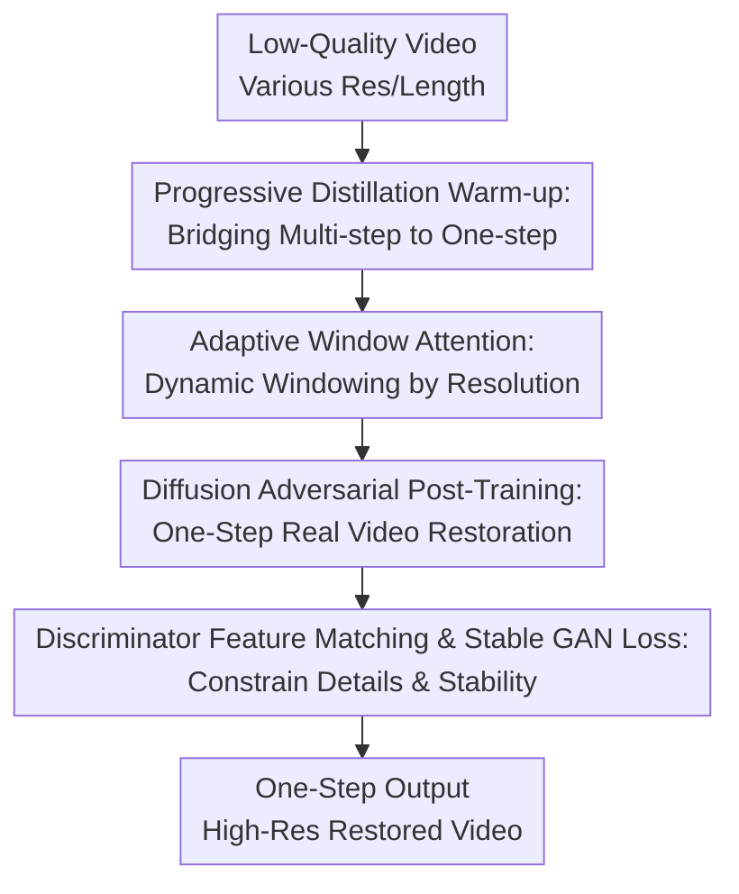

# SeedVR2: One-Step Video Restoration via Diffusion Adversarial Post-Training

**Conference**: ICLR2026  
**OpenReview**: [https://openreview.net/forum?id=x1FRyko9eC](https://openreview.net/forum?id=x1FRyko9eC)  
**Paper**: [Project Page](https://iceclear.github.io/projects/seedvr2/)  
**Code**: To be released  
**Area**: Image Restoration / Video Restoration  
**Keywords**: One-step video restoration, Diffusion model acceleration, Adversarial post-training, Adaptive window attention, Video super-resolution  

## TL;DR
SeedVR2 compresses a multi-step diffusion-based video restoration model into a one-step generator via diffusion adversarial post-training. It utilizes adaptive window attention, progressive distillation, and discriminator feature matching loss to support high-resolution video restoration, achieving perceptual quality comparable to or better than multi-step models in a single inference step.

## Background & Motivation
**Background**: Real-world video restoration and video super-resolution are shifting from traditional CNN/Transformer models to diffusion models. The advantage of diffusion models lies in their ability to synthesize realistic textures and details, particularly in scenarios involving heavy degradation, AIGC video enhancement, or low-quality real-world video repair where clean degradation models are unavailable.

**Limitations of Prior Work**: The primary bottleneck for diffusion-based video restoration is slow inference. Methods like UAV, MGLD-VSR, VEnhancer, STAR, and SeedVR typically require dozens of sampling steps to maintain stability; latency is compounded by both temporal depth and spatial resolution for long or high-resolution (e.g., 1080p+) videos. While existing one-step image restoration methods demonstrate potential, they often rely on teacher model distillation, fixed diffusion priors, or image-level designs. Directly applying these to videos leads to high teacher sampling costs, temporal inconsistency, and window artifacts at high resolutions.

**Key Challenge**: Video restoration must satisfy three conditions simultaneously: fast one-step inference, realistic high-resolution details, and high fidelity (temporal and content) to the low-quality input. Traditional distillation reduces steps but often traps the student model within the teacher's performance upper bound and produces over-smoothed results in few-step regimes. Pure GAN-based restoration is fast but lacks the generative capability of diffusion models. The core conflict is: how to retain the strong generative prior of a diffusion Transformer while eliminating the costs of multi-step sampling and teacher distillation.

**Goal**: The authors aim to train a one-step model for real-world video restoration that takes low-quality video as input and outputs a high-resolution restored version in a single forward pass. The model should remain stable across 720p, 1080p, various aspect ratios, and video lengths while matching the perceptual quality of a 50-step diffusion model.

**Key Insight**: SeedVR2 starts from a pre-trained large-scale video restoration diffusion Transformer (SeedVR). Instead of treating it as a fixed teacher or prior, the authors employ Adversarial Post-Training (APT) to train the entire network into a one-step generator. This allows the model to learn directly from real data distributions through adversarial learning, potentially surpassing the initial multi-step model or overcoming teacher limitations.

**Core Idea**: Transform SeedVR into a one-step video restoration generator via diffusion adversarial post-training, supplemented by high-resolution adaptive windowing, progressive distillation warm-up, and efficient feature matching losses to ensure realistic detail and speed.

## Method

### Overall Architecture
SeedVR2 takes a low-quality video as input and targets high-resolution output in one forward pass. It initializes with the SeedVR diffusion Transformer, uses progressive distillation to bridge the gap from 64 steps to one step, and then undergoes diffusion adversarial post-training. Architecturally, both the generator and discriminator use Swin-MMDIT with adaptive window attention. The discriminator provides GAN logits and intermediate layer features to constrain the restoration results.

From a training perspective, SeedVR2 is not merely "setting sampling steps to 1." It first trains the student to approximate the multi-step SeedVR vector field, then uses adversarial training with real videos to correct the over-smoothing tendency induced by distillation. Adaptive window attention is applied to both the generator and discriminator to resolve window size inconsistencies during high-resolution inference. Stable GAN and feature matching losses address the degradation issues typical in adversarial training of large-scale models.

### Key Designs
**1. Progressive Distillation Warm-up: Bridging Multi-step to One-step**

Directly applying one-step adversarial training to a 64-step diffusion model creates too large a gap, causing the model to lose restoration capability before GAN learning takes over. SeedVR2 incorporates progressive distillation: starting from 64 steps, the student is gradually distilled to one step with a stride of 2. Each stage involves ~10K iterations supervised by mean squared error on the vector field. This provides a sufficiently good starting point for adversarial training and enables the model to handle single frames and variable-length video clips. Notably, the 3B version distilled from a 7B model outperformed the 7B version in certain metrics, suggesting that warm-up improves one-step trainability.

**2. Adaptive Window Attention: Dynamic Windowing by Resolution**

SeedVR uses window attention to reduce computation, but fixed windows cause artifacts during high-resolution testing. The authors observed that training at 720p and testing at 1080p+ generates boundary artifacts because the model's RoPE and window overlaps haven't generalized to those specific splits. SeedVR2 makes the window size of feature $X \in \mathbb{R}^{d_t \times d_h \times d_w \times d_c}$ dynamic. During training (~720p, $d_h \times d_w = 45 \times 80$), window sizes are determined by:

$$
p_t = \left\lceil \frac{\min(d_t, 30)}{n_t} \right\rceil,\quad
p_h = \left\lceil \frac{d_h}{n_h} \right\rceil,\quad
p_w = \left\lceil \frac{d_w}{n_w} \right\rceil
$$

where $n_t, n_h, n_w$ control the number of windows. During testing, instead of using absolute dimensions, a proxy resolution $\tilde d_h \times \tilde d_w$ (maintaining the test aspect ratio but matching the training area size) is used to calculate window sizes. This ensures high-res test samples maintain a "relative window configuration" similar to training samples.

**3. Diffusion Adversarial Post-Training: One-Step Generation beyond Teacher Upper Bounds**

APT transforms a pre-trained diffusion model into a one-step generator via adversarial learning on real data. SeedVR2 applies this to conditional video restoration: the generator receives low-quality video, noise, and text prompts. The discriminator is also initialized from a diffusion Transformer with additional cross-attention-only blocks for logits. This allows the model to optimize for the "real data distribution" rather than just mimicking the teacher, which is crucial for restoration where multiple valid high-res solutions exist for a single degraded input.

**4. Discriminator Feature Matching & Stable GAN Loss: Detail Constraints and Training Stability**

Large-scale video GANs are prone to instability. SeedVR2 replaces the standard non-saturating GAN loss with RpGAN loss and adds an approximate R2 regularization to penalize discriminator gradient fluctuations near fake samples:

$$
L_{aR2}=\lVert D(\hat{x},c)-D(N(\hat{x},\sigma I),c)\rVert_2^2,
$$

where $\hat{x}$ is the predicted sample derived from the velocity field and $N(\hat{x},\sigma I)$ is a Gaussian perturbation. Furthermore, to avoid the high cost of pixel-space LPIPS for high-res video, the authors use discriminator feature matching loss ($L_F$) by extracting features from the 16th, 26th, and 36th blocks of the discriminator backbone:

$$
L_{F}=\frac{1}{3}\sum_{i=16,26,36}\lVert D_i^F(\hat{x},c)-D_i^F(x,c)\rVert_1.
$$

### Loss & Training
The model was trained using 72 NVIDIA H100-80G GPUs, processing ~100 frames of 720p video per batch via sequence and data parallelism. The dataset includes 10M image pairs and 5M video pairs with degradation synthesis following UAV. The optimizer is AdamW (LR: $1 \times 10^{-6}$, WD: 0.01). The three stages are: 1) Train a 7B SeedVR with adaptive windowing; 2) Progressive distillation from 64 steps to 1 step on flow matching vector fields; 3) Adversarial post-training where $L_1$ and $L_F$ weights are reduced to 0.1 to prioritize realism over smoothness.

## Key Experimental Results

### Main Results
Evaluation was conducted on synthetic VSR benchmarks, real-world VideoLQ, and AIGC28. Synthetic data used PSNR, SSIM, LPIPS, and DISTS; real/AIGC data used NIQE, MUSIQ, CLIP-IQA, and DOVER.

| Dataset | Metric | Ours-3B | Ours-7B | Prev. SOTA / Baselines | Key Insight |
|--------|------|---------|---------|------------------------|----------|
| SPMCS | LPIPS ↓ / DISTS ↓ | 0.306 / 0.131 | 0.322 / 0.134 | SeedVR-7B: 0.395 / 0.166 | One-step model outperforms 50-step SeedVR in perceptual distance |
| UDM10 | LPIPS ↓ / DISTS ↓ | 0.218 / 0.106 | 0.203 / 0.101 | SeedVR-7B: 0.264 / 0.124 | 7B version is best in perceptual metrics |
| YouHQ40 | LPIPS ↓ / DISTS ↓ | 0.284 / 0.122 | 0.274 / 0.110 | SeedVR-7B: 0.323 / 0.134 | Significant perceptual gain on high-quality video sets |
| VideoLQ | MUSIQ ↑ / DOVER ↑ | 51.09 / 8.176 | 45.76 / 7.236 | SeedVR-7B: 48.35 / 7.416 | 3B version stronger in no-reference metrics |
| AIGC28 | NIQE ↓ / MUSIQ ↑ / DOVER ↑ | 3.801 / 62.99 / 15.77 | 4.015 / 59.97 / 15.55 | SeedVR-7B: 4.294 / 56.90 / 14.77 | Ours-3B performs exceptionally on AIGC video |

User studies (with Ours-7B as baseline) showed that Ours-3B-1 is preferred for its visual quality (+16%). Inference for 100 frames at $768 \times 1344$ took 299s (Ours-7B) vs 1284s (SeedVR-7B).

### Ablation Study
| Configuration | PSNR ↑ | SSIM ↑ | LPIPS ↓ | DISTS ↓ | Description |
|------|--------|--------|---------|---------|------|
| Non-saturating GAN + R1 | 22.55 | 0.612 | 0.310 | 0.136 | Basic APT GAN style |
| RpGAN + R1 + R2 | 22.56 | 0.603 | 0.278 | 0.109 | Improved perceptual metrics and stability |
| RpGAN + R1 + R2 + L1 | 22.91 | 0.616 | 0.251 | 0.099 | Reconstruction constraint improves both fidelity and perception |
| RpGAN + R1 + R2 + L1 + $L_F$ | 22.91 | 0.620 | 0.244 | 0.092 | Feature matching reduces perceptual distance further |
| w/ Progressive Training | 23.96 | 0.667 | 0.227 | 0.097 | Progressive training significantly boosts restoration ability |

### Key Findings
- SeedVR2's strength lies in the trade-off between perceptual quality and speed.
- Adaptive window attention is essential for high-res deployment, mitigating boundary artifacts caused by configuration mismatches between train/test scales.
- Adversarial post-training is superior to pure distillation for capturing realistic textures in restoration.
- Larger models (7B) are not always superior; the 3B model's training dynamics and loss weighting often yielded better visual experiences.

## Highlights & Insights
- SeedVR2 successfully scales one-step diffusion to a complex video restoration system by integrating architecture, windowing mechanisms, and stable adversarial training.
- Adaptive window attention addresses a subtle but critical failure point: position generalization in window-based Transformers across different resolutions and aspect ratios.
- Discriminator feature matching is an elegant engineering compromise, providing perceptual constraints directly in latent space without expensive pixel decoding.

## Limitations & Future Work
- The causal video VAE remains the primary system bottleneck, accounting for over 95% of total time for 720p videos.
- Sensitivity to extreme degradation and large motion exists, as one-step generators have less "error correction" capacity than multi-step models.
- Potential over-sharpening on high-quality AIGC inputs.
- High training cost (72 H100s) limits reproducibility for smaller labs.

## Related Work & Insights
- **vs SeedVR**: SeedVR is the multi-step base; SeedVR2 achieves massive acceleration with similar or improved perceptual quality.
- **vs UAV / VEnhancer**: These methods use multi-step sampling with frozen priors. SeedVR2 trains the model end-to-end as a generator, reducing latency and decoupling from fixed sampling budgets.
- **vs One-step image restoration**: SeedVR2 extends the one-step logic to the temporal and high-resolution domain through windowing and progressive distillation.

## Rating
- Novelty: ⭐⭐⭐⭐⭐ Systematically introduces adversarial post-training to one-step video restoration with high-res windowing.
- Experimental Thoroughness: ⭐⭐⭐⭐ Extensive benchmarks and user studies, though high compute requirements hinder easy verification.
- Writing Quality: ⭐⭐⭐⭐ Logical flow and honest assessment of metric caveats.
- Value: ⭐⭐⭐⭐⭐ High practical value for real-world deployment of generative video restoration.

<!-- RELATED:START -->

## Related Papers

- [\[ICLR 2026\] Improved Adversarial Diffusion Compression for Real-World Video Super-Resolution](improved_adversarial_diffusion_compression_for_real-world_video_super-resolution.md)
- [\[ICLR 2026\] Vivid-VR: Distilling Concepts from Text-to-Video Diffusion Transformer for Photorealistic Video Restoration](vivid-vr_distilling_concepts_from_text-to-video_diffusion_transformer_for_photor.md)
- [\[ICLR 2026\] One-Step Flow for Image Super-Resolution with Tunable Fidelity-Realism Trade-offs](one-step_flow_for_image_super-resolution_with_tunable_fidelity-realism_trade-off.md)
- [\[ICLR 2026\] Analyzing the Training Dynamics of Image Restoration Transformers: A Revisit to Layer Normalization](analyzing_the_training_dynamics_of_image_restoration_transformers_a_revisit_to_l.md)
- [\[ICLR 2026\] DiffusionBlocks: Block-wise Neural Network Training via Diffusion Interpretation](diffusionblocks_block-wise_neural_network_training_via_diffusion_interpretation.md)

<!-- RELATED:END -->
