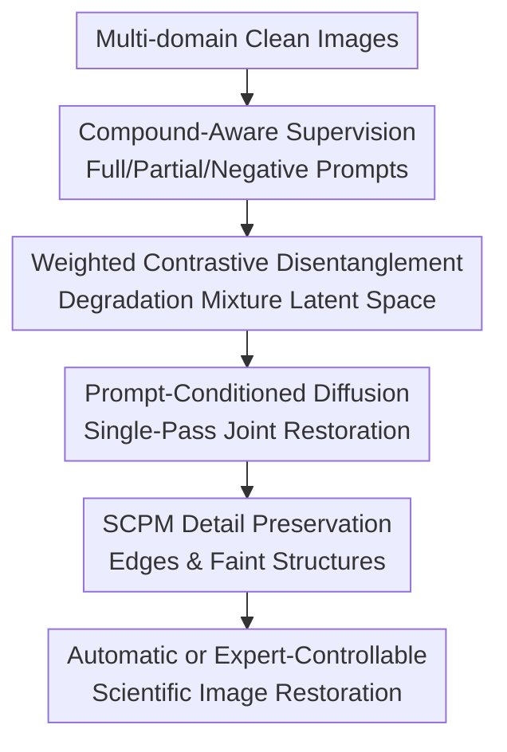

# Seeing Through the PRISM: Compound & Controllable Restoration of Scientific Images

**Conference**: ICLR2026  
**OpenReview**: [https://openreview.net/forum?id=CQ0U1wZYoy](https://openreview.net/forum?id=CQ0U1wZYoy)  
**Code**: Available (Claimed open-source in the paper, link not provided in the cache)  
**Area**: Image Restoration / Scientific Image Restoration  
**Keywords**: Compound Degradation, Controllable Image Restoration, Conditional Diffusion, Contrastive Disentanglement, Scientific Images  

## TL;DR
PRISM combines compound degradation samples, weighted contrastive disentangled CLIP representations, and text-conditional diffusion. This allows scientific images to undergo joint restoration of multiple mixed degradations in a single pass or selective correction based on expert prompts, outperforming existing all-in-one, diffusion, and composite restoration baselines in fidelity metrics, zero-shot compound restoration, and downstream scientific tasks.

## Background & Motivation
**Background**: Pre-processing for scientific and environmental imagery has long relied on specialized restorers, such as cloud/haze removal for remote sensing, denoising/super-resolution for microscopy, color correction for underwater imagery, and deconvolution for astronomical images. Recent all-in-one and blind image restoration attempts use a single model to cover multiple degradations, while diffusion models provide stronger generative priors and high-fidelity outputs for low-level vision tasks.

**Limitations of Prior Work**: Real-world scientific images are rarely affected by a single type of degradation. Satellite images may simultaneously exhibit sensor noise, clouds, haze, and lighting variations; camera traps encounter low-light at night, motion blur, and weather interference; microscopy often involves intertwined low signal-to-noise ratios, compression, and insufficient resolution. Chaining single-degradation models produces artifacts in early stages that are amplified in later ones, while removing all degradations indiscriminately might erase faint but scientifically significant signals.

**Key Challenge**: Scientific image restoration prioritizes "measurability, classification, segmentation, and inference" over "aesthetic appeal." This requires two capabilities: first, the model must understand and jointly process combinations of multiple degradations to avoid cascading errors; second, experts must be able to specify the removal of only certain degradations to preserve subtle structures or intensity distributions useful for current analysis.

**Goal**: The authors decompose the problem into three sub-goals: constructing data and benchmarks covering multiple scientific domains and degradation combinations; training a restoration model capable of mapping single and compound degradations into a unified compositional representation space; and verifying whether "controllable restoration" truly improves downstream scientific tasks like remote sensing, ecological monitoring, microscopy, and urban surveillance.

**Key Insight**: Compound degradations should not be treated merely as new categories to be memorized, but as combinations of degradation primitives in a latent space. If the model ensures "haze+rain" is closer to "haze-only" and "rain-only" than to unrelated "noise," unseen combinations can be interpreted through the geometric relationships of known primitives. The same geometric structure allows experts to intervene along specific degradation directions.

**Core Idea**: Generate compound degradation samples with full, partial, and negative prompts using compound-aware supervision. Align degradation primitives and mixtures into a compositional CLIP latent space via weighted contrastive learning. Finally, condition a latent diffusion restorer on this representation and natural language prompts.

## Method

### Overall Architecture
PRISM (Precision Restoration with Interpretable Separation of Mixtures) takes a scientific image with compound degradations and an optional natural language restoration prompt as input, outputting the restored image according to the prompt. During training, clean-degraded image pairs across multiple scientific domains are constructed. The CLIP image encoder is fine-tuned to retain image semantics while explicitly reflecting degradation combinations. The frozen CLIP encoder's representations, along with text prompts, then condition the UNet of Stable Diffusion v1.5 via cross-attention. An SCPM detail preservation module is integrated at the decoding stage.

During inference, PRISM operates in two modes. Experts can directly input free-text prompts like "remove fog and color shift" to generate conditions via the frozen CLIP text encoder. Alternatively, a lightweight MLP can predict multi-label degradation sets from image representations to automatically generate standardized prompts, such as "remove distortions x, y, z." Both modes utilize cross-attention within the diffusion model, completing restoration in a single denoising trajectory rather than a sequence of individual restorers.

### Key Designs
**1. Compound-aware supervision: Transforming "full fix, partial fix, and no fix" into training signals**

PRISM's dataset does not simply add random noise; it samples approximately 2 million clean images from sources like ImageNet, Sen12MS, iWildCam, EUVP, CityScapes, BioSR, brain tumor MRI, and Subaru/HSC astronomical images. Up to three degradations are superimposed per image. The degradation library covers geometric distortions, blur, photometric changes, and weather effects, with randomized parameters (e.g., blur kernel size, snowfall angle, color shift intensity). The resulting training triplets are $(I_{clean}, I_{dist}, p)$, where $p$ is the natural language restoration prompt.

The key is that prompts are not limited to "remove all degradations." Using GPT-4, the authors generate diverse expressions including partial prompts (requesting removal of a subset of mixed degradations) and negative prompts (requesting removal of degradations not present in the image). Partial prompts teach the model to "operate only along the specified degradation direction," while negative prompts enforce a constraint against over-restoration. For scientific imagery, this is more critical than standard data augmentation because signals and degradations can be visually similar; the model must know when to stop.

**2. Weighted contrastive disentanglement: Aligning mixtures with primitives in latent space**

Standard CLIP clusters by semantics (e.g., "satellite image," "microscopy image"), but restoration requires identifying the degradations. PRISM fine-tunes the CLIP image encoder while freezing the text encoder. For a clean image $I_{clean}$, $m$ degraded versions $I_{dist}^{(j)}$ are generated, yielding degradation embeddings $e_{dist}^{(j)}$ and a clean embedding $e_{clean}$. The contrastive loss pulls degraded images toward their clean counterparts while distinguishing them from sibling variants and other images in the batch.

Crucially, sibling variants are not repelled uniformly. Weights are defined by the Jaccard overlap of degradation sets $d^{(j)}$ and $d^{(k)}$:

$$
w_{jk}=\exp\left(1-\frac{|d^{(j)}\cap d^{(k)}|}{|d^{(j)}\cup d^{(k)}|}\right).
$$

If two samples share primitives like haze or blur, they are not pushed as far apart as completely unrelated degradations. The per-variant contrastive loss uses temperature $\tau=0.10$. This geometric constraint allows "haze+rain," "haze-only," and "rain-only" to form interpretable relationships in latent space, enabling restoration of unseen combinations and selective prompt control.

**3. Quality-aware regularization and Conditional Diffusion: Preventing drift and cascading errors**

Contrastive learning alone might drag clean image embeddings toward a "degradation-sensitive" direction. PRISM adds a quality-aware regularizer: for each degradation class $c$ in set $d^{(j)}$, it penalizes the probability of the classification head predicting that degradation on $e_{clean}$, denoted as $L_{qual}^{(j)}=\sum_{c\in d^{(j)}} \hat{p}(c \mid e_{clean})$. The final CLIP objective is $L_{CLIP}=\frac{1}{m}\sum_{j=1}^{m}(L_{ctr}^{(j)}+L_{qual}^{(j)})$. This tells the encoder: degraded images must identify their faults, but clean images must not show evidence of degradation.

After fine-tuning CLIP, PRISM freezes the encoders and concatenates the degradation-aware image vector with prompt text vectors, injecting them into Stable Diffusion v1.5 UNet blocks via learnable cross-attention. Unlike sequential restoration, PRISM simultaneously perceives "what degradations exist" and "which ones to remove," reducing cross-contamination and unifying full and selective restoration mechanisms.

**4. SCPM Detail Preservation: Reconciling diffusion priors with scientific microstructures**

While diffusion models have strong generative power, scientific restoration cannot rely solely on natural image priors. Faint fluorescence spots in microscopy, fine boundaries in remote sensing, and animal textures in ecology may be smoothed away. PRISM integrates the Semantic Content Preservation Module (SCPM) as a lightweight decoder-side refinement block to adaptively fuse encoder and decoder features during decoding.

The role of SCPM is not to replace diffusion restoration but to supplement the final output with edge, texture, and local structure fidelity. In scientific workflows, higher PSNR is meaningless if downstream segmentation or intensity measurement worsens; SCPM provides an avenue to preserve local semantics and structures, mitigating the risks of over-smoothing in latent diffusion.

### Key Experimental Results

### Main Results
PRISM was evaluated on the Mixed Degradations Benchmark (MDB) using manual prompt restoration. This test set includes images with up to three degradations. PRISM achieved the best results in PSNR, SSIM, and LPIPS, with an FID slightly higher than MPerceiver but overall the most balanced performance.

| Category | Method | PSNR ↑ | SSIM ↑ | FID ↓ | LPIPS ↓ |
|----------|------|--------|--------|-------|---------|
| All-in-One | PromptIR | 18.11 | 0.801 | 62.78 | 0.298 |
| Diffusion | DiffPlugin | 19.07 | 0.821 | 53.88 | 0.255 |
| Diffusion | MPerceiver | 20.84 | 0.829 | 48.18 | 0.235 |
| Diffusion | AutoDIR | 20.42 | 0.833 | 50.75 | 0.246 |
| Composite | OneRestore | 19.36 | 0.812 | 59.42 | 0.276 |
| PRISM | PRISM | 22.08 | 0.842 | 48.97 | 0.218 |

In zero-shot compound restoration, PRISM outperformed baselines on UIEB (underwater), POLED (under-display camera), and ThapaSet (fluid lensing), which contain complex distortions not explicitly seen during training. This demonstrates the effectiveness of the compositional latent geometry.

| Dataset | Method | PSNR ↑ | SSIM ↑ | LPIPS ↓ |
|--------|------|--------|--------|---------|
| UIEB | MPerceiver | 21.18 | 0.889 | 0.366 |
| UIEB | AutoDIR | 21.02 | 0.887 | 0.374 |
| UIEB | PRISM | 22.18 | 0.914 | 0.331 |
| POLED | MPerceiver | 17.55 | 0.669 | 0.436 |
| POLED | PRISM | 18.26 | 0.694 | 0.419 |
| ThapaSet | AutoDIR | 21.53 | 0.462 | 0.528 |
| ThapaSet | PRISM | 22.36 | 0.487 | 0.492 |

### Ablation Study
The analysis focuses on the roles of compound-aware supervision, contrastive disentanglement, and controllability. Results show that PRISM trained on compound samples is more stable than primitive-only versions as the number of degradations increases. Furthermore, compound-aware CLIP narrows the gap between sequential and composite prompting, proving it learns a structural representation rather than fixed prompt templates.

Downstream tasks also reveal that selective restoration significantly outperforms full restoration in microscopy and ecological monitoring.

| Domain Task | Degraded Input | Full Restoration | Selective Restoration | p-value |
|----------|----------------|------------------|------------------------|---------|
| Remote sensing Acc. ↑ | 0.781 ± 0.013 | 0.842 ± 0.011 | 0.836 ± 0.012 | 0.11 |
| Camera Traps Acc. ↑ | 0.921 ± 0.004 | 0.976 ± 0.008 | 0.984 ± 0.004 | 0.032 |
| Microscopy mIoU ↑ | 0.353 ± 0.015 | 0.475 ± 0.012 | 0.580 ± 0.010 | 0.018 |
| Urban scenes mIoU ↑ | 0.548 ± 0.018 | 0.615 ± 0.014 | 0.650 ± 0.012 | 0.041 |

### Key Findings
- Compound degradations cannot be solved by simply chaining "A then B." PRISM’s single-pass joint restoration reduced cascading errors, yielding a PSNR 1.24 higher than MPerceiver.
- Controllability is a functional requirement in science. In microscopy, super-resolution prompts alone achieved a segmentation mIoU of 0.580, whereas combined restoration dropped to 0.475 because denoising erased biological structures.
- Different tasks require different restoration strategies. Within the same BioSR input, segmentation favors structural enhancement, while fluorescence measurement favors intensity fidelity.

## Highlights & Insights
- PRISM treats "compound restoration" and "selective restoration" as the same representation problem, which is elegant. It uses latent space geometry to make the primitive-mixture relationship computable.
- The use of negative prompts is a highlight. Scientific scenarios require models to know "what not to do" to avoid treating weak signals as noise.
- Evaluating via downstream tasks rather than just aesthetic metrics is highly persuasive, clearly showing that no single "optimal" restored image exists for all workflows.

## Limitations & Future Work
- Training relies on synthetic augmentations, which may not capture all physical processes of real sensors. While zero-shot results are positive, rare instrument artifacts may still fall outside the primitive library.
- Current controllability focuses on "which degradation to remove" but lacks fine-grained control over intensity, spatial range (e.g., removing a cloud only in the corner), and confidence.
- Diffusion models are computationally intensive. Larger-scale remote sensing or high-throughput microscopy might require distillation or lighter-weight backbones.

## Related Work & Insights
- **vs PromptIR**: PromptIR uses prompts for multi-class restoration but focuses on fixed categories and general quality; PRISM focuses on compound supervision and scientific downstream tasks.
- **vs AutoDIR / DiffBIR**: These prioritize visual quality via automatic identification; PRISM emphasizes expert-driven selective control via compositional embeddings.
- **vs MPerceiver**: Both encode degradations as tokens, but PRISM uses weighted contrastive loss to constrain the latent relationship between mixtures and primitives.

## Rating
- Novelty: ⭐⭐⭐⭐☆ Systematically integrates compound supervision, contrastive disentanglement, and controllable diffusion for scientific tasks.
- Experimental Thoroughness: ⭐⭐⭐⭐⭐ Extensive evaluation across benchmarks, zero-shot sets, and downstream domains.
- Writing Quality: ⭐⭐⭐⭐☆ Clear motivation and case studies, though some structural details are compressed.
- Value: ⭐⭐⭐⭐⭐ Significant for scientific analysis fields where indiscriminate restoration is harmful.

<!-- RELATED:START -->

## Related Papers

- [\[ECCV 2024\] Seeing the Unseen: A Frequency Prompt Guided Transformer for Image Restoration](../../ECCV2024/image_restoration/seeing_the_unseen_a_frequency_prompt_guided_transformer_for_image_restoration.md)
- [\[ICML 2026\] PODiff: Latent Diffusion in Proper Orthogonal Decomposition Space for Scientific Super-Resolution](../../ICML2026/image_restoration/podiff_latent_diffusion_in_proper_orthogonal_decomposition_space_for_scientific_.md)
- [\[NeurIPS 2025\] Latent Harmony: Synergistic Unified UHD Image Restoration via Latent Space Regularization and Controllable Refinement](../../NeurIPS2025/image_restoration/latent_harmony_synergistic_unified_uhd_image_restoration_with_pre-trained_diffus.md)
- [\[CVPR 2026\] Disentanglement-wise Image Dehazing through Cross-Domain Manifold Consensus](../../CVPR2026/image_restoration/disentanglement-wise_image_dehazing_through_cross-domain_manifold_consensus.md)
- [\[CVPR 2026\] NEC-Diff: Noise-Robust Event–RAW Complementary Diffusion for Seeing Motion in Extreme Darkness](../../CVPR2026/image_restoration/nec-diff_noise-robust_event-raw_complementary_diffusion_for_seeing_motion_in_ext.md)

<!-- RELATED:END -->
