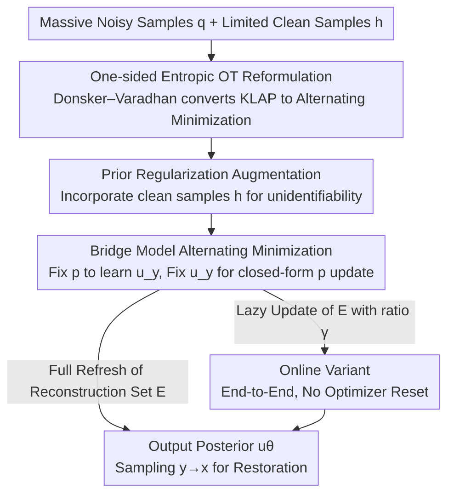

# SFBD-OMNI: Bridge Models for Lossy Measurement Restoration with Limited Clean Samples

**Conference**: ICLR 2026  
**OpenReview**: [https://openreview.net/forum?id=28IuGdneJQ](https://openreview.net/forum?id=28IuGdneJQ)  
**Code**: https://github.com/watml/SFBD-omni.git  
**Area**: Diffusion Models / Image Restoration / Inverse Problems  
**Keywords**: Distribution Restoration, Bridge Models, Entropic Optimal Transport, Identifiability, Weakly Supervised Generation

## TL;DR
When only massive corrupted measurements and almost no clean samples are available, this work reformulates the task of "restoring the true distribution from a corrupted one" as a **one-sided entropic Optimal Transport (OT)** problem. By using bridge models for alternating minimization, the proposed SFBD-OMNI framework handles arbitrary black-box corruptions (masking, grayscale, blurring, noise). It proves that restoration is possible with purely noisy samples when the corruption is identifiable; otherwise, as few as 50 clean images can steer the distribution back to the ground truth, significantly outperforming baselines like AmbientGAN, EMDiffusion, and SFBD in FID.

## Background & Motivation

**Background**: Diffusion models are among the most powerful frameworks for high-dimensional distribution modeling. However, like most generative models, they rely on large amounts of high-quality training data. In many real-world scenarios, the opposite is true—clean data is extremely expensive or impossible to obtain (e.g., medical X-rays requiring high radiation doses or terrestrial astronomical imaging requiring ideal atmospheric conditions), whereas **corrupted and noisy measurements are readily available**.

**Limitations of Prior Work**: Existing works for training generative models solely from corrupted samples are fragmented across specific corruption types. AmbientGAN utilizes a GAN min-max framework but requires the corruption process to be **differentiable** with respect to clean inputs and suffers from training instability (gradient vanishing, mode collapse). Ambient Diffusion is restricted to pixel masking, while SFBD only handles additive Gaussian noise. **No existing framework simultaneously** handles arbitrary corruption processes, provides theoretical restoration guarantees, and leverages the advantages of diffusion/bridge models.

**Key Challenge**: The root of the problem lies in the variational representation of the KL divergence used by GANs, which frames distribution restoration as an adversarial game. This path is inherently tied to "computing gradients through the corruption process" and adversarial instability. Furthermore, many practical corruptions (grayscaling, Gaussian blur) are **unidentifiable**—multiple distinct true distributions can collapse into the same corrupted distribution, making them mathematically indistinguishable using only noisy samples.

**Goal**: (1) Provide a unified solving framework for "corrupted measurement distribution restoration" applicable to any black-box corruption process; (2) Provide theoretical guarantees on recoverability (identifiability criteria) and how to remedy unidentifiability with limited clean samples; (3) Implement an end-to-end framework that avoids adversarial training.

**Key Insight**: Instead of the standard variational representation of KL divergence, the authors use the **Donsker–Varadhan variational principle** to rewrite the KL objective. They discovered that the problem is equivalent to an **entropic Optimal Transport (OT) with a one-sided marginal constraint**. This perspective naturally suggests an "alternating minimization" pipeline and only requires **black-box access** to the corruption process (sampling only, no gradients needed).

**Core Idea**: Reformulate the KLAP (Kullback–Leibler Ambient Projection) problem as a one-sided entropic OT. Use bridge models to learn the posterior and alternately update the distribution $p$ and the posterior $u_y$. Incorporate a "small clean sample prior" to resolve unidentifiable cases. This extends SFBD to arbitrary corruptions as **SFBD-OMNI**.

## Method

### Overall Architecture

Let the true clean distribution be $p_{\text{data}}$ and the corruption process be a black-box Markov kernel $r(y\mid x)$. The corresponding corruption operator $T_r$ maps the clean distribution to the corrupted distribution $q = T_r p_{\text{data}}$. The available data includes a massive set of noisy samples $E_{\text{noisy}}$ (from $q$) and a very small set of clean samples $E_{\text{clean}}$ (as few as 50). The goal is to restore $p_{\text{data}}$.

The classical approach (AmbientGAN) minimizes $D_{\text{KL}}(q \,\|\, T_r p)$, termed the **KLAP problem**. The key reformulation here is: after rewriting the KL using the Donsker–Varadhan principle, KLAP is equivalent to an alternating minimization:

$$\arg\min_p \min_{u_y} F_\lambda(p, u_y),$$

where $u_y$ is the "posterior distribution of clean sample $x$ given a corrupted observation $y$." This nested minimization corresponds exactly to an **EM-style alternating iteration**: solve for the posterior $u_y$ (learned via a bridge model) with fixed $p$, then update $p$ (closed-form) with fixed $u_y$. The pipeline involves pre-training the bridge model with minimal clean samples, then repeatedly performing "reconstruction-retraining" to push $p$ toward $p_{\text{data}}$. In unidentifiable cases, clean priors are injected to lock the solution to the correct branch.

### Key Designs

**1. One-sided Entropic OT Reformulation: Converting Adversarial Games via Donsker–Varadhan**

Direct Limitation: AmbientGAN represents $\min_p D_{\text{KL}}(q\|T_r p)$ via the variational form of $f$-divergence as a $\min_p \max_g$ adversarial game, inheriting all GAN-related issues (gradient through corruption, vanishing gradients, mode collapse). This work uses the Donsker–Varadhan principle $\log \mathbb{E}_{x\sim p}[e^{f_y(x)}] = \max_{u_y}\big(\mathbb{E}_{x\sim u_y}[f_y(x)] - D_{\text{KL}}(u_y\|p)\big)$, where $f_y(x)=\log r(y\mid x)$. Taking the expectation over $y\sim q$ yields:

$$D_{\text{KL}}(q\|T_r p) = \min_{u_y}\ \mathbb{E}_{y\sim q}\big[D_{\text{KL}}(u_y\|p) - \mathbb{E}_{x\sim u_y}[f_y(x)]\big] + C.$$

The beauty of this step is transforming the $\min_p\max_g$ adversarial game into a **dual minimization** over $p$ and $u_y$—no adversary, no discriminator. The authors further prove (Prop 3) that by setting cost $c(x,y)=-\log r(y\mid x)$, this objective is exactly an **entropic OT with only the $y$-marginal fixed**: $\Phi(p)=\min_{\pi\in\Pi_y(q)} \iint c\,\mathrm{d}\pi + D_{\text{KL}}(\pi\|p\otimes q)$. When the cost is quadratic (Gaussian corruption), the optimal coupling $\pi^*$ is the Schrödinger Bridge. Thus, "restoring the distribution" is interpreted as "finding $p$ such that the transport cost induced by the corruption kernel is minimized." This perspective eliminates adversarial training and only requires **black-box sampling** of $r(y\mid x)$ without needing differentiability.

**2. Augmented KLAP: Tackling Unidentifiable Corruptions with Limited Clean Priors**

Direct Limitation: Whether the corruption operator $T_r$ is **injective** determines recoverability (Prop 1). Additive Gaussian noise, independent pixel masking, and full-column rank linear transformations are injective (identifiable). However, operators like grayscaling or Gaussian blur (which discard high frequencies, effectively acting as projections in the Fourier domain) are **not injective**—the set of solutions satisfying $T_r p = T_r p_{\text{data}}$ forms a set $S(q)$, and noisy samples alone cannot distinguish $p_{\text{data}}$ from $S(q)$.

The solution is to add a prior regularization term to the objective:

$$J_\lambda(p) = D_{\text{KL}}(q\|T_r p) + \lambda\, D_{\text{KL}}(h\|p),$$

where $h$ is the empirical distribution of limited clean samples and $\lambda\ge 0$ is the regularization strength. The strict convexity of the second term ensures a unique optimal solution $p^*_\lambda$ when $\lambda>0$. Prop 2 provides a geometric intuition: as $\lambda\to 0$, the first term constrains $p$ within the solution set $S(q)$, while the second term selects the element $h^\dagger$ in $S(q)$ closest to the prior $h$ (the information projection of $h$ onto $S(q)$), so $p^*_\lambda\to h^\dagger$. For example, in grayscaling, noisy samples restore facial structure but not color; providing a few colored clean images as $h$ pulls the color distribution back. The paper also highlights a neglected point—**identifiability $\neq$ recoverability**: even if $T_r$ is injective, $q$ is only estimated from finite samples, and error magnification via $T_r^{-1}$ leads to poor sample complexity. Thus, even in identifiable cases, limited clean samples (as few as 50) are crucial for initializing $p_0$.

**3. SFBD-OMNI Alternating Minimization: Posteriors via Bridge Models + Closed-form Updates**

Direct Limitation: To make alternating minimization practical, the two sub-problems must be solvable. This work proves both have **closed-form solutions**:

$$u_y^k(x) = \frac{p^k(x)\, r(y\mid x)}{T_r p^k(y)},\qquad p^{k+1}(x) = \frac{1}{1+\lambda}\tilde p^{k+1}(x) + \frac{\lambda}{1+\lambda} h(x),$$

where $\tilde p^{k+1}(x)=\int q(y)\, u_y^k(x)\,\mathrm{d}y$. The first equation shows $u_y^k$ is the posterior of $x$ under the joint distribution $\pi(x,y)=p^k(x)\,r(y\mid x)$. The second shows the new $p$ is a "convex combination of the reconstructed distribution $\tilde p$ and the clean prior $h$." While $u_y$ cannot be written explicitly, it is **exactly what bridge models excel at**: given pairs $(x,y)$, the bridge model interpolates a transfer path between $x$ and $y$, learning the posterior $u_\theta(x\mid y)$ via the Conditional Drift Matching loss $L_{\text{CDM}}$, with sampling mirroring diffusion models. The algorithm (Alg 1) pre-trains $u_\theta$ with minimal clean samples, then cycles: reconstruct $x$ for each noisy $y$ using current $u_\theta$ to form a set $E$ (approximating $\tilde p$), then continue training $u_\theta$ targeting $p=\frac{1}{1+\lambda}p_E+\frac{\lambda}{1+\lambda}h_{E_{\text{clean}}}$. When $\lambda=0$ and corruption is Gaussian, SFBD-OMNI **degenerates to the original SFBD**; it also covers heuristic update rules from EMDiffusion but provides convergence proofs.

**4. Online Variant: End-to-End training via "Lazy Refresh"**

Direct Limitation: Alg 1 oscillates between "training" and "sampling," causing the reconstruction set $E$ to change drastically each round. This invalidates Adam's historical momentum, necessitating optimizer resets; moreover, forcing convergence each round leads to overfitting on the current $p^k$. The online variant (Alg 2) refreshes only a **ratio $\gamma$** of samples in $E$ per round, updating $\tilde p$ as a lazy moving average:

$$\tilde p^{k+1}(x) = \gamma\int q(y)\,u_y^k(x)\,\mathrm{d}y + (1-\gamma)\,\tilde p^k(x).$$

Setting $\gamma=1$ recovers standard SFBD-OMNI. Since $E$ evolves slowly, $u_\theta$ can be **optimized continuously without resetting the optimizer**, speeding up convergence. Prop 4 proves this lazy update still converges to the optimal $p^*_\lambda$ for any $\gamma\in(0,1]$ and provides a bound $\min_k D_{\text{KL}}(q\|T_r p^k)\le D_{\text{KL}}(h^\dagger\|p_0)/(\gamma K)$. Notably, while a smaller $\gamma$ implies a slower bound, the smaller changes in $E$ allow the network to converge in fewer steps and maintain optimizer state, potentially **reducing total training time**.

### Loss & Training
The posterior $u_\theta(x\mid y)$ is parameterized using **flow matching** (faster convergence and lower variance than diffusion, efficient for training against moving targets). A small Gaussian perturbation is added to endpoint $y$ to prevent deterministic path collapse. Non-leaky augmentation is used to suppress overfitting. The clean sample weight $\frac{\lambda}{1+\lambda}$ is set to 0 for identifiable cases and 0.2 for unidentifiable ones in standard SFBD-OMNI; the online variant uses 0.2 for stability across all cases. The noise set refresh ratio defaults to $\gamma=0.002$, updated at the end of each epoch. Evaluation uses FID (generated 50k images vs reference set).

## Key Experimental Results

### Main Results

FID results (lower is better) on CIFAR-10 (32×32) and CelebA (64×64) across various corruptions. All methods except Noise2Self were pre-trained with only **50 random clean images**. ✓ indicates identifiability, ✗ indicates lack thereof.

| Dataset | Corruption | Identifiable | SFBD-OMNI | Online SFBD-OMNI | Strongest Baseline |
|---------|------------|:------------:|:---------:|:----------------:|:------------------:|
| CIFAR-10| Pixel Masking (p=0.6)| ✓ | 21.31 | 22.43 | EMDiffusion 21.08 |
| CIFAR-10| Additive Gaussian (σ=0.2)| ✓ | **10.81** | 11.06 | SFBD 13.53 |
| CIFAR-10| Grayscale | ✗ | 32.61 | **31.32** | EMDiffusion 115.11 |
| CelebA | Gaussian Blur (k=9,σ=2)| ✗ | 11.60 | **10.28** | EMDiffusion 91.89 |
| CelebA | Grayscale | ✗ | 11.85 | **11.21** | EMDiffusion 59.04 |

Except for pixel masking (comparable to EMDiffusion), SFBD-OMNI and its online variant lead significantly, **especially in unidentifiable corruptions** (Grayscale 31-32 vs EMDiffusion 59-115, Gaussian Blur 10 vs 92). Note that in identifiable cases, the online variant's non-zero clean weight causes the solution to deviate slightly from the true distribution, yielding higher FID than standard SFBD-OMNI (e.g., Gaussian 11.06 vs 10.81), whereas in unidentifiable cases, this regularization is essential.

### Ablation Study

| Configuration | Key Phenomenon | Explanation |
|---------------|----------------|-------------|
| Clean weight $\frac{\lambda}{1+\lambda}$ scan | Unidentifiable: weight too small converges to arbitrary $S(q)$ element; too large biases toward prior | An optimal intermediate value exists; regularization is redundant/harmful for identifiable cases |
| Clean sample count (Grayscale, CelebA) | More is better but with **diminishing returns** | More clean samples make $h_{\text{clean}}$ closer to $p_{\text{data}}$, refining both initialization and the limit distribution |
| Refresh ratio $\gamma$ (Gaussian σ=0.5, 2k clean) | Large $\gamma$ (0.5) drops fast initially but FIDs diverge/bounce after epoch 6; Small $\gamma$ is more stable and reaches lower final FID | $E$ refreshes too quickly for the model to adapt |
| Pure noise, no clean samples (Gaussian σ=0.2, λ=0)| FID drops monotonically but saturates at **80.37** | Far worse than 10.81 achieved with only 50 clean images |

### Key Findings
- **Identifiability $\neq$ Recoverability**: Even when the corruption is injective (identifiable via pure noise in theory), magnifying errors from finite samples through $T_r^{-1}$ leads to a poor FID (80.37). Adding just 50 clean images drops this to 10.81—the value of clean samples for **initialization** $p_0$ is severely underrated.
- **Context-aware Clean Weights**: If unidentifiable, $\lambda>0$ is critical (prevents converging to random elements of $S(q)$); if identifiable, clean samples should only be used for initialization, with regularization ideally turned off during training. This aligns perfectly with identifiability theory.
- **Small $\gamma$ is Stable and Efficient**: Lazy updates allow the reconstruction set to evolve slowly, giving the model time to adapt, resulting in lower FID and saved time due to the lack of optimizer resets.
- The method remains effective for high-res Satellite/MRI data (Poisson, Compressed Sensing), though residual artifacts suggest **production-grade reconstruction might still require domain priors**.

## Highlights & Insights
- **The "De-adversarialized" Distribution Restoration**: By switching to the Donsker–Varadhan representation, the KL objective transforms from a GAN min-max game into a pure alternating minimization. This bridges "corrupted restoration," "OT," and "Bridge Models" into a single framework.
- **Black-box Corruption Access**: Unlike AmbientGAN, which requires differentials, this method only needs to sample $r(y\mid x)$, making it applicable to non-differentiable simulators (compressed sensing, complex imaging chains).
- **Engineering insight from "50 images"**: In weak/unsupervised generation, obtaining a few dozen clean samples for priors and initialization is far more cost-effective than simply increasing noisy sample counts.
- **Lazy Refresh for Moving Targets**: For training against moving targets (self-distillation, EM, replay buffers), slowly refreshing the target set without resetting the optimizer is a broadly applicable stabilization trick.

## Limitations & Future Work
- Residual artifacts in high-res Satellite/MRI tasks suggest **production-level restoration likely needs problem-specific designs**; a universal framework is not necessarily plug-and-play.
- The online variant fixes a non-zero clean weight for stability, which causes **systemic deviations** in identifiable cases. Whether weights can be self-adaptive or if identifiability can be detected online remains unexplored.
- Experiments were conducted at CIFAR-10/CelebA scales (32-64 res). Stability and cost at higher resolutions remain open questions.
- Convergence guarantees rely on "mild assumptions" and full-support kernels (enforced by infinitesimal Gaussian noise). Proofs might be less robust if corruptions deviate severely from these settings.

## Related Work & Insights
- **vs SFBD (Lu et al., 2025)**: SFBD only handles Gaussian noise using diffusion backward SDE relationships across $[0, \tau]$. This work proves SFBD is a special case of SFBD-OMNI ($\lambda=0$, Gaussian) but generalizes to **arbitrary corruptions** using bridge models and solves unidentifiable cases.
- **vs AmbientGAN (Bora et al., 2018)**: Both minimize KL between corrupted distributions, but AmbientGAN uses GAN min-max, requires differentiability, cannot handle unidentifiability, and is unstable. Ours uses alternating minimization, black-box access, and prior regularization.
- **vs EMDiffusion (Bai et al., 2024)**: EMDiffusion's heuristic iteration matches SFBD-OMNI at $\lambda=0$. However, it lacks convergence proofs and cannot handle unidentifiability; this work provides proofs and the online/prior mechanisms.

## Rating
- Novelty: ⭐⭐⭐⭐⭐ The Donsker–Varadhan perspective unifying corrupted restoration as one-sided entropic OT solved via bridge models is both theoretically and algorithmically novel.
- Experimental Thoroughness: ⭐⭐⭐⭐ Coverage of 5 corruptions, 4 ablations, and Satellite/MRI extensions, though resolution and dataset scales are relatively small.
- Writing Quality: ⭐⭐⭐⭐⭐ Clear theoretical derivations, excellent treatment of identifiability and geometric intuition.
- Value: ⭐⭐⭐⭐⭐ Dealing with "abundant measurements, scarce ground truth" is a universal reality in medicine, astronomy, and remote sensing. The black-box plus minimal clean sample paradigm is highly practical.

<!-- RELATED:START -->

## Related Papers

- [\[ICLR 2026\] Energy-oriented Diffusion Bridge for Image Restoration with Foundational Diffusion Models](energy-oriented_diffusion_bridge_for_image_restoration_with_foundational_diffusi.md)
- [\[ICLR 2026\] Text-Aware Image Restoration with Diffusion Models](text-aware_image_restoration_with_diffusion_models.md)
- [\[NeurIPS 2025\] Audio Super-Resolution with Latent Bridge Models](../../NeurIPS2025/image_restoration/audio_super-resolution_with_latent_bridge_models.md)
- [\[ICLR 2026\] Optimizing ID Consistency in Multimodal Large Models: Facial Restoration via Alignment, Entanglement, and Disentanglement](optimizing_id_consistency_in_multimodal_large_models_facial_restoration_via_alig.md)
- [\[CVPR 2025\] Prior Does Matter: Visual Navigation via Denoising Diffusion Bridge Models](../../CVPR2025/image_restoration/prior_does_matter_visual_navigation_via_denoising_diffusion_bridge_models.md)

<!-- RELATED:END -->
