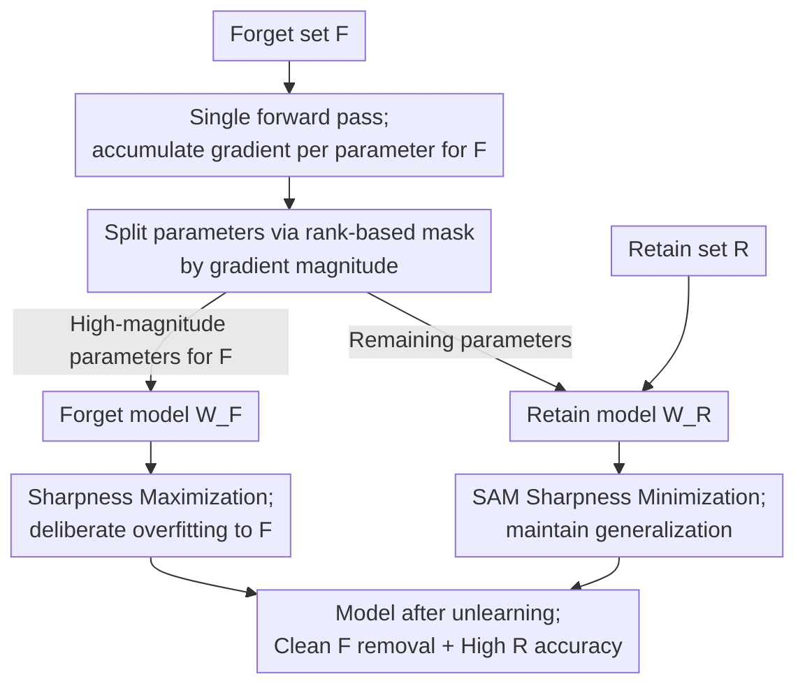

# Sharpness-Aware Machine Unlearning

**Conference**: ICLR 2026  
**arXiv**: [2506.13715](https://arxiv.org/abs/2506.13715)  
**Code**: None  
**Area**: Image Restoration  
**Keywords**: machine unlearning, Sharpness-Aware Minimization, SAM, Signal-Noise Decomposition, Sharp MinMax

## TL;DR

This work systematically analyzes the theoretical properties of SAM in machine unlearning scenarios from the perspective of signal-noise decomposition. It finds that SAM "relinquishes" denoising capabilities on the forget set while maintaining advantages on the retain set. Consequently, the authors propose Sharp MinMax, which splits the model into two parts to perform sharpness minimization (for retention) and sharpness maximization (for forgetting) respectively, achieving SOTA unlearning performance.

## Background & Motivation

Machine Unlearning aims to efficiently remove the influence of specific training data on a model without retraining from scratch. While existing methods such as influence function updates (Influence Unlearning), sparse fine-tuning (L1-Sparse), and gradient ascent (NegGrad) have made progress, they lack deep theoretical understanding of the unlearning process, often relying on extensive hyperparameter tuning and exhibiting unpredictable behavior in practice.

The Key Challenge lies in the interference or cancellation between "retain signals" and "forget signals" during training. Specifically, there has been a lack of reliable theoretical guidance on **how to achieve a balance between accuracy on retained data and thoroughness of forgetting on target data**.

Sharpness-Aware Minimization (SAM) has been proven to find flatter loss minima, effectively suppressing noise memorization and improving generalization. A natural hypothesis is: Does an optimizer adept at suppressing memorization also excel at "unlearning"? This paper conducts in-depth theoretical and experimental research on this question.

## Method

### Overall Architecture

This paper addresses whether SAM, known for suppressing noise memorization and finding flat minima, can facilitate the "unlearning" of specific data. To clarify this, the authors first establish an analytical framework and then propose a specific algorithm based on it. The analytical part utilizes a two-layer CNN to decompose each weight update into a signal learning coefficient $\kappa$ and a noise memorization coefficient $\zeta$, precisely tracking the differing trajectories of SGD and SAM during NegGrad unlearning. In this setup, each image patch carries either a class signal $y_i\varphi$ or irrelevant noise $\xi_i$. Unlearning uses a dual-objective loss $\mathcal{L}_{\text{NegGrad}}=\alpha\,\mathcal{L}(\mathcal{R})-(1-\alpha)\,\mathcal{L}(\mathcal{F})$, performing gradient descent on the retain set $\mathcal{R}$ and gradient ascent on the forget set $\mathcal{F}$. Theoretically, three conclusions are derived (selective failure of SAM's denoising capability, differentiated error bounds, and a theoretical threshold for the retain weight $\alpha$), pointing to the counter-intuitive fact: SAM is only effective on the retain set and degrades to standard SGD on the forget set. The proposed algorithm leverages this by splitting the model into a "forget model $W_F$" and a "retain model $W_R$" based on the gradient magnitude relative to the forget set. Sharpness maximization is applied to the former, while SAM sharpness minimization is applied to the latter, forming the Sharp MinMax approach. The data flow of Sharp MinMax is as follows:

### Key Designs

**1. Selective Failure of SAM’s Denoising Capability: Explaining why SAM is no longer a universal remedy in unlearning**

While it is generally assumed that the flat minima found by SAM suppress noise memorization, Lemma 3.1 proves that this benefit only holds for half of the data in unlearning scenarios. The SAM perturbation term $\hat\epsilon$ adds noise in the direction of loss ascent before gradient calculation. On the retain set $\mathcal{R}$, this deactivates noise neurons and maintains denoising properties. However, NegGrad performs gradient ascent on the forget set $\mathcal{F}$, which reverses the effect of $\hat\epsilon$, keeping the noise neurons of the forget set active. Consequently, SAM degrades to standard SGD on $\mathcal{F}$, resulting in a degree of overfitting comparable to SGD—a precursor to the idea that "deliberate overfitting aids unlearning."

**2. Differentiated Error Bounds Determined by Signal Strength: Quantifying the safety margin of SAM**

Theorems 3.2 and 3.3 attribute "successful generalization after unlearning" to a signal strength threshold. Under SGD, benign overfitting only occurs when $\|\varphi\|_2\geq C_1 d^{1/4}n^{-1/4}P\sigma_p$; otherwise, harmful overfitting occurs, leading to test error $\geq 0.1$. SAM significantly relaxes this threshold: even if the signal is as weak as $\|\varphi\|_2\geq\Omega(1)$, low test error can be maintained provided the retain set has sufficient signal. This gap stems from Design 1—SAM's denoising properties on the retain set are not compromised, making it safe across a wider range of signal intensities.

**3. Theoretical Threshold for Retain Weight $\alpha$: Turning hyperparameter tuning into a computable quantity**

In practice, a smaller $\alpha$ emphasizes forgetting but can degrade retain accuracy, traditionally requiring manual tuning. Lemma 3.4 provides a basis for this: the signal learning rate of SAM on the retain set is $\Theta(\|\varphi\|_2^2)$ times that of SGD, allowing it to tolerate a smaller $\alpha$. Within the benign overfitting range, the required $\alpha$ thresholds for SGD and SAM differ by an order of $O(\sqrt{d/n})$. Thus, the optimal $\alpha$ is determined not only by the ratio of retain to forget samples but also by signal strength $\|\varphi\|_2$ and data dimension $d$, providing the first estimable lower bound for $\alpha$ rather than a purely heuristic one.

**4. Sharp MinMax: Translating "SAM is only effective for the retain set" into an algorithm**

Since SAM provides advantages for the retain set but degrades for the forget set, the algorithm assigns different roles to model components. The authors first pass the forget set $\mathcal{F}$ through the model to accumulate gradients for each parameter and create a weight mask based on gradient magnitude ranking (Fan et al., 2023). Parameters with the most significant high magnitudes for $\mathcal{F}$ are assigned to the "forget model $W_F$," while the rest are assigned to the "retain model $W_R$." Opposing sharpness regularizations are then applied: the retain model uses SAM for sharpness minimization $\min_{W_R}\mathcal{L}+[\max_{\hat\epsilon}\mathcal{L}(W_R+\hat\epsilon)-\mathcal{L}(W_R)]$ to protect generalization via flat minima; the forget model performs sharpness maximization $\min_{W_F}\mathcal{L}-[\max_{\hat\epsilon}\mathcal{L}(W_F+\hat\epsilon)-\mathcal{L}(W_F)]$ to push the loss landscape toward sharpness. Doing so induces deep overfitting to the forget set—following the logic that "the better it is remembered, the more thoroughly it can be erased." While the objectives differ only by a sign, this directly materializes the counter-intuitive observation from Design 1 into a SOTA unlearning strategy. Notably, $W_F$ requires higher signal strength than SGD to avoid harmful overfitting. Additionally, the authors utilize the memorization score $\text{mem}(\mathcal{A},\mathcal{S},i)$ from Feldman & Zhang (2020) to quantify unlearning difficulty, categorizing the forget set into $\mathcal{F}_{\text{high}},\mathcal{F}_{\text{mid}},\mathcal{F}_{\text{low}}$ for graded evaluation.

## Key Experimental Results

### Experimental Setup
- Datasets: CIFAR-100, ImageNet-1K (Main), CIFAR-10, Tiny-ImageNet (Supplementary)
- Model: ResNet-50
- Forget set size: $|\mathcal{F}| \approx 5\%|\mathcal{S}|$, split by memorization score into $\mathcal{F}_{\text{high}}, \mathcal{F}_{\text{mid}}, \mathcal{F}_{\text{low}}$
- Metric: ToW (Tug-of-War), a composite measure of retain accuracy, forget accuracy, and test accuracy
- Baselines: NegGrad, RL, SalUn, L1-Sparse, SCRUB

### Main Results

| Method | ImageNet AVG ToW | CIFAR-100 AVG ToW | Description |
|------|-----------------|-------------------|------|
| NegGrad+SGD | 83.83 | 81.80 | Baseline |
| NegGrad+SAM 0.1 | 83.68 | 72.78 | SAM as $\mathcal{U}$ |
| NegGrad+ASAM 1.0 | 84.84 | 83.11 | Best NegGrad variant |
| Sharp MinMax+ASAM 1.0 | ~87.90 | ~87.90 | **New SOTA** |

### Ablation Study

| Configuration | Key Metric | Description |
|------|---------|------|
| Reducing $\alpha$ | SAM shows stronger decay resistance | SGD collapses first; ASAM 1.0 is most robust |
| MIA Accuracy | Consistently lowered by SAM | Forget set is harder to identify by Membership Inference Attacks |
| Feature Entanglement $E_{Wp}$ | SAM < SGD | SAM achieves better separation of retain/forget features after unlearning |

### Key Findings

1. **SAM consistently improves all unlearning methods**: Whether used as a pre-training algorithm or an unlearning algorithm, SAM enhances the ToW metric.
2. **Overfitting can benefit unlearning**: In strict sample-level unlearning scenarios (e.g., privacy/copyright), deliberately making the model overfit to the forget set is actually more effective—challenging the conventional wisdom that "overfitting is always harmful."
3. **SGD sometimes achieves lower forget accuracy**: Although SAM has a higher ToW, SGD occasionally reaches lower accuracy on the forget set, confirming theoretical predictions that SGD overfits more deeply to the forget set.
4. **Loss landscape visualization**: Models pre-trained with SAM are flatter. Interestingly, SGD becomes flatter after unlearning, suggesting a potential implicit regularization effect.

## Highlights & Insights

- **Significant Theoretical Contribution**: This work is the first to analyze SAM's behavior in machine unlearning under a rigorous signal-noise framework, proving the "selective failure" of SAM’s denoising properties—a counter-intuitive yet vital discovery.
- **Connecting Optimization and Unlearning**: By deeply integrating sharpness-aware optimization with machine unlearning, it provides theoretical guidance for $\alpha$ selection, moving away from purely heuristic tuning.
- **Elegant Sharp MinMax Design**: Leveraging the insight that "overfitting = good unlearning," the model is split into complementary parts to maintain generalization while enhancing unlearning.
- **Wasserstein Entanglement Metric**: The proposed feature entanglement measure $E_{Wp}$ based on optimal transport is more capable of distinguishing irregularly shaped feature distributions than variance-based entanglement $E_{\text{Var}}$.

## Limitations & Future Work

1. **Missing Theory for Weak Signal Regime**: When the retain signal strength is $O(1)$, SAM's behavior is not fully characterized, and harmful overfitting might occur.
2. **Interaction between $\alpha$ and Model Split Ratio**: The theoretical interaction between the retain weight $\alpha$ and the proportion of the forget model has not been analyzed.
3. **Two-layer CNN Assumption**: The theoretical analysis is based on a two-layer CNN; extending this to deep networks requires additional work.
4. **"Regularization" Effect of SGD after Unlearning**: The observation that the loss landscape becomes flatter after SGD unlearning remains unexplained.
5. **Computational Overhead**: SAM itself requires two forward/backward passes, and Sharp MinMax adds the cost of model splitting.

## Related Work & Insights

- **Relationship with SalUn**: SalUn also performs selective parameter unlearning but uses random label flipping; Sharp MinMax replaces this with sharpness maximization, which is more theoretically grounded.
- **Relationship with SCRUB**: SCRUB is based on knowledge distillation and NegGrad; SAM can be used as a plug-in to directly enhance its performance.
- **Implications for Privacy Unlearning**: The finding that "overfitting benefits unlearning" provides important guidance for designing unlearning algorithms that satisfy differential privacy constraints.
- **Implications for LLM Unlearning**: The framework may extend to Large Language Model unlearning (e.g., knowledge editing, concept erasure), especially given that SAM is already widely used in LLM fine-tuning.

## Rating
- Novelty: ⭐⭐⭐⭐⭐
- Experimental Thoroughness: ⭐⭐⭐⭐⭐
- Writing Quality: ⭐⭐⭐⭐
- Value: ⭐⭐⭐⭐⭐

<!-- RELATED:START -->

## Related Papers

- [\[ICLR 2026\] Text-Aware Image Restoration with Diffusion Models](text-aware_image_restoration_with_diffusion_models.md)
- [\[CVPR 2025\] Classic Video Denoising in a Machine Learning World: Robust, Fast, and Controllable](../../CVPR2025/image_restoration/classic_video_denoising_in_a_machine_learning_world_robust_fast_and_controllable.md)
- [\[ICLR 2026\] Texture Vector-Quantization and Reconstruction Aware Prediction for Generative Super-Resolution](texture_vector-quantization_and_reconstruction_aware_prediction_for_generative_s.md)
- [\[ICLR 2026\] Trajectory-aware Shifted State Space Models for Online Video Super-Resolution](trajectory-aware_shifted_state_space_models_for_online_video_super-resolution.md)
- [\[ICLR 2026\] Content-Aware Mamba for Learned Image Compression](content-aware_mamba_for_learned_image_compression.md)

<!-- RELATED:END -->
