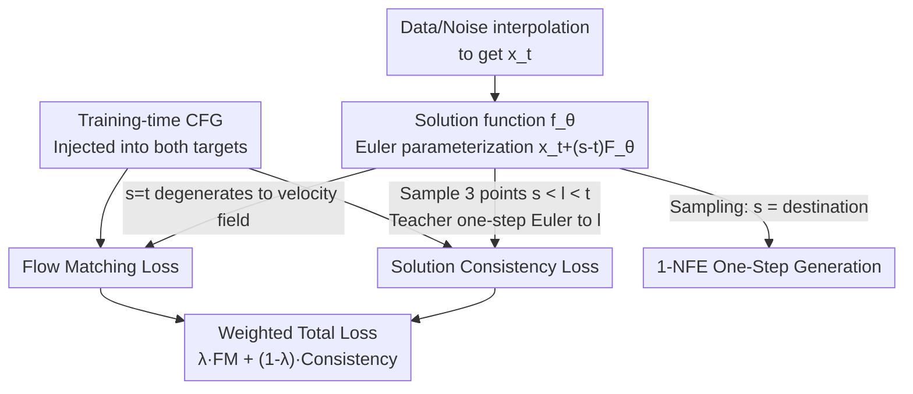

# SoFlow: Solution Flow Models for One-Step Generative Modeling

**Conference**: ICLR 2026  
**arXiv**: [2512.15657](https://arxiv.org/abs/2512.15657)  
**Code**: [https://github.com/zlab-princeton/SoFlow](https://github.com/zlab-princeton/SoFlow)  
**Area**: Diffusion Models / One-step Generation  
**Keywords**: solution function, flow matching, one-step generation, consistency loss, JVP-free

## TL;DR
The paper proposes Solution Flow Models (SoFlow), which directly learn the solution function $f(x_t, t, s)$ of a velocity ODE (mapping $x_t$ at time $t$ to the solution at time $s$). Trained from scratch using a combination of Flow Matching loss and a JVP-free solution consistency loss, it achieves superior 1-NFE FID compared to MeanFlow on ImageNet 256 (XL/2: 2.96 vs 3.43).

## Background & Motivation

**Background**: Consistency models (CM/iCT/ECT/sCT) and MeanFlow enable few-step or one-step generation. However, Flow Matching anchoring in MeanFlow requires expensive JVP computations (poorly optimized in PyTorch), and consistency models trained from scratch struggle to utilize CFG.

**Limitations of Prior Work**: (a) JVP efficiency is low in deep learning frameworks as it is neither standard forward nor backward propagation; (b) Consistency training objectives are unstable due to stop-gradient pseudo-target drift; (c) One-step models trained from scratch do not support training-time CFG.

**Key Challenge**: To achieve a "one-step jump to the destination," existing methods require either JVP (slow) or suffer from unstable training targets (poor quality).

**Goal**: Design a one-step generation framework that is JVP-free, supports training-time CFG, and can be trained from scratch.

**Key Insight**: Instead of learning the velocity field and then integrating (as in Flow Matching), one should learn the ODE solution function $f(x_t, t, s)$ directly. The solution function naturally satisfies two properties: (1) Initial condition $f(x_t, t, t) = x_t$; (2) ODE consistency. The second property can be approximated with a consistency loss that avoids JVP.

**Core Idea**: Learn the ODE solution function instead of the velocity field, using consistency across three time points $(s, l, t)$ to replace JVP for ensuring ODE consistency.

## Method

### Overall Architecture

SoFlow aim for a "one-step jump from noise directly to data." While traditional Flow Matching learns a velocity field $v(x_t, t)$ requiring multi-step ODE integration, SoFlow learns the ODE **solution function** $f_\theta(x_t, t, s)$. It takes the noisy sample $x_t$, the current time $t$, and the target time $s$, providing the solution at $s$ in a single forward pass. For inference, setting $s$ as the destination yields 1-NFE generation. The training loss is a weighted sum: $\lambda$ Flow Matching loss + $(1-\lambda)$ solution consistency loss. The former anchors the solution to a velocity field and enables training-time CFG, while the latter ensures self-consistency across different time points.

### Key Designs

**1. Solution Consistency Loss: Replacing JVP with Three-Point Consistency**

This design eliminates the JVP overhead found in MeanFlow, where consistency requires the partial derivative of the velocity field with respect to time. SoFlow formulates consistency on the solution function: a true solution must satisfy transitivity $f(x_t, t, s) = f(f(x_t, t, l), l, s)$. During training, three time points $s < l < t$ are sampled, and the model minimizes:

$$\big\|f_\theta(x_t, t, s) - f_{\theta^-}\big(x_t + (\alpha_t' x_0 + \beta_t' x_1)(l-t),\, l,\, s\big)\big\|^2$$

where the intermediate point at $l$ is obtained via a one-step Euler move by the teacher model $f_{\theta^-}$ (stop-gradient). This objective uses only forward passes, removing JVP entirely.

**2. Flow Matching Loss: Solution Function as a Velocity Field at $s=t$**

Consistency alone lacks a regression target and can drift. At $s \to t$, the solution function's behavior is equivalent to a velocity field: $\partial_3 f(x_t, t, s)|_{s=t} = v(x_t, t)$. By using Euler parameterization $f_\theta(x_t, t, s) = x_t + (s-t) F_\theta(x_t, t, s)$, then $F_\theta(x_t, t, t) = v_\theta(x_t, t)$ acts as a velocity field. This allows the network to be trained as a velocity predictor at $s=t$ (providing a stable FM target) while acting as a solution function at $s \neq t$.

**3. Training-time CFG: Addressing the One-Step Bottleneck**

Since 1-NFE generation lacks intermediate states for CFG application during inference, the guidance must be learned during training. In SoFlow, the FM component regresses toward the guided velocity $w(\alpha_t' x_0 + \beta_t' x_1) + (1-w) v_{\text{uncond}}$. The consistency loss then uses the model's own predicted guided velocity to replace high-variance targets, ensuring stability. Ablations show CFG improves B/4 FID from 44.64 to 14.92.

### Loss & Training
- DiT Architecture (B/4, L/2, XL/2), latent space (SD-VAE).
- $\lambda = 0.8$ Flow Matching + $0.2$ Consistency.
- Time sampling: logit-normal distribution.
- Adaptive Huber loss ($p=0.5$ or $1$) for robustness against outliers.

## Key Experimental Results

### Main Results (ImageNet 256×256, 1-NFE)

| Model Size | MeanFlow FID | **SoFlow FID** | Gain |
|---------|-------------|--------------|------|
| B/2 | 6.17 | **4.85** | -1.32 |
| M/2 | 5.01 | **3.73** | -1.28 |
| L/2 | 3.84 | **3.20** | -0.64 |
| XL/2 | 3.43 | **2.96** | -0.47 |

### Ablation Study

| Configuration | FID (B/4) |
|------|----------|
| 100% Consistency, 0% FM | 53.78 |
| 20% FM + 80% Consistency | 47.65 |
| 80% FM + 20% Consistency | **44.64** |
| MSE ($p=0$) | 62.93 |
| Huber ($p=0.5$) | **44.64** |
| No CFG | 44.64 |
| With CFG ($w=1.0$) | **14.92** |

### Key Findings
- SoFlow outperforms MeanFlow across all model sizes given identical architecture and training steps.
- An 80% FM loss ratio is optimal; excessive consistency loss is detrimental as FM provides the stable velocity field guidance.
- Huber loss significantly outperforms MSE (62.93 → 44.64), indicating robustness is vital for large-error samples.
- Training-time CFG is the primary driver of quality (44.64 → 14.92).

## Highlights & Insights
- **JVP-free** is the primary practical advantage: PyTorch JVP is 2-4× slower than standard backward passes. SoFlow simplifies implementation using only forward passes.
- The shift from **Velocity Field to Solution Function** is insightful: learning the "answer" (solution) rather than the "direction" (velocity) naturally bypasses integration.
- **Training-time CFG** solves the fundamental problem that 1-step models have no intermediate trajectory to apply traditional guidance.

## Limitations & Future Work
- XL/2 FID (2.96) still lags behind multi-step SiT/DiT (~2.0 with 250 steps); the upper bound of one-step quality needs improvement.
- Evaluation is limited to ImageNet 256, lacking verification on 512/1024 or T2I tasks.
- The solution function requires an extra $s$ input via positional embedding, increasing design complexity.
- Lacks direct comparison with the latest consistency methods like sCT or IMM.

## Related Work & Insights
- **vs MeanFlow**: Key differences are the JVP-free approach and solution parameterization. SoFlow shows consistent gains (-0.47 to -1.32 FID).
- **vs Consistency Models (iCT/sCT)**: shares the consistency philosophy, but SoFlow's solution consistency is more general (supports arbitrary $(t, s)$ pairs) and natively supports training-time CFG.
- **vs Shortcut/IMM**: both map arbitrary time pairs, but SoFlow is derived from the mathematical properties of ODE solution functions.

## Rating
- Novelty: ⭐⭐⭐⭐ Innovative solution learning and JVP-free loss.
- Experimental Thoroughness: ⭐⭐⭐⭐ Extensive ablations and scaling tests, though limited to low resolution.
- Writing Quality: ⭐⭐⭐⭐⭐ Clear mathematical derivations and tight logic.
- Value: ⭐⭐⭐⭐ Substantial progress for one-step generation with high engineering value.

<!-- RELATED:START -->

## Related Papers

- [\[ICLR 2026\] One-Step Flow for Image Super-Resolution with Tunable Fidelity-Realism Trade-offs](one-step_flow_for_image_super-resolution_with_tunable_fidelity-realism_trade-off.md)
- [\[CVPR 2026\] ExpoCM: Exposure-Aware One-Step Generative Single-Image HDR Reconstruction](../../CVPR2026/image_restoration/expocm_exposure-aware_one-step_generative_single-image_hdr_reconstruction.md)
- [\[CVPR 2026\] GDPO-SR: Group Direct Preference Optimization for One-Step Generative Image Super-Resolution](../../CVPR2026/image_restoration/gdpo-sr_group_direct_preference_optimization_for_one-step_generative_image_super.md)
- [\[ICLR 2026\] VARestorer: One-Step VAR Distillation for Real-World Image Super-Resolution](varestorer_one-step_var_distillation_for_real-world_image_super-resolution.md)
- [\[ICML 2026\] Solving Inverse Problems with Flow-based Models via Model Predictive Control](../../ICML2026/image_restoration/solving_inverse_problems_with_flow-based_models_via_model_predictive_control.md)

<!-- RELATED:END -->
