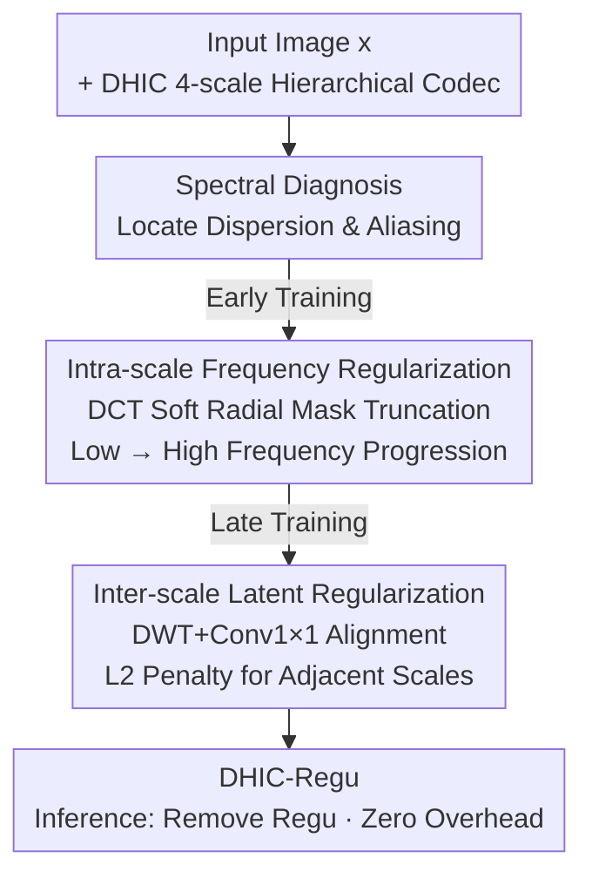

# Taming Hierarchical Image Coding Optimization: A Spectral Regularization Perspective

**Conference**: ICLR 2026  
**OpenReview**: [https://openreview.net/forum?id=lO6I66lweK](https://openreview.net/forum?id=lO6I66lweK)  
**Code**: None  
**Area**: Image Compression / Low-level Vision  
**Keywords**: Learned Image Compression, Hierarchical VAE, Frequency Principle, Spectral Regularization, Training Dynamics

## TL;DR
Addressing the contrast where hierarchical learned image compression is "theoretically superior but practically outperformed by single-scale models," this paper analyzes spectral training dynamics. The root causes are identified as cross-scale energy dispersion and spectral aliasing. Two spectral regularizations—intra-scale frequency truncation (gradual specialization from low to high frequencies) and inter-scale latent similarity penalty (suppressing spectral overlap)—are proposed. These are active only during training with zero inference overhead, accelerating training by 2.3× and achieving a 20.65% average bitrate saving relative to VTM-22.0, setting a new SOTA in learned image compression.

## Background & Motivation
**Background**: Learned Image Compression (LIC) has recently surpassed manual codecs like JPEG/HEVC/VVC. The mainstream approach is the single-scale VAE, where an analysis transform $y=g_a(x)$ encodes the image into a single-scale latent variable, a hyperprior/context model estimates the bitrate, and a synthesis transform $\hat{x}=g_s(\hat{y})$ reconstructs the image using the rate-distortion loss $L=R(y)+R(z)+\lambda\, D(x,\hat{x})$. However, single-scale performance is saturating at high bitrates and resolutions. Hierarchical VAEs (HVAE) extend this to multiple scales, theoretically fitting the "frequency principle"—higher scales (larger receptive fields) handle low-frequency global structures, while lower scales handle high-frequency details, supporting scale-level autoregression and quality scalability.

**Limitations of Prior Work**: Real-world performance of hierarchical coding has struggled to meet theoretical expectations. For instance, QARV requires nearly 10 days of training on an RTX 3090 and is outperformed by lighter single-scale models like ELIC in certain bitrate ranges. The potential of hierarchical architectures remains under-exploited.

**Key Challenge**: The authors argue the issue lies in "naive optimization" rather than architecture. The objective $L_{hier}=\sum_l R(z_l)+\lambda D(x,\hat{x})$ causes all scales to compete across the entire spectrum without explicit constraints on scale-specific frequency responsibility. Spectral analysis of training dynamics reveals two violations of the frequency principle: ① **intra-scale interference**, where spectral energy disperses across bands, mixing high-frequency noise and low-frequency interference that propagates through levels; ② **inter-scale aliasing**, where adjacent scales overlap in frequency (e.g., redundant low-frequency bands in higher scales), leading to repeated encoding and wasted bitrate.

**Goal**: To explicitly train hierarchical models into frequency-hierarchical representations where each scale specializes in its designated frequency band, without increasing inference complexity.

**Key Insight**: Leveraging the "frequency principle"—different network layers exhibit different sensitivities to frequency bands. Since hierarchical architectures are structural embodiments of this principle, explicit frequency guidance can be used to promote spectral convergence and decoupling.

**Core Idea**: Design two plug-and-play, training-only spectral regularization strategies: early-stage DCT frequency truncation to guide scales toward low-to-high frequency specialization, and late-stage latent similarity penalties to suppress inter-scale spectral aliasing.

## Method

### Overall Architecture
The method is built upon **DHIC (Deep Hierarchical Image Coding)**, a self-developed lightweight 4-scale hierarchical codec. Each scale contains a single latent block, and simple CNNs replace heavy backbones like Transformers or Mamba to isolate the effects of regularization. DHIC-Base is trained without regularization, while DHIC-Regu incorporates the proposed strategies.

The approach follows a "diagnosis then staged treatment" logic. Spectral analysis first identifies intra-scale dispersion and inter-scale aliasing. Two treatments are applied along the training timeline: **Early training** (e.g., first 100 epochs) utilizes intra-scale frequency regularization with a progressive DCT soft radial mask to force higher scales to master low frequencies first. **Late training** switches to inter-scale latent regularization, using a DWT downsampling + $1\times1$ convolution alignment module to penalize excessive similarity between adjacent latents. Both regularizations are removed during inference, ensuring DHIC-Regu has the same parameters and KMACs as DHIC-Base.

### Key Designs

**1. Spectral Analysis of Training Dynamics: Diagnosing Dispersion and Aliasing**

The authors quantify each scale's contribution to reconstruction and calculate spectral overlap with the input image, visualized as heatmaps over training epochs. Two stages emerge: early convergence to specific frequencies and later stabilization into a decoupled distribution. However, local "pathologies" remain: **intra-scale interference** causes spectral dispersion through the hierarchy, and **inter-scale aliasing** leads to redundant encoding. Scale-wise BPP and MSE curves (Fig. 8) show that naive training causes continuous, volatile bitrate reallocation between scales, particularly in deeper levels, increasing both rate and distortion.

**2. Intra-scale Frequency Regularization: DCT Soft Masking**

To combat dispersion, a DCT-based progressive frequency truncation is used. Early in training, only low-frequency components are fed into the model, with higher frequencies added gradually. A 2D-DCT is applied to the training image $x \in \mathbb{R}^{B\times C\times H\times W}$ to obtain spectrum $F=P_H x P_W^{\top}$. A time-varying soft radial mask is applied:

$$M(u,v;t)=\max\!\left(0,\ \frac{\tau(t)-\sqrt{(u/H)^2+(v/W)^2}}{\tau(t)}\right)$$

where $\tau(t)$ grows linearly from $\tau(0)=0.05$ to 1. The truncated spectrum $\tilde{F}=F\cdot M(u,v;t)$ is converted back via 2D-IDCT. This ensures the top-level scale $z_1$ captures low-frequency info early, preventing high-frequency noise from propagating across scales.

**3. Inter-scale Latent Regularization: DWT Alignment and L2 Penalty**

To address aliasing, a Discrete Wavelet Transform (DWT) based alignment module is inserted between adjacent latents during training. Lower-scale latent $z_l$ is decomposed via DWT and linearly recombined via $1\times1$ convolution to align with $z_{l-1}$. An L2 distance penalty encourages these features to "diverge." The loss is modified from $L_{hier}$ to:

$$L_{hier\_regu}=\sum_{l=1}^{L} R(z_l)+\lambda\, D(x,\hat{x})-\delta\sum_{l=1}^{L} L2\big(z_{l-1},\ \mathrm{Conv}_{1\times1}(\mathrm{DWT}(z_l))\big)$$

where $\delta=0.1$. The negative sign encourages the lower-scale latent **not** to predict low-frequency content already captured by the higher scale, leading to more efficient cross-scale information distribution.

### Loss & Training
Training is sequential: the first ~100 epochs use intra-scale DCT truncation ($\tau$ from 0.05 to 1), followed by inter-scale latent regularization ($\delta=0.1$). The base RD objective remains $L_{hier}=\sum_l R(z_l)+\lambda D(x,\hat{x})$, supporting variable bitrates ($\lambda \in [64, 4096]$). The model is pre-trained on $256\times256$ crops and fine-tuned on $512\times512$ crops using a mix of Flickr20K/DIV2K/COCO2017/ImageNet.

## Key Experimental Results

### Main Results
BD-Rate relative to VTM-22.0 (lower is better). DHIC-Regu leads across all datasets while maintaining the same inference complexity as DHIC-Base.

| Model | Kodak (%) | CLIC Pro (%) | Tecnick (%) | Average (%) |
|------|-----------|--------------|-------------|----------|
| ELIC (CVPR'22) | -3.22 | -3.89 | -4.57 | -3.89 |
| TCM-Large (CVPR'23) | -9.97 | -9.65 | -13.24 | -10.95 |
| MLIC++ (ICML'23 NCW) | -11.83 | -12.18 | -17.25 | -13.75 |
| MambaIC (CVPR'25) | -15.12 | -9.98 | -13.65 | -12.92 |
| HPCM-Large (ICCV'25) | -19.19 | -18.37 | -22.20 | -19.92 |
| QARV (TPAMI'24, Hier.) | -5.81 | -6.91 | -8.88 | -7.20 |
| DHIC-Base (Ours, no Regu) | -9.62 | -10.79 | -13.06 | -11.16 |
| **DHIC-Regu (Ours)** | **-19.73** | **-18.13** | **-24.09** | **-20.65** |

### Ablation Study
Effect of individual regularizations (Baseline: naive optimization):

| Configuration | Acceleration | BD-Rate (%) | Note |
|------|---------|-------------|------|
| Intra-Scale Only | 1.84× | -1.07 | Accelerates convergence; limited RD gain |
| Inter-Scale Only | 0.91× | -7.66 | Slower convergence; significant performance gain |
| Both (Full) | 2.30× | -10.11 | Synergistic: Faster and better |

### Key Findings
- **Complementary Roles**: Intra-scale focus on speed (1.84×), while inter-scale focus on performance (-7.66%). Together, they achieve 2.3× speedup and -10.11% gain.
- **Zero Overhead**: DHIC-Regu and DHIC-Base share identical parameters (106.93M), KMACs, and encoding/decoding times.
- **Visual Decoupling**: Naive training results in tangled latent representations. With regularization, clear coarse-to-fine hierarchical structures emerge by epoch 40.

## Highlights & Insights
- **Quantifiable Diagnosis**: Translates abstract "poor optimization" into manageable "spectral pathologies" (dispersion and aliasing) using spectral heatmaps.
- **Training-only Scaffolding**: Performance is gained strictly from superior training dynamics without increasing deployment complexity.
- **Frequency Curriculum**: The DCT truncation scheduler acts as a "low-to-high" curriculum, transforming the frequency principle from a passive emergence into an active guidance.

## Limitations & Future Work
- **Switching Timing**: The timing for switching regularizations (e.g., 100 epochs) is empirically fixed rather than adaptive.
- **Frequency Assumption**: Relies on the "high scale $\to$ low frequency" assumption, which may vary for non-natural images.
- **Dataset Generalization**: While verified on natural image benchmarks, gains on medical or remote sensing data require further validation.

## Related Work & Insights
- **vs QARV**: QARV uses heavy backbones and naive optimization. DHIC-Regu releases hierarchical potential through regularization, outperforming QARV (-20.65% vs -7.20%) and proving effective when applied to QARV itself.
- **vs HPCM-Large**: While HPCM is a strong single-scale SOTA (-19.92%), DHIC-Regu (-20.65%) offers better performance and faster decoding, especially at high resolutions.

## Rating
- Novelty: ⭐⭐⭐⭐⭐ 
- Experimental Thoroughness: ⭐⭐⭐⭐ 
- Writing Quality: ⭐⭐⭐⭐⭐ 
- Value: ⭐⭐⭐⭐⭐ 

<!-- RELATED:START -->

## Related Papers

- [\[CVPR 2026\] Spectral Super-Resolution via Adversarial Unfolding and Data-Driven Spectrum Regularization](../../CVPR2026/image_restoration/spectral_super-resolution_via_adversarial_unfolding_and_data-driven_spectrum_reg.md)
- [\[ICLR 2026\] Taming Score-Based Denoisers in ADMM: A Convergent Plug-and-Play Framework](taming_score-based_denoisers_in_admm_a_convergent_plug-and-play_framework.md)
- [\[ICLR 2026\] ProtoTS: Learning Hierarchical Prototypes for Explainable Time Series Forecasting](protots_learning_hierarchical_prototypes_for_explainable_time_series_forecasting.md)
- [\[ICLR 2026\] Efficient Degradation-agnostic Image Restoration via Channel-Wise Functional Decomposition and Manifold Regularization](efficient_degradation-agnostic_image_restoration_via_channel-wise_functional_dec.md)
- [\[CVPR 2026\] Rethinking Knowledge Transfer in Image Quality Assessment: A Perceptual Preference Structure Alignment Perspective](../../CVPR2026/image_restoration/rethinking_knowledge_transfer_in_image_quality_assessment_a_perceptual_preferenc.md)

<!-- RELATED:END -->
