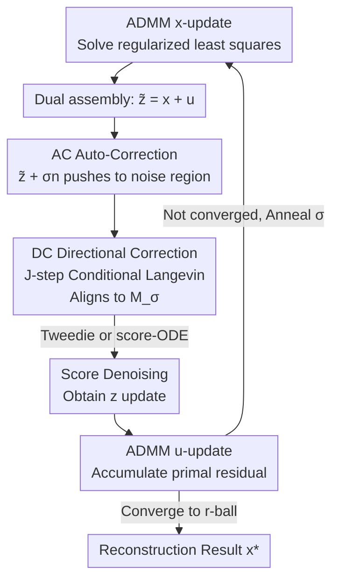

# Taming Score-Based Denoisers in ADMM: A Convergent Plug-and-Play Framework

**Conference**: ICLR 2026  
**OpenReview**: [https://openreview.net/forum?id=BiXwSIIMIq](https://openreview.net/forum?id=BiXwSIIMIq)  
**Code**: https://github.com/rajeshshrestha/ACDC.git  
**Area**: Image Restoration / Inverse Problems / Diffusion Priors  
**Keywords**: Plug-and-Play, ADMM, score-based denoising, manifold mismatch, convergence analysis

## TL;DR
This paper proposes the ADMM-PnP + AC-DC triple-stage denoiser. It employs "Auto-Correction (adding noise) + Directional Correction (Langevin-based)" to pull ADMM iterates back to the noise manifold where the score function was trained, before performing score-based denoising. This stabilizes the embedding of diffusion priors into ADMM with dual variables and provides the first fixed-point convergence proof for this combination, consistently outperforming baselines such as DPS, DiffPIR, and DDRM across various image inverse problems.

## Background & Motivation
**Background**: Solving inverse problems $y = A(x) + \xi$ (e.g., deblurring, super-resolution, inpainting, phase retrieval) is typically formulated as $\min_x \ell(y\|A(x)) + h(x)$, where $\ell$ is the data fidelity term and $h$ is a structural regularization term. Recent mainstream approaches use the score function $s_\theta(x,\sigma)\approx\nabla_x\log p(x_t)$ pre-trained by diffusion models as a strong prior: either by modifying the MCMC sampling process for posterior sampling (DPS, DDRM) or by using Tweedie’s Lemma to treat the score as a "denoising operator" within proximal/variable-splitting optimization iterations (DiffPIR, RED-diff, SNORE), known as Plug-and-Play (PnP).

**Limitations of Prior Work**: Score functions are trained on "noise manifolds constructed by Gaussian perturbations" $\mathcal{M}_{\sigma(t)}=\mathrm{supp}(x_t)$. However, the iterates $\tilde z^{(k)}$ generated by optimization algorithms do not necessarily fall on any $\mathcal{M}_{\sigma(t)}$—this is the **manifold mismatch**. Directly applying score denoising to a point with incorrect noise geometry leads to degradation and artifacts. Existing remedies (adding Gaussian noise for "purification" or random regularization) only push points closer to some manifold but **do not guarantee alignment** and are prone to overfitting measurement noise.

**Key Challenge**: Embedding score denoising into ADMM is significantly more difficult than into purely primal algorithms because ADMM is a primal-dual method. **The dual variable $u^{(k)}$ further distorts the "noise" geometry of the iterate**—in $\tilde z^{(k)} = x^{(k+1)} + u^{(k)}$, the distribution of $u^{(k)}$ is unclear, making the resulting noise distribution harder to characterize. This likely explains why score denoising is rarely combined with primal-dual methods like ADMM, despite ADMM's attractiveness for handling multiple regularizers/constraints.

**Key Challenge 2**: Theoretically, the **convergence of score-based PnP is rarely clarified**. While classical denoisers have mature convergence theories, score-based denoisers lack clarity on whether iterations stabilize or under what conditions they converge due to geometric mismatch. Existing analyses mostly cover primal algorithms rather than ADMM.

**Goal**: (1) Design a denoiser that truly aligns ADMM iterates with the score training manifold; (2) Provide convergence guarantees for the combination of ADMM-PnP and score-based denoisers.

**Key Insight**: Instead of hoping a single noise injection achieves alignment, a two-step approach is taken: first, use Gaussian noise to roughly push the point into a noise-dominated region (Auto-Correction), then use Langevin dynamics to **directionally** pull it to the target manifold $\mathcal{M}_{\sigma(k)}$ (Directional Correction), before finally performing score denoising.

**Core Idea**: Replace the $z$-subproblem denoising step in ADMM with a three-stage operator: "AC (Auto-Correction) → DC (Conditional Langevin Directional Correction) → Score Denoising." This ensures the score always acts on its practiced manifold. The operator is proven to be weakly non-expansive/bounded, leading to the convergence of ADMM-PnP.

## Method

### Overall Architecture
This paper addresses how to stably integrate a diffusion score denoiser into the ADMM denoising subproblem. ADMM-PnP decomposes the original problem $\min_{x,z}\ell(y\|A(x))+\gamma h(z)\ \text{s.t.}\ x=z$ into three alternating steps: the $x$-update solves a data-fidelity regularized least squares (using Adam), the $z$-update is essentially a denoising problem, and the $u$-update accumulates primal residuals. Standard PnP writes the $z$-update as $z^{(k+1)} = D_{\sigma^{(k)}}(\tilde z^{(k)})$, where $\tilde z^{(k)} = x^{(k+1)} + u^{(k)}$.

The core modification in **Ours** is the denoising operator $D_{\sigma^{(k)}}$, replaced by the **three-stage AC-DC denoiser**. Given the current $\tilde z^{(k)}$, **AC** is applied first: add Gaussian noise $z^{(k)}_{ac} = \tilde z^{(k)} + \sigma^{(k)} n$ to push the point into a noise-dominant region. Then **DC**: starting from $z^{(k)}_{ac}$, run $J$ steps of conditional Langevin dynamics to **directionally** converge the point onto the target noise manifold $\mathcal{M}_{\sigma^{(k)}}$ while preserving measurement info. Finally, **Denoising**: use Tweedie’s Lemma (or score-ODE) on the aligned $z^{(k)}_{dc}$ to obtain $z^{(k+1)}$. The key is that the score acts only on points already pulled back to the training manifold by AC-DC. The operator $D_{\sigma^{(k)}}$ is proven to satisfy properties required for convergence.

### Key Designs

**1. AC Auto-Correction: Pushing Iterates into "Noise-Dominant" Neighborhoods**

Directly applying the score to ADMM iterates $\tilde z^{(k)}$ results in mismatch because its noise geometry is unknown (especially due to the dual variable $u^{(k)}$). The AC stage performs a simple operation: $z^{(k)}_{ac} = \tilde z^{(k)} + \sigma^{(k)} n,\ n\sim\mathcal{N}(0,I)$. This can be expanded as $z^{(k)}_{ac} = z_{\sigma^{(k)}} + \tilde s^{(k)}$, where $z_{\sigma^{(k)}} = z^{(k)}_\natural + \sigma^{(k)} n_1$ is a standard Gaussian-perturbed version of the clean signal $z^{(k)}_\natural\sim p_{data}$, and $\tilde s^{(k)} = \sqrt2\,\sigma^{(k)} n_2 + s^{(k)}$. When $\sigma^{(k)}$ is sufficiently large, $z^{(k)}_{ac}$ is dominated by Gaussian noise. This step is similar to "purification" but **Ours** explicitly notes that **AC alone is insufficient** because it does not guarantee the point falls on the specific $\mathcal{M}_{\sigma(t)}$ trained by the score.

**2. DC Directional Correction: Using Conditional Langevin to Pull Points to Target Manifolds**

This is the most critical incremental contribution compared to existing "noise-injection PnP." DC starts from $z^{(k)}_{ac}$ and runs $J$ steps of Langevin dynamics to sample from the conditional distribution $p(z_{\sigma^{(k)}}\mid z^{(k)}_{ac})$. This target distribution has two advantages: its support $\mathrm{supp}(z_{\sigma^{(k)}}\mid z^{(k)}_{ac})\subseteq\mathrm{supp}(z_{\sigma^{(k)}})=\mathcal{M}_{\sigma^{(k)}}$ ensures the sampled point **must lie on the target manifold**, and it preserves information from $z^{(k)}_{ac}$ (the measurements) to avoid washing out signal details. The conditional score can be decomposed as:

$$\nabla\log p(z_{\sigma^{(k)}}\mid z^{(k)}_{ac}) = s_\theta(z_{\sigma^{(k)}},\sigma^{(k)}) + \nabla\log p(z^{(k)}_{ac}\mid z_{\sigma^{(k)}}).$$

The first term is the pre-trained score. The second likelihood term is approximated as $\nabla\log p(z^{(k)}_{ac}\mid z_{\sigma^{(k)}})\approx -\tfrac{1}{\sigma_s^2}(z_{\sigma^{(k)}}-z^{(k)}_{ac})$ under mild conditions. The Langevin update becomes $w^{(k,j+1)} = w^{(k,j)} + \eta^{(k)}\big(\tfrac{1}{\sigma_s^2}(z^{(k)}_{ac}-w^{(k,j)}) + s_\theta(w^{(k,j)},\sigma^{(k)})\big) + \sqrt{2\eta^{(k)}}\,n$.

**3. Score Denoising: Final Denoising on Aligned Points**

After AC-DC, the input $z^{(k)}_{dc}$ approximately lies on $\mathcal{M}_{\sigma^{(k)}}$, making score denoising appropriate. The paper provides two equivalent exits: Tweedie denoising $z^{(k)}_{tw} = z^{(k)}_{dc} + (\sigma^{(k)})^2 s_\theta(z^{(k)}_{dc},\sigma^{(k)})$ (denoted as Ours-tweedie) or solving a probability flow ODE $\tfrac{dz_t}{dt}=\lambda(t)s_\theta(z_t,t)$ from $z^{(k)}_{dc}$ back to $z_0$ (denoted as Ours-ode). The contribution lies in **guaranteeing the input is "the right point."** $\sigma^{(k)}$ is decayed via linear annealing.

**4. Convergence Analysis: Extending ADMM-PnP Fixed-Point Convergence to Score Denoisers**

The paper provides the first convergence proof for ADMM + score denoisers. **Result 1 (Strongly convex $\ell$ + fixed step size)**: Defines the residual operator $R_\sigma(\tilde z) = (D_{\sigma^{(k)}} - I)(\tilde z)$. If it satisfies "weak non-expansiveness" $\|R_\sigma(\tilde z_1)-R_\sigma(\tilde z_2)\|_2^2 \le \epsilon^2\|\tilde z_1-\tilde z_2\|_2^2 + \delta^2$, the ADMM sequence converges with high probability into an $r$-radius fixed-point ball. **Result 2 (Non-convex + adaptive step size)**: proving AC-DC is a "bounded denoiser" ($\tfrac1d\|(D_{\sigma^{(k)}}-I)(x)\|_2^2\le c_k^2$), the sequence converges with high probability to a fixed point.

### Loss & Training
**Ours** involves **no training**. It reuses pre-trained scores from Chung et al. (2023). Key hyperparameters: $\sigma^{(k)}$ linear annealing from $10$ to $0.1$, $J=10$ DC steps, $\eta^{(k)} = 5\times10^{-4}\sigma^{(k)}$, and $\sigma_s^{(k)} = 0.1/\sqrt{\sigma^{(k)}}$. The $x$-subproblem uses Adam for up to 1000 steps.

## Key Experimental Results

### Main Results
On FFHQ and ImageNet (256×256), for tasks including super-resolution, deblurring, inpainting, and phase retrieval, **Ours-tweedie** and **Ours-ode** achieve SOTA or near-SOTA performance across PSNR, SSIM, and LPIPS, significantly outperforming DDRM, DiffPIR, and RED-diff.

| Task | Method | PSNR↑ | SSIM↑ | LPIPS↓ |
|------|------|-------|-------|--------|
| Random Inpainting | **Ours** | **31.99** | **0.91** | **0.057** |
| Random Inpainting | DDRM | 29.89 | 0.72 | 0.231 |
| Random Inpainting | DiffPIR | 28.36 | 0.82 | 0.134 |
| Box Inpainting | **Ours** | **22.13** | 0.82 | **0.141** |
| Motion Deblur | **Ours** | **30.70** | **0.84** | **0.194** |

### Ablation Study

| Configuration | Observation | Explanation |
|------|------|------|
| AC only ($J=0$) | Severe artifacts | Adding noise without directional correction fails to align with the manifold. |
| AC-DC ($J=10$) | Significant cleanup | Score denoising becomes effective once DC pulls the point back to $\mathcal{M}_{\sigma}$. |
| AC-DC ($J=20$) | Further improved | Increasing Langevin steps continues to refine the alignment. |

### Key Findings
- **DC is the core increment**: In difficult tasks like phase retrieval, $J=0$ (equivalent to existing "noise-injection PnP") causes severe artifacts; artifacts decrease as $J$ increases.
- **Dual variables are distinct to ADMM**: The AC-DC design compensates for the manifold distortion caused by $u^{(k)}$, which previously prevented combining score denoising with ADMM.
- **Perceptual metric gains are significant**: LPIPS rewards the artifact-free, natural reconstructions produced by AC-DC.

## Highlights & Insights
- **Upgraded Purification**: Evolved "noise purification" into a "noise injection + directional correction" two-stage process.
- **Clever Conditional Distribution**: The DC target $p(z_{\sigma^{(k)}}\mid z^{(k)}_{ac})$ balances manifold alignment with measurement preservation.
- **Theoretical Grounding**: Provided both algorithms and convergence proofs for convex and non-convex scenarios.
- **Zero-Training PnP**: Broadly applicable and compatible with any proximal-style framework.

## Limitations & Future Work
- **Fixed-Point Convergence Only**: Due to the unknown implicit $h(\cdot)$, stationary point convergence remains unproven.
- **Computational Cost**: Inner Langevin steps ($J=10$) and Adam $x$-updates add inference overhead compared to single-pass sampling.
- **Theoretical Assumptions**: Convergence relies on assumptions like $\log p_{data}$ smoothness and DC reaching a stationary distribution.
- **Evaluation Scale**: Tested primarily on 256x256 resolutions with 100 images per set.

## Related Work & Insights
- **vs DPS / DDRM (Sampling)**: They use observation-guided scores for posterior sampling; **Ours** uses optimization (ADMM) and provides convergence proofs.
- **vs DiffPIR / RED-diff (PnP)**: They rely on basic purification and focus on primal algorithms; **Ours** uses AC-DC for manifold alignment and covers ADMM with dual variables.
- **vs Ryu 2019 / Chan 2016 (PnP Theory)**: **Ours** extends their convergence requirements to "weak non-expansiveness" and "bounded denoisers," covering diffusion scores.

## Rating
- Novelty: ⭐⭐⭐⭐⭐ 
- Experimental Thoroughness: ⭐⭐⭐⭐ 
- Writing Quality: ⭐⭐⭐⭐ 
- Value: ⭐⭐⭐⭐⭐ 

<!-- RELATED:START -->

## Related Papers

- [\[ICLR 2026\] Adaptive Moments are Surprisingly Effective for Plug-and-Play Diffusion Sampling](adaptive_moments_are_surprisingly_effective_for_plug-and-play_diffusion_sampling.md)
- [\[CVPR 2026\] PnP-CM: Consistency Models as Plug-and-Play Priors for Inverse Problems](../../CVPR2026/image_restoration/pnp-cm_consistency_models_as_plug-and-play_priors_for_inverse_problems.md)
- [\[ECCV 2024\] BrushNet: A Plug-and-Play Image Inpainting Model with Decomposed Dual-Branch Diffusion](../../ECCV2024/image_restoration/brushnet_a_plug-and-play_image_inpainting_model_with_decomposed_dual-branch_diff.md)
- [\[NeurIPS 2025\] Learning Cocoercive Conservative Denoisers via Helmholtz Decomposition for Poisson Inverse Problems](../../NeurIPS2025/image_restoration/learning_cocoercive_conservative_denoisers_via_helmholtz_decomposition_for_poiss.md)
- [\[ICLR 2026\] FAST-DIPS: Adjoint-Free Analytic Steps and Hard-Constrained Likelihood Correction for Diffusion-Prior Inverse Problems](fastdips_adjointfree_analytic_steps_and_hardconstrained_likelihood_correction_fo.md)

<!-- RELATED:END -->
