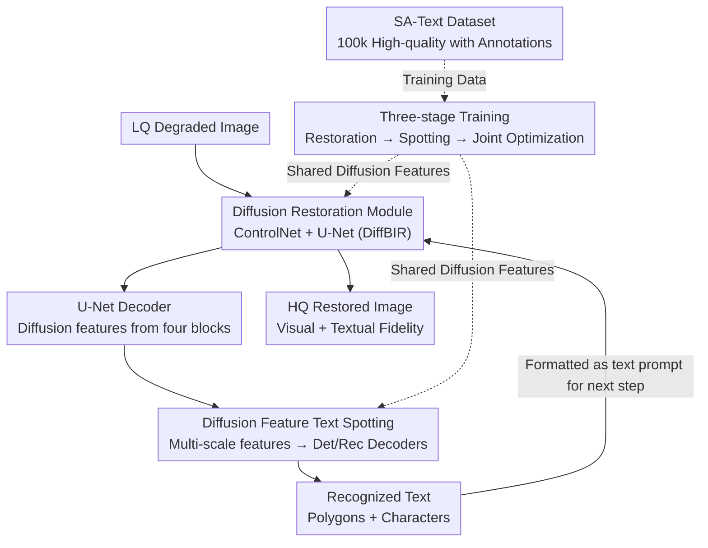

# Text-Aware Image Restoration with Diffusion Models

**Conference**: ICLR 2026  
**OpenReview**: [https://openreview.net/forum?id=jt2c2H6auR](https://openreview.net/forum?id=jt2c2H6auR)  
**Code**: The paper promises to release code / weights / dataset (not released as of the submission deadline)  
**Area**: Diffusion Models / Image Restoration / Scene Text  
**Keywords**: Text-aware restoration, diffusion models, text-spotting, text hallucination, multi-task learning

## TL;DR
This paper proposes "Text-Aware Image Restoration (TAIR)," a new task aimed at simultaneously restoring visual appearance and textual content. The authors introduce TeReDiff, a model that embeds a text-spotting module into a diffusion restoration network and jointly trains them using shared diffusion features. Accompanied by the SA-Text dataset containing 100,000 high-quality images with dense text annotations, the method significantly alleviates "text-image hallucination"—the tendency of diffusion restoration models to fabricate plausible but incorrect characters—and achieves a new SOTA on the STISR benchmark TextZoom.

## Background & Motivation
**Background**: Diffusion models have achieved excellent perceptual quality in natural image restoration (IR) by leveraging strong generative priors. Methods like StableSR, SeeSR, DiffBIR, SUPIR, and FaithDiff can produce visually "clean" results under various degradations.

**Limitations of Prior Work**: These methods consistently fail in **text regions**. Due to their reliance on generative priors, when encountering degraded text, they tend to "draw a texture that looks like text" rather than restoring the **actual characters**. The authors term this phenomenon **text-image hallucination**: the output appears to contain text, but the characters are incorrect or nonsensical. Experiments show that under heavy degradation (Level 2/3), the end-to-end recognition F1 of mainstream methods drops even below that of the original low-quality input.

**Key Challenge**: Previous IR research focused solely on overall perceptual quality without explicitly accounting for text readability. However, text carries semantic information (digitalization, road signs, navigation), where minor character distortions lead to severe information loss. Conversely, Scene Text Image Super-Resolution (STISR) focuses on character clarity but typically processes **cropped word images** (e.g., $64\times16$ with word-level assumptions), discarding global context and failing to ensure consistency across the entire scene. Neither approach balances "full-scene visual restoration" with "textual fidelity."

**Goal**: To define and solve the TAIR task—explicitly maintaining textual fidelity while restoring the **entire scene image** by integrating text semantics into the restoration process. This involves addressing two sub-problems: (1) the lack of high-resolution datasets with dense text annotations; and (2) the absence of model mechanisms that allow the restoration process to "know" what the text is.

**Key Insight**: Recent studies indicate that **intermediate diffusion features are semantically rich and useful for downstream visual tasks**. Rather than attaching an independent OCR module, it is more effective to feed the decoder features of the diffusion U-Net directly into a text-spotting module. This allows "restoration" and "text recognition" to mutually benefit through shared features: restoration provides recognizable features, while recognition informs the restoration process about the correct characters.

**Core Idea**: A multi-task closed loop is established where "diffusion feature-driven text-spotting" and "recognized text as a denoising condition" replace purely generative-based "guessing," thereby suppressing text hallucination.

## Method

### Overall Architecture
TeReDiff integrates a **text-spotting module** into the DiffBIR (U-Net $\mathcal{U}$ + ControlNet $\mathcal{C}$) diffusion restoration framework. Given a low-quality (LQ) input $I_{lq}$, it outputs a high-quality (HQ) image $I_{hq}$ with both visual and textual fidelity. On the restoration side, the HQ latent $z_0$ is diffused to $z_t$, concatenated with the condition latent $c$ from degradation removal to form $c_t = \text{concat}(z_t, c)$, and fed into the ControlNet-conditioned U-Net along with a text prompt $p_t$. Crucially, at each denoising step, diffusion features extracted from the U-Net decoder are fed into the text-spotting module to predict locations and characters. These recognition results are formatted into text prompts $p_{t+1}$ for the subsequent denoising step. Both modules are **jointly trained** using shared diffusion features through a three-stage optimization process. The entire pipeline is supported by the self-constructed SA-Text dataset.

### Key Designs

**1. SA-Text: Automated VLM Pipeline for High-Resolution Dense Text Annotations**
TAIR requires specific data: common text-spotting datasets (e.g., TextOCR) have dense labels but low resolution, while IR datasets (e.g., LSDIR) have high quality but no text labels. The authors built an **automatic** pipeline based on SA-1B to produce SA-Text (100k $512\times512$ HQ images with dense labels). The pipeline has two stages: **Detection + Cropping**, which uses a detection model on high-res images to identify $512\times512$ crops that fully contain at least one instance without splitting it; and **VLM Recognition + Filtering**, where polygon crops of instances are fed to two VLMs (Qwen2.5-VL and OVIS2). **Only instances where both transcribers agree are kept**, effectively filtering out misreadings and false positives. Private areas (faces/plates) are excluded using VLM clarity grading.

**2. Diffusion Feature-driven Text-spotting: Shared Semantic Features**
To mitigate text hallucination, TeReDiff **reuses internal diffusion U-Net features** instead of standard ResNet features. Features are extracted from four U-Net decoder blocks, aligned via convolutions, and stacked into multi-scale inputs $F \in \mathbb{R}^{L \times D}$. $F$ is processed by a transformer encoder $\mathcal{E}$ and two decoders ($\mathcal{D}_{det}, \mathcal{D}_{rec}$) to output polygon-character tuples $Y=\{(d_t^{(i)}, r_t^{(i)})\}_{i=1}^{K}$. This enables the restoration network to learn "text-aware" representations through backpropagation, preventing character fabrication.

**3. Three-stage Training: From Separation to Joint Optimization**
To avoid interference between heterogeneous tasks: **Stage 1** trains only the restoration module (U-Net + ControlNet) using diffusion loss $\mathcal{L}_{diff}$. **Stage 2** trains only the text-spotting module using bipartite matching (classification, localization, and transcription losses $\mathcal{L}_{det} + \mathcal{L}_{rec}$) with frozen diffusion features. **Stage 3** jointly optimizes both with a weighted total loss, allowing restoration to benefit from text supervision.

**4. Inference-time Text Prompt Guidance: Closed-loop Denoising**
The spotting output is utilized during inference to form a denoising loop. Output characters from the spotting branch at step $t$, $\{r_t^{(i)}\}_{i=1}^{K}$, are formatted into a text prompt $p_{t+1}$ for step $t+1$. As the image clears, prompts are refined; for example, 'S' might be corrected to 'I' ("LOUSS" to "LOUIS") during the process. **Descriptive prompts** ("A realistic scene where the texts... appear clearly...") were found to outperform simple tag-style prompts.

### Loss & Training
The restoration uses diffusion loss $\mathcal{L}_{diff}$. The spotting module uses detection and recognition losses $\mathcal{L}_{det} + \mathcal{L}_{rec}$ based on bipartite matching with Ground Truth. Stage 3 uses a weighted combination. The restoration module is initialized from DiffBIR, and text-spotting from TESTR. Optimizer: AdamW; Learning rate: $1\times10^{-4}$ (Stages 1/2) and $1\times10^{-5}$ (Stage 3).

## Key Experimental Results

### Main Results
Evaluated on the SA-Text test set and Real-Text using two spotting models (ABCNet v2 / TESTR). The following are representative values for Level 1 degradation (TESTR):

| Method | Det F1 | End-to-End (None) | End-to-End (Full) |
|------|--------|-------------------|-------------------|
| LQ Input | 44.47 | 25.93 | 34.73 |
| DiffBIR | 64.34 | 25.51 | 35.47 |
| SeeSR | 65.32 | 23.31 | 32.82 |
| FaithDiff | 66.23 | 22.50 | 31.59 |
| **TeReDiff (Ours)** | **67.47** | **28.19** | **36.99** |

On Real-Text, TeReDiff shows a significant advantage: Det F1 **74.89** (vs. 70.57 for FaithDiff) and E2E(None) **49.39** (vs. 41.64). On the TextZoom benchmark, it achieves an average recognition rate of **72.4%** (CRNN), outperforming specialized STISR methods like TextSR (58.7%) and approaching the HR upper bound. Standard IR metrics (SSIM, LPIPS, FID) also show improvement or parity, indicating that introducing text objectives does not compromise overall visual quality.

### Ablation Study
Tested on SA-Text (Level 2 degradation, TESTR) to verify training stages and prompts:

| Config | Text Condition | Det F1 | E2E(None) | E2E(Full) |
|------|---------|--------|-----------|-----------|
| Stage 1 | Null | 59.99 | 21.24 | 29.79 |
| Stage 1 | Captioner (Ours) | 61.99 | 24.76 | 31.70 |
| Stage 1 | Ground-truth | 71.44 | 32.51 | 42.71 |
| Stage 3 | Null | 67.50 | 23.46 | 32.72 |
| Stage 3 | Captioner (Ours) | 65.75 | 26.39 | 35.13 |
| Stage 3 | Ground-truth | 71.85 | 33.31 | 43.40 |

Ablation on prompt style (Level 2): Descriptive vs. Tag-style E2E(Full) is 35.13 vs. 31.94 with predicted text, and 43.40 vs. 42.12 with GT text, favoring descriptive prompts.

### Key Findings
- **Joint Training (Stage 3) is the primary source of text-awareness**: Even without text prompts (Null), Stage 3 improves over Stage 1 (Det F1 59.99 → 67.50), proving gradients from spotting help the restoration module learn text-aware features.
- **Text prompts are effective and scale with accuracy**: Using GT prompts yields the highest scores, suggesting the bottleneck is recognition accuracy.
- **Superiority increases with degradation**: Mainstream models perform worse than LQ inputs at Level 2/3 (hallucination), while TeReDiff remains robust.
- **Descriptive > Tag prompts**: Embedding words into natural sentences like "text clearly appears on the board" guides the diffusion model better.

## Highlights & Insights
- **Systematizing a failure mode**: Naming "text-image hallucination" identifies a blind spot in diffusion IR where PSNR/LPIPS scores are high while text is nonsensical.
- **Efficient downstream task integration**: Reusing U-Net decoder features for spotting instead of an external OCR allows the gradients to directly refine the restoration process.
- **Inference-time self-correction**: The loop where recognized characters guide the next denoising step turns generative "guessing" into a feedback-driven iterative process.
- **Robust data curation**: Using dual-VLM cross-verification for pseudo-labeling provides a low-cost, scalable, and language-agnostic paradigm.

## Limitations & Future Work
- Standard quality metrics (PSNR/LPIPS) fail to capture text fidelity, forcing reliance on spotting metrics. A unified "textual fidelity" metric is still needed.
- The system depends heavily on text-spotting accuracy; if recognition fails early, it might propagate errors into the denoising process.
- While the pipeline is language-agnostic, main experiments focus on English. Generalization to complex layouts (dense documents, artistic fonts) remains to be seen.
- Inference overhead is higher due to running the spotting module at every denoising step.

## Related Work & Insights
- **vs. STISR (TextDiff / TextSR)**: STISR works on cropped word images; TAIR processes full $512\times512$ complex scenes. TeReDiff's SOTA results on TextZoom suggest that full-scene training provides better generalization than localized super-resolution.
- **vs. Diffusion IR (DiffBIR / SeeSR)**: These models guess characters based on generative priors. TeReDiff guards textual fidelity via explicit semantic injection without visual sacrifice.
- **vs. Segmentation-based methods**: Unlike approaches that use segmentation masks, TeReDiff utilizes linguistic information from recognition, providing a more direct character-level semantic guide.

## Rating
- Novelty: ⭐⭐⭐⭐⭐ Proposes/names TAIR task + text-image hallucination; provides a complete model/dataset loop.
- Experimental Thoroughness: ⭐⭐⭐⭐⭐ Extensive benchmarks (SA-Text/Real-Text/TextZoom), multiple levels of degradation, and comprehensive ablation.
- Writing Quality: ⭐⭐⭐⭐ Clear motivation and methodology; some loss details are condensed into appendices.
- Value: ⭐⭐⭐⭐⭐ Highly practical for text-critical scenarios such as document digitizing, road signs, and AR.

<!-- RELATED:START -->

## Related Papers

- [\[ICLR 2026\] Energy-oriented Diffusion Bridge for Image Restoration with Foundational Diffusion Models](energy-oriented_diffusion_bridge_for_image_restoration_with_foundational_diffusi.md)
- [\[ICLR 2026\] Vivid-VR: Distilling Concepts from Text-to-Video Diffusion Transformer for Photorealistic Video Restoration](vivid-vr_distilling_concepts_from_text-to-video_diffusion_transformer_for_photor.md)
- [\[ICLR 2026\] Trajectory-aware Shifted State Space Models for Online Video Super-Resolution](trajectory-aware_shifted_state_space_models_for_online_video_super-resolution.md)
- [\[ICML 2026\] Consistent Diffusion Language Models](../../ICML2026/image_restoration/consistent_diffusion_language_models.md)
- [\[ICLR 2026\] Horizon Imagination: Efficient On-Policy Rollout in Diffusion World Models](horizon_imagination_efficient_on-policy_rollout_in_diffusion_world_models.md)

<!-- RELATED:END -->
