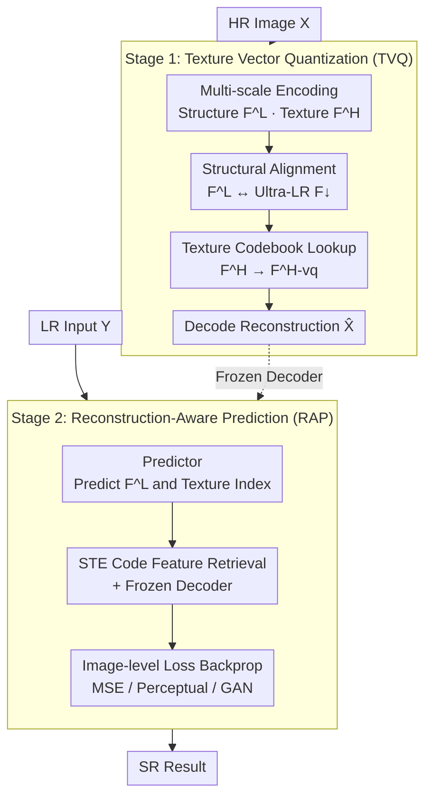

# Texture Vector-Quantization and Reconstruction Aware Prediction for Generative Super-Resolution

**Conference**: ICLR 2026  
**OpenReview**: [https://openreview.net/forum?id=OCN81ZmYYj](https://openreview.net/forum?id=OCN81ZmYYj)  
**Code**: https://github.com/LabShuHangGU/TVQ-RAP  
**Area**: Image Restoration / Generative Super-Resolution / Vector Quantization  
**Keywords**: Super-Resolution, Vector Quantization, Texture Codebook, Straight-Through Estimator, Reconstruction-Aware

## TL;DR
Addressing two major issues in VQ-based generative SR—high quantization error in codebooks and "code-level" supervision for predictors—this paper proposes **Texture Vector Quantization (TVQ)**, which assigns only missing textures to the codebook while stripping away structures, and **Reconstruction-Aware Prediction (RAP)**, which leverages a Straight-Through Estimator to feed image-level reconstruction losses directly back to the index predictor. This achieves SOTA perceptual quality with minimal computational cost (38ms/image).

## Background & Motivation

**Background**: Generative Super-Resolution (GSR) aims to restore realistic high-definition images from low-resolution inputs. Early PSNR-oriented methods tended to produce over-smoothed results and lost fine textures. While GAN and Diffusion methods can model priors and generate realistic textures, GAN training is often unstable and Diffusion inference is slow. Recently, the VQ-VAE lineage (VQGAN, FeMaSR, AdaCode, VARSR, etc.) has shown competitiveness in accuracy and efficiency by encoding features with a discrete visual codebook and training an index prediction network to model visual priors.

**Limitations of Prior Work**: VQ-based methods face two specific problems. First, they directly replace continuous visual features with nearest-neighbor codebook entries. Since natural image signals are extremely rich, ensuring encoding accuracy usually requires a massive codebook, which is memory-intensive and difficult to train (Figure 1 shows that vanilla VQ still has an rFID of 11.0 even with 8192 entries). Second, the predictor is trained with **code-level cross-entropy**, treating "index prediction accuracy" as the primary objective. This is not strictly aligned with "final image quality": all deviations from the ground-truth index are penalized equally, even if a "wrong code" actually results in a visually plausible reconstruction, leading to optimization stagnation and suboptimal prior modeling.

**Key Challenge**: A codebook must balance "encoding precision" with "manageable scale," which is hard to achieve simultaneously. Furthermore, there is a misalignment between the predictor's "code-level accuracy" and the "image-level quality" goals.

**Key Insight**: The authors leverage the unique structure of the SR task—**LR is known at inference time**. This means "structural/low-frequency" components can be estimated from the LR input and do not need to be laboriously encoded by the codebook. Inspired by classical dictionary learning (removing low-frequency components to enhance dictionary expressiveness), the codebook is reserved solely for the **texture/high-frequency** information missing in the LR image. This significantly reduces feature space diversity and naturally lowers encoding error.

**Core Idea**: **Structures follow a continuous bypass, while textures use the codebook** (TVQ) to resolve the conflict between codebook scale and precision. **Using STE to backpropagate image-level loss directly to the index predictor** (RAP) aligns the training objective with reconstruction quality.

## Method

### Overall Architecture

The method follows a **two-stage sequential** approach: In the first stage, an autoencoder (TVQ) is trained to separate structure and texture, applying vector quantization only to the texture. In the second stage, the decoder is frozen, and a predictor is trained to estimate "structural features + texture code indices" from the LR input, fine-tuned using the reconstruction-aware approach (RAP).

In the first stage, the encoder transforms the HR image $X$ into two paths: low-resolution structural features $F^L$ (32× downsampled relative to HR) and high-resolution texture features $F^H$ (8× downsampled). To force $F^L$ to capture only structure, the authors train an auxiliary autoencoder on an "ultra-low resolution" downsampled image $X_\downarrow$ to obtain $F_\downarrow$ (containing only basic structure) and align $F^L$ with $F_\downarrow$. Consequently, the remaining components needed for reconstruction are forced into the "de-structured texture." Only $F^H$ undergoes codebook quantization into $F^{H\text{-}vq}$. Finally, $F^L$ and $F^{H\text{-}vq}$ are decoded to reconstruct $\hat X$.

In the second stage, since $X_\downarrow$ used in training is even smaller than the test LR input $Y$, the structural information in $F^L$ can be easily regressed from $Y$. The primary difficulty of SR remains "predicting the texture code indices $F^{H\text{-}vq}$ from $Y$." The predictor is first warmed up with code-level cross-entropy, followed by RAP—converting predicted one-hot indices through a Straight-Through Estimator (STE) into **frozen pre-trained decoder** inputs to generate HR images, then backpropagating MSE/perceptual/GAN reconstruction losses directly to the index predictor.

### Key Designs

**1. Texture Vector Quantization (TVQ): Assigning only missing LR texture to the codebook**

This directly addresses the pain point where the codebook must represent the entire complex feature space. The authors use a multi-scale autoencoder to map the HR image into structural features $F^L\in\mathbb{R}^{C_L\times H_L\times W_L}$ and texture features $F^H\in\mathbb{R}^{C_H\times H_H\times W_H}$ (where $[F^H,F^L]=E(X)$). The key is ensuring $F^L$ only contains structure: $X$ is downsampled 8× to obtain an ultra-low-resolution image $X_\downarrow$, and a separate autoencoder is trained: $F_\downarrow=E_\downarrow(X_\downarrow)$, $\hat X_\downarrow=D_\downarrow(F_\downarrow)$. Since $X_\downarrow$ is smaller than the LR input, $F_\downarrow$ only retains basic structure. $F^L$ is then aligned with $F_\downarrow$ using Euclidean distance. Because the final reconstruction $\hat X=D(F^{H\text{-}vq},F^L)$ requires both $F^L$ and quantized $F^H$, once structures are handled by $F^L$, $F^H$ is "compelled" to represent the de-structured texture. Only $F^H$ passes through the codebook: $F^{H\text{-}vq}=\mathrm{Lookup}(F^H,C_T)$.

After removing structure, the diversity of the feature space decreases significantly, thereby reducing quantization error—a realization of the classical "residual learning" or "de-low-frequency" idea in VQ. The effect is immediate: at the same codebook scale, TVQ's rFID significantly outperfoms vanilla VQ (e.g., 14.7→9.2 at codebook size 256). TVQ-256 trained for 100k steps even surpasses VQ-8192 trained for 300k steps, demonstrating that a small codebook can support a stronger prior.

**2. Reconstruction-Aware Prediction (RAP): Direct image-level supervision via STE**

This targets the misalignment between code-level cross-entropy and image quality. In the second stage, the goal is to predict texture indices from LR. The vanilla approach minimizes code-level cross-entropy $L_{CE}=-\sum_i I^H_i\log(\hat I_i)$, which penalizes all non-ground-truth predictions equally, regardless of the visual impact. The authors switch to image-level supervision: predicted probabilities are converted to one-hot vectors $\hat I^{one\text{-}hot}_i=\mathrm{OneHot}(\hat I_i)$, used to look up codebook features $\hat F^{H\text{-}vq}_i=C_T(\hat I^{one\text{-}hot}_i)$, then fed into the **frozen pre-trained decoder** to generate HR estimates. These estimates are supervised with MSE, perceptual, and GAN losses.

The challenge is that OneHot/argmax is non-differentiable. The authors use the Straight-Through Estimator (STE) to rewrite it as:

$$\hat I^{one\text{-}hot}_i=\hat I_i+\big(\hat I^{one\text{-}hot}_i-\hat I_i\big).\mathrm{detach}$$

The forward pass yields the discrete one-hot vector, while backpropagation bypasses the detach term to flow directly back to $\hat I_i$. Thus, gradients from the differentiable decoder can reach the index prediction network. The predictor is no longer optimized for "guessing the index" but for "reconstructing a high-quality image." Interestingly, after adding image-level supervision, the index accuracy actually drops from 6.8% to 4.4%, but perceptual metrics like FID, LPIPS, and CLIPIQA improve significantly—confirming that "code-level accuracy $\neq$ image quality."

### Loss & Training
- **Stage 1 (TVQ)**: Uses VQGAN's MSE + Perceptual + GAN losses for $X$ and $\hat X$; $F^L$ and $F_\downarrow$ use Euclidean alignment; codebook backpropagation employs VQ-VAE’s stop-gradient trick. Codebook size 1024, trained on 512×512 images for 450K steps.
- **Stage 2 (RAP)**: Predictor is pre-warmed with code-level cross-entropy for 300K steps, then fine-tuned with image-level RAP loss for 10K steps. Structural branch $\hat F^L$ is supervised with MSE.
- The structural/texture branches are downsampled 32×/8× relative to HR, with 64/256 channels respectively.

## Key Experimental Results

### Main Results (ImageNet-Test, Synthetic Degradation)

| Method | LPIPS↓ | DISTS↓ | CLIPIQA↑ | MUSIQ↑ | MANIQA↑ | FID↓ |
|------|--------|--------|----------|--------|---------|------|
| ResShift-15 | 0.237 | 0.1716 | 0.586 | 53.182 | 0.4191 | **19.53** |
| SinSR-1 | 0.218 | 0.1808 | 0.611 | 53.632 | 0.4161 | 25.58 |
| UPSR-5 | 0.246 | 0.2017 | 0.633 | 59.227 | 0.4591 | 37.92 |
| **TVQ&RAP (Ours)** | **0.210** | 0.1784 | **0.730** | **63.873** | **0.5530** | 26.57 |

Ours achieves the best results across all no-reference perceptual metrics (CLIPIQA/MUSIQ/MANIQA) and LPIPS, with minor trade-offs in PSNR/SSIM typical of generative SR. FID is slightly behind ResShift. On real datasets (RealSR / RealSet65), no-reference metrics remain mostly best or second best.

### Efficiency Comparison (64×64 input, single RTX 3090)

| Method | Runtime | Params | LPIPS↓ | MUSIQ↑ | CLIPIQA↑ |
|------|---------|--------|--------|--------|----------|
| ResShift-15 | 689ms | 119M | 0.2371 | 53.128 | 0.586 |
| SinSR-1 | 65ms | 119M | 0.2183 | 52.632 | 0.611 |
| UPSR-5 | 230ms | 119M | 0.2460 | 59.227 | 0.633 |
| **Ours** | **38ms** | 57M | **0.2101** | **63.873** | **0.730** |

The runtime is only ~5.5% of ResShift-15 and ~16.5% of UPSR-5, with parameters roughly half those of diffusion methods, while achieving better quality.

### Ablation Study

| Config | r-PSNR↑ | r-LPIPS↓ | r-FID↓ | PSNR↑ | LPIPS↓ | FID↓ |
|------|---------|----------|--------|-------|--------|------|
| Vanilla VQ | 23.29 | 0.1271 | 12.81 | 22.87 | 0.2707 | 44.54 |
| **TVQ** | **26.20** | **0.0733** | **6.49** | **24.10** | **0.2216** | **33.23** |

(Codebook size 1024, isolation of TVQ effects; TVQ outperforms vanilla VQ in both reconstruction and SR.)

| Config | Accuracy↑ | DISTS↓ | LPIPS↓ | FID↓ | CLIPIQA↑ | MUSIQ↑ |
|------|-----------|--------|--------|------|----------|--------|
| Code-level Only | 6.8% | 0.1935 | 0.2159 | 32.876 | 0.6971 | 61.687 |
| **+ Image-level (RAP)** | 4.4% | **0.1784** | **0.2101** | **26.567** | **0.7304** | **63.873** |

### Key Findings
- **TVQ is the engine for representation quality**: Removing structure allows small codebooks to achieve high fidelity. TVQ-256 at 100k steps outperforms VQ-8192 at 300k steps, proving the bottleneck is feature space complexity rather than codebook size.
- **RAP demonstrates "Code Accuracy $\neq$ Image Quality"**: Adding image-level supervision drops index accuracy (6.8%→4.4%) while improving perceptual metrics. Correcting indices is not the goal; reconstructing good images is.
- **Sweet spot for feature resolution**: While 16×/8× downsampling for the structure branch yields better reconstruction, 32× is optimal for SR; excessively large feature maps may retain residual textures that interfere with the structural branch despite alignment losses.

## Highlights & Insights
- **Trading task structure for encoding budget**: Since LR is known, structures don't need the codebook—reducing codebook complexity via task-specific priors is highly effective.
- **STE for end-to-end discrete optimization**: The $\hat I+(\hat I^{one\text{-}hot}-\hat I).\mathrm{detach}$ trick allows image-level gradients to flow through one-hot operations. This is transferable to any task involving "discrete token prediction + differentiable decoder."
- **Paradoxical evidence**: Using the "accuracy drop, quality rise" metric provides powerful empirical support for the misalignment theory.

## Limitations & Future Work
- PSNR/SSIM still lag behind fidelity-oriented methods, and FID is higher than ResShift.
- Relies on the assumption that structure can be estimated from LR; performance in extreme scenarios (e.g., massive upscaling factors or severe blur where structure is lost) remains to be fully verified.
- The multi-stage pipeline is somewhat complex; whether it can be trained end-to-end from scratch remains a question for future exploration.

## Related Work & Insights
- **vs FeMaSR / AdaCode (VQ SR)**: These use vanilla codebooks for the entire feature space and code-level supervision. Ours uses texture codebooks + image-level supervision, being lighter and more accurate.
- **vs VARSR (Self-Regressive SR)**: VARSR depends on complex multi-scale residual quantization and large Transformers. Ours uses a simple "texture codebook + light predictor + STE," achieving 38ms inference.
- **vs Diffusion SR (ResShift / SinSR / UPSR)**: Diffusion relies on expensive multi-step sampling. Ours uses discrete texture priors and single-pass prediction, achieving comparable or better perceptual quality at a fraction of the cost.

## Rating
- Novelty: ⭐⭐⭐⭐⭐ "Structural stripping + Texture codebook" and "STE image-level predictor training" both target the real pain points of VQ SR.
- Experimental Thoroughness: ⭐⭐⭐⭐ Extensive datasets, efficiency comparisons, and robust ablations; however, FID and extreme scaling factors lack some depth.
- Writing Quality: ⭐⭐⭐⭐ Logical flow from motivation to method; diagrams effectively illustrate innovations.
- Value: ⭐⭐⭐⭐⭐ 38ms for SOTA perceptual quality makes it highly practical for real-time/on-device generative SR.

<!-- RELATED:START -->

## Related Papers

- [\[ICCV 2025\] Outlier-Aware Post-Training Quantization for Image Super-Resolution](../../ICCV2025/image_restoration/outlier-aware_post-training_quantization_for_image_super-resolution.md)
- [\[CVPR 2026\] ExpoCM: Exposure-Aware One-Step Generative Single-Image HDR Reconstruction](../../CVPR2026/image_restoration/expocm_exposure-aware_one-step_generative_single-image_hdr_reconstruction.md)
- [\[ICLR 2026\] Trajectory-aware Shifted State Space Models for Online Video Super-Resolution](trajectory-aware_shifted_state_space_models_for_online_video_super-resolution.md)
- [\[CVPR 2026\] Edit-aware RAW Reconstruction](../../CVPR2026/image_restoration/edit-aware_raw_reconstruction.md)
- [\[ICLR 2026\] SoFlow: Solution Flow Models for One-Step Generative Modeling](soflow_solution_flow_models_for_one-step_generative_modeling.md)

<!-- RELATED:END -->
