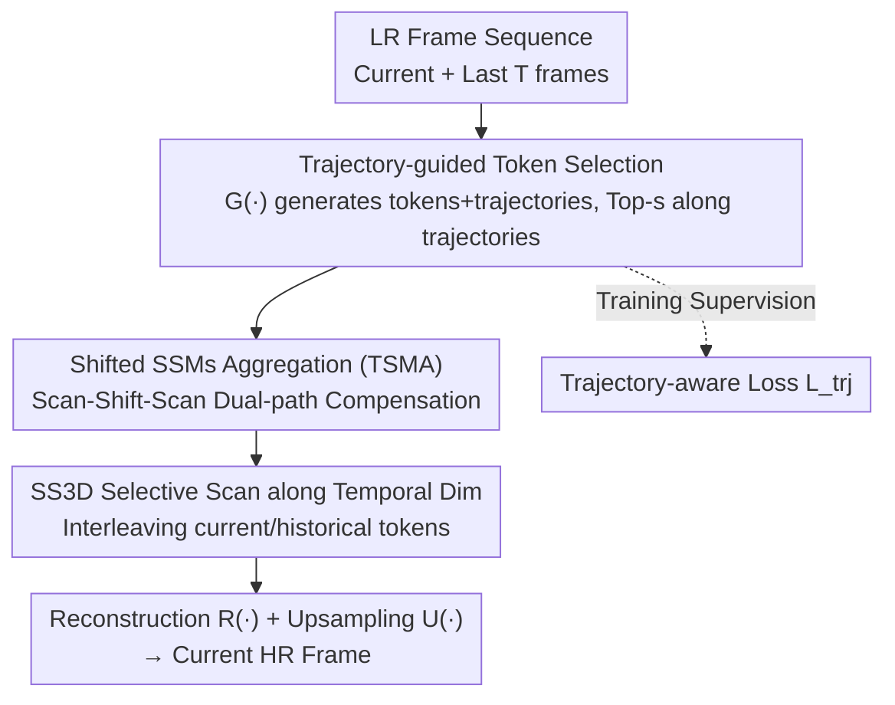

# Trajectory-aware Shifted State Space Models for Online Video Super-Resolution

**Conference**: ICLR 2026  
**OpenReview**: [https://openreview.net/forum?id=RygnSGcV49](https://openreview.net/forum?id=RygnSGcV49)  
**Code**: https://github.com/QZ1-boy/TS-Mamba (Available)  
**Area**: Image Restoration / Video Super-Resolution  
**Keywords**: Online Video Super-Resolution, State Space Models, Mamba, Trajectory Modeling, Hilbert Scanning

## TL;DR
This paper proposes TS-Mamba, which combines "video trajectory modeling" with "low-complexity Mamba" for online video super-resolution: it first selects the most similar tokens to the current token from historical frames along trajectories, then aggregates them spatio-temporally using a set of "shifted" State Space Model blocks. While maintaining long-range temporal modeling capabilities, it reduces computational complexity (MACs) by over 22.7% compared to existing online VSR methods and achieves SOTA on most test sets.

## Background & Motivation
**Background**: Online video super-resolution (VSR) targets low-latency scenarios such as live streaming and video conferencing. It can only use the current low-resolution frame $I_{LR}^{t}$ and previous frames to reconstruct the current high-resolution frame, without access to future frames. To meet real-time requirements, mainstream online methods use lightweight temporal alignment modules like CKBG, DAP, FDAN, and TMP.

**Limitations of Prior Work**: To save computational costs, these methods almost exclusively use a **single** adjacent historical frame for alignment and are mostly based on CNNs, which is essentially "short-range" temporal modeling. This limits the upper bound of reconstruction quality by ignoring long-range information. Introducing long-range alignment (e.g., bidirectional propagation, Transformers, diffusion models) would cause complexity to surge beyond real-time constraints.

**Key Challenge**: There is a contradiction between long-range temporal modeling capability and the low-complexity/low-latency requirements of online VSR. Transformer-based global modeling offers high quality but is too expensive; CNN-based methods are lightweight but can only see one frame.

**Goal**: To find a modeling tool that is both sufficiently lightweight and capable of long-range spatio-temporal aggregation, while solving the "spatial discontinuity" problem inherent in applying it to images.

**Key Insight**: State Space Models (SSM / Mamba) offer linear complexity and near-global receptive fields, making them naturally suitable for "low-cost long-range modeling." However, flattening 2D images into 1D token sequences in Mamba loses spatial continuity. Existing vision Mamba methods simply stack multiple scanning patterns to compensate, without analyzing where the discontinuity actually occurs, which only adds unnecessary complexity.

**Core Idea**: Use "trajectories" to accurately select truly relevant tokens from historical frames (instead of whole-frame alignment), then perform spatio-temporal aggregation at the token level using "Scan-Shift-Scan" shifted SSMs to specifically compensate for Hilbert scan discontinuities. This enables long-range online VSR with low complexity. This is also the first SSM-based online VSR model.

## Method

### Overall Architecture
TS-Mamba addresses "how to cheaply aggregate long-range spatio-temporal information from multiple historical frames to reconstruct the current HR frame." The pipeline is as follows: the current frame and the preceding $T$ LR frames are fed into a token and trajectory generation module $G(\cdot)$, producing current frame tokens $Q=\{q_i^t\}$ and historical tokens $V=\{v_i^k\}$, and constructing a motion trajectory $\mathcal{T}^t$ for each token over time. Along the trajectories, the $s$ most similar tokens $V_s$ are selected from historical frames via cosine similarity. $Q$ and $V_s$ are then fed into the Trajectory-aware Shifted Mamba Aggregation (TSMA) module, which uses "Scan-Shift-Scan" shifted SSM blocks for spatio-temporal aggregation to obtain feature $F_{LR}^t = \mathrm{TSMA}(Q, V_s)$. Finally, the aggregated feature passes through a reconstruction network $R(\cdot)$ and is added to the bicubic upsampled current frame $U(I_{LR}^t)$ to produce $I_{SR}^t = R(F_{LR}^t) + U(I_{LR}^t)$. During training, a trajectory-aware loss is used to supervise the accuracy of the trajectories.

### Key Designs

**1. Trajectory-guided token selection: Replacing whole-frame alignment with motion trajectories to pick only truly relevant historical tokens**

Existing online VSR methods either perform whole-frame alignment (expensive) or only look at one frame (short-range). This paper changes the granularity to the token level. $G(\cdot)$ consists of one convolutional layer plus $N_1$ residual blocks to extract tokens from each frame; meanwhile, for each current token $q_i^t$, it constructs a trajectory $\tau_i^k = (x_i^k, y_i^k),\ k\in[t-T, t]$ across time, recording its coordinates in each historical frame (trajectories are updated by a lightweight flow network). With trajectories, the task of "where to look in historical frames" becomes an explicit, supervisable geometric correspondence rather than a blind whole-frame search.

During token selection, cosine similarity between the current token and historical tokens is calculated along the trajectory to select the Top-$s$:

$$\{h_j\}_{j=1}^{s} = \underset{k}{\mathrm{Top\text{-}k}}\ \left\langle \frac{q_{\tau_i^t}}{\|q_{\tau_i^t}\|_2^2}, \frac{v_{\tau_i^k}}{\|v_{\tau_i^k}\|_2^2} \right\rangle,\quad V_s = \{v_{\tau_i^{h_j}}\}_{j=1}^{s}$$

In this way, the long-range history of $T$ frames is compressed into only $s$ most relevant tokens for each position (experimentally $s=3$). This preserves long-range information while significantly reducing the data to be aggregated—a prerequisite for being "long-range yet inexpensive."

**2. Shifted SSMs block: Diagnosing Hilbert scan discontinuities and compensating with "Scan-Shift-Scan"**

When Mamba flattens a 2D image into a 1D sequence along a scanning path, spatially adjacent pixels may be pulled far apart in the sequence, causing a loss of spatial continuity. Unlike prior methods that blindly stack various scans, this paper first **quantifies** the discontinuity: it defines a discontinuity degree $D_d$. In a local block composed of four adjacent regions, if the four regions are scanned sequentially, $D_d=0$; otherwise, $D_d$ equals the "number of regions not scanned sequentially," ranging from $\{0,1,2,3\}$. After dividing an $8\times8$ grid into four $4\times4$ local windows, the authors found that Hilbert scanning exhibits both **intra-window discontinuity** and **inter-window discontinuity** (the gap in the central region between windows is largest, where $D_d$ can reach 3).

To address these two types of discontinuities, the paper proposes a "Scan-Shift-Scan" process: after the first scan, a window shift is performed in a certain direction/step (e.g., Up 1 $U(1)$, Top-Left 3 $UL(3)$), followed by a second scan so that the second scan connects the breakages from the first. A process is denoted as $P(l, Sf(p), j) = Sc_1(l) \to Sf(p) \to Sc_2(j)$, and its effectiveness is measured by an elimination value $\delta = \delta_{intra} + \delta_{inter}$ ($\delta\in[4,18]$). Based on this, the authors construct two parallel compensation branches—IntraWCB and InterWCB: for example, path ① uses $P(1, U(1), 3) + P(1, UL(3), 3)$, and path ② uses $P(2, L(1), 4) + P(2, LU(3), 4)$. Each branch contains one standard SSM block and two parallel S-SSM blocks, with outputs fused via convolution and Deformable Attention Blocks (DAB). This "diagnose first, then compensate specifically with shifts" approach is the key difference from existing vision Mamba methods.

**3. SS3D: Spatial Hilbert selective scanning along temporal dimension to interleave current and historical tokens**

Selecting historical tokens is not enough; they must exchange information in the spatio-temporal dimensions. SS3D (spatial Hilbert selective scanning along temporal dimension) scans the current tokens $\{q_{\tau_i^t}\}$ and selected historical tokens $\{v_{\tau_i^{h_j}}\}_{j=1}^{s}$ together into a 1D sequence along the Hilbert path. During scanning, historical tokens are **interleaved** with current tokens, allowing information to interact across both spatial and temporal dimensions. Window-based selective scanning preserves local spatial information while gradually capturing global temporal patterns—this is the scanning mechanism that enables TSMA to achieve true "long-range spatio-temporal aggregation."

**4. Trajectory-aware loss: Supervising trajectory generation for accurate token selection**

The effectiveness of the method relies on the trajectories correctly selecting relevant tokens. Therefore, the trajectories themselves require supervision. The paper generates HR trajectories $\mathcal{T}^t_{HR}$ from HR videos in the same manner and downsamples them to the LR scale as supervision signals:

$$L_{trj} = \left\| \mathcal{T}^t - ((\mathcal{T}^t_{HR})\downarrow_{\hat{s}})/\hat{s} \right\|$$

Spatial reconstruction uses Charbonnier loss $L_{spa} = \sqrt{\|I_{HR}^t - I_{SR}^t\|^2 + \epsilon^2}$. The total loss is $L_{total} = L_{spa} + \lambda L_{trj}$ ($\lambda=0.1$). Ablations show that removing $L_{trj}$ causes PSNR to drop from 30.73 to 30.70.

### Loss & Training
The training sets are REDS and Vimeo-90K, evaluated on REDS4, Vid4, and Vimeo-90K-T. Two degradations, BI (bicubic) and BD (Gaussian blur + downsampling), are included with a scale factor $\hat{s}=4$. $N_1=2, N_2=13$, token size $4\times4$, window $8\times8$, number of selected tokens $s=3$, temporal window $T=15$. Adam + Cosine Annealing, HR patch $256\times256$, batch 8, total 600K iterations, 2 RTX 3090 GPUs.

## Key Experimental Results

### Main Results
Compared with five online VSR methods across three datasets and two degradations, TS-Mamba achieves the optimal PSNR/SSIM in most settings while maintaining significantly lower complexity (MACs only 112G, one of the lowest among online methods). Complexity is calculated for an $180\times320$ LR frame.

| Dataset (Degradation) | Metric | TS-Mamba | FDAN | KSNet | TMP |
|--------|------|------|------|------|------|
| REDS4 (BI, RGB) | PSNR/SSIM | **30.73 / 0.8727** | 30.71 / 0.8723 | 30.69 / 0.8724 | 30.67 / 0.8710 |
| Vid4 (BI, Y) | PSNR/SSIM | **27.17 / 0.8209** | 27.14 / 0.8206 | 27.14 / 0.8208 | 27.10 / 0.8167 |
| Vimeo-90K-T (BI, Y) | PSNR/SSIM | 37.36 / 0.9482 | 37.36 / 0.9483 | 37.34 / 0.9490 | 37.33 / 0.9481 |
| Complexity | MACs(G) / Params(M) | **112 / 3.0** | 146 / 3.9 | 145 / 3.0 | 176 / 3.1 |

Compared to TMP, TS-Mamba's MACs are reduced by approximately 36.3%; compared to the SOTAs shown in Figure 1, the overall MACs are reduced by more than 22.7%. The runtime is 29ms / 33.5 FPS, making it the second fastest online method (TMP is faster in runtime due to CUDA kernels but has higher MACs).

### Ablation Study
Verified the contribution of each component on REDS4 (BI):

| Config | PSNR/SSIM | MACs(G) | Description |
|------|---------|------|------|
| TS-Mamba (Full) | 30.73 / 0.8727 | 112 | Full model |
| v1.1 w/o Trajectory | 30.45 / 0.8678 | 84 | Remove $G(\cdot)$+token selection, drops 0.28dB (Largest) |
| v1.2 w/o $L_{trj}$ | 30.70 / 0.8721 | 112 | No trajectory loss, inaccurate trajectories |
| v1.3 w/o IntraWCB | 30.58 / 0.8702 | 97 | Remove intra-window compensation |
| v1.4 w/o InterWCB | 30.61 / 0.8706 | 97 | Remove inter-window compensation |
| v1.5 w/o Intra+InterWCB | 30.52 / 0.8689 | 85 | Remove both compensation branches |
| v1.8 w/o All Shifts | 30.61 / 0.8702 | 111 | Remove all shift operations |

Ablation on token count $s$: $s=1\to30.64, s=2\to30.68, s=3\to30.73, s=4\to30.74$ (gain saturates but complexity increases), thus $s=3$ is chosen as a compromise.

### Key Findings
- **Trajectory/token selection contributes the most**: Removing it leads to a 0.28dB drop, far exceeding other components, proving that "accurate token selection along trajectories" is the core source of gain for TS-Mamba.
- **Both compensation branches are essential**: Individually removing IntraWCB or InterWCB leads to drops of about 0.12–0.15dB, and removing both drops the score to 30.52, proving that both intra-window and inter-window discontinuities need compensation.
- **Diminishing returns for token count**: Increasing $s$ from 3 to 4 barely changes the PSNR (30.73→30.74) but costs an additional 8G MACs, validating the design intuition that "a few most relevant tokens are sufficient."
- **Failure scenarios**: When high-speed rotation occurs (e.g., spinning wheels), trajectory generation becomes inaccurate and rotational information is difficult to reconstruct—this is a shared challenge for most online VSR methods.

## Highlights & Insights
- **First to introduce "trajectories" to Mamba and first SSM model for online VSR**: Upgrading token selection from "whole-frame/single-frame alignment" to "selecting most relevant tokens along motion trajectories" allows long-range information to be compressed into a minimal number of tokens, which is key to being "long-range and low-cost."
- **"Diagnosis then compensation" scanning methodology**: Quantifying Hilbert scan spatial breakages via $D_d$ and elimination value $\delta$, then specifically compensating with "Scan-Shift-Scan"—this methodology is transferable to any scan-based vision Mamba model.
- **Supervisable trajectories**: Using HR trajectories to supervise LR trajectories turns the accuracy of token selection into an explicit loss term, which is a simple yet effective idea.

## Limitations & Future Work
- **Failure under rotation/high-dynamic motion**: The authors admit that in high-speed rotation scenarios, trajectories are inaccurate and reconstruction degrades, which is an inherent weakness of the trajectory modeling paradigm.
- **Dependence on external flow networks**: Trajectory quality is affected by the precision of the flow network.
- **Manual search for shift combinations**: The $P(\cdot)$ combinations for the two compensation branches were manually selected after enumerating elimination values; automated or learnable extensions are missing.
- **Real-time performance limited by implementation**: Although TS-Mamba has the lowest MACs, its runtime is slower than TMP (which uses CUDA accelerators), suggesting the engineering implementation of SSM blocks still has room for optimization.

## Related Work & Insights
- **vs CNN-based Online VSR (FDAN / KSNet / TMP)**: These are based on CNNs for short-range (mostly single-frame) temporal alignment. Ours uses trajectories + Mamba for long-range token-level aggregation, achieving superior quality at significantly lower MACs.
- **vs Mamba Vision SR (VSRM / MamEVSR)**: These ignore the local spatial continuity of Mamba and rely on repeated multi-scanning; Ours quantifies the Hilbert scan discontinuities and compensates specifically via shifts, which is more efficient.
- **vs Bidirectional Propagation (BasicVSR++ / IART / VSRM)**: Those methods achieve higher PSNR by using future frames and bidirectional propagation, but they have high complexity (thousands of MACs) and do not meet online constraints. TS-Mamba achieves online SOTA using only historical frames.

## Rating
- Novelty: ⭐⭐⭐⭐⭐ First SSM for online VSR, introducing trajectories to Mamba and quantifiable scan discontinuity compensation.
- Experimental Thoroughness: ⭐⭐⭐⭐ Complete evaluation on three datasets with two degradations, plus comprehensive ablation and failure case analysis, though PSNR gains are relatively small (around 0.02–0.06dB).
- Writing Quality: ⭐⭐⭐⭐ Method is clearly described with sufficient diagrams; shift process notation is somewhat dense.
- Value: ⭐⭐⭐⭐ Realizes low MACs and high quality for online VSR; the scan compensation methodology is useful for various Mamba vision models.

<!-- RELATED:START -->

## Related Papers

- [\[ICLR 2026\] Continuous Space-Time Video Super-Resolution with 3D Fourier Fields](continuous_space-time_video_super-resolution_with_3d_fourier_fields.md)
- [\[AAAI 2026\] MFmamba: A Multi-function Network for Panchromatic Image Resolution Restoration Based on State-Space Model](../../AAAI2026/image_restoration/mfmamba_a_multi-function_network_for_panchromatic_image_resolution_restoration_b.md)
- [\[CVPR 2025\] QMambaBSR: Burst Image Super-Resolution with Query State Space Model](../../CVPR2025/image_restoration/qmambabsr_burst_image_super-resolution_with_query_state_space_model.md)
- [\[ICLR 2026\] Text-Aware Image Restoration with Diffusion Models](text-aware_image_restoration_with_diffusion_models.md)
- [\[CVPR 2025\] Efficient Visual State Space Model for Image Deblurring](../../CVPR2025/image_restoration/efficient_visual_state_space_model_for_image_deblurring.md)

<!-- RELATED:END -->
