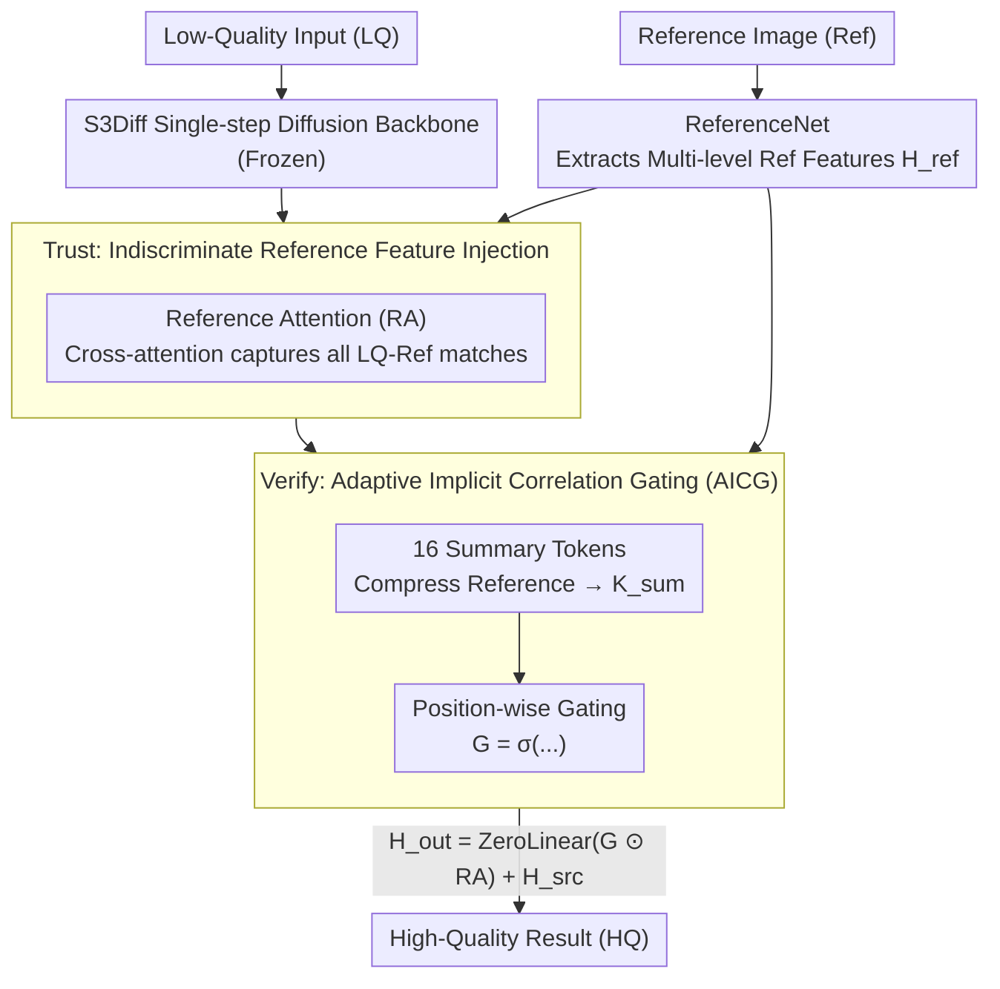

# Trust but Verify: Adaptive Conditioning for Reference-Based Diffusion Super-Resolution

**Conference**: ICLR 2026  
**arXiv**: [2602.01864](https://arxiv.org/abs/2602.01864)  
**Code**: [https://github.com/vivoCameraResearch/AdaRefSR](https://github.com/vivoCameraResearch/AdaRefSR)  
**Area**: Image Restoration  
**Keywords**: Reference-based Super-Resolution, diffusion model, Adaptive Gating, Implicit Correlation, Single-step Diffusion

## TL;DR

Ada-RefSR is proposed as a single-step reference-guided diffusion super-resolution framework based on the "Trust but Verify" principle. It utilizes an Adaptive Implicit Correlation Gating (AICG) mechanism to leverage reliable reference information while suppressing erroneous fusion, with only a 0.13% increase in computational overhead.

## Background & Motivation

Single Image Super-Resolution (SISR) methods based on diffusion models (e.g., StableSR, DiffBIR, SeeSR) generate visually pleasing results by leveraging generative priors but frequently suffer from **hallucination issues**—fabricating or omitting details. Reference-based Super-Resolution (RefSR) mitigates hallucinations by introducing external reference images to provide complementary high-frequency details.

The core challenge lies in the fact that real-world degradation makes the correspondence between low-quality (LQ) inputs and reference (Ref) images unreliable. Existing methods have significant flaws in regulating reference usage:

**PFStorer (Global Learnable Vector)**: Uses global weights to uniformly control the reference branch, failing to adapt to input pairs of varying alignment quality—using the same gating value for both well-aligned and poorly-aligned pairs.

**ReFIR (Explicit Token Similarity)**: Spatial gating based on explicit correlation is susceptible to noise interference and suffers from a long-tail distribution problem (where many identical tokens dominate the computation while a few critical tokens are ignored).

**The Two-Sided Problem**:
   - **Over-reliance on Reference**: Erroneous injection of reference cues leading to semantic inconsistency (e.g., a bird's eye being copied to a non-eye region).
   - **Under-utilization of Reference**: Valuable reference information is not fully exploited.

## Method

### Overall Architecture

Ada-RefSR uses S3Diff, a single-step diffusion SR model, as the backbone. Other components are frozen, and only the newly inserted reference attention modules are trained. The reference utilization process is split into two steps: "Trust" and "Verify". In the Trust phase, Reference Attention (RA) indiscriminately injects reference features into the backbone to maximize the capture of potential matches. In the Verify phase, the Adaptive Implicit Correlation Gating (AICG) estimates reference credibility spatially to suppress erroneous fusion. These two steps in series ensure useful references are not missed while preventing contamination from incorrect correspondences.

### Key Designs

**1. Trust: Indiscriminate Reference Feature Injection to Ensure No Missing Matches**

Given that correspondences between LQ and Ref are unstable under real degradation, applying similarity threshold filtering before injection might prematurely discard "weak but useful" matches. Ada-RefSR instead trusts all references initially. A ReferenceNet (initialized with SD-Turbo, fixed timestep=1) extracts multi-level reference features $\mathbf{H}_{ref}$. Then, RA modules are inserted into each attention layer of the backbone for cross-attention: queries come from the backbone $\mathbf{Q}=\mathbf{H}_{src}\mathbf{W}_Q$, while keys and values come from the reference $\mathbf{K}=\mathbf{H}_{ref}\mathbf{W}_K$, $\mathbf{V}=\mathbf{H}_{ref}\mathbf{W}_V$. The output is $\mathbf{H}_{out}=\text{ZeroLinear}(\text{Softmax}(\tfrac{\mathbf{QK}^\top}{\sqrt{d}})\mathbf{V})+\mathbf{H}_{src}$. Projection weights for RA are initialized from the backbone's self-attention, and a ZeroLinear layer ensures the residual branch starts from zero to prevent reference features from overwhelming the backbone early in training. This step deliberately avoids filtering to capture all potential LQ-Ref matches, accepting that indiscriminate fusion may cause local semantic inconsistencies (e.g., copying eyes to non-eye regions), which are addressed in the next step.

**2. Verify: Adaptive Implicit Correlation Gating (AICG) for Position-wise Suppression**

To fix the side effects of the previous step, a direct approach like ReFIR (calculating an explicit $L_{src}\times L_{ref}$ token-to-token similarity matrix as a gate) is computationally expensive (+16% overhead), noise-sensitive, and dominated by redundant tokens. AICG instead uses implicit estimation: First, a set of learnable summary tokens $\mathbf{T}_S\in\mathbb{R}^{M\times d}$ ($M=16$) compresses the reference into a compact representation: $\mathbf{S}=\mathbf{T}_S\mathbf{W}_K$, $\mathbf{K}_{sum}=\text{Softmax}(\tfrac{\mathbf{SK}^\top}{\sqrt{d}})\mathbf{K}\in\mathbb{R}^{M\times d}$. Next, the backbone queries calculate attention with these 16 summary tokens to obtain a distribution map $\mathbf{S}_{map}=\text{Softmax}(\tfrac{\mathbf{Q}\mathbf{K}_{sum}^\top}{\sqrt{d}})\in\mathbb{R}^{L_q\times M}$. A gating value for each spatial position is obtained by averaging along the summary dimension and applying a sigmoid function: $\mathbf{G}=\sigma(\tfrac{1}{M}\sum_{j=1}^{M}[\mathbf{S}_{map}]_{:,j})\in\mathbb{R}^{L_q\times 1}$. Finally, this gates the RA output: $\mathbf{H}_{out}=\text{ZeroLinear}(\mathbf{G}\odot\text{RA}(\mathbf{H}_{src},\mathbf{H}_{ref}))+\mathbf{H}_{src}$. If a position is highly correlated with the reference overall, the gate approaches 1; otherwise, it is lowered to cut off erroneous fusion. By reusing projections and intermediate variables from RA and spreading 16 summary tokens across the image, AICG incurs only a +0.13% overhead—far lower than ReFIR’s +16%—while avoiding noise and long-tail issues inherent in explicit similarity.

### Loss & Training

The training objective is a weighted sum of reconstruction, perceptual, and adversarial losses:

$$\mathcal{L}_{total} = \lambda_1 \mathcal{L}_{rec} + \lambda_2 \mathcal{L}_{per} + \lambda_3 \mathcal{L}_{adv}$$

Where $\mathcal{L}_{rec}$ is the L2 reconstruction loss, $\mathcal{L}_{per}$ is the VGG perceptual loss, and $\mathcal{L}_{adv}$ is the standard GAN adversarial loss. The model is trained using Adam on 2 A40 GPUs with a learning rate of 5e-5, batch size of 16, and 11K iterations. To enhance robustness against unreliable references, 20% of HQ-Ref pairs are randomly replaced with irrelevant samples during training, forcing AICG to learn to suppress gating when the reference is useless.

## Key Experimental Results

### Main Results (Table 1)

**WRSR Dataset** (In-scene Reference SR):

| Method | PSNR↑ | SSIM↑ | LPIPS↓ | FID↓ |
|------|-------|-------|--------|------|
| S3Diff | 21.91 | 0.562 | 0.354 | 63.82 |
| SeeSR+ReFIR | 21.83 | 0.567 | 0.344 | 61.96 |
| SUPIR+ReFIR | 21.01 | 0.538 | 0.395 | 76.50 |
| **Ours** | **21.97** | **0.578** | **0.306** | **53.28** |

**Bird Dataset** (Retrieval-Augmented SR):

| Method | PSNR↑ | LPIPS↓ | FID↓ |
|------|-------|--------|------|
| S3Diff | 24.84 | 0.290 | 60.95 |
| SeeSR+ReFIR | 23.72 | 0.295 | 52.40 |
| **Ours** | **25.30** | **0.254** | **36.42** |

**Face Dataset** (Face Reference SR):

| Method | PSNR↑ | LPIPS↓ | FID↓ |
|------|-------|--------|------|
| DMDNet | 26.90 | 0.232 | 56.63 |
| InstantRestore | 26.22 | 0.207 | 51.23 |
| **Ours** | **27.13** | **0.175** | **42.70** |

### Ablation Study (Table 2 - WRSR & Face Datasets)

| Gating Scheme | WRSR PSNR | WRSR SSIM | Face PSNR | Face SSIM |
|---------|-----------|-----------|-----------|-----------|
| Vanilla (No Gating) | 21.95 | 0.574 | 27.08 | 0.750 |
| Global (PFStorer) | 21.63 | 0.561 | 27.06 | 0.750 |
| ReFIR | 21.78 | 0.567 | 26.94 | 0.747 |
| **AICG (Ours)** | **21.97** | **0.578** | **27.13** | **0.752** |

### Efficiency Comparison (Table 3 - 1024×1024)

| Method | VRAM(GB) | Inference Time(s) |
|------|---------|-----------|
| S3Diff | 7.18 | 0.74 |
| Ada-RefSR | 15.54 | 1.35 |
| SeeSR+ReFIR | 18.95 | **40.23** |

- **Ada-RefSR is approximately 30x faster than SeeSR+ReFIR.**

### Key Findings

1. **AICG consistently outperforms other gating schemes across all datasets**: This validates the effectiveness of implicit correlation modeling.
2. **Robustness Advantage**: When the LQ-Ref alignment ratio is <0.7, SUPIR+ReFIR falls below its baseline, while the proposed method consistently exceeds its baseline.
3. **Interpretability of Summary Tokens**: Different tokens capture different semantic regions (body parts, sky, grass, bird features, etc.).
4. **16 Summary Tokens is Optimal**: Performance with 8 or 32 tokens is inferior to 16.

## Highlights & Insights

- **"Trust but Verify" Philosophy**: A clear logic of initially trusting (maximizing reference utilization) and then verifying (suppressing erroneous fusion).
- **Extremely Lightweight**: AICG adds only 0.13% computational overhead (vs. 16% for ReFIR) by reusing existing projections.
- **Implicit vs. Explicit Correlation**: Implicit modeling via summary tokens avoids the noise sensitivity issues of explicit token-to-token similarity.
- **Semantic Clustering of Learnable Tokens**: Tokens self-organize into semantically meaningful cluster centers.
- **30x Speedup**: The single-step diffusion design makes inference significantly faster than multi-step methods.

## Limitations & Future Work

1. The number of model parameters is approximately double that of S3Diff (2679M vs 1327M), primarily due to ReferenceNet.
2. Handling extremely irrelevant references still has room for improvement.
3. Currently limited to a single reference image; extension to multiple references is yet to be explored.
4. Patch-level reference guidance might provide finer control.
5. More lightweight reference injection strategies (e.g., token pruning, sparse attention) remain to be explored.

## Related Work & Insights

- **S3Diff**: Serves as the single-step diffusion backbone for SR.
- **ReFIR**: Current SOTA for retrieval-augmented RefSR, though its explicit correlation gating has limitations.
- **IP-Adapter / ControlNet**: Other reference injection paradigms that are less precise for RefSR scenarios.
- **DETR's Learnable Queries**: Source of inspiration for AICG’s summary tokens, though functionally different.
- **Insight**: The approach for implicit correlation modeling can be extended to other conditional generation tasks (e.g., video editing, virtual try-on).

## Rating

- Novelty: ⭐⭐⭐⭐ (Innovative AICG gating mechanism, clear Trust-but-Verify paradigm)
- Experimental Thoroughness: ⭐⭐⭐⭐⭐ (4 datasets, multi-dimensional ablation, efficiency analysis, robustness testing, complexity derivation)
- Writing Quality: ⭐⭐⭐⭐⭐ (Clear logic, excellent diagrams, complete formula derivation)
- Value: ⭐⭐⭐⭐ (Practical progress in the RefSR field, 30x speedup is significant)

## Related Papers

- [\[ICLR 2026\] LiveMoments: Reselected Key Photo Restoration in Live Photos via Reference-guided Diffusion](livemoments_reselected_key_photo_restoration_in_live_photos_via_reference-guided.md)
- [\[ICLR 2026\] KernelFusion: Zero-Shot Blind Super-Resolution via Patch Diffusion](kernelfusion_zero-shot_blind_super-resolution_via_patch_diffusion.md)
- [\[ICLR 2026\] Improved Adversarial Diffusion Compression for Real-World Video Super-Resolution](improved_adversarial_diffusion_compression_for_real-world_video_super-resolution.md)
- [\[ICLR 2026\] Adaptive Moments are Surprisingly Effective for Plug-and-Play Diffusion Sampling](adaptive_moments_are_surprisingly_effective_for_plug-and-play_diffusion_sampling.md)
- [\[ICLR 2026\] Texture Vector-Quantization and Reconstruction Aware Prediction for Generative Super-Resolution](texture_vector-quantization_and_reconstruction_aware_prediction_for_generative_s.md)

<!-- RELATED:END -->

<!-- RELATED:START -->

## Related Papers

- [\[ICLR 2026\] PlantRSR: A New Plant Dataset and Method for Reference-based Super-Resolution](plantrsr_a_new_plant_dataset_and_method_for_reference-based_super-resolution.md)
- [\[ICLR 2026\] LiveMoments: Reselected Key Photo Restoration in Live Photos via Reference-guided Diffusion](livemoments_reselected_key_photo_restoration_in_live_photos_via_reference-guided.md)
- [\[ICLR 2026\] KernelFusion: Zero-Shot Blind Super-Resolution via Patch Diffusion](kernelfusion_zero-shot_blind_super-resolution_via_patch_diffusion.md)
- [\[ICLR 2026\] Improved Adversarial Diffusion Compression for Real-World Video Super-Resolution](improved_adversarial_diffusion_compression_for_real-world_video_super-resolution.md)
- [\[ICLR 2026\] Adaptive Moments are Surprisingly Effective for Plug-and-Play Diffusion Sampling](adaptive_moments_are_surprisingly_effective_for_plug-and-play_diffusion_sampling.md)

<!-- RELATED:END -->
