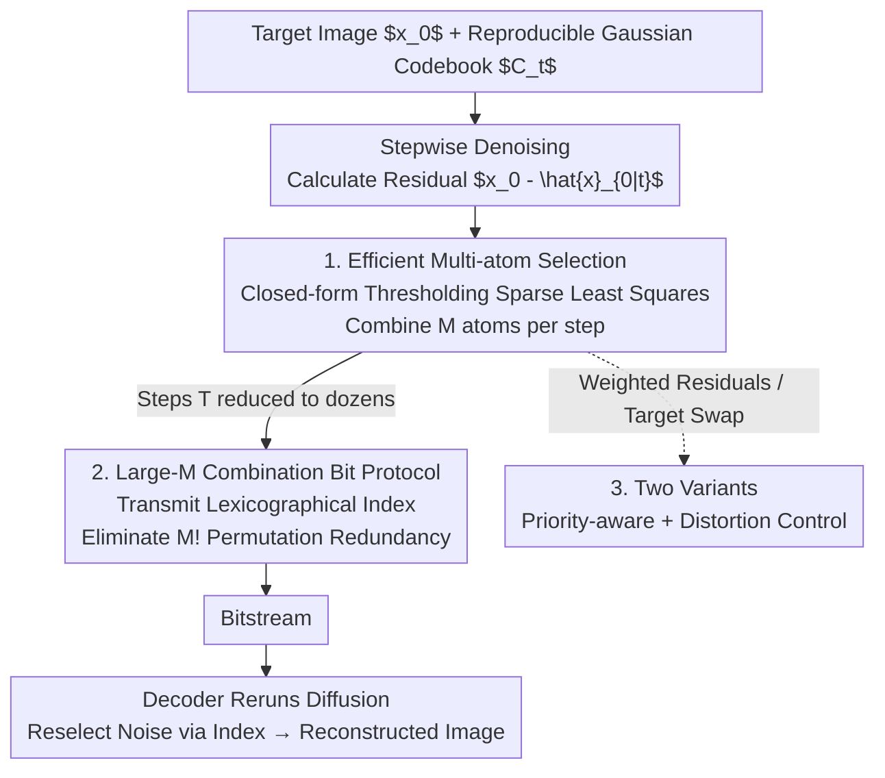

# Turbo-DDCM: Fast and Flexible Zero-Shot Diffusion-Based Image Compression

**Conference**: ICLR 2026  
**OpenReview**: [https://openreview.net/forum?id=eIF1QvC94Z](https://openreview.net/forum?id=eIF1QvC94Z)  
**Code**: Available on the project homepage  
**Area**: Diffusion Models / Image Compression  
**Keywords**: Zero-shot Compression, Diffusion Models, DDCM, Sparse Least Squares, Priority-aware

## TL;DR
This paper replaces the stepwise "Greedy Matching Pursuit" of the zero-shot diffusion compression method DDCM with a closed-form sparse least squares selection rule. By combining hundreds of noise atoms simultaneously in each step, the diffusion steps are reduced by 92%, cutting the round-trip compression-decompression time per image from 65 seconds to 1.8 seconds while maintaining SOTA-level quality and supporting flexible variants such as region-priority and target-PSNR compression.

## Background & Motivation
**Background**: Image compression has recently shifted from neural network methods to diffusion models, with the "zero-shot" path being the most attractive. It reuses a pre-trained diffusion backbone without separate training or fine-tuning. The same model can perform generation, restoration, and editing, with all tasks benefiting from backbone upgrades. The representative method DDCM (Denoising Diffusion Codebook Models) modifies the "random Gaussian noise sampling" in standard DDPM reverse diffusion to "selecting the noise atom from a reproducible codebook that best matches the target image." Thus, the image is reconstructed by storing the indices of the atoms selected at each step, making the mechanism extremely simple.

**Limitations of Prior Work**: Zero-shot diffusion compression is "notoriously slow." DDCM requires hundreds of denoising steps to achieve acceptable reconstruction quality, taking 65 seconds per image; PSC takes several minutes; even DiffC, using customized CUDA kernels, requires about 10 seconds and depends on hardware specialization, with bitrates and time consumption varying significantly across images/bitrates. In contrast, training-based methods yield results in a single forward pass, leaving the zero-shot route significantly disadvantaged in practicality.

**Key Challenge**: There are two ways to increase the bitrate in DDCM, but both are constrained. Increasing the denoising steps $T$ multiplies expensive denoiser calls, while increasing the codebook size $K$ only grows the bitrate logarithmically while significantly slowing down the search. The authors previously proposed using Matching Pursuit (MP) to combine $M$ atoms per step to broaden the bitrate, but MP relies on greedy iteration and exhaustive search, taking 0.1 seconds per step times $T$. Due to non-negative convex combination coefficients, increasing $M$ alone has limited gains and requires increasing coefficient bits $C$, causing exponential runtime growth. The fundamental contradiction is: **combining more atoms per step to reduce steps is desired, but the cost of the existing combination method (MP) explodes with the number of atoms**.

**Goal**: Find a selection rule that can "cheaply combine any number of noise atoms per step," allowing a few strong estimations to replace hundreds of weak ones, paired with an efficient coding protocol, and extending the method to region-priority and distortion-controlled scenarios.

**Key Insight**: The authors leverage a high-dimensional geometric fact—**atoms of a Gaussian random codebook are approximately orthogonal in high-dimensional space**. Under this approximation, the sparse least squares problem of "linearly approximating the residual with $M$ atoms" does not require iterative search and has a closed-form solution.

**Core Idea**: Replace DDCM’s greedy matching pursuit with a closed-form thresholding sparse least squares method to select and combine hundreds of atoms at once. This significantly strengthens the residual estimation per step, drastically reducing diffusion steps. Additionally, design a combinatorial coding protocol to eliminate permutation redundancy.

## Method

### Overall Architecture
Turbo-DDCM builds on DDCM: DDCM’s reverse diffusion replaces random Gaussian noise with an atom selected from a reproducible codebook $C_t=[z_t^{(1)},\dots,z_t^{(K)}]$. During compression, the atom with the largest inner product with the residual $x_0-\hat x_{0|t}$ is chosen, and the index sequence is stored for reconstruction. Turbo-DDCM makes two changes: **First**, it upgrades "selecting 1 atom per step" to "closed-form combination of $M$ atoms per step" using thresholding sparse least squares, where the cost is nearly independent of $M$, resulting in much stronger residual estimation and reducing total steps to dozens ($T=30$). **Second**, it designs a bit protocol for large-$M$ combinations that eliminates permutation redundancy by encoding indices as a lexicographical combinations. The decoder runs the same generative diffusion, reselecting noise from the codebook according to the decoded indices. Two flexible variants use weighted residuals or target-swapping to support region-priority and PSNR-controlled compression.

### Key Designs

**1. Efficient Multi-atom Selection: Replacing Greedy MP with Closed-form Thresholding**

This step addresses the core conflict where the cost of combining more atoms explodes. The authors formulate the noise construction at each step as a least squares problem with sparsity and quantization constraints: using a linear combination of exactly $M$ non-zero atoms with quantized coefficients to approximate the residual, $s_t^*=\arg\min_{s_t}\|C_t s_t-(x_0-\hat x_{0|t})\|_2^2$, subject to $\|s_t\|_0=M$ and coefficients from a quantization set $V\cup\{0\}$. The key insight is that high-dimensional Gaussian codebooks are approximately orthogonal, allowing a closed-form solution (thresholding algorithm): calculate the normalized inner product $(u_t)_i=\langle z_t^{(i)},x_0-\hat x_{0|t}\rangle/\|z_t^{(i)}\|_2$ for each atom, select the $M$ atoms with the largest absolute values, and use the inner products as coefficients. For the paper’s choice of $V=[-1,+1]$, this simplifies to taking the sign of the inner product $(s_t^*)_i=\mathrm{sign}((u_t)_i)$ for selected atoms and zero elsewhere.

This rule differs from DDCM’s MP in four fundamental ways: **(1) Construction Efficiency**: Closed-form Top-M selection is orders of magnitude faster than MP’s iterative search. **(2) Required Steps**: Runtime is almost independent of $M$, allowing $M$ to scale to hundreds, strengthening residual estimation and cutting diffusion steps by 92%. **(3) Quantization Values**: While MP is restricted to non-negative coefficients due to convex combinations, this method allows positive and negative coefficients, doubling representative capacity. **(4) Hyperparameters**: Bitrate is finely controlled via a single hyperparameter $M$, whereas DDCM requires adjusting $C/K/T$ simultaneously, causing erratic runtime fluctuations. Since $T$ is significantly reduced, the authors replace synthetic noise $z_t^*$ with DDIM sampling in the final steps to improve perceptual quality at low bitrates, with DDIM steps $N$ decreasing heuristically with bitrate.

**2. Efficient Bit Protocol for Large M: Approaching Information Bottom Bound by Eliminating Permutation Redundancy**

When $M$ is large, following the DDCM bit protocol causes significant waste. DDCM uses $\lceil\log_2 K\rceil M$ bits per step and **preserves the selection order of atoms** (since its noise construction depends on order). However, in the thresholding scheme, order is semantically irrelevant; only identity matters. Thus, naively encoding $M$ indices yields $M!$ equivalent representations. For a sequence, this results in $(M!)^{T-1}$ equivalent compressed results—even for conservative parameters like $M=5, T=30$, there are approximately $2^{200}$ equivalent representations.

The authors recompute the costs: each step requires transmitting an "unordered combination of $M$ unique atoms chosen from $K$" plus $M$ quantized coefficients, with $\binom{K}{M}\cdot(2^C)^M$ possibilities, corresponding to a lower bound of $\lceil\log_2\binom{K}{M}\rceil+MC$ bits. They propose a protocol achieving this bound: transmit the **lexicographical index of the selected combination in the set $\{1,\dots,\binom{K}{M}\}$**, followed by $M$ coefficients in a canonical order. This eliminates factorial redundancy while transmitting equivalent information. The final $\mathrm{BPP}$ is $(T-N-1)(\lceil\log_2\binom{K}{M}\rceil+MC)/\text{pixels}$, saving about 40% bits for typical configurations compared to DDCM.

**3. Two Flexible Variants: Adapting Selection Rules for Priority and Distortion Control**

The authors demonstrate the versatility of the selection rule. The **Priority-aware variant** targets scenarios like medical imaging or video conferences where specific regions must be clear. By introducing a latent space priority mask $w$ (downsampled from a pixel-level map), the least squares objective becomes $\|C_t s_t-w\odot(x_0-\hat x_{0|t})\|_2^2$. Atom selection then prioritizes reducing errors in high-weight pixels. Critically, $w$ **does not need to be transmitted to the decoder**, and the protocol/BPP remains unchanged with negligible runtime impact. This weighting approach generalizes naturally to DDCM and DiffC. The **Distortion Control variant** addresses the "large distortion variance across images at a fixed bitrate" problem by compressing each image to reach a target PSNR (rather than fixed BPP), significantly reducing variance in inter-image distortion. These variants are, to the authors' knowledge, the first of their kind in zero-shot diffusion compression.

## Key Experimental Results

### Main Results
Evaluated on Kodak24 and DIV2K ($512\times512$ crop) with an SD 2.1 Base backbone. Turbo-DDCM fixes $T=30, K=16384, C=1$, and adjusts bitrate via $M\in[45, 300]$. Distortion is measured by PSNR/LPIPS, perception by FID, and time as round-trip process time on an A40.

| metric | Turbo-DDCM | DDCM | DiffC (CUDA) | PSC |
|----------|-----------|------|--------------|-----|
| Round-trip Time | **1.8 s** (Fastest) | 65 s | ~10 s | >300 s |
| Relative Speedup | — | >34× (High BR) | 3×~10× | Extremely Slow |
| Distortion/Perception | Comparable/Better | Comparable | Perception slightly better at low BR | Lagging behind |
| Hardware Specialization | Not required | Not required | Requires custom kernels | Not required |

On the rate-distortion-perception front, Turbo-DDCM outperforms PSC and achieves equal or better distortion/perceptual quality compared to DDCM. Compared to non-neural/fine-tuned/trained methods, it outperforms all prior methods except for StableCodec (which is specifically hyper-tuned for each bitrate). At low bitrates, it shows better distortion even against perception-oriented methods like PerCo (SD) or DiffEIC; at high bitrates, it is slightly inferior to training-based methods in distortion due to the inherent latent compression ceiling of the SD 2.1 VAE.

### Ablation Study
| Configuration / Dimension | Effect | Explanation |
|-------------|------|------|
| Closed-form instead of MP | Steps −92% | Combining hundreds of atoms/step; strong estimation replaces weak ones |
| Positive/Negative Coeffs | Double capacity | MP restricted to non-negative convex combinations |
| New Bit Protocol | BPP −~40% | Eliminates $M!$ permutation redundancy; approaches info lower bound |
| Adjusting only $M$ | Constant runtime | DDCM requires $C/K/T$ adjustments, causing time drift |

### Key Findings
- The speed increase stems fundamentally from "stronger residual estimation per step"—closed-form multi-atom selection allows dozens of steps to replace hundreds, which is the real lever for the 92% reduction rather than mere engineering optimization.
- Runtime advantages are particularly evident at high bitrates (>34× vs DDCM, nearly an order of magnitude vs DiffC with CUDA kernels). Turbo-DDCM maintains near-constant runtime across bitrates and images, a practicality advantage other zero-shot methods lack.
- High-bitrate distortion is limited by the inherent ceiling of the SD 2.1 VAE, a common bottleneck for latent diffusion compression.

## Highlights & Insights
- **High-dimensional approximate orthogonality turns iterative search into closed-form solutions**: This is the most elegant move—MP is slow because atom correlation requires greedy decoupling; high-dimensional Gaussian codebooks approximate orthogonality, reducing sparse least squares to "Top-M inner products + sign extraction," dropping step costs to a single sorted inner product.
- **Order independence → Lexicographical indexing**: Recognizing that order is meaningless in thresholding atom selection and using the $\binom{K}{M}$ lower bound for encoding is a prime example of information-theoretic overhead reduction.
- **Feature richness through lightweight modification**: The priority-aware variant only weights the residual, and the distortion control variant only changes the target, with the mask requiring no transmission. This proves the framework's "clean" interface and low extension cost.

## Limitations & Future Work
- The authors admit that while fast, the method is still multi-step, whereas trained methods achieve similar quality in a single forward pass. Ideal "one-step zero-shot" methods would further increase speed while retaining flexibility.
- Some non-zero-shot methods still outperform this method in rate-distortion-perception trade-offs, suggesting a quality gap for zero-shot routes.
- High-bitrate performance is bottlenecked by the SD 2.1 VAE—this is a structural issue of latent diffusion; pixel-space operations or stronger backbones are needed for breakthroughs, though this might sacrifice zero-shot generality.
- DDCM-style compression lacks a complete theoretical foundation; the impact of the approximate orthogonality assumption across different codebook scales/dimensions remains to be systematically characterized.

## Related Work & Insights
- **vs DDCM**: Shares the reproducible codebook and residual matching concept, but DDCM selects 1 atom per step and relies on MP for bitrate increases at explosive costs. Ours uses closed-form thresholding to combine hundreds of atoms, allows signed coefficients, and optimizes the bit protocol, achieving comparable quality over 34× faster at high bitrates.
- **vs DiffC**: DiffC uses Reverse Channel Coding (RCC) and custom CUDA kernels for speed (~10s), but depends on hardware specialization and shows high variance in bitrate/time. Turbo-DDCM is faster without specialized hardware and is stable across images and bitrates.
- **vs ROI/Priority Compression (e.g., Xu et al. 2025)**: Existing ROI compression is mostly implemented in trained frameworks; this work is the first to bring pixel-priority-based region-aware capabilities to zero-shot diffusion compression without requiring mask transmission.

## Rating
- Novelty: ⭐⭐⭐⭐ Replaced greedy MP with closed-form sparse least squares via high-dimensional orthogonality, combined with an information-bottom-bound protocol.
- Experimental Thoroughness: ⭐⭐⭐⭐ Evaluated on two datasets against multiple baselines across distortion, perception, and time; verified two functional variants.
- Writing Quality: ⭐⭐⭐⭐ Clear logic from motivation to contradiction to solution.
- Value: ⭐⭐⭐⭐ Reduces zero-shot diffusion compression time to 1.8s while remaining competitive, significantly advancing the practicality of the route.

<!-- RELATED:START -->

## Related Papers

- [\[ICLR 2026\] KernelFusion: Zero-Shot Blind Super-Resolution via Patch Diffusion](kernelfusion_zero-shot_blind_super-resolution_via_patch_diffusion.md)
- [\[CVPR 2026\] MR. Illuminate: Zero-Shot Low-Light Image Enhancement with Diffusion Prior](../../CVPR2026/image_restoration/mr_illuminate_zero-shot_low-light_image_enhancement_with_diffusion_prior.md)
- [\[ICLR 2026\] Improved Adversarial Diffusion Compression for Real-World Video Super-Resolution](improved_adversarial_diffusion_compression_for_real-world_video_super-resolution.md)
- [\[CVPR 2026\] Zero-Shot Image Denoising via Hybrid Prior-Guided Pseudo Sample Generation](../../CVPR2026/image_restoration/zero-shot_image_denoising_via_hybrid_prior-guided_pseudo_sample_generation.md)
- [\[CVPR 2026\] Self-supervised Dynamic Heterogeneous Degradation Modeling for Unified Zero-Shot Image Restoration](../../CVPR2026/image_restoration/self-supervised_dynamic_heterogeneous_degradation_modeling_for_unified_zero-shot.md)

<!-- RELATED:END -->
