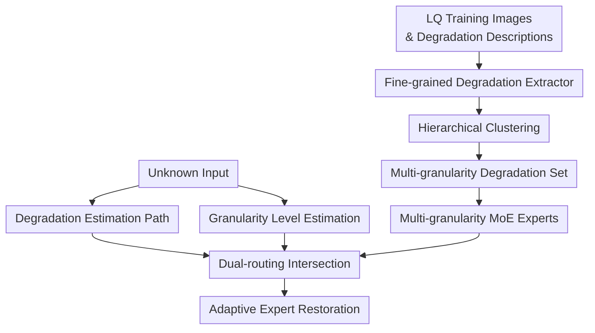

# UniRestorer: Universal Image Restoration via Adaptively Estimating Image Degradation at Proper Granularity

**Conference**: ICLR2026  
**OpenReview**: [https://openreview.net/forum?id=nDrZow7fCF](https://openreview.net/forum?id=nDrZow7fCF)  
**Code**: https://github.com/mrluin/UniRestorer  
**Area**: Image Restoration / Universal Image Restoration  
**Keywords**: Universal Image Restoration, Multi-degradation Modeling, Multi-granularity Degradation Representation, Mixture-of-Experts, Robust Routing  

## TL;DR
UniRestorer hierarchically organizes the image degradation space into multi-granularity degradation groups and trains corresponding MoE restoration experts. By jointly routing via degradation estimation and granularity estimation, the universal restoration model leverages fine-grained degradation priors while remaining robust against incorrect degradation estimation.

## Background & Motivation
**Background**: Image restoration has long been split by tasks: specialized models are trained for deraining, dehazing, denoising, deblurring, low-light enhancement, desnowing, and compression artifact removal. Recent all-in-one image restoration aims to process various low-quality inputs with a single unified model. Common approaches include training a shared backbone on mixed tasks, adding prompts/adapters for different degradations, or using conditional modules like MoE, LoRA, and filters.

**Limitations of Prior Work**: Fully degradation-agnostic shared models struggle to learn specialized processing for different degradations, as tasks like denoising and deblurring can even conflict. Degradation-aware methods seem more reasonable as they estimate the input degradation to activate specific prompts or experts. However, the degradation space in all-in-one scenarios is vast—especially with mixed degradations and continuous intensity variations—making estimation errors inevitable. Once routing sends a heavy-snow image to a light-snow expert or a low-light+rain image to a rain-only expert, the loss caused by incorrect routing increases as experts become more specialized.

**Key Challenge**: Universal restoration seeks two conflicting capabilities: identifying degradations finely enough to utilize specific priors like single-task models, while maintaining robustness under estimation uncertainty to avoid forcing inputs into overly narrow experts. Existing methods mostly perform degradation representation and routing at a single granularity, forcing a choice between "coarse experts (stable but imprecise)" and "fine experts (precise but prone to misrouting)."

**Goal**: The authors decompose the problem into three sub-tasks: learning a fine-grained degradation representation that distinguishes both type and intensity; organizing training degradations into a hierarchical set from coarse to fine and training corresponding experts for each group; and estimating both the "degradation type" and the "proper granularity" during testing to select the most appropriate expert.

**Key Insight**: Degradation estimation should not be treated as a definitive scalar classification but should incorporate uncertainty. When input degradation is clear and falls within the training distribution, the model can boldly use fine-grained experts; when input degradation is mixed, deviates from the training distribution, or the estimation is ambiguous, the model should fallback to coarser experts, trading specialization for generalization and stability.

**Core Idea**: Replace single-granularity routing with "Multi-granularity Degradation Representation + Multi-granularity MoE Experts + Dual-routing (Degradation/Granularity)," allowing the model to adaptively select experts based on the reliability of current degradation estimation.

## Method

### Overall Architecture
The workflow of UniRestorer consists of three phases: degradation space construction, expert training, and dual-routing restoration during testing. During training, a degradation representation extractor is trained under fine-grained text supervision. All low-quality training images are then mapped to this space for hierarchical clustering to obtain coarse-to-fine degradation groups, with an expert trained for each group. During inference, for an unknown input, the model simultaneously estimates the most likely fine-grained degradation path and the appropriate granularity level; the intersection of these two determines the active expert.

The key designs correspond directly to the nodes: the fine-grained extractor makes the degradation space separable, hierarchical clustering and MoE experts explicitly model the "coarse-stable vs. fine-accurate" trade-off, and dual-routing mitigates the impact of misrouting.

### Key Designs
**1. Fine-grained Degradation Representation Extractor: Perceiving Intensity Beyond Type**

Many all-in-one methods treat degradation as coarse labels like "rain/haze/noise," but restoration difficulties often lie in intensity and combinations. UniRestorer trains an extractor based on DA-CLIP. Leveraging CLIP/DA-CLIP's image-text alignment, it maps low-quality images to a representation $e = D(X)$. Crucially, supervision texts are refined to include intensity descriptions like "small/medium/large noise," "normal/thick haze," and "small/large blur." Combined with content captions generated by BLIP for clean images, the representation remains sensitive to degradation types and degrees while preserving content. 

This addresses the foundation of clustering: if light and heavy noise are mixed in the feature space, even complex routing cannot learn clear boundaries. The authors also note that resizing to $224 \times 224$ destroys fine-grained information like noise; thus, the extractor is trained on high-resolution crops to avoid erasing the degradation signal via downsampling.

**2. Hierarchical Clustering and Multi-granularity Experts: Balancing Generalization and Specialization**

Instead of a flat expert set, UniRestorer performs coarse-to-fine hierarchical clustering on representations. The coarsest level covers the entire degradation space (root node). Subsequent levels split this into larger DR groups and eventually into specific clusters. Formally, K-means is applied to the representation set to find centroids $\{u_{1,i}\}$, assigning samples via $\arg\min_u \|e_j-u\|_2^2$, and recursively clustering to form the multi-granularity set.

Each group corresponds to an expert $F_{i,j}$ (where $i$ is granularity level and $j$ is group index). Coarse experts see a wider range of degradations, suitable for uncertain or OOD inputs, while fine experts focus on consistent subsets for detailed restoration. Experts can be full-parameter networks (e.g., Restormer, or RetinexFormer for low-light clusters). To reduce redundancy, a LoRA version uses the coarsest expert as a base model, with others learning rank-8 LoRA weights.

**3. Dual-Routing (Degradation + Granularity): Fallback to Coarse Experts Under Uncertainty**

Unlike single-routing which assumes the estimated class is the ground truth, UniRestorer incorporates reliability. Two branches are trained on top of the extractor $D$: $H_d$ produces a fine-grained vector $e_d$ to identify the leaf path, and $H_g$ produces $e_g$ to determine how coarse or fine the expert should be on that path. The final expert is the intersection of the path $P(k)$ chosen by $G_d$ and the level $t$ chosen by $G_g$.

Intuitively, if an input resembles "heavy snow" and its representation is near a fine-grained cluster center, $G_g$ selects a fine-level expert. If the input is mixed or OOD, leading to a representation far from centers, $G_g$ routes it to a coarser expert. This mechanism downgrades "misrouting to the wrong specific expert" to "conservative processing in a wider group," maintaining performance for both in-distribution and OOD samples.

**4. Uncertainty-based Training Objective: Learning Reliability from Distance**

Granularity estimation is tied to $e_d$ and $e_g$ through a objective similar to aleatoric uncertainty learning. The loss is: $\mathcal{L}_{dg}=\mathbb{E}[\frac{1}{2e_g}\|u-e_d\|^2 + \frac{1}{2}\log e_g]$, where $u$ is the finest cluster center. If the estimate $e_d$ is close to the center, the model learns a small $e_g$ (high confidence). If the distance is large, a larger $e_g$ mitigates the penalty, indicating uncertainty.

The total objective is $\mathcal{L}_{total}=\ell_1+\alpha\mathcal{L}_{dg}+\beta\mathcal{L}_{aux}$, where $\ell_1$ trains restoration quality and $\mathcal{L}_{aux}$ is the MoE load balancing loss. This can be interpreted as the negative log-likelihood of a Gaussian distribution $\mathcal{N}(\mu_i,\sigma_i^2I)$, making granularity routing an adaptive selection based on representation reliability.

### Loss & Training
Training is multi-stage. Phase 1: Train the extractor using synthetic degradations and intensity-aware captions (e.g., categorizing rain intensity into small/medium/large). Phase 2: Fix the representation space and perform hierarchical clustering on training images. Phase 3: Train restoration experts for each group using AdamW (batch size 8, patch size 128, CosineAnnealing). Phase 4: Freeze experts and train the routers using Adam (batch size 8, patch size 256, fixed learning rate $10^{-3}$).

The model supports "auto mode" (full estimation) and "instruction mode" (user provides degradation type to prune the tree, then performs dual-routing within the remaining space).

## Key Experimental Results

### Main Results
UniRestorer was evaluated on all-in-one single degradation, mixed degradation (CDD-11), real-world data, unseen degradations, and compared against single-task models.

| Setting | Data / Metric | UniRestorer | Prev. SOTA | Gain / Observation |
|------|-------------|-------------|--------------|------------|
| 7T All-in-one | Avg PSNR | 32.77 | 30.58 (MoCEIR-5T) | +2.19 dB, covers 7 tasks |
| 5T All-in-one | Avg PSNR | 33.38 | 30.58 (MoCEIR-5T) | +2.80 dB |
| 3T All-in-one | Avg PSNR | 36.71 | 32.73 (MoCEIR-3T) | +3.98 dB |
| Mixed (CDD-11) | Avg PSNR | 30.90 | 29.05 (MoCE-IR-S) | +1.85 dB |
| Real-world Generalization | Avg PSNR | 29.70 | 27.26 (Restormer) | +2.44 dB |
| Unseen (Raindrop/UDC/UW) | PSNR | 24.91 / 29.64 / 18.07 | - | Leads in all unseen tasks |

In instruction mode, UniRestorer approaches or exceeds many single-task models (e.g., 41.68 dB on Rain100L vs. Restormer's 39.60 dB; 37.45 dB on SOTS dehazing vs. Restormer's 33.18 dB). This is attributed to fine-grained experts handling sub-distributions (like rain intensity) better than unified single-task models.

| Single-task Setting | Metric | UniRestorer† | Restormer | NAFNet | Observation |
|------------|------|--------------|-----------|--------|------|
| Derain / Rain100L | PSNR | 41.68 | 39.60 | 38.36 | Fine-grained experts dominate |
| Denoise / BSD68 σ=15 | PSNR | 35.00 | 34.92 | 34.80 | Comparable to strong baselines |
| Desnow / Snow100K-L | PSNR | 31.14 | 30.86 | 29.50 | Effective snow intensity split |
| Dehaze / SOTS | PSNR | 37.45 | 33.18 | 22.70 | Significant gain in dehazing |

### Ablation Study
Single-granularity experiments show that in-distribution performance increases with more DR groups, but OOD stability drops. Multi-granularity routing preserves both.

| Routing | Layers | DR Groups | In-dist. PSNR | Out-dist. PSNR | Observation |
|------|----------|---------|---------------|----------------|------|
| $G_d$ | 1 | {1} | 22.06 | 17.23 | Weak generalization/specialization |
| $G_d$ | 1 | {8} | 24.22 | 18.35 | High in-dist., poor out-dist. |
| $G_d, G_g$ | 3 | {1, 4, 8} | 24.46 | 19.45 | Best trade-off |

The loss function ablation shows that $\mathcal{L}_{dg}$ and load balancing are vital. Adding $\mathcal{L}_{dg}$ improves OOD PSNR from 18.37 to 18.76, and $\mathcal{L}_{load}$ further boosts it to 19.45.

### Key Findings
- Fine-grained representation is the prerequisite. Standard features (VGG, DA-CLIP) are outperformed by the proposed DR extractor.
- Granularity estimation allows the model to "fall back" to coarse experts for OOD samples, preventing specialized experts from failing on unfamiliar inputs.
- The LoRA version (UniRestorer-LoRA) significantly outperforms existing all-in-one methods while using fewer active parameters.
- Efficiency: Despite many experts, MoE sparse activation keeps inference FLOPs (1155.8G) and latency (0.484s) comparable to Restormer, though training cost is higher.

## Highlights & Insights
- **Reframing misrouting as a granularity problem**: Instead of fixating on perfect classification, the model adaptively adjusts its confidence level. If uncertain, it defaults to a more generalist expert.
- **Hierarchical spaces fit low-level vision**: Degradations are continuous and combinatorial. Hierarchical clustering naturally represents "snow" vs. "heavy snow," aligning the expert structure with the physical nature of degradations.
- **Fine-grained captions as pseudo-labels**: Using synthetic intensity parameters as text supervision allows the model to learn degradation degrees without manual labeling.
- **Instruction mode as a practical interface**: Allowing user-driven tree pruning bridges the gap between fully automated and user-guided restoration tools.

## Limitations & Future Work
- Higher training complexity and cost due to multi-stage training and numerous experts.
- Data scale remains a bottleneck for minor tasks (e.g., small deraining datasets).
- Real-world coverage is still limited by the diversity of synthetic pipelines used in training.
- Tree depth and group counts remain empirical hyperparameters that might require auto-tuning.

## Related Work & Insights
- **vs PromptIR/InstructIR**: Offers stronger specialization via explicit experts at the cost of structure complexity.
- **vs AirNet/DA-CLIP**: Extends single-layer degradation embeddings to hierarchical MoE routing.
- **vs GRIDS/RestoreAgent**: Adds the granularity level as a routing dimension for improved robustness.
- **Future Extension**: The framework is highly applicable to video restoration and real-world super-resolution where degradation varies continuously.

## Rating
- Novelty: ⭐⭐⭐⭐☆ The combination of multi-granularity sets and dual-routing is distinct and effective for all-in-one restoration.
- Experimental Thoroughness: ⭐⭐⭐⭐⭐ Comprehensive evaluation across in-distribution, mixed, OOD, and single-task scenarios.
- Writing Quality: ⭐⭐⭐⭐☆ Clear motivation and architecture; minor typos in individual formulas.
- Value: ⭐⭐⭐⭐⭐ The fallback mechanism for uncertain degradation estimation is a valuable insight for the community.

<!-- RELATED:START -->

## Related Papers

- [\[ICCV 2025\] Towards a Universal Image Degradation Model via Content-Degradation Disentanglement](../../ICCV2025/image_restoration/towards_a_universal_image_degradation_model_via_content-degradation_disentanglem.md)
- [\[ICLR 2026\] Rethinking Expressivity and Degradation-Awareness in Attention for All-in-One Blind Image Restoration](rethinking_expressivity_and_degradation-awareness_in_attention_for_all-in-one_bl.md)
- [\[ICLR 2026\] Efficient Degradation-agnostic Image Restoration via Channel-Wise Functional Decomposition and Manifold Regularization](efficient_degradation-agnostic_image_restoration_via_channel-wise_functional_dec.md)
- [\[ICCV 2025\] UniRes: Universal Image Restoration for Complex Degradations](../../ICCV2025/image_restoration/unires_universal_image_restoration_for_complex_degradations.md)
- [\[ECCV 2024\] MoE-DiffIR: Task-customized Diffusion Priors for Universal Compressed Image Restoration](../../ECCV2024/image_restoration/moe-diffir_task-customized_diffusion_priors_for_universal_compressed_image_resto.md)

<!-- RELATED:END -->
