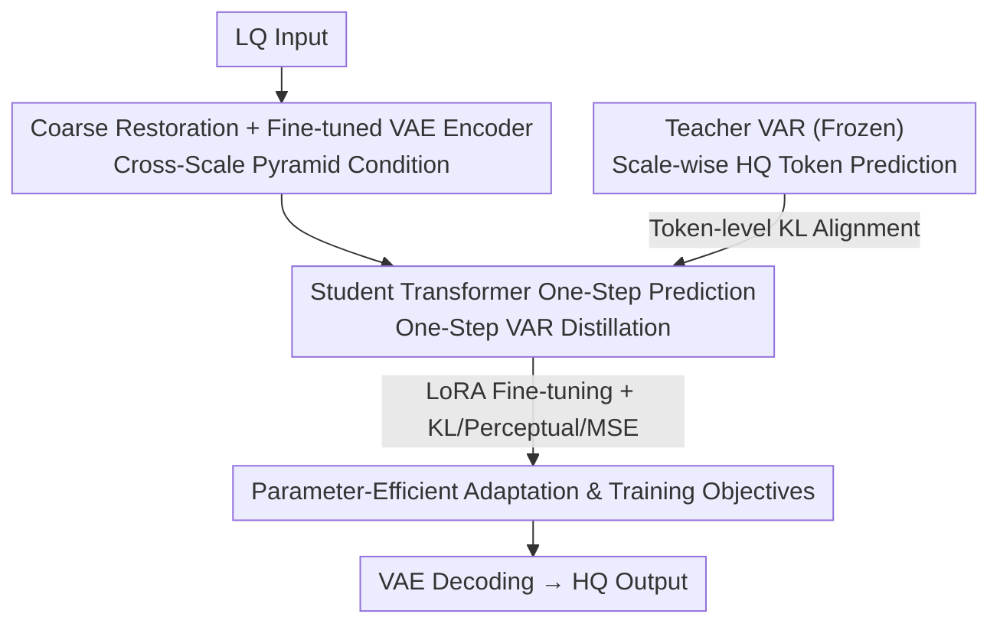

# VARestorer: One-Step VAR Distillation for Real-World Image Super-Resolution

**Conference**: ICLR 2026  
**OpenReview**: [https://openreview.net/forum?id=T2Oihh7zN8](https://openreview.net/forum?id=T2Oihh7zN8)  
**Code**: https://github.com/EternalEvan/VARestorer  
**Area**: Image Restoration / Real-World Super-Resolution / Visual Autoregressive Models / Model Distillation  
**Keywords**: Real-ISR, VAR, Distribution Matching Distillation, One-Step Inference, Cross-Scale Condition

## TL;DR
A pre-trained text-to-image Visual Autoregressive (VAR) model is distilled into a one-step real-world super-resolution model via token-level distribution matching. Combined with a cross-scale pyramid condition to fully utilize low-quality input information, it achieves 72.32 MUSIQ / 0.7669 CLIPIQA on DIV2K-Val by fine-tuning only 1.2% of the parameters, while accelerating inference by approximately 10x.

## Background & Motivation
**Background**: Real-world image super-resolution (Real-ISR) aims to restore high-quality (HQ) results from low-quality (LQ) images collected in the wild containing noise, blur, downsampling, and compression. Current mainstream approaches include predictive methods (estimating blur kernels), GAN-based methods, and the recently popular diffusion-based methods—the latter utilize pre-trained diffusion priors for denoising sampling, yielding excellent results but slow sampling. Visual Autoregressive (VAR) models use "next-scale prediction" to construct image multi-scale token map sequences, offering strong generation quality and scalability with a natural "coarse-to-fine" hierarchical structure that aligns well with super-resolution.

**Limitations of Prior Work**: Directly applying VAR to super-resolution faces two major issues. First, VAR's scale-wise causal attention prevents lower-scale tokens from perceiving higher-scale information, failing to fully utilize global LQ context, which leads to blur and inconsistent artifacts during zero-shot upsampling. Second, autoregressive iterative prediction across scales leads to **error accumulation**—small errors in earlier scales are propagated and magnified in subsequent scales. While generative tasks can tolerate shifts in intermediate steps as long as the final image is plausible, restoration tasks require high alignment between output and input/GT, making such cumulative errors fatal. Additionally, while diffusion distillation can reduce steps, it often suffers from over-smoothing and reduced diversity.

**Key Challenge**: To utilize VAR’s rich generative priors, one must perform multi-step autoregressive iteration; however, this iteration causes error accumulation that destroys the consistency required for restoration. There is a fundamental conflict between "utilizing VAR generative power" and "avoiding iterative errors."

**Goal**: Compress multi-step VAR into **one-step** inference to eliminate error accumulation while preserving generative priors and ensuring LQ input information is fully absorbed within the autoregressive architecture.

**Key Insight**: The authors borrow the idea of "distribution matching" from diffusion distillation—instead of aligning pixels token-by-token, the student model's one-step token distribution is made to match the multi-step teacher VAR's token distribution. Furthermore, without drastically changing the architecture, the VAR's causal attention is relaxed into all-attention to inject cross-scale conditions.

**Core Idea**: Transform a pre-trained VAR into a one-step super-resolution model via token-level distribution matching distillation, and feed LQ information through cross-scale pyramid conditions to "predict all scale HQ tokens in a single forward pass."

## Method

### Overall Architecture
VARestorer treats a pre-trained text-to-image VAR as both a **teacher** (frozen) and a **student** (initialized). During training, the teacher follows the original scale-wise autoregression of VAR, predicting the next-scale HQ token distribution given the ground truth (GT) previous-scale tokens. The student is required to directly output tokens for all scales in a **single forward pass** based only on the LQ input. Token-level KL alignment is performed between the two at each scale to compress the teacher's generative knowledge into the student’s one-step mapping. To effectively inject LQ information, the student side first performs lightweight coarse restoration on the LQ, extracts multi-scale pyramid token maps using a fine-tuned VAE encoder, and replaces VAR’s causal attention with cross-scale all-attention, allowing bidirectional interaction across resolution levels. During inference, only the student is run: LQ → (Coarse Restoration + Pyramid Encoding) → Student One-Step Prediction of all-scale tokens → VAE Decoding → HQ.

### Key Designs

**1. One-Step VAR Distillation: Eliminating Iterative Errors via Token-Level Distribution Matching**

This design directly addresses the "error accumulation from multi-step iteration" pain point. Rather than forcing the student to mimic the teacher's scale-by-scale sampling trajectory, the authors formulate distillation as a KL divergence optimization problem. The teacher predicts the $k$-th scale distribution $p_T(r_k\mid r_{HQ,<k})$ given previous GT tokens $r_{HQ,<k}$, while the student predicts all scales $p_S(\hat r_k\mid r_{LQ})$ from LQ input alone in one pass. The goal is to align the two distributions at each scale:

$$\mathcal{L}_{KL}=\sum_k D_{KL}\big(p_T(r_k\mid r_{HQ,<k})\,\|\,p_S(\hat r_k\mid r_{LQ})\big)$$

where $p_T(r_k\mid r_{HQ,<k})=F_T(r_{HQ,<k})$ and $p_S(\hat r\mid r_{LQ})=F_S(r_{LQ})$. Unlike pixel-wise L2, KL encourages the student to learn "diverse and high-quality" token distributions rather than averaging one-to-many possible outputs into a blurred image—fitting the ill-posed nature of SR. Since the diffusion approach of "using two denoising networks to estimate distribution density gradients" does not apply to VAR (given their different image/distribution modeling), the authors apply KL directly to the cross-scale token distributions predicted by VAR. Consequently, the student can fit the teacher's multi-step generation quality in a single forward pass, eliminating error accumulation and significantly accelerating inference.

**2. Cross-Scale Pyramid Condition: Relaxing Causal Attention for Enhanced LQ Utilization**

VAR's scale-wise causal attention prevents lower-scale tokens from seeing higher scales, meaning lower scales "do not know how to lay the groundwork for subsequent scales," resulting in global blur and blocky artifacts. Furthermore, determining how many control tokens to place at each scale is difficult—naively matching the count of $r_k$ causes weak guidance at lower scales, while using ControlNet requires significant architectural changes. The authors fine-tune the VAR's VAE encoder to encode the LQ into **multi-scale pyramid token maps** (capturing different granularities from high-level semantics to detailed structures). They then replace the scale-wise causal attention masks in the transformer with **cross-scale all-attention**, enabling direct bidirectional interaction across all resolution levels. This preserves VAR’s generative prior without major architectural changes and ensures that subsequent LQ tokens are not ignored by the transformer. Removing this (w/o cross) in the ablation study causes MUSIQ to drop from 72.32 to 63.72, marking it as the most critical component.

**3. Parameter-Efficient Adaptation and Training Objectives: Tuning 1.2% Parameters with KL+Perceptual+MSE Balancing**

To preserve VAR's expressiveness while keeping fine-tuning costs low, the student only uses LoRA (rank=32) to unfreeze cross-attention and self-attention modules. Trainable parameters account for only ~1.2% (27.3M) of the transformer, with the rest frozen. A lightweight module performs initial coarse restoration on the LQ input, and BLIP is used to automatically generate text prompts, leveraging the vision-language priors VAR learned during generative tasks. The total training loss combines KL with perceptual loss and pixel-wise MSE to ensure the student output $x_S$ does not deviate from the GT in terms of fidelity:

$$\mathcal{L}=\lambda_{KL}\mathcal{L}_{KL}+\lambda_{perc}\mathcal{L}_{perc}+\lambda_{MSE}\lVert x_S-x_{GT}\rVert_2^2$$

Weights are set to $\lambda_{KL}=0.1, \lambda_{perc}=0.25, \lambda_{MSE}=0.5$. KL handles "realism/diversity," while perceptual and MSE handle "consistency/fidelity with GT." Balancing these three ensures the distillation is neither over-smoothed nor distorted.

### Loss & Training
Training data uses LSDIR (~85k high-quality images) with high-order degradation to synthesize LQ-HQ pairs. The degradation pipeline is $x_{LQ}=[(k*x_{HQ})\downarrow_r+n]_{JPEG}$ (blur, noise, downsampling, JPEG compression). Both student and teacher are initialized with pre-trained T2I VAR transformer blocks. Training uses batch size 32, learning rate 1e-6, AdamW (weight decay 1e-2) for 10K steps on 8×Nvidia L20.

## Key Experimental Results

### Main Results
Benchmark comparisons were conducted on synthetic DIV2K-Val and real-world datasets DrealSR / RealSR against DiffBIR, SeeSR, PASD, ResShift, VARSR, OSEDiff, and SinSR. VARestorer leads almost entirely in non-reference perceptual metrics using only one step:

| Dataset | Metric | VARestorer-1 | Next Best | Note |
|--------|------|------|----------|------|
| DIV2K-Val | MUSIQ↑ | **72.32** | 71.48 (VARSR-10) | 1 step vs 10 steps |
| DIV2K-Val | CLIPIQA↑ | **0.7669** | 0.7330 (VARSR-10) | Highest perceptual quality |
| DIV2K-Val | NIQE↓ | **4.410** | 4.581 (PASD-20) | Best natural texture |
| DrealSR | MANIQA↑ | **0.5638** | 0.5543 (DiffBIR-50) | Real-world degradation |
| RealSR | MANIQA↑ | **0.5655** | 0.5583 (DiffBIR-50) | — |
| RealSR | FID↓ | **117.2** | 123.5 (OSEDiff-1) | Best distribution-level |

Note: VARestorer does not achieve the highest reference-based metrics (e.g., DIV2K PSNR 21.08 is lower than ResShift's 22.66). The authors argue these metrics penalize high-frequency details (like hair texture) and prioritize non-reference perceptual metrics and FID.

Parameter and Inference Efficiency (DIV2K-Val):

| Method | Trainable Params | Inference Time (s) | MANIQA↑ | MUSIQ↑ |
|------|-----------|-------------|---------|--------|
| DiffBIR | 380.0M | 10.27 | 0.5664 | 69.87 |
| VARSR | 1101.9M | 0.63 | 0.5173 | 71.48 |
| OSEDiff | 8.5M | 0.18 | 0.4410 | 67.96 |
| **VARestorer** | **27.3M** | **0.23** | **0.5590** | **72.32** |

Compared to the VAR-based VARSR (10 steps, >1B params), VARestorer requires only one step and 27.3M trainable parameters, achieving better quality and ~10x faster inference.

### Ablation Study
Ablations on DIV2K-Val by removing components:

| Configuration | LPIPS↓ | MUSIQ↑ | NIQE↓ | CLIPIQA↑ | Note |
|------|--------|--------|-------|----------|------|
| w/o distill | 0.3723 | 62.22 | 6.283 | 0.4794 | Revert to multi-step VAR+ControlNet; obvious artifacts |
| w/o cross | 0.4224 | 63.72 | 6.029 | 0.3910 | Causal attention; global blur + blocky artifacts |
| w/o $\mathcal{L}_{KL}$ | 0.3214 | 69.73 | 4.372 | 0.6682 | Clean image but weak realism; texture distortion |
| **VARestorer** | **0.3131** | **72.32** | **4.410** | **0.7669** | Full model |

### Key Findings
- **Cross-scale all-attention is the most significant contributor**: Removing it causes MUSIQ to drop from 72.32 to 63.72 and CLIPIQA from 0.7669 to 0.3910, proving that "allowing lower scales to see higher scales" is the main driver of quality; causal attention causes cross-scale token misalignment.
- **One-step distillation is the quality foundation**: The "w/o distill" (multi-step VAR + ControlNet) configuration only achieves 62.22 MUSIQ, verifying the destructive nature of error accumulation in restoration and the necessity of one-step mapping.
- **KL provides realism**: Removing $\mathcal{L}_{KL}$ keeps the image "clean" but results in a lack of realistic details and unnatural textures, indicating that distribution matching provides "realness/diversity" rather than just fidelity.
- The authors also extended VARestorer to tasks like deraining and low-light enhancement (Appendix C), demonstrating framework versatility.

## Highlights & Insights
- **Porting distribution matching distillation from diffusion to VAR**: The key insight is that VAR and diffusion have different distribution modeling. Instead of copying "density gradient estimation using semi-denoising networks," they directly apply KL to the cross-scale token distribution—this is the core adaptation that makes VAR distillation work.
- **Lightweight condition injection by relaxing attention masks**: Compared to forcing ControlNet into VAR (which disrupts autoregression and requires retraining), changing the causal mask to all-attention + fine-tuning a VAE encoder for pyramid conditions is both efficient and effective. This approach is transferable to other autoregressive vision models.
- **One-step + 1.2% parameters + 10x acceleration**: This is highly attractive for efficiency-sensitive real-world deployments and proves that VAR generative priors can be efficiently repurposed for more discriminative restoration tasks.

## Limitations & Future Work
- The authors admit failure under **severe noise or heavy compression** (failure cases in Appendix E), suggesting that one-step mapping lacks expressive power for extreme degradation.
- Reference-based metrics (PSNR/SSIM) are not leading. While the paper explains this as a penalty for high-frequency details, it means the method may not be optimal for scenarios requiring strict pixel fidelity (e.g., medical/metrology).
- Dependence on BLIP-generated prompts and pre-trained T2I VAR binds the method's effectiveness to these external modules; robustness to inaccurate prompts is not fully discussed.
- Future directions: Explore "difficulty-adaptive few-step" strategies (returning to 2-3 steps for extreme degradation) or develop GT-free self-distillation to remove dependency on the teacher's scale-wise GT conditions.

## Related Work & Insights
- **vs. Diffusion Distillation (OSEDiff / SinSR)**: These distill diffusion to one step but often suffer from over-smoothing and low diversity. This work distills VAR's hierarchical token distribution; KL alignment preserves detailed diversity, leading to higher perceptual metrics (DIV2K MUSIQ 72.32 vs. OSEDiff 67.96).
- **vs. VARSR (Multi-step VAR for SR)**: While both use VAR, VARSR requires 10 steps, >1B parameters, and suffers from error accumulation. Ours is one-step, uses 27.3M trainable parameters, and is ~10x faster with better quality.
- **vs. ControlNet-style VAR conditioning**: Previous works applying ControlNet directly to VAR disrupted autoregressive generation. This work uses cross-scale all-attention + pyramid conditions to inject LQ information while preserving generative priors.

## Rating
- Novelty: ⭐⭐⭐⭐ First systematic application of distribution matching distillation + cross-scale all-attention to VAR-based super-resolution with precise adaptation.
- Experimental Thoroughness: ⭐⭐⭐⭐ Three datasets, nine metrics, efficiency comparison + ablations + cross-task extension; analysis of extreme degradation is slightly brief.
- Writing Quality: ⭐⭐⭐⭐ Clear logic across motivation, conflict, and method; well-placed formulas and diagrams.
- Value: ⭐⭐⭐⭐ High value for real-world deployment and VAR prior reuse due to one-step efficiency and 1.2% parameter tuning.

<!-- RELATED:START -->

## Related Papers

- [\[ICML 2026\] One-Step Residual Shifting Diffusion for Image Super-Resolution via Distillation](../../ICML2026/image_restoration/one-step_residual_shifting_diffusion_for_image_super-resolution_via_distillation.md)
- [\[CVPR 2026\] One-Step Diffusion Transformer for Controllable Real-World Image Super-Resolution](../../CVPR2026/image_restoration/one-step_diffusion_transformer_for_controllable_real-world_image_super-resolutio.md)
- [\[CVPR 2026\] Time-Aware One Step Diffusion Network for Real-World Image Super-Resolution](../../CVPR2026/image_restoration/time-aware_one_step_diffusion_network_for_real-world_image_super-resolution.md)
- [\[ICLR 2026\] Learning Heterogeneous Degradation Representation for Real-World Super-Resolution](learning_heterogeneous_degradation_representation_for_real-world_super-resolutio.md)
- [\[ICLR 2026\] Improved Adversarial Diffusion Compression for Real-World Video Super-Resolution](improved_adversarial_diffusion_compression_for_real-world_video_super-resolution.md)

<!-- RELATED:END -->
