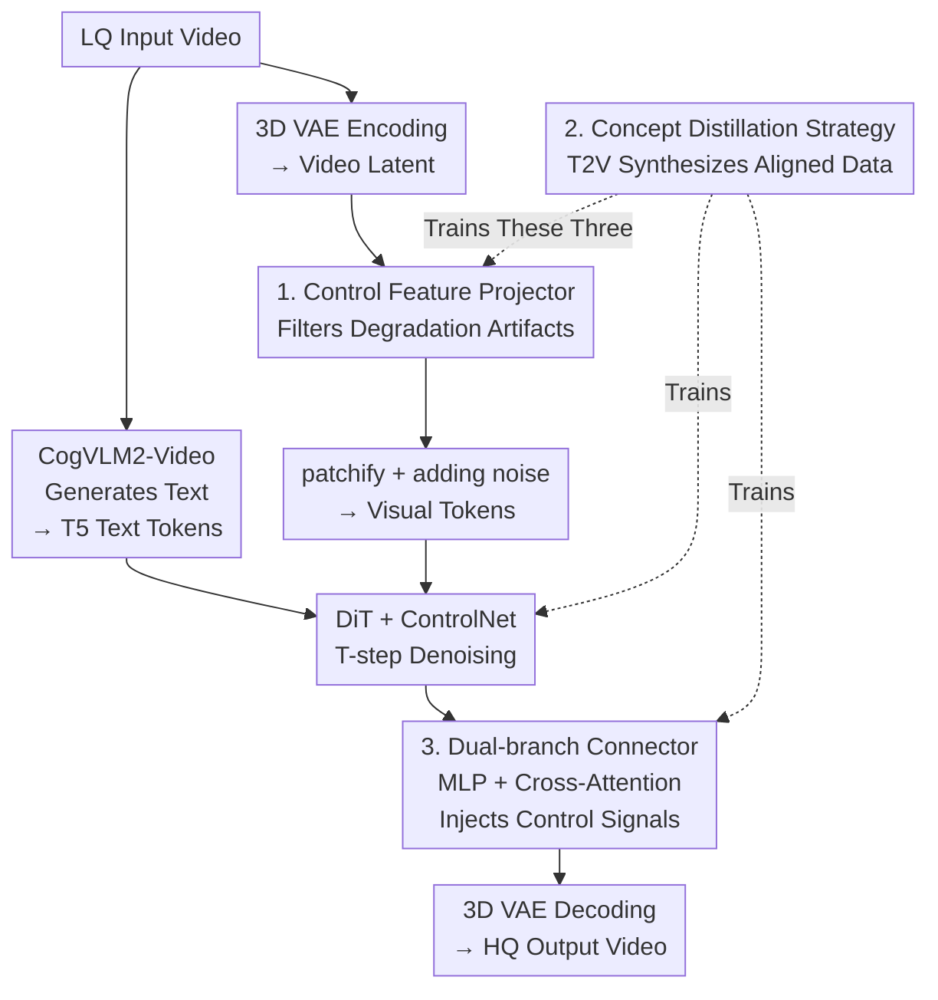

# Vivid-VR: Distilling Concepts from Text-to-Video Diffusion Transformer for Photorealistic Video Restoration

**Conference**: ICLR 2026  
**OpenReview**: [https://openreview.net/forum?id=YV5Zgv8pdg](https://openreview.net/forum?id=YV5Zgv8pdg)  
**Code**: https://github.com/csbhr/Vivid-VR  
**Area**: Video Restoration / Diffusion Models  
**Keywords**: Video Restoration, Text-to-Video, DiT, ControlNet, Concept Distillation

## TL;DR
Vivid-VR performs generative video restoration by attaching a ControlNet to a pre-trained T2V diffusion Transformer (CogVideoX1.5-5B). It utilizes a "concept distillation" training strategy, where the T2V model synthesizes its own text-aligned training data to suppress distribution drift during fine-tuning. Combined with a lightweight control feature projector and a dual-branch connector, it achieves more realistic textures and robust temporal consistency across real, synthetic, and AIGC videos.

## Background & Motivation

**Background**: The goal of video restoration is to recover lost textures, details, and structures from low-quality (LQ) videos into high-quality (HQ) versions. Traditional reconstruction methods use CNNs or Transformers to regress directly from degraded inputs, which lacks priors and produces over-smoothed results under severe degradation. While GANs can supplement some textures, their generative capacity is limited. With the rise of diffusion models, T2I diffusion was first applied to image restoration with impressive effects; subsequently, DiT architectures gave birth to high-quality, temporally stable T2V models, leading to T2V-based restoration methods like SeedVR and STAR.

**Limitations of Prior Work**: Despite utilizing powerful T2V backbones, existing restoration methods still significantly **lag behind native T2V models** in terms of texture realism and temporal consistency—meaning fine-tuning often damages the inherent generative capabilities of the base model.

**Key Challenge**: The root cause is **distribution drift** during the fine-tuning stage. T2V pre-training uses massive, diverse, and highly text-aligned data, making drift negligible. However, during video restoration fine-tuning, the text-video alignment of training data relies on VLM captioners, which are naturally imperfect. This "imperfect multi-modal alignment" is amplified during fine-tuning, manifesting as texture distortion and temporal jitter. In other words, the problem lies not in the network architecture, but in the **quality of text-video alignment in training data**.

**Goal**: To perform controllable video restoration without damaging the base T2V generation capability, two issues must be addressed: (1) suppressing distribution drift during fine-tuning; and (2) injecting LQ control signals into the generation pipeline cleanly and dynamically.

**Key Insight**: The authors observe that instead of striving to train a more accurate VLM captioner (which is costly and may still result in latent space discrepancies), it is better to **let the T2V model generate its own text-aligned training data**. The T2V model’s understanding of "textual concepts" is already embedded in its latent space. By performing a text-guided video translation (partial noising then denoising), the resulting video is naturally aligned with the textual concepts.

**Core Idea**: Use a pre-trained T2V model to "half-noise and then denoise" real videos to synthesize training samples with better text alignment. This "distills" the T2V's concept understanding into the restoration model to eliminate distribution drift and preserve texture/temporal quality. Simultaneously, the ControlNet feature preprocessing and connectors are redesigned.

## Method

### Overall Architecture

Vivid-VR uses a frozen CogVideoX1.5-5B as the T2V backbone and utilizes a ControlNet to inject LQ videos as conditions. During inference, the data flow is as follows: the LQ video first generates a text description via CogVLM2-Video, which is encoded into text tokens by T5. Simultaneously, the LQ video is encoded into latents by a 3D VAE, where a **control feature projector** filters out degradation artifacts before patchifying and adding noise to generate visual tokens. Text tokens, visual tokens, and timestep embeddings are fed into the DiT ($N$ blocks) and ControlNet ($N/7$ blocks, initialized from the first $N/7$ DiT blocks). Both perform $T$ denoising steps, and ControlNet visual tokens are fused into the DiT via $N$ **dual-branch connectors**. After denoising, the HQ video is reconstructed by the 3D VAE decoder.

For training, only the **control feature projector, ControlNet, and connectors** are updated while other parameters remain frozen. The training data is specifically constructed using the **concept distillation strategy**, which is the source of suppressing distribution drift. The framework is supported by three components: concept distillation (data management), control feature projector (input purity), and dual-branch connector (control injection).

### Key Designs

**1. Control Feature Projector: Removing degradation artifacts at the latent entry via lightweight CNN**

The base T2V model is trained on HQ videos. Directly feeding LQ VAE latents into it damages generation quality—latents contain both content information and degradation artifacts like blurry contours, which propagate and pollute the generation. While SUPIR fine-tunes the VAE encoder separately, decoupled optimization makes VAE features incompatible with the subsequent DiT/ControlNet (Ablation (b)). Jointly fine-tuning the VAE encoder is too expensive (e.g., FaithDiff). This paper treats it as a **lightweight extension** attached after the VAE encoder: three cascaded spatio-temporal residual blocks specifically designed to filter out degradation features and output cleaner latents. Visualizations (Fig. 6) show that feature contours are blurry before the projector and become significantly sharper with clear boundaries after, proving it effectively filters degradation signals at a much lower cost than modifying the VAE encoder.

**2. Concept Distillation Strategy: Distilling T2V concepts into training data to eliminate distribution drift**

This is the core of the paper. The root cause of distribution drift is the imperfect alignment provided by VLM captioners (Fig. 3, top row). Rather than training a better captioner, the authors **distill the T2V backbone's understanding of text concepts**: given a video-text pair, the source video is noised to the standard deviation of timestep $T/2$, then denoised for $T/2$ steps using CogVideoX1.5-5B under the text condition. This yields a synthesized video that is **naturally aligned with text concepts in the T2V latent space**—it largely preserves source content while modifying concepts to better fit the text description. The authors randomly sample from a 500K multi-modal dataset to generate 100K pairs via this pipeline, mixing them with original data to fine-tune the control modules.

The reason for "half-noising" rather than "generating from scratch" is that the latter would completely detach from the source content (Fig. 7, Ablation (h) "From scratch" is worse than (i)). Table 3 provides quantitative evidence: with concept distillation, the text-video alignment score (FGA-BLIP2) of training data rises from 3.49 to 3.97, and restoration quality (DOVER) increases from 12.99 to 14.46. When the text is shuffled during distillation, the alignment score collapses to 1.77 and quality drops accordingly, proving that "text-visual alignment" is the key variable for gains, rather than just more data.

**3. Dual-branch ControlNet Connector: MLP for feature mapping and Cross-Attention for dynamic retrieval**

When injecting ControlNet visual tokens into the DiT, existing connectors (e.g., ZeroSFT) do not adequately consider the DiT's own features, limiting fusion quality. This paper designs a dual-branch structure: an MLP branch for mapping control features to preserve content, and a Cross-Attention (CA) branch for **dynamic retrieval** of control features for adaptive modulation. For the $i$-th connector, the fusion is:

$$\hat f^i = f^i + \mathrm{MLP}(c^{\lfloor i/7\rfloor}) + \mathrm{CA}(f^i,\, c^{\lfloor i/7\rfloor}),$$

where $f^i$ represents the visual tokens of the $i$-th DiT block, and $c^{\lfloor i/7\rfloor}$ represents the visual tokens of the corresponding ControlNet block. Both branches are essential: removing CA leaves insufficient detail (Ablation (c)); replacing MLP with a skip connection causes the model to fail to converge as it only selects DiT-like features, leading to content mismatches (Ablation (d)). Compared to ZeroSFT, this design also avoids ghosting between adjacent frames caused by normalization and the gradient explosion issue when normalization is removed.

### Loss & Training

Following CogVideoX1.5-5B's v-prediction objective:

$$L = \mathbb{E}_{x_0,t,\epsilon}\big[\,\|v - v_\theta(x_t, x_{lq}, x_{text}, t)\|^2\,\big],$$

where $x_0$ is the HQ video, $x_{lq}$ is the LQ video synthesized using the Real-ESRGAN degradation model, $x_{text}$ is the text description, $x_t=\sqrt{\bar\alpha_t}x_0+\sqrt{1-\bar\alpha_t}\,\epsilon$ is the noisy latent, and the optimization target is $v=\sqrt{\bar\alpha_t}\,\epsilon-\sqrt{1-\bar\alpha_t}\,x_0$. Training data consists of 500K real videos + 100K concept-distilled synthetic videos. Images are scaled to a short side of 1024 and center-cropped to $1024\times1024$, with frame counts randomized between 17–37. Optimizer: AdamW (lr=1e-4) with cosine annealing on 32 H20-96G GPUs, batch 1/card, 30K iterations, ~6K GPU hours. Inference uses DPM solver for 50 steps; high-resolution inputs use tiled aggregate sampling to avoid overlap artifacts.

## Key Experimental Results

### Main Results

Vivid-VR was compared against Real-ESRGAN, SUPIR, MGLD, UAV, STAR, DOVE, SeedVR-7B, and SeedVR2-7B across 6 test sets including synthetic (SPMCS / UDM10 / YouHQ40), real (VideoLQ / UGC50), and AIGC (AIGC50). Vivid-VR achieved the best results in nearly all **no-reference** perceptual metrics. Representative results include:

| Dataset | Metric | Vivid-VR | Next Best |
|--------|------|----------|----------|
| SPMCS | MUSIQ ↑ | **70.03** | 66.11 (UAV) |
| SPMCS | DOVER ↑ | **11.35** | 10.07 (SUPIR) |
| SPMCS | MD-VQA ↑ | **86.55** | 83.07 (UAV) |
| VideoLQ | MUSIQ ↑ | **62.47** | 57.70 (MGLD) |
| VideoLQ | MD-VQA ↑ | **83.14** | 80.67 (MGLD) |
| AIGC50 | MUSIQ ↑ | **67.18** | 62.07 (DOVE) |
| AIGC50 | MD-VQA ↑ | **89.69** | 86.97 (STAR) |

Vivid-VR does not stand out in full-reference metrics (PSNR/SSIM/LPIPS), which the authors attribute to the inconsistency of these metrics with human perceptual preference in generative restoration scenarios—severe degradation allows for multiple plausible HQ solutions. For example, in Fig. 4, (i1) has a worse LPIPS than (g1) but is human-preferred.

### Ablation Study

Evaluated on UGC50, where (i) is the full Vivid-VR:

| Config | NIQE ↓ | MUSIQ ↑ | CLIP-IQA ↑ | DOVER ↑ | Description |
|------|--------|---------|------------|---------|------|
| (i) Full | **4.361** | **67.61** | **0.450** | **14.46** | Full Model |
| (a) w/o Projector | 4.622 | 63.06 | 0.414 | 13.98 | Remove Control Feature Projector |
| (b) Finetune VAE enc | 4.632 | 64.31 | 0.408 | 14.40 | SUPIR-style decoupled finetuning |
| (c) w/o CA (MLP only) | 5.183 | 59.78 | 0.374 | 13.04 | Remove Cross-Attention branch |
| (d) SK+CA (MLP→skip) | 4.730 | 63.91 | 0.401 | 13.71 | Remove MLP mapping |
| (e) ZeroSFT Connector | 4.771 | 61.21 | 0.389 | 13.77 | Replace with ZeroSFT |
| (f) w/o Distillation | 5.364 | 57.36 | 0.363 | 12.99 | Train only on collected videos |
| (g) QW captioner | 5.253 | 60.88 | 0.354 | 13.45 | Re-caption with Qwen2.5-VL |
| (h) From scratch dist | 4.710 | 62.66 | 0.391 | 13.27 | Distill from scratch, not half-noise |

### Key Findings
- **Concept distillation provides the largest gain**: Removing it (f) causes MUSIQ to drop from 67.61 to 57.36 and DOVER from 14.46 to 12.99—the most significant drop across ablations, resulting in over-sharpened textures and temporal jitter (Fig. 5(f)).
- **Stronger captioners do not help**: Re-captioning with Qwen2.5-VL (g) was actually worse—confirming the author's point that the issue is not captioner accuracy, but concept alignment within the T2V latent space, which only distillation can solve.
- **Both dual-branches are essential**: MLP only (c) lacks detail; CA only (d) barely converges and lacks content consistency.
- **Half-noising is superior to from-scratch generation**: (h) is worse than (i), indicating that preserving source content while "fine-tuning concepts" is a prerequisite for effective synthetic data.

## Highlights & Insights
- Transforming the "hard-to-fix data alignment" problem into "letting the base model produce its own aligned data"—instead of training expensive captioners, the T2V's own latent space acts as the alignment judge.
- "Half-noising then denoising" is a reusable lightweight data augmentation paradigm: it preserves source content while aligning text-visual concepts, suitable for any controllable generation task where the base model is strong but downstream data alignment is poor.
- The control feature projector simplifies "LQ input purification" from expensive joint VAE fine-tuning to a lightweight three-layer spatio-temporal residual plug-in, offering high cost-performance.

## Limitations & Future Work
- High cost: It relies on a large CogVideoX1.5-5B backbone, requiring 6K GPU hours for training and 50 steps for inference at fixed $1024\times1024$, limiting real-time or ultra-high-res scenarios.
- Concept distillation may "change content": Half-noising/denoising modifies concepts to fit text. For strict fidelity tasks (e.g., forensics, medical), this "content modification for alignment" may be unacceptable.
- Weak full-reference metrics: Although LPIPS/PSNR are argued to be unreliable, there is a lack of stronger fidelity evidence (e.g., large-scale user studies or quantitative content consistency analysis).
- Future directions: Optimizing the noise strength $T/2$ or making it adaptive; migrating projector/connector ideas to one-step diffusion to reduce inference costs.

## Related Work & Insights
- **vs SeedVR / STAR**: Also use T2V backbones for restoration, but direct fine-tuning suffers from distribution drift (Fig. 5 temporal jitter). This paper uses concept distillation to solve drift at the data level.
- **vs SUPIR / FaithDiff**: They rely on (joint or independent) VAE encoder fine-tuning to purify input, which is either incompatible or expensive. This paper uses a lightweight projector for similar effects at lower cost.
- **vs ZeroSFT Connector**: ZeroSFT doesn't adequately consider DiT features, and its normalization causes ghosting. This paper's dual-branch (MLP for content + CA for retrieval) bypasses these issues.

## Rating
- Novelty: ⭐⭐⭐⭐⭐ Using T2V self-produced aligned data to solve fine-tuning drift is a clever reconstruction of the root cause.
- Experimental Thoroughness: ⭐⭐⭐⭐ 6 benchmarks + complete ablations + causal verification of alignment scores, though full-reference fidelity evidence is relatively thin.
- Writing Quality: ⭐⭐⭐⭐ Clear logical loop from motivation to method to ablation, with rich visualizations.
- Value: ⭐⭐⭐⭐ Significantly raises perceptual quality in generative video restoration; the concept distillation paradigm has high migration potential.

<!-- RELATED:START -->

## Related Papers

- [\[ICLR 2026\] Text-Aware Image Restoration with Diffusion Models](text-aware_image_restoration_with_diffusion_models.md)
- [\[ICLR 2026\] SeedVR2: One-Step Video Restoration via Diffusion Adversarial Post-Training](seedvr2_one-step_video_restoration_via_diffusion_adversarial_post-training.md)
- [\[ICLR 2026\] Improved Adversarial Diffusion Compression for Real-World Video Super-Resolution](improved_adversarial_diffusion_compression_for_real-world_video_super-resolution.md)
- [\[CVPR 2026\] TextOVSR: Text-Guided Real-World Opera Video Super-Resolution](../../CVPR2026/image_restoration/textovsr_text-guided_real-world_opera_video_super-resolution.md)
- [\[ICLR 2026\] Trajectory-aware Shifted State Space Models for Online Video Super-Resolution](trajectory-aware_shifted_state_space_models_for_online_video_super-resolution.md)

<!-- RELATED:END -->
