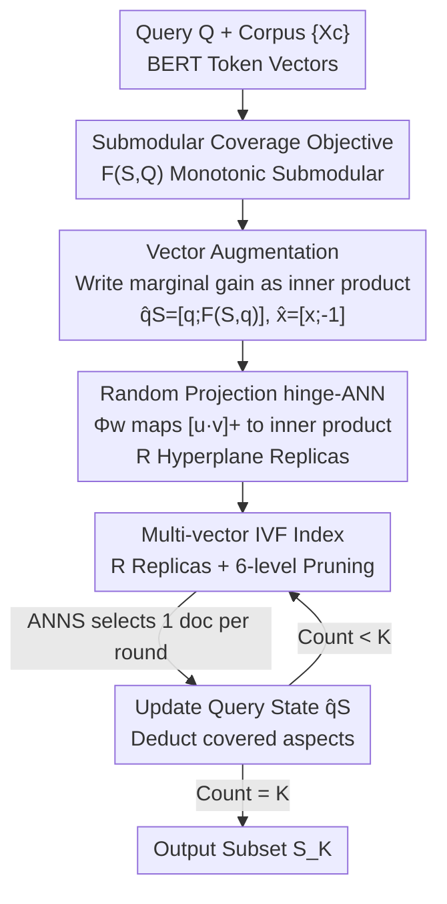

# A Dense Subset Index for Collective Query Coverage

**Conference**: ICLR2026  
**OpenReview**: [https://openreview.net/forum?id=cUdODCFjUM](https://openreview.net/forum?id=cUdODCFjUM)  
**Code**: https://github.com/structlearning/DISCo  
**Area**: Information Retrieval / Dense Retrieval / Submodular Optimization / Approximate Nearest Neighbor  
**Keywords**: Set Coverage Retrieval, Submodular Maximization, Multi-vector Retrieval, Random Projection, ANN Indexing

## TL;DR
DISCO models "multiple documents collaboratively covering a complex query" as a monotonic submodular coverage objective. Through vector augmentation and random projection, it rewrites the marginal gain of each greedy iteration into an indexable inner product form. This enables a modified multi-vector IVF index to approximate greedy solutions in sublinear time, achieving over $100\times$ speedup compared to standard greedy algorithms while providing higher coverage than traditional IR indices.

## Background & Motivation
**Background**: Traditional Information Retrieval (IR) assumes "a single relevant document can independently satisfy a query," treating documents as competitors scored by relevance for top-K ranking. Modern dense retrieval (ColBERT) utilizes MaxSim (Chamfer similarity) for query-document scoring with IVF inverted indices for sublinear retrieval.

**Limitations of Prior Work**: In scenarios like multi-hop QA, table QA, or text-to-SQL, the "self-contained document" premise fails—answering a query often requires synthesizing information scattered across multiple documents. Example: "Who is the computer scientist from Clamart who served as an editor of Algorithmica?" No single paragraph may contain both "Clamart" and "Algorithmica." Independent scoring leads to redundancy (multiple biographies covering the same fact) while missing other query aspects.

**Key Challenge**: Current two-stage approaches (retrieving an expanded set then filtering) suffer from high redundancy and missed aspects. The root cause is the scoring target: relevance should be tied to a **document subset** rather than individual documents. However, subset selection is combinatorially explosive. A naive greedy approach requires scanning the entire corpus for marginal gains each round; on the MS-MARCO dataset (8.8M passages), selecting 10 documents would take over a day per query.

**Goal**: (1) Provide a clean scoring objective for "collective query coverage"; (2) Design a sublinear-time scalable algorithm; (3) Provide a deployable vector database implementation.

**Key Insight**: The authors observe that if the coverage objective is set as a facility-location style "soft set coverage," it is naturally **monotonic submodular**, granting the standard greedy algorithm a $(1-1/e)$ approximation guarantee. The remaining bottleneck—finding the document with the maximum marginal gain—is essentially a retrieval problem if the gain function can be rewritten as an inner product compatible with ANN indices.

**Core Idea**: Replace "relevance" with "coverage" as the subset-level objective. Use **vector augmentation + random projection** to disguise the marginal gain of submodular greedy as a MaxSim-style inner product, enabling the reuse of multi-vector IVF indices to approximate greedy solutions in sublinear time.

## Method

### Overall Architecture
DISCO (Dense Index for Set Coverage) addresses selecting a document subset $S$ of size $K$ from a million-scale corpus $\{X_c\}$ for a query $Q$ (atomic vectors $\{q_1,\dots,q_M\}$) to maximize **collective coverage**. The framework consists of three layers: formalizing "collaborative retrieval" as a monotonic submodular objective $F(S,Q)$; transforming marginal gains $F(c\mid S,Q)$ via vector augmentation and random projection into an indexable inner product; and implementing the search using a multi-replica, six-level pruning multi-vector IVF index.

The pipeline executes $K$ iterations. Each iteration uses ANNS to select one document for $S$, updates the "coverage state" in the query vectors, and automatically avoids already-covered query aspects in the next round.

### Key Designs

**1. Set Coverage Objective $F(S,Q)$: Formalizing "Collaboration"**

To optimize collective coverage, the rewards must favor "collective coverage" over "redundant coverage." Following facility-location logic, the coverage of $S$ over $Q$ is defined as the sum of the maximum similarity of each query token across all document tokens in $S$:

$$F(S, Q) = \sum_{q\in Q} \max_{x\in \cup_{c\in S}X_c} q^\top x, \qquad \max_{S\subset C}\, F(S,Q)\ \text{s.t.}\ |S|\le K.$$

The difference from ColBERT’s MaxSim objective $\max_{|S|=K}\sum_{c\in S}\mathrm{MaxSim}(Q,X_c)$ lies in the **outer max vs outer sum**. MaxSim scores documents independently, encouraging redundancy. $F(S,Q)$ takes the max coverage per query token once. $F$ is monotonic submodular, so greedy selection—adding $c$ that maximizes $F(c\mid S,Q)$—provides a $(1-1/e)\approx63\%$ approximation guarantee.

**2. Vector Augmentation: Decoupling $S$ from Marginal Gains**

To index the scoring, it must be written as a dot product of a precomputable corpus representation and a query representation. The marginal gain is expanded into a sum of hinge terms:

$$F(c\mid S,Q)=\sum_{q\in Q}\max_{x\in X_c}\Big[\,q^\top x-\max_{u\in S}\max_{x'\in X_u}q^\top x'\,\Big]_+$$

The second term $\max_{u\in S}\max_{x'\in X_u}q^\top x'$ is the coverage of $q$ in the current set, $F(S,q)$. The authors use **lifted vector spaces**: query tokens $\hat q_S:=[q;\,F(S,q)]\in\mathbb{R}^{d+1}$ and corpus tokens $\hat x:=[x;\,-1]\in\mathbb{R}^{d+1}$. Their dot product $\hat q_S^\top\hat x$ recovers the hinge content:

$$F(c\mid S,Q)=\sum_{q\in Q}\max_{x\in X_c}\big[\hat q_S^\top\hat x\big]_+.$$

This shifts all dependency on $S$ to the query side $\hat q_S$, allowing $\hat x$ to be precomputed and indexed independently of $S$ and $Q$.

**3. Random Projection hinge-ANN: Linearizing the Hinge Function**

Standard ANN handles inner products, not the truncated hinge $[\cdot]_+$. The authors use a random feature map: for a random hyperplane $w\sim\mathcal N(0,I_{d+1})$, define:

$$\Phi_w(u)\triangleq\big[\,u;\ \mathrm{sign}(w^\top u)\cdot u\,\big]/\sqrt2,$$

then $\Phi_w(u)^\top\Phi_w(v)$ equals $u^\top v$ or 0. By sampling $R$ hyperplanes:

$$G_{w_{1:R}}(c;S,Q)=\sum_{q\in Q}\max_{r\in[R]}\max_{x\in X_c}\Phi_{w_r}(\hat q_S)^\top\Phi_{w_r}(\hat x).$$

With $R \ge \log(|Q|/\delta)$, $G$ approximates the true marginal gain with high probability. This form reflects MaxSim and can be directly used in multi-vector indices.

**4. Multi-replica Multi-vector IVF Index + 6-level Pruning**

DISCO adapts the PLAID framework for sublinear ANNS through six stages: ① Replica-level coarse filtering; ② Replica-level centroid pruning; ③ Replica pooling; ④ Fine-grained filtering (max-aggregation across replicas); ⑤ Residual scoring; ⑥ Full-precision scoring. This converts a $\Theta(|C|)$ scan per round into an $o(C)$ retrieval. **Early pooling** (pruning within replicas before merging) is crucial for efficiency.

## Key Experimental Results

### Main Results
Evaluated on 7 datasets (MS-MARCO, HotpotQA, BEIR/LoTTE) with $K=10$.

| Dataset | Metric | DISCO Performance | Note |
|--------|---------|-----------|------|
| MS-MARCO | Coverage vs Efficiency | Matches greedy coverage, speed $\ge 100\times$ | Over 100x faster than Exact/Lazy Greedy |
| HotpotQA | Coverage vs Efficiency | Pareto optimal (top-right) | IR baselines fast but low coverage |
| Fever | Coverage vs Efficiency | Pareto optimal | — |

Alignment on HotpotQA ground truth ($|S_{\mathrm{gold}}|=2$, $K=2$):

| Method | Error(F) ↓ | MAP ↑ |
|------|-----------|-------|
| Exact Greedy | 0.69 | 0.83 |
| Lazy Greedy | 0.69 | 0.83 |
| PLAID | 1.30 | 0.81 |
| **DISCO** | **0.68** | **0.84** |

DISCO achieves the lowest Error(F) and highest MAP, showing it retrieves subsets closest to ground truth coverage while being orders of magnitude faster than exact greedy.

### Ablation Study

| Configuration | Key Observation | Note |
|------|---------|------|
| Hyperplanes $R$ | Coverage improves with $R$; $R=5$ matches Exact Greedy | Validates random projection quality |
| Early Pooling | Best efficiency and coverage | Prunes low-score candidates earlier |
| Late Pooling | Worse efficiency and coverage | Independent top-n' merging loses fidelity |

### Key Findings
- **Coverage vs Relevance**: Methods using query-agnostic pruning (Stochastic Greedy) fail significantly on MAP (0.14–0.19), highlighting the necessity of stateful query updates.
- **Multi-vector > Single-vector**: Multi-vector approaches (PLAID, DISCO) consistently outperform single-vector ones (MUVERA).
- **Efficiency**: DISCO match exact results with $R=5$ to $8$, making the random projection cost manageable.

## Highlights & Insights
- **Reduction to Iterative Retrieval**: Transforming a combinatorial subset problem into $K$ rounds of "marginal gain maximized" single-document retrieval using submodularity.
- **Stateful Query, Stateless Index**: Augmented vectors $\hat q_S$ encode "what is already covered" into the query, keeping the corpus static and indexable.
- **Linearizing Hinge**: A clean template for using ANN with non-inner product similarities by using Sign-LSH feature maps.

## Limitations & Future Work
- **Token-level Limit**: Coverage relies on token similarity; it may struggle with deep semantic reasoning where tokens differ.
- **Storage Overhead**: $R$ replicas multiply the memory and index construction costs.
- **Hyperparameter Sensitivity**: The 6-level pruning relies on empirical thresholds like $\tau, n, n'$.

## Related Work & Insights
- **vs PLAID/WARP**: These use MaxSim for independent top-K ranking. DISCO changes the objective to subset coverage, preventing late-stage redundancy.
- **vs Greedy Variants**: DISCO makes the "find max marginal gain" step sublinear via indexing, solving the scalability bottleneck of submodular maximization.
- **vs Diversity Re-ranking**: Traditional MMR/DPP occurs at the re-ranking stage. DISCO integrates coverage into the **first-stage retrieval**, ensuring diverse/collective sets are not missed by the initial recall.

## Rating
- Novelty: ⭐⭐⭐⭐⭐ Elegant reduction of set coverage to indexable submodular greedy search.
- Experimental Thoroughness: ⭐⭐⭐⭐ Extensive datasets, but lacks detailed memory overhead analysis for large $R$.
- Writing Quality: ⭐⭐⭐⭐ Clear logical chain; pruning details are dense but precise.
- Value: ⭐⭐⭐⭐⭐ Practical solution for multi-hop/collective retrieval in production vector databases.

<!-- RELATED:START -->

## Related Papers

- [\[ACL 2026\] When Does Mixing Help? Analyzing Query Embedding Interpolation in Multilingual Dense Retrieval](../../ACL2026/information_retrieval/when_does_mixing_help_analyzing_query_embedding_interpolation_in_multilingual_de.md)
- [\[ICLR 2026\] Query-Level Uncertainty in Large Language Models](query-level_uncertainty_in_large_language_models.md)
- [\[ICLR 2026\] Revela: Dense Retriever Learning via Language Modeling](revela_dense_retriever_learning_via_language_modeling.md)
- [\[ICLR 2026\] Query-Aware Flow Diffusion for Graph-Based RAG with Retrieval Guarantees](query-aware_flow_diffusion_for_graph-based_rag_with_retrieval_guarantees.md)
- [\[ICLR 2026\] LightRetriever: A LLM-based Text Retrieval Architecture with Extremely Faster Query Inference](lightretriever_a_llm-based_text_retrieval_architecture_with_extremely_faster_que.md)

<!-- RELATED:END -->
## Related Papers

- [\[ACL 2026\] When Does Mixing Help? Analyzing Query Embedding Interpolation in Multilingual Dense Retrieval](../../ACL2026/information_retrieval/when_does_mixing_help_analyzing_query_embedding_interpolation_in_multilingual_de.md)
- [\[ICLR 2026\] Query-Level Uncertainty in Large Language Models](query-level_uncertainty_in_large_language_models.md)
- [\[ICLR 2026\] Revela: Dense Retriever Learning via Language Modeling](revela_dense_retriever_learning_via_language_modeling.md)
- [\[ICLR 2026\] Query-Aware Flow Diffusion for Graph-Based RAG with Retrieval Guarantees](query-aware_flow_diffusion_for_graph-based_rag_with_retrieval_guarantees.md)
- [\[ICLR 2026\] LightRetriever: A LLM-based Text Retrieval Architecture with Extremely Faster Query Inference](lightretriever_a_llm-based_text_retrieval_architecture_with_extremely_faster_que.md)

<!-- RELATED:END -->
