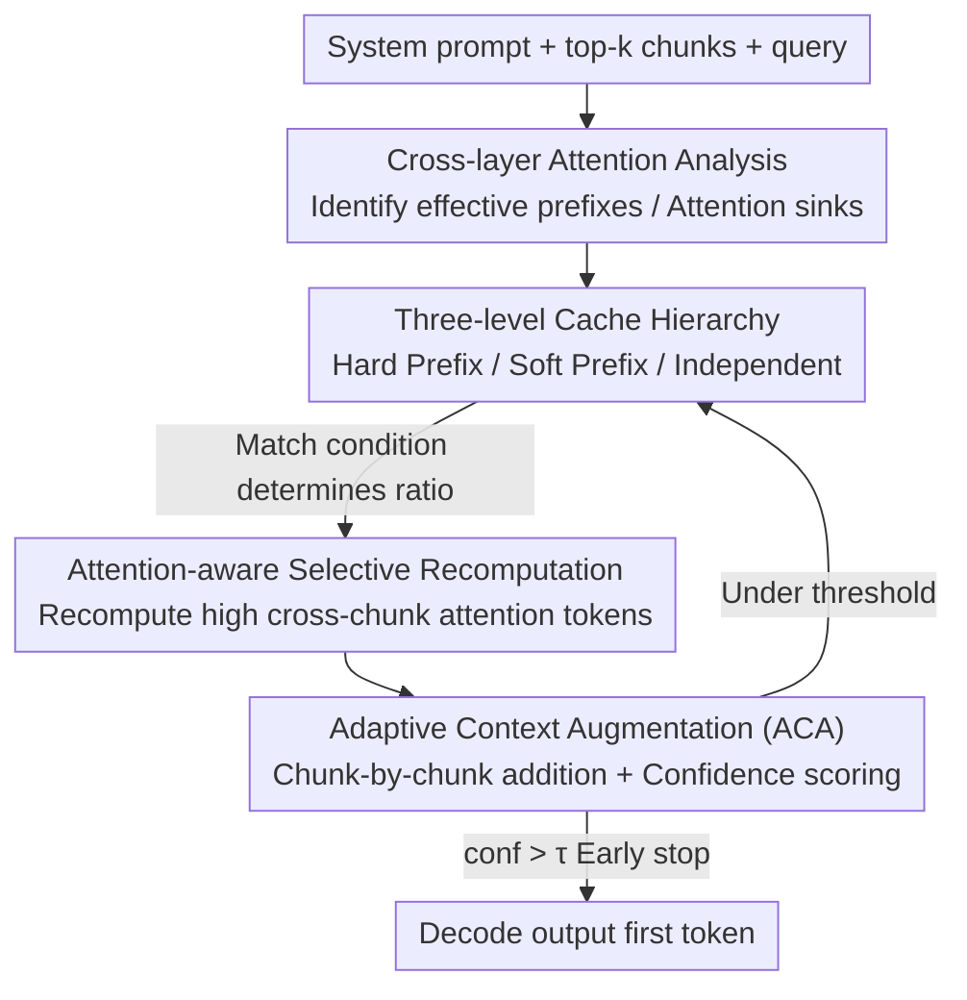

# AdaCache: Adaptive Caching and Context Augmentation for Efficient LLM Serving

**Conference**: ICLR 2026  
**OpenReview**: [https://openreview.net/forum?id=Bmvx8ybDzo](https://openreview.net/forum?id=Bmvx8ybDzo)  
**Code**: To be confirmed  
**Area**: LLM Efficiency / RAG / KV Cache / Inference Acceleration  
**Keywords**: RAG Serving, KV Cache Reuse, Selective Recomputation, Adaptive Context, TTFT

## TL;DR
AdaCache addresses two types of waste in RAG inference—redundant recomputation of the same text chunks and the uniform provision of top-k contexts regardless of query difficulty. It proposes "Hierarchical Caching + Attention-aware Selective Recomputation" and "Confidence-driven Adaptive Context Augmentation," reducing Time to First Token (TTFT) by 1.4$\times$ to 5.0$\times$ compared to state-of-the-art RAG caching systems across six datasets and three models while maintaining generation quality.

## Background & Motivation
**Background**: Retrieval-Augmented Generation (RAG) mitigates LLM hallucinations and knowledge staleness by prepending retrieved external text chunks to the prompt. However, this significantly increases sequence length: a 200-token query can easily exceed 2000 tokens after adding context, leading to over 10$\times$ higher computation and memory overhead. Consequently, the prefill stage dominates serving latency, hindering TTFT and throughput.

**Limitations of Prior Work**: The authors identify two fundamental inefficiencies in current RAG systems. First is **cross-query context overlap**, where popular chunks are repeatedly retrieved and recomputed for different queries. On MMLU, chunk access follows a power-law distribution, with the top 10% of chunks satisfying 80% of top-1 retrieval requests. Second is **intra-query context over-provisioning**, where all queries receive a fixed top-k context regardless of difficulty. Accuracy shows diminishing marginal returns with retrieval depth: over 60% of queries require minimal context, whereas only 3% truly benefit from top-8. Static deep retrieval wastes computation on simple queries and may introduce noise that degrades performance.

**Key Challenge**: Achieving both quality gains and inference efficiency in RAG requires balancing "cache reuse rate" vs. "generation fidelity," and "context sufficiency" vs. "computational cost." Existing solutions occupy extreme ends: prefix caching (e.g., vLLM, SGLang, RAGCache) requires **exact prefix matches**, leading to low hit rates in long contexts. Independent chunk caching (e.g., PromptCache) highers hit rates but **discards cross-chunk attention**, sacrificing accuracy. CacheBlend uses selective recomputation to restore some attention but applies a **uniform recomputation ratio** to all chunks, ignoring the heterogeneity of chunk attention patterns. Moreover, all prior works assume static top-k retrieval, missing opportunities for query-adaptive optimization.

**Core Idea**: AdaCache employs "Hierarchical Caching + Adaptive Selective Recomputation based on match conditions" to eliminate cross-query redundancy, and "Confidence-driven incremental context augmentation" to solve context over-provisioning. These two mechanisms are orthogonal and can be layered onto existing caching strategies.

## Method

### Overall Architecture
AdaCache is a caching framework integrated into the RAG prefill stage. It takes a system prompt, retrieved top-k chunks, and a query as input, outputting KV states and the first token. It aims to minimize token computation while preserving quality via two modules: **Cache-aware Selective Recomputation** manages a three-level cache (Hard Prefix / Soft Prefix / Independent) to allow layered hits and selective recomputation of "attention-critical tokens"; **Adaptive Context Augmentation (ACA)** incrementally adds chunks and uses a lightweight confidence score to trigger early exit. ACA rounds utilize the first module for efficient KV management, storing results in the Hard Prefix cache for subsequent use.

### Key Designs

**1. Cross-layer Attention Analysis: Identifying "Effective Prefixes" from Attention Patterns**

Independent caching fails because it discards cross-chunk attention, but the authors find that full restoration of dependencies is unnecessary. By segmenting the augmented prompt into `[system prompt, chunk 1, …, chunk k, query]` and aggregating attention at chunk granularity, distinct depth patterns emerge. Shallow layers (e.g., layers 1–18 in Qwen3-8B) exhibit **local attention**, where chunks primarily attend to their predecessors. Deep layers (layers 19–36) show **attention sinks**, where specific chunks absorb most subsequent attention. Only a few chunks act as "effective prefixes" (predecessor chunks in shallow layers; sink chunks and predecessors in deep layers). This observation allows "partial prefix matching" for critical chunks instead of requiring exact sequence matches.

**2. Three-level Cache Hierarchy: Trading Match Conditions for Hit Rates**

To overcome the binary "hit-or-miss" limitation of prefix caching, AdaCache implements three levels progressing toward lower fidelity but higher hit rates. **Hard Prefix Cache** requires exact sequence matching; due to causal masks, this is mathematically equivalent to full recomputation and preserves perfect quality. **Soft Prefix Cache** relaxes this to "effective prefix matching"—hits are allowed if sink or predecessor chunks match, requiring a recomputation ratio $\alpha$ to restore global dependencies. **Independent Cache** serves as a fallback where chunks are cached independently. It offers the highest hit rate but requires a higher recomputation ratio $\beta$ ($\beta > \alpha$) to mitigate accuracy risks.

**3. Attention-aware Selective Recomputation: Sparse Recomputation Based on Match Levels**

Recomputing all tokens within a chunk is costly. The authors observe that only a few tokens exhibit significant cross-chunk attention and KV state deviations, and these sparse patterns are **consistent across layers**. Thus, analyzing the first layer to identify tokens with high cross-chunk attention allows this selection to be applied to all layers. Unlike CacheBlend's uniform ratio, AdaCache's recomputation ratio is dynamic: zero for Hard Prefix hits, $\alpha$ for Soft Prefix, and $\beta$ for Independent Cache, providing an adaptive efficiency-accuracy trade-off.

**4. Adaptive Context Augmentation (ACA): Determining Context Depth via Confidence**

ACA replaces static top-k provision with **incremental addition**. Starting with one chunk, it evaluates confidence after each addition, stopping if a threshold $\tau$ is met or $k$ chunks are reached (Algorithm 1). This introduces minimal overhead as retrieval happens once, and each round only recomputes the new chunk's KV while hits are retrieved for previous chunks. Confidence is a composite metric:

$$\mathrm{conf} = \lambda \cdot \widehat{\mathrm{KL}}(O_{1..l-1}, O_l) + (1-\lambda)\cdot \widehat{H}(O_l)$$

The first term is the **average KL divergence** $\mathrm{KL} = \tfrac{1}{k}\sum D_{\mathrm{KL}}(L_i \| L_j)$ between the last $l$ layer logits and the final layer, representing cross-layer reasoning convergence. The second term is the **entropy** $H = -\sum p_i \log p_i$ of the final token distribution, representing output uncertainty. Both are normalized. This metric is lightweight, computing logits for only the **last 4 layers** and the **last token**, costing <1% of prefill time.

### Loss & Training
This method is a training-free inference-time mechanism. Only the weight $\lambda$ and threshold $\tau$ for the confidence metric are optimized using a validation set. Recomputation ratios $\alpha, \beta$ are hyperparameters.

## Key Experimental Results

### Main Results
Models: Llama-3-8B-Instruct, Qwen3-4B, Qwen3-8B. Knowledge base: Wikipedia (512-token chunks, e5-base-v2 encoding, FAISS IVF index, default top-6). Datasets: MMLU, MMLU-Pro, SuperGPQA, TriviaQA, 2WikiMultihopQA, HotpotQA. Metrics: Exact Match (EM) and TTFT. Hardware: Single RTX 6000 Ada (48 GB).

| Baseline | Avg. TTFT Speedup | Max Speedup | Generation Quality |
|----------|-------------------|-------------|--------------------|
| Full Recomputation | 3.12$\times$ | 6.02$\times$ | Comparable |
| Prefix Caching (SGLang) | 2.69$\times$ | 5.0$\times$ | Same |
| CacheBlend | 1.32$\times$ | 2.34$\times$ | Slightly Better |

AdaCache occasionally exceeds full recomputation accuracy because excessive context can introduce noise; confidence-guided selection ensures "minimal sufficient context."

### Ablation Study
Four configurations (Fig. 6, Qwen3-4B/8B): Prefix Caching + ACA, CacheBlend + ACA, AdaCache w/o ACA, and Full AdaCache.

| Config | Relative Effect | Note |
|------|---------|------|
| ACA over Prefix Caching | 1.65$\times$ avg. | ACA is plug-and-play for TTFT reduction |
| ACA over CacheBlend | 1.22$\times$ avg. | Same as above |
| Full AdaCache vs. Prefix Caching+ACA | 1.76$\times$ avg. | Contribution of hierarchical caching |
| Full AdaCache vs. CacheBlend+ACA | 1.23$\times$ avg. | Contribution of soft prefix caching |

### Key Findings
- **Mechanisms are orthogonal**: ACA improves TTFT for any base strategy. Hierarchical caching (especially soft hits) provides further speedup over uniform recomputation.
- **Context distribution drives gains**: ACA measured context length is "head-heavy"—most queries need minimal context. Datasets with more skew (MMLU, TriviaQA) see higher gains (1.95$\times$ / 1.62$\times$ over CacheBlend) compared to more complex ones (MMLU-Pro).
- **Scalability with top-k**: As top-k increases, Prefix Caching degrades due to strict matching (dropping from 1.76$\times$ at top-2 to 1.13$\times$ at top-8), whereas AdaCache scales from 2.93$\times$ to 4.67$\times$.

## Highlights & Insights
- **Revisiting cross-chunk attention as a tunable knob**: By identifying "effective prefixes" (sink/predecessor chunks), the soft prefix cache achieves high hit rates and fidelity via partial matching and sparse recomputation.
- **Layer-consistent sparsity**: Identifying "attention-critical tokens" at the first layer alone minimizes recomputation selection overhead, making it a transferable trick for KV reuse.
- **"Less is more" via early exit**: ACA leverages the observation that noise from excessive context hurts accuracy. Its composite metric (KL convergence + entropy) formalizes this with minimal cost.
- **Orthogonal compatibility**: ACA's ability to be layered onto Prefix Caching or CacheBlend allows existing RAG systems to be patched with adaptive context logic.

## Limitations & Future Work
- **Hyperparameter dependence**: $\lambda$ and $\tau$ are optimized on validation sets; their stability across domains and the potential for automated thresholding remain for future study.
- **Prefill iteration cost**: ACA uses multiple forward passes to simplify context. While caching minimizes work per round, "difficult queries" (low confidence until top-6) may approach the cost of static expansion.
- **Sink position drift**: Attention sink locations can shift depending on context. The robustness and overhead of the heuristic used to locate the sink chunks in the transition layer require further quantification.
- **Baseline assumptions**: The Prefix Caching baseline assumes zero latency for RAM/SSD storage loading; real-world benefits may vary based on end-to-end IO performance.

## Related Work & Insights
- **vs. Prefix Caching (SGLang / RAGCache)**: These rely on exact matches which fail under chunk reordering or long sequences. AdaCache uses hierarchical levels to maintain scalability.
- **vs. PromptCache**: PromptCache hit rates are high, but it discards cross-chunk dependencies. AdaCache restores these via soft prefixes.
- **vs. CacheBlend**: AdaCache replaces uniform recomputation and static top-k with match-aware ratios and query-level context pruning, proving more efficient for simple queries and long contexts.
- **vs. Inference Systems (vLLM / Orca)**: General systems treat prompts as monolithic sequences. AdaCache specifically exploits the chunk-level redundancy inherent in RAG.

## Rating
- Novelty: ⭐⭐⭐⭐ Solid combination of hierarchical caching and confidence-driven pruning based on attention analysis.
- Experimental Thoroughness: ⭐⭐⭐⭐ Broad dataset/model coverage, though lacks end-to-end throughput benchmarks.
- Writing Quality: ⭐⭐⭐⭐ Strong motivation backed by quantitative observations (power-law, diminishing returns).
- Value: ⭐⭐⭐⭐ High practical value for RAG serving; modular design allows easy integration.

<!-- RELATED:START -->

## Related Papers

- [\[ICLR 2026\] Beyond RAG vs. Long-Context: Learning Distraction-Aware Retrieval for Efficient Knowledge Grounding](beyond_rag_vs_long-context_learning_distraction-aware_retrieval_for_efficient_kn.md)
- [\[ICLR 2026\] Embedding-Based Context-Aware Reranker](embedding-based_context-aware_reranker.md)
- [\[ICLR 2026\] RAEE: A Robust Retrieval-Augmented Early Exit Framework for Efficient Inference](raee_a_robust_retrieval-augmented_early_exit_framework_for_efficient_inference.md)
- [\[ICLR 2026\] HiPRAG: Hierarchical Process Rewards for Efficient Agentic Retrieval Augmented Generation](hiprag_hierarchical_process_rewards_for_efficient_agentic_retrieval_augmented_ge.md)
- [\[ICLR 2026\] ELViS: Efficient Visual Similarity from Local Descriptors that Generalizes Across Domains](elvis_efficient_visual_similarity_from_local_descriptors_that_generalizes_across.md)

<!-- RELATED:END -->
