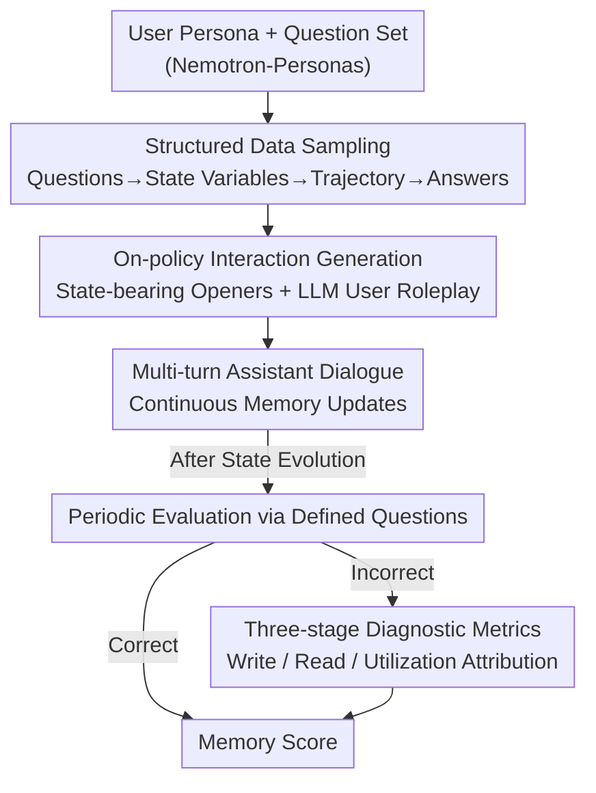

# AMemGym: Interactive Memory Benchmarking for Assistants in Long-Horizon Conversations

**Conference**: ICLR 2026  
**arXiv**: [2603.01966](https://arxiv.org/abs/2603.01966)  
**Code**: [https://agi-eval-official.github.io/amemgym/](https://agi-eval-official.github.io/amemgym/)  
**Area**: Information Retrieval  
**Keywords**: Conversation Memory Evaluation, On-policy Evaluation, User State Tracking, Memory Diagnosis, Simulated Users  

## TL;DR
This paper introduces AMemGym, the first on-policy interactive evaluation benchmark for long-horizon conversation memory. By utilizing structured data sampling (User Persona → State Evolution → Personalized QA), it drives LLMs to simulate users in role-play scenarios. The study reveals ranking bias issues in traditional off-policy evaluations and systematically diagnoses the "write/read/utilization" three-stage failure modes in RAG, long-context, and Agent memory systems.

## Background & Motivation

**Background**: LLM assistants must manage memory during long-horizon conversations to provide personalized services. However, existing memory benchmarks (MSC, LongMemEval, PersonaMem, etc.) rely entirely on static off-policy data for evaluation.

**Limitations of Prior Work**: (a) Off-policy evaluation fails to reflect the consequences of the assistant's own conversational behavior—memory operations are tightly coupled with interaction patterns; (b) Human-curated test scenarios are costly and unscalable; (c) Evaluation metrics are mostly end-to-end QA accuracy, lacking diagnosis of why memory fails.

**Key Challenge**: An agent's memory effectiveness depends highly on its own interaction patterns (on-policy), yet current evaluations use conversation histories generated by other models (off-policy), leading to inconsistencies between evaluation results and real-world deployment performance.

**Goal**: Build a scalable interactive environment that supports on-policy evaluation, multi-granular diagnosis, and memory strategy optimization.

**Key Insight**: Use structured data as a "skeleton" (User State Schema → State Evolution Trajectory → State-Dependent QA) and LLM role-play to generate natural conversation as the "flesh." The structure ensures evaluability while interaction ensures authenticity.

**Core Idea**: Reverse-engineer user state variables and evolution trajectories from evaluation questions. Using structured data to drive simulated users for on-policy interaction makes the benchmark both reliable and scalable.

## Method

### Overall Architecture
AMemGym addresses the issue where existing benchmarks use static dialogues from other models to test assistants, ignoring that memory performance depends on the assistant's own dialogue behavior—off-policy evaluation cannot measure real deployment performance. The approach builds an interactive environment where the assistant "personally participates," while using structured data to ensure automatic scoring. The pipeline consists of three components: **Structured Data Sampling** to reverse-engineer an evaluation skeleton (Question → State Variables → Evolution Trajectory → Personalized Answers + Pre-generated Openers); **On-policy Interaction Generation** where an LLM plays the user role based on preset states; and **Three-stage Diagnostic Metrics** that attribute failures to write, read, or utilization stages.

### Key Designs

**1. Structured Data Sampling: Building Simulation Data from Evaluation Goals**

For an interactive environment to support automatic scoring, each question must have a clear ground truth. AMemGym uses reverse engineering: first sampling a persona $p$ to generate a question set $\mathcal{Q}_p$, then deriving the state variables $\Sigma = \{(s_j, V_j)\}_{j=1}^M$ required for the answers. It then generates a state evolution trajectory $\mathcal{T}_\sigma = (\sigma_0, \dots, \sigma_{N_p})$, where each transition is triggered by a narrative event $e_t$. Finally, it generates personalized answers $r_{i,\nu}$ for each (question, state combination). This process achieves 99.1% state exposure quality and 0.94–0.96 agreement with human annotators.

**2. On-policy Interaction Generation: Assistant Responses Impact Dialogue**

AMemGym uses pre-generated "state-bearing" utterances as openers for each session to ensure specific state information enters the conversation. Subsequently, an LLM user role-plays based on the persona, current state, and history. Unlike off-policy methods using static text, how the assistant responds in one turn actually changes what the simulated user says next, capturing the coupling between memory operations and interaction patterns.

**3. Three-stage Diagnostic Metrics: Decomposing Failures**

Accuracy alone does not explain if an assistant failed to store, retrieve, or use info. AMemGym performs root-cause attribution: it checks if the assistant "knows" the state at evaluation time—if yes but it still fails, it is a **utilization failure**. If no, it traces back to the last update: if the information was unknown at the time of writing, it is a **write failure**; if it was known then but unknown now, it is a **read failure**.

## Key Experimental Results

### Main Results—On-policy vs Off-policy

| Memory Configuration | On-policy↑ | Off-policy↑ | Rank Change |
| :--- | :--- | :--- | :--- |
| AWE-(2,4,30) | .291 | .253 | ▼3 |
| AWE-(2,4,10) | .275 | .273 | ▲2 |
| RAG-(2,4,30) | .227 | .241 | ▲2 |
| LLM (Vanilla) | .203 | .198 | ▼1 |

**Significant Rank Differences**: Off-policy evaluation provides misleading suggestions for optimal configuration choices.

### Native LLMs Evaluation

| Model | Memory Score (Period 1→10) |
| :--- | :--- |
| claude-sonnet-4 | .336 (Best) |
| gemini-2.5-flash | .327 |
| gpt-4.1 | .244 |
| deepseek-v3 | .152 |

While the upper bound for all models is $>0.8$, performance drops sharply as interaction grows, with most eventually falling to random levels.

### Ablation Study

| Strategy | Write↓ | Read↓ | Util.↓ |
| :--- | :--- | :--- | :--- |
| LLM | .301 | .087 | .244 |
| RAG | .377 | .172 | .067 |
| AWE | .338 | .159 | .074 |
| AWI | .286 | .245 | .122 |

### Key Findings
- **RAG/AWE reduce utilization failures but increase write/read failures**: External storage mitigates long-context issues but introduces information loss.
- **AWI has the lowest write failure but highest read failure**: Compressing into context is easy for storage but hard for retrieval.
- **Update Frequency↓ → Read Failure↑**: Retaining too many local messages leads to multi-memory source confusion.
- **Retrieval numbers have low impact on read/utilization but non-monotonic effects on write**: Excess retrieval noise hurts writing judgment.

## Highlights & Insights
- The **empirical comparison of on-policy vs off-policy** is the most significant contribution, proving ranking bias in off-policy benchmarks.
- The **three-stage diagnosis** (write/read/utilization) provides an actionable framework for identifying bottlenecks in memory systems.
- The dual-layer design (structured skeleton + free-form role-play) cleverly balances evaluability with interactive realism.
- Demonstrated a proof-of-concept for **agent self-evolution** by using environmental feedback to refine memory strategies.

## Limitations & Future Work
- Simulated users are based on LLM role-play; the gap with real human behavior requires further discussion.
- State variables use discrete sets, failing to represent continuous evolution or fuzzy preferences.
- Focused primarily on personalized QA—other memory needs (task tracking, knowledge accumulation) are not yet covered.
- High generation costs (using GPT-4.1 for data generation and user simulation).
- Minimal context requirements (128K-512K) limit the range of usable models.

## Related Work & Insights
- **vs LongMemEval/PersonaMem**: These are static off-policy benchmarks; AMemGym introduces on-policy interactive evaluation.
- **vs CollabLLM**: CollabLLM uses simulated users for training; AMemGym focuses on evaluation.
- **vs Mem0/A-Mem**: These represent the memory systems being evaluated, while AMemGym provides the environment.

## Rating
- Novelty: ⭐⭐⭐⭐⭐ 
- Experimental Thoroughness: ⭐⭐⭐⭐⭐ 
- Writing Quality: ⭐⭐⭐⭐⭐ 
- Value: ⭐⭐⭐⭐⭐ 

<!-- RELATED:START -->

## Related Papers

- [\[ACL 2026\] HyperMem: Hypergraph Memory for Long-Term Conversations](../../ACL2026/information_retrieval/hypermem_hypergraph_memory_for_long-term_conversations.md)
- [\[ICLR 2026\] Fathom-DeepResearch: Unlocking Long Horizon Information Retrieval and Synthesis for SLMs](fathom-deepresearch_unlocking_long_horizon_information_retrieval_and_synthesis_f.md)
- [\[AAAI 2026\] Mem-PAL: Towards Memory-based Personalized Dialogue Assistants for Long-term User-Agent Interaction](../../AAAI2026/information_retrieval/mem-pal_towards_memory-based_personalized_dialogue_assistants_for_long-term_user.md)
- [\[ICLR 2026\] MLP Memory: A Retriever-Pretrained Memory for Large Language Models](mlp_memory_a_retriever-pretrained_memory_for_large_language_models.md)
- [\[ICLR 2026\] Robust Test-Time Video-Text Retrieval: Benchmarking and Adapting for Query Shifts](robust_test-time_video-text_retrieval_benchmarking_and_adapting_for_query_shifts.md)

<!-- RELATED:END -->
