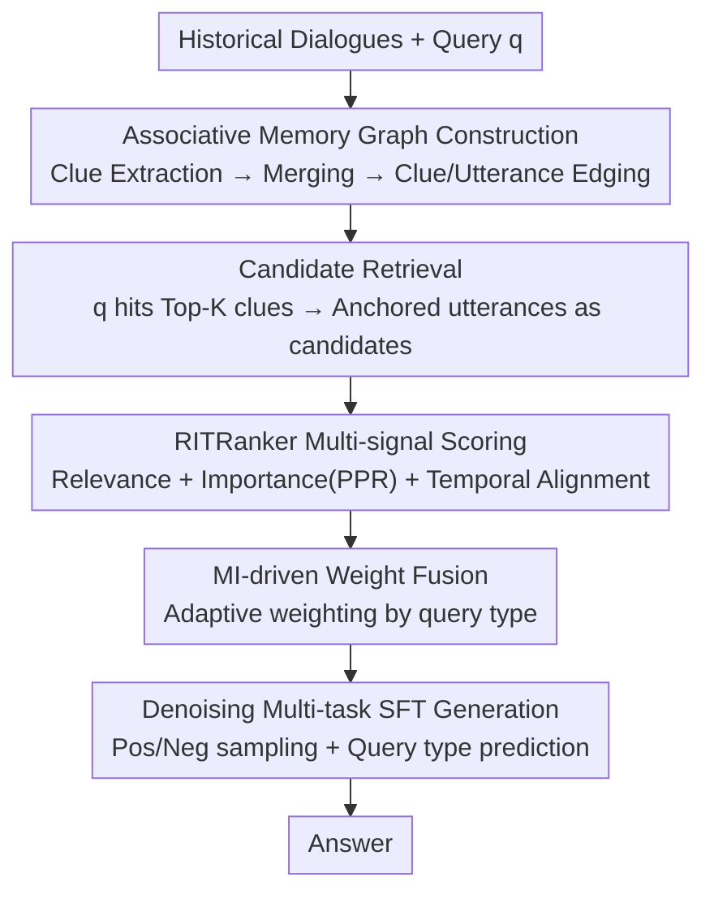

# AssoMem: Scalable Memory QA with Multi-Signal Associative Retrieval

**Conference**: ICLR2026  
**OpenReview**: [https://openreview.net/forum?id=ZCjWUBwCwE](https://openreview.net/forum?id=ZCjWUBwCwE)  
**Code**: TBD  
**Area**: Information Retrieval / Memory QA / RAG  
**Keywords**: Memory QA, Associative Memory Graph, Multi-Signal Retrieval, Personalized PageRank, Mutual Information Fusion

## TL;DR
AssoMem constructs a "clue-utterance" associative memory graph for large-scale personal memory QA and adaptively fuses three signals—relevance, importance, and temporal alignment—using mutual information for ranking. It significantly outperforms SOTA models based solely on semantic similarity in both retrieval and generation across multiple benchmarks.

## Background & Motivation
**Background**: Transforming LLM assistants into a "second brain" requires the ability to continuously store user meeting notes and dialogue records while answering memory recall questions like "What were the key points from the meeting with Sarah last week?" The current mainstream is the RAG paradigm: organizing historical memory (long/short-term segmentation, topic/summary hierarchy filtering, entity-relationship knowledge graphs) and retrieving evidence based on semantic similarity to the query to generate answers.

**Limitations of Prior Work**: Almost all these methods rely exclusively on "relevance" (semantic distance) as the retrieval criterion. However, memory bases expand over time, becoming filled with highly similar entries—repeated meeting topics or overlapping dialogue segments. When similar items cluster, similarity alone fails to distinguish "which one is truly relevant," leading to a collapse in retrieval performance as memory scale increases (Figure 1 in the paper).

**Key Challenge**: Human memory is not composed of isolated items or simple temporal flows; it is organized **associatively**—linking information through "clues" like entities, locations, events, and topics. Furthermore, humans remember important clues more clearly and recall them more frequently. Similarity retrieval discards the dimensions of "importance" and "temporal constraints." For instance, preference-based questions like "What do I usually complain about at work? Give some advice," require clues most important to the user, rather than sentences that literally most resemble the query.

**Goal**: To perform accurate memory recall QA on large-scale, similarity-dense memory bases, three sub-problems must be addressed: (1) How to organize memory to be both fast and importance-aware; (2) How to introduce importance and temporal signals beyond relevance; (3) How to dynamically allocate weights to different signals based on the question type.

**Key Insight**: Mimic the associative memory of the human brain by anchoring each memory "utterance" to automatically extracted clues, forming a graph. Graph mining algorithms are used on this graph to quantify importance, overlaid with explicit temporal matching.

**Core Idea**: Replace "single similarity retrieval" with an "associative memory graph + multi-signal (relevance/importance/time) adaptive fusion via mutual information" to solve memory recall degradation in similarity-dense scenarios.

## Method

### Overall Architecture
AssoMem answers memory questions in two steps at runtime: **Memory Retrieval** and **Answer Generation**. Given a memory base $M=\{(S_i,d_i)\}$ (where each session $S_i$ contains utterances $u$ with timestamps $d_i$) and a query $q$, the retrieval step selects a set of utterance evidence $E^*$ that best supports the answer. The generation step then produces the answer $\hat a=\text{LLM}^*(q,E^*)$ using a fine-tuned model.

The retrieval step is the core of the paper. It first constructs an **associative memory graph** offline: an LLM extracts a representative "clue" for each session (e.g., a project name or event type), links clue nodes to utterance nodes, and adds edges between similar nodes. Online retrieval occurs in two stages: first, the query hits Top-K clues, collecting their anchored utterances as a candidate set; then, the **RITRanker** scores and ranks each candidate utterance. The scoring fuses relevance, importance, and temporal alignment using mutual information-driven adaptive weights. Finally, the generation side employs multi-task denoising fine-tuning on a smaller model to improve its utility of retrieved noisy contexts.

### Key Designs

**1. Associative Memory Graph: Anchoring abstract clues to original utterances for importance ranking**

To address the pain point of "clustered similar items where similarity fails to distinguish," AssoMem no longer treats memories as isolated items but builds a graph $G=(V,E)$. There are two types of nodes: **clue nodes** (representative clues extracted by an LLM for each session, with redundancy removed by merging clues with embedding similarity > $\delta$) and **utterance nodes** (specific utterances encoded into text embeddings using models like BGE). There are also two types of edges: **belonging edges** connecting utterance $u \in S_i$ to its clue $c_i'$, and **similarity edges** connecting similar nodes of the same type where $\text{sim}(v_i,v_j) > \gamma$.

The fundamental difference from existing memory graphs (like Mem0 or KG-based methods) is that while prior graphs are built on **abstract concepts** detached from original historical data, this graph supports bidirectional associative links between "abstract clues $\leftrightarrow$ precise utterances." This structure enables graph mining algorithms to quantify "importance"—the foundation for the most critical of the three signals.

**2. RITRanker 3D Signals: Supplementing relevance with importance and temporal constraints**

This is the main body of retrieval scoring, targeting "single similarity's inability to answer preference or temporal questions." For each candidate utterance $u$, it fuses three dimensions:

- **Relevance** $s^{(rel)}_u=\text{sim}(e_q,e_u)$: Cosine similarity between query and utterance embeddings to ensure content alignment, which is a verified necessity.
- **Importance**: Run **Personalized PageRank (PPR)** on the associative memory graph, $r^{(k+1)}=dMr^{(k)}+(1-d)t$, where $M$ is the adjacency matrix, $d$ is the damping factor, and $t$ is the personalized teleport vector. Crucially, the elements in $t$ corresponding to utterances are filled with "similarity between query and utterance," while clue nodes are set to 0, with $r_0=t$. Using PPR instead of global PageRank ($r_0=\{1/N\}$) avoids inflating the importance of memories unrelated to the question—it acts as an "importance prior conditioned on relevance."
- **Temporal Alignment**: Explicitly performed in three steps—extracting time tokens from the query to judge if temporal reasoning is needed, using TimeLlaMA for temporal embedding of tokens, and calculating $s^{(temp)}_u=\text{sim}(e^{(temp)}_q,e^{(temp)}_u)$. This is used instead of common "recency decay" because decay cannot satisfy "explicitly specified temporal constraints" (e.g., "yesterday's meeting").

Each dimension captures blind spots of simple similarity: preference questions rely on importance, while temporal questions rely on temporal alignment.

**3. MI-driven Adaptive Weight Fusion: Dynamic weighting by question type**

Since "different question types should trust different signals," AssoMem uses **Conditional Mutual Information (CMI)** to measure the information gain of a signal dimension for judging whether an utterance is useful. First, each raw score $\tilde s^{(d)}_u$ is discretized into low/medium/high bins. Pairs of "score bin—usefulness label $y_\lambda$" are collected, and probabilities are estimated per question type $q$ to calculate:

$$\text{CMI}_d(q)=I(\tilde s^{(d)(b)}_u;\lambda\mid q)=\sum_{\tilde s^{(d)(b)}_u}\sum_\lambda p(\tilde s^{(d)(b)}_u,y_\lambda)\log\frac{p(\tilde s^{(d)(b)}_u,y_\lambda\mid q)}{p(\tilde s^{(d)(b)}_u\mid q)\,p(y_\lambda\mid q)}$$

Weights are then calculated via temperature softmax: $w^{(d)}(q)=\dfrac{\exp(\text{CMI}_d(q)/T)}{\sum_{d'}\exp(\text{CMI}_{d'}(q)/T)}$, with the final score:

$$\text{Score}(q,u)=w^{(rel)}(q)\,\tilde s^{(rel)}_u+w^{(imp)}(q)\,\tilde s^{(imp)}_u+w^{(temp)}(q)\,\tilde s^{(temp)}_u$$

This automatically increases the "importance" weight for preference questions and the "temporal" weight for temporal questions. It transforms the selection of which signal to trust from manual tuning into an adaptive process determined by data mutual information.

**4. Denoising Multi-task SFT: Teaching the generation model to use noisy contexts**

Since "good recall $\neq$ good generation—noise in the Top-K can degrade answers," AssoMem performs denoising fine-tuning: $\text{LLM}^*=\text{FineTune}(\text{LLM},D_{QA+Mem})$. Two sampling strategies are used for the denoising QA dataset: (1) mixing positive and negative memory contexts to force the model to distinguish evidence; (2) using purely negative contexts to improve robustness against over-reliance on context. **Multi-task joint training** is also conducted—learning question type prediction and answer generation together, allowing the model to identify intent before utilizing memory. Note that large models (70B/120B) are not fine-tuned; SFT is applied to smaller models (3B/32B) to suppress generation noise.

## Key Experimental Results

### Main Results
Datasets: LongMemEval (small/medium/large levels, with the 'l' level increasing dialogues from 500 to 2,500 rounds) + self-built **MeetingQA** (multi-speaker synthetic meeting data with usefulness labels). Retrieval metrics: Recall@k / nDCG@k; Generation metrics: LLM-as-Judge accuracy, BERTScore, Faithfulness.

Partial retrieval results on LongMemEval medium:

| Method | R@6 | R@10 | nDCG@10 | Acc@6 |
|------|------|------|---------|-------|
| Utterance-flat | 64.25 | 70.18 | 68.04 | 48.66 |
| Session-utterance (mixed granularity) | 70.17 | 78.97 | 76.50 | 55.85 |
| Topic grouping (Prev. SOTA) | 76.47 | 79.14 | 78.86 | 59.95 |
| **AssoMem** | **80.87** | **84.96** | **82.93** | **64.01** |

AssoMem shows a **Gain** of 5.82% over the Prev. SOTA (topic grouping) on 'm', 7.04% on 'l', and 3.81% on MeetingQA. The paper reports an average improvement of **24.93%** over baselines. For generation, Acc@6 increased from 48.66 (flat) → 55.85 (multi-granularity) → 64.01 (AssoMem), with BERTScore rising from 51.71 → 60.06 → 67.56, demonstrating that retrieval quality directly translates to generation quality.

Generation results of different base models using AssoMem Recall@10 context (Table 2): After SFT, LlaMA3.2-3B accuracy increased from 26.91 → 33.43, and Qwen2.5-32B from 64.72 → 73.88 (Acc@10 gains of 6.52% and 9.16% respectively). Non-fine-tuned 70B/120B models remain strong (Gpt-Oss-120B Acc 76.49).

### Ablation Study
Step-wise removal on LongMemEval 'm' (Table 3):

| Configuration | R@6 | R@10 | Acc@6 | Description |
|------|------|------|-------|------|
| **AssoMem (Full)** | 80.87 | 84.96 | 64.01 | — |
| w/o Temporal | 73.39 | 78.37 | 57.88 | Drops most on temporal questions |
| w/o Importance | 75.81 | 79.62 | 59.55 | Preference questions suffer |
| w/o Weight Assignment | 76.79 | 81.80 | 60.38 | Using fixed weights, R@6 drops 4.08% |
| w/o Clue nodes | 79.75 | 84.80 | 63.06 | Removal of clue nodes, R@6 drops 1.12% |

### Key Findings
- **MI weight fusion contributes the most**: Changing to fixed weighting drops R@6 by 4.08%, which is more significant than removing clue nodes (1.12% drop), indicating that "adaptive weighting by question type" is the core source of gain.
- **Strong coupling between dimensions and question types**: Removing the temporal dimension only hurts temporal reasoning tasks, while removing importance only hurts single-user preference tasks (Radar chart Figure 3b), confirming the core thesis that different questions require different signal dimensions.
- **High Robustness**: As memory scales from 500 to 2,500 rounds (m → l), AssoMem's lead over topic grouping actually expands (Gain of 6.39%/7.04% for R@6/R@10). Similarity methods collapse with scale, while AssoMem does not.
- **Recall-Generation Gap**: On 'm', Recall@6 reached 80.87% but Acc@6 was only 64.01%. Noise in the Top-K indeed hampers generation, which justifies the need for denoising fine-tuning.

## Highlights & Insights
- **Translating cognitive concepts into computable graph signals**: Using the personalized teleport vector of PPR to encode query relevance and allowing the graph to propagate "importance" is a clever way to formalize the subjective concept of "what memory is more important to the user" into a stationary distribution on a graph.
- **Mutual Information as a "Signal Router"**: Using CMI to measure the discriminative contribution of each signal dimension for different question types and converting this to weights via softmax avoids the rigidity of "one size fits all" weights. This logic is transferable to any multi-signal retrieval/reranking scenario.
- **Separated yet closed-loop optimization**: Retrieval performs multi-signal fusion while generation performs denoising SFT. This addresses the common gap where "good recall $\neq$ good answers." This combination is more robust than single-point optimization.
- **MeetingQA Dataset**: Fills a gap in large-scale, multi-speaker, usefulness-labeled meeting memory QA evaluation, serving as a valuable public asset.

## Limitations & Future Work
- **Reliance on LLM clue extraction quality**: Clues are automatically generated by an LLM agent and merged by thresholds $\delta/\gamma$. Poor clue extraction or improper thresholds could pollute the entire graph. The paper does not deeply analyze sensitivity or failure modes for this part.
- **MeetingQA is synthetic data**: While synthetic data is useful for showing generalization, the performance under real-world multi-speaker, cross-session noise remains to be verified.
- **Importance approximated by PPR**: Centrality in a graph structure may not perfectly equal subjective user importance; this is a modeling assumption rather than a guarantee.
- **CMI requires "usefulness labels"**: Estimating probabilities depends on labeled data. In new scenarios with label scarcity or distribution drift, weight estimation might be inaccurate.
- **Future Directions**: Introducing dialogue metadata (people, places) and external knowledge like ConceptNet to enrich the graph structure (mentioned as extensible but not fully experimented), and jointly optimizing clue extraction and retrieval in an end-to-end manner.

## Related Work & Insights
- **vs. Memory Segmentation (LST Memory, etc.)**: They enhance recall by cutting history into long/short-term segments. AssoMem avoids temporal segmentation in favor of an associative graph + multi-signals, with the key difference being the explicit modeling of "importance." AssoMem shows clear advantages for preference/temporal questions.
- **vs. Hierarchical Filtering / Topic Grouping (Prev. SOTA)**: They use topic/summary hierarchies to narrow the search space. AssoMem also uses a "clue $\rightarrow$ utterance" two-stage retrieval but overlays it with PPR importance and explicit temporal matching with adaptive weighting, leading to stable performance leads across three datasets.
- **vs. KG-based Memory Graphs (Mem0, etc.)**: Their graphs are built on abstract concepts detached from raw data. AssoMem's graph supports bidirectional anchoring between "abstract clues $\leftrightarrow$ precise utterances," enabling importance-aware ranking.
- **vs. Pure Relevance Reranking**: They still center on semantic similarity. AssoMem's core argument is that "in similarity-dense scenarios, relevance alone is insufficient," using multi-dimensional signals to fill blind spots.

## Rating
- Novelty: ⭐⭐⭐⭐ Combining associative graphs + PPR importance + MI adaptive fusion for memory QA is both novel and self-consistent.
- Experimental Thoroughness: ⭐⭐⭐⭐ Covers three benchmarks + self-built data, multiple base models, dual ablation of dimensions/components, and robustness across scale and question types.
- Writing Quality: ⭐⭐⭐⭐ Clear logic from motivation to method to experiments, with well-organized formulas and research questions.
- Value: ⭐⭐⭐⭐ Directly addresses the core retrieval bottleneck of large-scale personal memory assistants; both the method and MeetingQA have significant reuse value.

<!-- RELATED:START -->

## Related Papers

- [\[ICLR 2026\] BrowseNet: Graph-Based Associative Memory for Contextual Information Retrieval](browsenet_graph-based_associative_memory_for_contextual_information_retrieval.md)
- [\[ICLR 2026\] ZeroGR: A Generalizable and Scalable Framework for Zero-Shot Generative Retrieval](zerogr_a_generalizable_and_scalable_framework_for_zero-shot_generative_retrieval.md)
- [\[ICLR 2026\] Summaries as Centroids for Interpretable and Scalable Text Clustering](summaries_as_centroids_for_interpretable_and_scalable_text_clustering.md)
- [\[ICLR 2026\] MLP Memory: A Retriever-Pretrained Memory for Large Language Models](mlp_memory_a_retriever-pretrained_memory_for_large_language_models.md)
- [\[ACL 2025\] Mitigating Lost-in-Retrieval Problems in RAG Multi-Hop QA](../../ACL2025/information_retrieval/mitigating_lost-in-retrieval_problems_in_retrieval_augmented_multi-hop_question_.md)

<!-- RELATED:END -->
