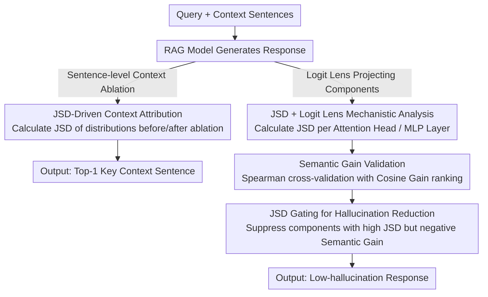

# Attributing Response to Context: A Jensen-Shannon Divergence Driven Mechanistic Study of Context Attribution in Retrieval-Augmented Generation

**Conference**: ICLR 2026  
**arXiv**: [2505.16415](https://arxiv.org/abs/2505.16415)  
**Code**: [https://github.com/ruizheliUOA/ARC_JSD](https://github.com/ruizheliUOA/ARC_JSD)  
**Area**: RAG / Interpretability / Mechanistic Analysis  
**Keywords**: Context Attribution, Jensen-Shannon Divergence, RAG, Mechanistic Interpretability, Attention Heads, MLP Layers, Hallucination Mitigation  

## TL;DR
The authors propose ARC-JSD, a method that achieves efficient and precise RAG context attribution without fine-tuning, gradient computation, or surrogate models by calculating the Jensen-Shannon Divergence (JSD) of response distributions between full and ablated contexts. Combined with Logit Lens for mechanistic analysis, it identifies attention heads and MLP layers responsible for attribution, reducing hallucination rates by approximately 39% through gating operations.

## Background & Motivation

**Background**: RAG enhances LLM generation accuracy by incorporating external contexts. However, reliably attributing generated content to specific context segments (context attribution) remains an open challenge.

**Limitations of Prior Work**:
- High manual annotation costs (Zeng et al., 2021; Slobodkin et al., 2024).
- Gradient-based methods (MIRAGE) require backpropagation, leading to high computational overhead.
- ContextCite necessitates hundreds of forward passes to train linear surrogate models.
- DPO fine-tuning methods (SelfCite) require additional training.

**Key Challenge**: Existing methods struggle to balance attribution accuracy and computational efficiency—they are either accurate but expensive or fast but imprecise.

**Key Insight**: Leveraging the mathematical properties of JSD (symmetry, boundedness $[0, \log 2]$, and scale-invariance) to directly measure changes in response distribution after ablating individual context sentences, bypassing surrogate model training.

**Core Idea**: If removing a context sentence causes the maximum change in the model's output distribution (highest JSD), that sentence is deemed the most critical for the generated response.

## Method

### Overall Architecture
ARC-JSD addresses the context attribution problem—determining which context sentence a generated phrase originates from—efficiently and accurately without training auxiliary models. The approach operates on two levels: first, at the model output level, it identifies key contexts by ablating sentences and observing distribution shifts (attribution); second, it applies this "ablate-and-observe" logic internally to identify specific attention heads and MLP layers responsible for the attribution (mechanistic analysis). Both levels utilize Jensen-Shannon Divergence (JSD) as the core metric: it identifies key sentences at the output level, locates internal components via Logit Lens, cross-validates via independent semantic gain evidence, and finally serves as a gating mechanism to suppress hallucinations.

### Key Designs

**1. JSD-Driven Context Attribution: Quantifying Contribution via Distribution Shifts**

ARC-JSD addresses the efficiency-accuracy trade-off by bypassing surrogate models. For each context sentence $c_i$, it performs a "leave-one-out" generation. The JSD between the response distribution with the full context and the distribution with the ablated context is calculated per token and accumulated:

$$\text{JSD}(c_i) = \sum_{j=1}^{|\mathcal{R}|} \text{JSD}\big(\mathcal{P}_{\text{LM}}(r_j|\mathcal{C},\mathcal{Q}) \,\|\, \mathcal{P}_{\text{LM}}(r_j|\mathcal{C}_{\text{ABLATE}}(c_i),\mathcal{Q})\big)$$

The sentence with the highest score is the key context: $c_{\text{Top-1}} = \arg\max_{c_i} \text{JSD}(c_i)$. Accumulating per-token JSD amplifies sensitivity to local changes (e.g., entity names) without being dominated by high-entropy noise. This "forward-only ablation" is efficient, with complexity proportional to $O(|\mathcal{C}|^2)$, making it faster than ContextCite or gradient methods (MIRAGE) when $|\mathcal{C}| < 256$.

**2. JSD + Logit Lens Mechanistic Analysis: Extending the Metric Internally**

To understand which components perform attribution, JSD is applied to each attention head $(\ell,h)$ and MLP layer $\ell$. Using Logit Lens, intermediate representations are projected into the vocabulary space to derive "pseudo-output distributions." JSD is then calculated between full and ablated conditions. Results indicate that attribution-related attention heads are concentrated in **higher layers**, while MLP layers contribute most in the **mid-to-high layers**.

**3. Semantic Gain Validation: Cross-Validation via Independent Perspectives**

To ensure JSD rankings are not biased by the metric itself, the authors introduce Semantic Gain, measuring whether a component shifts representations closer to the correct answer (cosine similarity increase). By defining $\Delta^{\ell,\text{Attn}}$ and $\Delta^{\ell,\text{MLP}}$ for each layer and using Spearman $\rho$ to test correlation between JSD and Semantic Gain rankings, they confirm that JSD-selected components indeed provide positive semantic contributions.

**4. JSD Gating for Hallucination Reduction: Using Diagnostic Scores as a Switch**

Since JSD identifies "responsible" components, it can also suppress "misleading" ones. JSD scores serve as a confidence gate. Attention heads or MLP layers with high JSD but negative Semantic Gain $G$ (highly active but steering towards wrong answers) are scaled down:

$$\text{Mask} = 0.7 + 0.3 \times \text{sigmoid}(G)$$

When $G < 0$, the mask approaches 0.7, suppressing the component's contribution. This zero-shot gating reduced hallucination rates from 13.4% to 8.2% (approx. 39% reduction) on Qwen2-7B-IT while maintaining Factual F1.

## Key Experimental Results

### Datasets and Models
- Three QA datasets: TyDi QA (440, single-hop), HotpotQA (1000, multi-hop), MuSiQue (1000, multi-hop, avg. 93.6 context sentences).
- Four instruction-tuned models: Qwen2-1.5B/7B-IT, Gemma2-2B/9B-IT.
- Generalization testing: LLaMA-3.1-8B-IT, Qwen3-Next-80B-A3B-IT.

### Main Results (Top-1 Attribution Accuracy)
- ARC-JSD consistently outperforms baselines in the compute-accuracy trade-off on MuSiQue (Fig. 2a).
- Average attribution accuracy improved by approximately **10.7%**.
- While ContextCite-32 is faster when $|\mathcal{C}| > 32$, its accuracy remains lower than ARC-JSD.

### Metric Comparison Ablation

| Metric | Relative Performance |
|------|---------|
| JSD | **Optimal**: symmetric, bounded, scale-invariant |
| KL | Explodes with zero probabilities; lacks cross-layer comparability |
| TV | Bounded but too coarse; fails to distinguish high-entropy vs. key token shifts |
| Wasserstein | Requires distance metric over 152K vocabulary; $O(V^3)$ complexity |
| MMD | Requires kernel functions and token distance definitions |

### Mechanistic Analysis Verification
- Table 3: Spearman $\rho$ between JSD and Semantic Gain rankings is significant ($p<0.05$ or $p<0.01$) across all datasets/models.
- Table 5: Ablating Top-10 JSD attention heads causes significantly larger JSD drops (2.23±0.12) compared to random ones (1.53±0.76).

### Hallucination Reduction (Table 4)

| Setting | Hallucination Rate | Factual F1 |
|------|--------|-----------|
| Base RAG | 13.4% | 76.1 |
| Gate Top-5 Attn & MLP | **8.2%** | 75.9 |
| Gate Random 5 | 12.7% | 69.4 |

### Generalization
- Advantages in compute-accuracy trade-off are maintained on LLaMA-3.1-8B-IT and Qwen3-Next-80B-A3B-IT (MoE).

## Highlights & Insights
- **Simplicity and Efficiency**: The concept—leave-one-out ablation + JSD comparison—is elegant, training-free, and plug-and-play for any RAG system.
- **Theoretical Grounding**: Choosing JSD is well-justified by its symmetry and boundedness compared to KL/TV/Wasserstein.
- **Closed-Loop Mechanistic Analysis**: Moves from identification (JSD) to validation (Semantic Gain) and application (Gating).
- **Visual Semantic Evolution**: Logit Lens reveals how Qwen2 transitions from Chinese tokens to English terms in higher layers ("一只 → A", "翅膀 → wings"), aligning with language anchoring phenomena.
- **Practical Value**: Significant hallucination reduction without retraining.

## Limitations & Future Work
- **Quadratic Complexity**: $O(|\mathcal{C}|^2)$ complexity remains expensive for ultra-long contexts (hundreds of sentences).
- **Top-1 Attribution Only**: Evaluation is limited to sentence-level gold labels due to dataset constraints; finer-grained (phrase/clause) attribution is untested.
- **Limited Gating Scale**: Hallucination experiments conducted on a subset (200 samples) of HotpotQA; requires broader verification.
- **Lack of Direct Comparison**: Accuracy vs. fine-tuning methods like SelfCite is only shown in trade-off plots, not direct tables.
- **Threshold Selection**: The selection of the "small JSD" threshold (0.02 bits) lacks systematic sensitivity analysis.

## Related Work & Insights
- **vs. ContextCite (Cohen-Wang et al., 2024)**: ContextCite requires hundreds of passes for surrogate training; its linear assumption may miss non-linear interactions captured by ARC-JSD's direct distribution measurement.
- **vs. MIRAGE (Qi et al., 2024)**: Gradient methods are computationally heavier and lose information when aggregating from token to sentence levels.
- **vs. Sun et al. (2025)**: While Sun et al. focus on locating hallucination sources, this work locates sources of correct generation; the two are complementary.

## Rating
- Novelty: ⭐⭐⭐⭐ Applying JSD to RAG attribution is novel and theoretically sound.
- Experimental Thoroughness: ⭐⭐⭐⭐ Extensive testing across 3 datasets and 6 models with multi-angle ablation.
- Writing Quality: ⭐⭐⭐⭐ Clear framework, coherent derivations, and intuitive case studies.
- Value: ⭐⭐⭐⭐ Provides both a plug-and-play attribution method and valuable mechanistic insights for RAG transparency.

<!-- RELATED:START -->

## Related Papers

- [\[ACL 2026\] Context Attribution with Multi-Armed Bandit Optimization](../../ACL2026/information_retrieval/context_attribution_with_multi-armed_bandit_optimization.md)
- [\[ICLR 2026\] Embedding-Based Context-Aware Reranker](embedding-based_context-aware_reranker.md)
- [\[ICML 2026\] Less Is More: Elevating RAG via Performance-Driven Context Compression](../../ICML2026/information_retrieval/less_is_more_elevating_rag_via_performance-driven_context_compression.md)
- [\[ACL 2025\] A Reality Check on Context Utilisation for Retrieval-Augmented Generation](../../ACL2025/information_retrieval/a_reality_check_on_context_utilisation_for_retrieval-augmented_generation.md)
- [\[ICLR 2026\] Beyond RAG vs. Long-Context: Learning Distraction-Aware Retrieval for Efficient Knowledge Grounding](beyond_rag_vs_long-context_learning_distraction-aware_retrieval_for_efficient_kn.md)

<!-- RELATED:END -->
