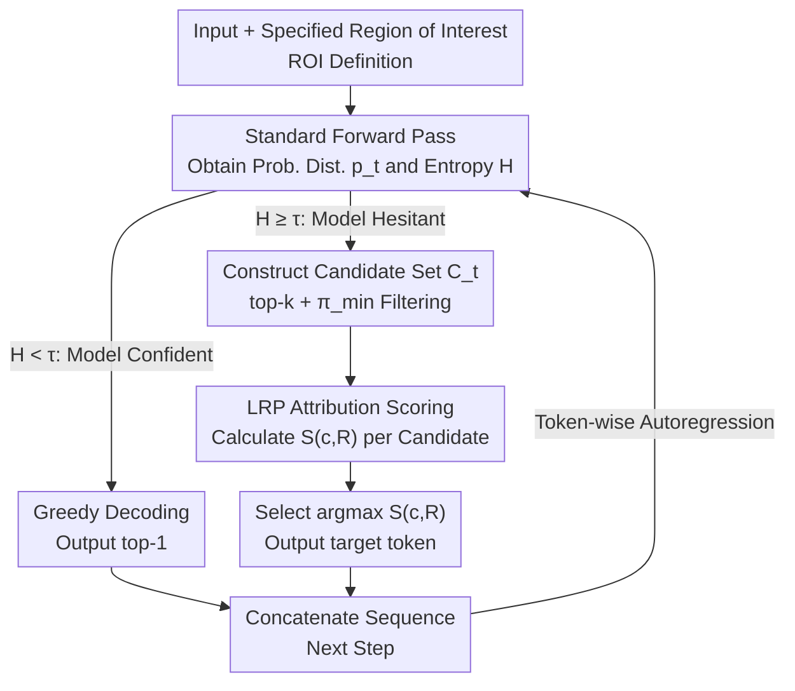

# Attribution-Guided Decoding

**Conference**: ICLR 2026  
**arXiv**: [2509.26307](https://arxiv.org/abs/2509.26307)  
**Code**: [GitHub](https://github.com/piotr-komorowski/AGD)  
**Area**: Robotics  
**Keywords**: attribution method, LRP, instruction following, factuality, entropy-gating, controlled decoding

## TL;DR

Ours proposes the AGD decoding strategy, which selects the token with the highest attribution score regarding a user-specified "Region of Interest" (ROI) from high-probability candidate tokens during each generation step. This transforms attribution methods from passive analysis tools into active generation steering tools, achieving significant improvements in both instruction following and factuality tasks.

## Background & Motivation

**Background**: LLM decoding strategies are critical for controlling generation quality. Standard decoding methods (greedy, top-k, nucleus sampling) control the stochasticity of the output but cannot directly steer generated semantic attributes. To enhance instruction following and factual accuracy, researchers have proposed two categories of methods: (1) **Interventionist methods**, such as activation steering, which directly modify internal model representations, or contrastive decoding (CAD, DoLA), which modify output logits; (2) **Post-processing methods**, which filter or rerank outputs.

**Limitations of Prior Work**: Interventionist methods directly modify the model's forward pass or logit distribution, often pushing the model into out-of-distribution states. This leads to increased perplexity, repetitive outputs, and decreased text quality. This creates an undesirable trade-off where users must choose between "better control" and "higher generation quality." For example, while activation steering improves instruction following, it can severely damage the fluency and coherence of the output.

**Key Challenge**: How to guide generation toward desired behaviors (e.g., following instructions, reducing hallucinations) without modifying internal model states or output distributions? A mechanism is required that provides effective control without compromising generation quality.

**Goal**: (1) Propose a decoding steering method that does not intervene in the model's forward pass; (2) Ensure the method is flexibly applicable to various tasks (instruction following, factuality, context retrieval); (3) Reduce computational overhead and quality loss brought by steering.

**Key Insight**: The authors propose transforming **attribution methods** from post-hoc interpretation tools into forward steering tools. Attribution methods quantify the "dependency" of each candidate token on specific parts of the input. If candidate token A has a higher attribution score toward the user's instruction than candidate token B, it indicates that A is more "compliant" with the instruction. Selecting A achieves instruction steering without modifying any internal model states.

**Core Idea**: Redefine the decoding process as "finding the token among candidates with the maximum attribution to a specified Region of Interest," replacing the probability maximization mechanism with an attribution-based selection mechanism.

## Method

### Overall Architecture

AGD addresses the problem of "guiding generation without touching internal states." It replaces "selecting the most probable token" with "selecting the most compliant token" at each step. Specifically, when generating a token: a standard forward pass is first performed to obtain the probability distribution $\mathbf{p}_t$, and its entropy $H(\mathbf{p}_t)$ is used as a **gate**. If the model is confident (low entropy), it proceeds with standard greedy output to save attribution costs; only when the model is hesitant (high entropy) is AGD enabled. Once enabled, a candidate set $\mathcal{C}_t$ is formed from top-k high-probability tokens and filtered by a threshold $\pi_{\min}$, ensuring selected tokens remain within the model's reasonable range. Then, for a pre-specified **Region of Interest (ROI)** $R$ (such as instruction segments, specific knowledge-processing attention heads, or token embeddings of context documents) acting as the "steering target," an attribution method is used to trace back the attribution score $S(c, R)$ for each token $c$ in the candidate set. Finally, the token with the highest attribution score is output. The entire loop does not modify the forward pass or logit values; it is "selective" rather than "interventionist," which is precisely why it controls generation without destroying text quality.

### Key Designs

**1. LRP-based Attribution Scoring: Quantifying "which part of the input a token depends on" into comparable scores**

Tokens in the candidate set all have high probabilities, so probability alone cannot distinguish which one follows instructions better. AGD performs Layer-wise Relevance Propagation (LRP) on the pre-softmax logits of candidate token $c$ to obtain attribution scores $r_\omega$ for various model components $\omega \in \Omega$. The scores for components falling within the ROI are summed to obtain the total score $S(c, R) = \sum_{\omega \in R} r_\omega$. A higher score indicates the token is more "determined by information in the ROI." LRP (specifically the AttnLRP variant) is chosen over simple Input×Gradient (I×G) because it propagates more stably and faithfully through non-linear components like self-attention and layer normalization in Transformers, with a cost comparable to gradient methods. Crucially, attribution scores are **signed**: positive attribution helps select tokens that rely on instructions, while negative attribution helps avoid tokens that violate negative constraints—a bidirectional signal that pure probability methods cannot provide.

**2. Flexible ROI Definition: Applying the same algorithm to different tasks by changing the ROI**

AGD is a general framework because it abstracts "control targets" into "a set of attributable components in the model." For **instruction following**, the ROI $R_I$ is the set of token embeddings corresponding to the instruction part (e.g., system prompt). For **closed-book factuality**, the ROI $R_P$ is switched to a set of pre-identified parametric knowledge attention heads. For **open-book retrieval**, the ROI can be either context document token embeddings $R_C$ or in-context retrieval attention heads $R_{IC}$. The same AGD algorithm runs in all cases; only the target of $R$ changes. This correspondence between "attribution components ↔ control goals" allows the method to generalize to any control goal quantifiable by attribution.

**3. Adaptive Entropy-Gating: Intervening only at critical forks where the model is uncertain**

Calculating attribution at every step incurs the overhead of multiple backpropagations and can disrupt high-quality outputs when the model is already certain. The gating mechanism uses the Shannon entropy $H(\mathbf{p}_t)$ of the output distribution to decide whether to intervene: if $H(\mathbf{p}_t) < \tau$, the model is confident and uses greedy decoding; if $H(\mathbf{p}_t) \geq \tau$, the model is hesitant and AGD is activated. The threshold $\tau$ is set to the 80th percentile of token-level entropy on IHEval ($\tau = 1.734$). Thus, steering occurs only at "critical forks" that determine the generation trajectory, saving computation and avoiding unnecessary interference with deterministic outputs, significantly improving the "quality-following" trade-off.

### Loss & Training

Ours is a pure inference-time method and **requires no training or fine-tuning**. Fixed parameters: $k=5$ (candidate set size), $\pi_{\min}=0.05$ (minimum probability threshold), $\tau=1.734$ (entropy gating threshold). All experiments use the same hyperparameters without per-model or per-task adjustment.

## Key Experimental Results

### Main Results: Instruction Following

Evaluated on three models (Llama 3.1 8B, Qwen 2.5 7B, Gemma 3 4B) across IHEval and SysBench benchmarks.

| Model | Method | PLA (IHEval) | QS | PLA*QS | SSR (SysBench) |
|------|------|-------------|-----|--------|----------------|
| Llama 3.1 | Greedy | 66.0 | 81.3 | 53.7 | 26.0 |
| Llama 3.1 | CAD | 73.9 | 72.6 | 53.7 | 32.3 |
| Llama 3.1 | AGD_LRP | **79.1** | 73.2 | **57.9** | 32.2 |
| Llama 3.1 | AGD_LRP_e | 74.5 | 76.4 | 56.9 | **33.9** |
| Qwen 2.5 | Greedy | 63.2 | 74.1 | 46.8 | 27.1 |
| Qwen 2.5 | AGD_LRP_e | **70.4** | 70.6 | **49.7** | **29.9** |
| Gemma 3 | Greedy | 84.7 | 82.3 | 69.7 | 33.3 |
| Gemma 3 | AGD_LRP_e | **86.7** | 81.4 | 70.6 | **36.0** |

### Factuality & Context Retrieval (Llama 3.1 8B)

| Setting | Method | TriviaQA | NQ | HotPotQA |
|------|------|----------|-----|----------|
| Closed-book | Greedy | 81.4 | 63.6 | 34.6 |
| Closed-book | DoLA | 81.2 | 63.8 | 34.3 |
| Closed-book | AGD_LRP_h | **82.4** | 63.0 | **39.6** |
| Open-book | Greedy | 89.4 | 83.5 | 81.3 |
| Open-book | CAD | 87.9 | 84.6 | 83.7 |
| Open-book | AGD_LRP_c | **91.4** | **87.9** | **87.9** |

### Key Findings

- **LRP significantly outperforms I×G**: AGD using LRP attribution consistently and broadly outperforms versions using I×G in instruction following. The AttnLRP rules provide more faithful attribution scores in Transformers, translating directly into better steering.
- **Negative attribution signals are critical**: For constraints like "forbidden words," violating candidates generate **negative attribution scores** toward the instruction, helping the model actively avoid those tokens. This is a unique advantage of AGD over simple probability manipulation.
- **Entropy-gating significantly improves the quality-following trade-off**: On Llama 3.1, full AGD achieves a PLA of 79.1 but QS drops to 73.2; the entropy-gated version's PLA drops to 74.5 but QS recovers to 76.4, with the combined PLA*QS metric differing by only 1%. In multi-turn dialogues (SysBench), the gated version's SSR (33.9) even exceeds full AGD (32.2), suggesting that steering only at critical points is often superior.
- **Substantial gains in open-book QA**: On HotPotQA (containing 80% distractor documents), AGD improves over greedy decoding by 6.6 points, indicating that attribution mechanisms help the model lock onto relevant passages within noisy contexts.

## Highlights & Insights

- **Paradigm shift from "Interpretation to Steering"**: Transforming attribution methods from post-hoc analysis tools into active steering signals during generation is a profound perspective shift. While attribution has been used for decades to "explain why," this paper is the first to use it to "decide how."
- **Selection vs. Intervention**: AGD does not modify the forward pass or logit distribution—it simply makes "smarter choices" among candidates the model already deems feasible. This ensures tokens remain within the model's normal distribution, fundamentally avoiding quality degradation issues seen in activation steering.
- **Unified abstraction of ROI**: By abstracting control targets as subsets of attributable components, AGD becomes a universal framework. Any target representable as a set of input tokens or attention heads can be steered via AGD—from instruction following to factuality—simply by changing the ROI definition.

## Limitations & Future Work

- **Candidate set constraints**: As a selection mechanism, AGD cannot generate tokens not present in the candidate set. If the "correct answer" is not in the top-k, AGD cannot function.
- **Computational overhead**: Calculating attribution for each candidate requires multiple backpropagations (though entropy-gating mitigates this), leading to noticeable latency in long text generation.
- **ROI definition dependency**: While instruction-based ROIs are natural, identifying knowledge heads or retrieval heads requires prior analysis, limiting immediate transferability.
- **Verification limited to $\leq$ 8B models**: Experiments use models up to 8B parameters; scalability to larger models (specifically memory requirements for attribution) remains unknown.

## Related Work & Insights

- **vs. CAD (Context-aware Decoding)**: CAD modifies distributions by contrasting logits with and without instructions (interventionist). AGD does not modify logits but selects tokens with the highest attribution among high-probability ones. AGD outperforms CAD in instruction following (79.1 vs 73.9 PLA on Llama 3.1), suggesting attribution signals are more effective than logit differences.
- **vs. Activation Steering**: Steering modifies internal representations, providing strong control but severe quality degradation. AGD's "non-interventional" design inherently avoids this.
- **vs. DoLA**: DoLA uses cross-layer logit contrast to reduce hallucinations (interventionist). AGD significantly outperforms DoLA on closed-book HotPotQA (39.6 vs 34.3), as attribution signals capture knowledge storage locations more precisely than layer contrasts.

## Rating

- Novelty: ⭐⭐⭐⭐⭐ Extremely inspiring shift from interpretation to steering.
- Experimental Thoroughness: ⭐⭐⭐⭐ Extensive coverage of 3 tasks, 3 models, and multiple benchmarks with sufficient ablation.
- Writing Quality: ⭐⭐⭐⭐⭐ Clear structure, excellent visualizations, and well-articulated motivations.
- Value: ⭐⭐⭐⭐⭐ A general training-free decoding framework with a profound impact on controllable LLM generation.

<!-- RELATED:START -->

## Related Papers

- [\[ICLR 2026\] Bridging Draft Policy Misalignment: Group Tree Optimization for Speculative Decoding](bridging_draft_policy_misalignment_group_tree_optimization_for_speculative_decod.md)
- [\[ICLR 2026\] RefTool: Reference-Guided Tool Creation for Knowledge-Intensive Reasoning](reftool_reference-guided_tool_creation_for_knowledge-intensive_reasoning.md)
- [\[ACL 2026\] Context Attribution with Multi-Armed Bandit Optimization](../../ACL2026/information_retrieval/context_attribution_with_multi-armed_bandit_optimization.md)
- [\[ICLR 2026\] Attributing Response to Context: A Jensen-Shannon Divergence Driven Mechanistic Study of Context Attribution in Retrieval-Augmented Generation](attributing_response_to_context_a_jensen-shannon_divergence_driven_mechanistic_s.md)
- [\[ACL 2026\] CiteGuard: Faithful Citation Attribution for LLMs via Retrieval-Augmented Validation](../../ACL2026/information_retrieval/citeguard_faithful_citation_attribution_for_llms_via_retrieval-augmented_validat.md)

<!-- RELATED:END -->
