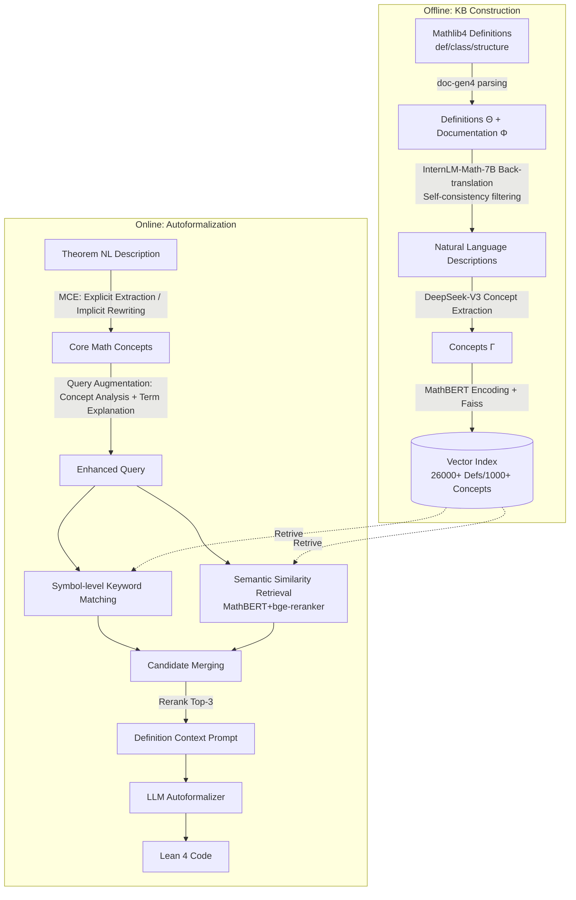

# Automated Formalization via Conceptual Retrieval-Augmented LLMs

**Conference**: ICLR 2026  
**OpenReview**: [https://openreview.net/forum?id=09lmwhDqZ3](https://openreview.net/forum?id=09lmwhDqZ3)  
**Code**: [https://github.com/kahvia0526/CRAMF](https://github.com/kahvia0526/CRAMF)  
**Area**: Information Retrieval / Autoformalization / Retrieval-Augmented Generation  
**Keywords**: Autoformalization, RAG, Lean 4, Mathlib, Mathematical Concept Retrieval, Conceptual Polymorphism  

## TL;DR
CRAMF automatically constructs a "concept–definition" knowledge base from Mathlib4, utilizing query augmentation, dual-channel hybrid retrieval, and reranking to provide precise formal definitions for LLM-based autoformalizers. It serves as a plug-and-play plugin that improves translation accuracy by an average of 29.9% relative gain, reaching up to 62.1%.

## Background & Motivation
**Background**: Autoformalization aims to translate natural language mathematical theorems into machine-verifiable formal code such as Lean, Coq, or Isabelle. It serves as a bridge for LLMs to connect informal reasoning with formal symbolic logic. Systems like DeepMind's AlphaProof, which won a silver medal at the 2024 IMO, rely on such formalization pipelines. Current mainstream approaches involve direct translation using LLMs (via few-shot prompting or fine-tuning on NL–FL pairs), represented by systems like Herald and Kimina-Prover.

**Limitations of Prior Work**: Direct translation via LLMs suffers from two fundamental failures. ① **Model Hallucination**: LLMs confidently generate erroneous formal code, typically by fabricating non-existent predicates in Mathlib, misusing symbols due to informal reasoning, or generating outdated definitions incompatible with the latest Mathlib versions, leading to compilation failures. ② **Semantic Gap**: Mismatches occur between the ambiguity of natural language and the precision of formal language. The most difficult issue is **conceptual polymorphism**: the same expression (e.g., "neighborhood" in topological spaces vs. metric spaces) corresponds to entirely different formal definitions across contexts, domains, or abstraction levels. Choosing the wrong abstraction level triggers type-class synthesis errors, which is particularly severe in fields like combinatorics with many implicit entities.

**Key Challenge**: While RAG is commonly used in general NLP to address hallucinations and ambiguity, adapting RAG for mathematical formalization is non-trivial. Mathlib lacks a structured, searchable mapping from natural language expressions to formal definitions. Resolving conceptual polymorphism requires disambiguating between multiple context-sensitive formalizations, which standard RAG pipelines cannot achieve. Furthermore, formal retrieval demands extremely high precision.

**Goal**: To design a domain-specific retrieval-augmented solution for Lean autoformalization that suppresses hallucinations and bridges the semantic gap.

**Core Idea**: **Concept-driven retrieval-augmentation (concept-driven RAG)** — using "core mathematical concepts" as retrieval units to build a concept–definition knowledge base from Mathlib. Precise definitions are retrieved as context for grounding during the LLM generation process, serving as a plug-and-play enhancement for existing autoformalizers.

## Method

### Overall Architecture
CRAMF operates under the retrieval-augmented paradigm: given a natural language description of a theorem, it first retrieves formal definitions of relevant concepts from a structured knowledge base, then feeds these definitions as context to the LLM autoformalizer to help generate Lean 4 code that is syntactically correct, semantically aligned, and compliant with Mathlib standards. It consists of three main components: KB construction, Mathematical Concept Extraction (MCE), and definition retrieval (including Dual-channel Hybrid Retrieval (DHR) and a reranking module).

### Key Designs

**1. Ontology Schema + Automated KB Population: Converting Mathlib into a searchable concept–definition mapping.** Retrieval requires a structured knowledge base, which Mathlib lacks. The authors define a lightweight ontology $O=(C,P,A,R)$, where entity types $C=\{\Gamma,\Theta,\Phi\}$ represent abstract mathematical concepts, Mathlib formal definitions, and natural language documentation of definitions, respectively. The relationship $R_1\subseteq\Gamma\times\mathcal{P}(\Phi)$ represents the one-to-many mapping from concepts to definitions (the source of polymorphism), and $R_2:\Phi\to\Theta$ is a one-to-one mapping from documentation to definitions. During population, `doc-gen4` parses Mathlib to extract all `def`, `class`, and `structure` entities to fill $\Theta$ and $\Phi$. The core lies in constructing concept entities $\Gamma$: InternLM-Math-7B performs **back-translation** on each formal definition to generate natural language descriptions, quality-controlled by self-consistency (selecting the candidate most semantically aligned with the original documentation). DeepSeek-V3 then extracts underlying mathematical concepts. Each knowledge unit is represented as a quadruple $(\gamma_n,\theta_r,v_c,v_d)$, where $v_c=\text{MathBERT}(\gamma_e)$ and $v_d=\text{MathBERT}(\theta_a)$ are encodings from MathBERT (pre-trained on mathematical corpora) indexed via Faiss, covering 26,000+ definitions and 1,000+ core concepts.

**2. Concept Extraction (MCE) + Implicit Problem Rewriting: Narrowing the retrieval unit from "sentences" to "core concepts."** Retrieving using the entire theorem description introduces noise. CRAMF extracts core mathematical concepts as query units. Problems are handled in two categories: for standard proof problems with explicit concept keywords, the LLM identifies concepts directly; for applied math problems (e.g., combinatorics problems like "in any group of 6 people, 3 know each other or 3 are strangers"), where keywords are absent, an **LLM-based problem rewriting mechanism** is introduced. This mechanism models the problem mathematically to explicitly express the underlying structure before concept extraction. Ablations show this conditional rewriting yields an .8.8% FAR improvement in the CombMath domain.

**3. Query Augmentation + Dual-channel Hybrid Retrieval + Reranking: Suppressing polymorphism via symbolic precision and semantic relevance.** Since a concept may have multiple formal definitions, using only the concept name as a query results in high noise and low recall. Thus, **query augmentation** is performed: an LLM generates a conceptual analysis of the theorem, producing term explanations that fuse domain information, application context, and inter-concept dependencies. The concepts and explanations are concatenated into a query to match richer semantics during retrieval. The retrieval itself runs through two parallel paths: **Symbol-level keyword matching** (where keywords generated by the LLM are used for regex-based exact matches against Mathlib symbols) and **Semantic similarity retrieval** (where the enhanced query is encoded by MathBERT to find Top-10 candidates, followed by `bge-reranker-v2-m3` to select Top-5). Finally, a **reranking** step uses `bge-reranker` for fine-grained semantic evaluation between the query explanation and the KB documentation to select the Top-3 definitions for the context prompt. Removing DHR causes the average FAR to drop by 15.7%.

## Key Experimental Results

### Main Results
**Formalization Accuracy FAR@10** (Gain in relative %):

| Model | miniF2F Base→+CRAMF (Gain) | ProofNet Base→+CRAMF (Gain) | AdvancedMath Base→+CRAMF (Gain) |
|---|---|---|---|
| DeepSeek-V3 | 36.9→47.1 (+27.6%) | 23.6→37.0 (+56.8%) | 19.8→32.1 (**+62.1%**) |
| GPT-4o | 49.6→60.1 (+21.2%) | 29.9→42.2 (+41.1%) | 22.8→34.7 (+52.2%) |
| Gemini 2.5 Flash | 72.1→82.0 (+13.7%) | 57.0→63.1 (+10.7%) | 43.9→50.9 (+15.9%) |
| Claude 4.1 | 83.6→92.6 (+10.8%) | 72.2→79.7 (+10.4%) | 57.2→65.9 (+15.2%) |
| Herald-7B | 49.2→63.1 (+28.3%) | 44.4→55.1 (+24.1%) | 39.3→51.4 (+30.8%) |
| Kimina-7B | 80.3→84.8 (+5.6%) | 65.0→69.3 (+6.6%) | 61.3→66.5 (+8.5%) |
| Godel-V2-8B | 88.1→95.1 (+7.9%) | 73.0→80.2 (+9.9%) | 57.8→68.2 (+18.0%) |

Compilation Pass Rate (CPR@10) also showed universal improvement (e.g., DeepSeek-V3 on AdvancedMath rose from 31.7% to 48.2%, +52.1%).

Retrieval quality (ACS score 0–3 / HitRate@3) compared to 6 baselines:

| Method | ACS (miniF2F/ProofNet/AdvMath) | HitRate@3 (miniF2F/ProofNet/AdvMath) |
|---|---|---|
| BM25 | 0.91 / 0.94 / 0.83 | 11.3% / 14.5% / 9.1% |
| LeanSearch | 1.58 / 1.63 / 1.56 | 36.8% / 42.3% / 35.1% |
| **CRAMF** | **2.07 / 2.14 / 1.93** | **44.2% / 50.6% / 42.9%** |

### Ablation Study
Using Herald-7B as backbone, FAR@10:

| Configuration | miniF2F | ProofNet | AdvancedMath |
|---|---|---|---|
| CRAMF (Full) | 63.1 | 55.1 | 51.4 |
| w/o MCE | 58.2 | 49.8 | 44.0 |
| w/o DHR | 48.5 | 36.8 | 37.1 |
| w/o Rerank | 54.3 | 47.5 | 43.9 |

On the 241-problem CombMath dataset, removing rewriting (w/o ReWrite) dropped FAR from 63.1% to 54.3% (-8.8%).

### Key Findings
- **DHR is critical**: Removing dual-channel hybrid retrieval leads to a 15.7% drop in FAR, confirming the necessity of capturing both semantic relevance and symbolic precision in formal environments.
- **Weaker backbones see larger gains**: General models like DeepSeek-V3 without domain fine-tuning saw relative gains of 62.1% on AdvancedMath. This indicates CRAMF acts as a "plug-and-play knowledge bridge," significantly lowering the barrier for entry; stronger models like Kimina/Godel still showed positive gains.
- **MCE Is indispensable**: Removing concept extraction results in a 6–7 point drop, proving that providing domain knowledge and application context for concepts effectively resolves definition ambiguity.

## Highlights & Insights
- **Dimensionality reduction of the "retrieval unit"**: Moving from full sentences to core concepts targets the root cause of autoformalization hallucinations and polymorphism—most errors occur during "definition selection."
- **Self-bootstrapping KB via back-translation**: Since Mathlib lacks NL–Definition mappings, the authors created a searchable KB from scratch using a "Formal Def → Back-translation → Concept Extraction" pipeline, bypassing expensive manual annotation.
- **Plug-and-play**: CRAMF consistently improves performance across 7 models ranging from general LLMs to specialized formalizers without requiring base model modification or fine-tuning.
- **Symbolic precision × Semantic relevance dual-channel**: Pure semantic retrieval (HyDE/LeanSearch) cannot satisfy the symbolic rigors of Lean, while pure keyword search (BM25) misses semantic variants. The dual-channel design is a tailored solution for formal retrieval.

## Limitations & Future Work
- Knowledge base construction heavily relies on LLMs (InternLM for back-translation, DeepSeek for concept extraction); noise from back-translation may introduce systemic biases.
- The system is tightly coupled with Mathlib versions; updates require KB reconstruction. Portability to other ITPs like Coq or Isabelle is unverified.
- The multi-step pipeline (back-translation → MCE → query augmentation → retrieval → reranking) involves multiple model calls, leading to higher online latency and costs.
- Evaluation on AdvancedMath (173 problems) and CombMath (241 problems) uses relatively small datasets, and AdvancedMath is a private dataset, limiting external comparability.

## Related Work & Insights
- **Autoformalization**: Divided into rule-based methods (Mizar, ForTheL, GF using controlled natural languages) and LLM-based methods (few-shot prompting or fine-tuning), represented by Herald, Kimina-Prover, and Godel-Formalizer.
- **Retrieval-Augmented Generation (RAG)**: While RAG for suppressing factual hallucinations is mature in general domains, this work adapts it to mathematical formalization, addressing "lack of structured mapping + conceptual polymorphism + high precision requirements."
- **Insight**: When task failures concentrate on "symbol/entity selection" rather than "reasoning workflow," retrieving precise domain definitions is more cost-effective than using larger models. Automatically back-translating domain libraries into searchable KBs is a generic strategy for bringing RAG to specialized domains lacking annotations.

## Rating
- Novelty: ⭐⭐⭐⭐
- Experimental Thoroughness: ⭐⭐⭐⭐
- Writing Quality: ⭐⭐⭐⭐
- Value: ⭐⭐⭐⭐

<!-- RELATED:START -->

## Related Papers

- [\[ICLR 2026\] Retro*: Optimizing LLMs for Reasoning-Intensive Document Retrieval](retro_optimizing_llms_for_reasoning-intensive_document_retrieval.md)
- [\[ACL 2026\] CiteGuard: Faithful Citation Attribution for LLMs via Retrieval-Augmented Validation](../../ACL2026/information_retrieval/citeguard_faithful_citation_attribution_for_llms_via_retrieval-augmented_validat.md)
- [\[ACL 2025\] AIR-Bench: Automated Heterogeneous Information Retrieval Benchmark](../../ACL2025/information_retrieval/air-bench_automated_heterogeneous_information_retrieval_benchmark.md)
- [\[ACL 2025\] Automatic Benchmark Generation from Scientific Papers via Retrieval-Augmented LLMs](../../ACL2025/information_retrieval/automatic_benchmark_generation_from_scientific_papers_via_retrieval-augmented_ll.md)
- [\[ICLR 2026\] Let LLMs Speak Embedding Languages: Generative Text Embeddings via Iterative Contrastive Refinement](let_llms_speak_embedding_languages_generative_text_embeddings_via_iterative_cont.md)

<!-- RELATED:END -->
