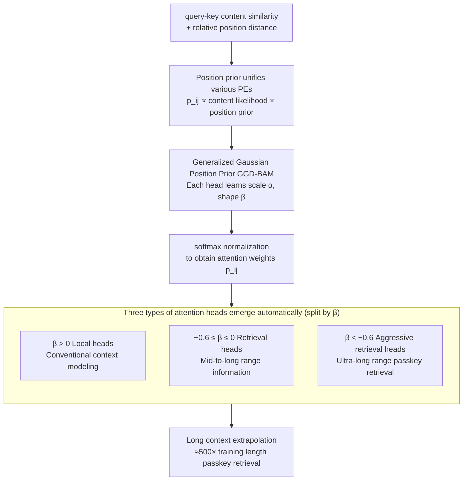

# Bayesian Attention Mechanism: A Probabilistic Framework for Positional Encoding and Context Length Extrapolation

**Conference**: ICLR 2026  
**arXiv**: [2505.22842](https://arxiv.org/abs/2505.22842)  
**Code**: [https://github.com/ArthurSBianchessi/BAM](https://github.com/ArthurSBianchessi/BAM)  
**Area**: Information Retrieval  
**Keywords**: Bayesian Attention, Positional Encoding, Context Extrapolation, Generalized Gaussian Distribution, Long Context  

## TL;DR
The paper reformulates positional encoding as a prior distribution within a Bayesian attention mechanism, unifying NoPE (uniform prior) and ALiBi (Laplace prior). It proposes a Generalized Gaussian Prior (GGD-BAM) that achieves perfect passkey retrieval at 500x training length with an addition of only 384 parameters.

## Background & Motivation

**Background**: Transformers lack inherent positional information and require Positional Encoding (PE). Existing methods (Sinusoidal, RoPE, ALiBi, NoPE) vary in context length extrapolation performance but lack a unified theoretical understanding.

**Limitations of Prior Work**: (a) PE methods are largely empirical with weak theoretical foundations; (b) Evaluation relies excessively on perplexity, which does not reflect true extrapolation—models can achieve low perplexity via sliding window attention without being able to retrieve distant information.

**Key Challenge**: Different PE methods perform inconsistently across scenarios, and there is no unified framework to analyze their behavioral differences and applicability.

**Goal**: (a) Provide a unified theoretical framework for PE; (b) Derive new PE strategies based on this theory; (c) Achieve true long-context extrapolation (retrieval-based rather than just perplexity-based).

**Key Insight**: Interpret attention weights $p_{ij}$ as a joint probability distribution of content and position; PE then naturally emerges as a positional prior.

**Core Idea**: PE serves as the positional prior of attention. By selecting a Generalized Gaussian Distribution and allowing "anti-local" attention heads where $\beta < 0$, ultra-long context retrieval is achieved.

## Method

### Overall Architecture
BAM addresses the fragmentation of existing PE methods, which are often based on disjoint intuitions and are difficult to compare. The core mechanism treats each attention weight as a **joint probability** of content and position events, formulated as $p_{ij} \propto p(f_{\text{cont}}(\mathbf{q}_i, \mathbf{k}_j)) \cdot p(g_{\text{pos}}(i,j))$. The first term $p(f_{\text{cont}})$ represents the standard query-key similarity (content likelihood), while the second term $p(g_{\text{pos}}(i,j))$ is the **positional prior** depending only on relative positions $i,j$. Consequently, positional encoding is no longer a handcrafted bias added to logits, but a prior with a flexible shape within the attention distribution. The pipeline involves multiplying content likelihood with the positional prior and normalizing via softmax to obtain $p_{ij}$. The shape of the positional prior is determined by two learnable parameters of the Generalized Gaussian Distribution (GGD). The sign of the shape parameter $\beta$ allows different attention heads to spontaneously differentiate into local or retrieval heads, facilitating long-context extrapolation.

### Key Designs

**1. Unified PE via Positional Prior: Situating Empirical Methods in a Probabilistic Perspective**

Existing PEs are fragmented because they originate from different intuitions. BAM demonstrates that by viewing $p(g_{\text{pos}})$ as a positional prior, common methods become special cases of prior shapes: NoPE corresponds to a uniform prior (no positional preference), and ALiBi corresponds to a Laplace prior (linear decay with distance, equivalent to GGD with shape parameter $\beta = 1$). This allows the extrapolation differences of various PEs to be analyzed as variations in shape parameters within the same family, enabling comparison and search in a continuous parameter space.

**2. Generalized Gaussian Positional Prior (GGD-BAM): Learning Decay Shapes per Head**

BAM replaces the positional prior with a Generalized Gaussian Distribution, which corresponds to an attention bias $b_{ij} = -\left|\frac{j-i-\mu}{\alpha}\right|^{\beta}$. Each head is assigned two learnable parameters: scale $\theta_\alpha$ (controlling decay speed) and shape $\theta_\beta$ (controlling the decay curve). The shape parameter $\beta$ dictates head behavior: $\beta > 1$ results in sharper local focus than ALiBi; $\beta \in (0,1)$ yields heavy-tailed decay for longer-range context. The paper further **relaxes the $\beta > 0$ constraint**, allowing $\beta < 0$ to create an **anti-local attention** prior. This suppresses weights of nearby tokens and pushes attention toward the far end. Theoretically, when $\beta < 0$, the nearby weight $\lim_{|i-j|\to 0} p_{ij}=0$ while the distant weight $\lim_{|i-j|\to\infty} p_{ij}\neq 0$. This essentially creates a "retrieval head" specifically for distal information. Negative $\beta$ is crucial for extrapolation because long-range passkey retrieval requires heads to ignore local context and lock onto distant tokens—something monotonic decay PEs cannot achieve.

**3. Automatic Emergence of Three Types of Heads: Specialization over Global Tuning**

Training does not explicitly assign heads to local or retrieval tasks; instead, shape parameters spontaneously cluster into three groups after convergence: local heads ($\beta > 0$) for standard modeling, retrieval heads ($-0.6 \leq \beta \leq 0$) for mid-range info, and aggressive retrieval heads ($\beta < -0.6$) for ultra-long range tasks. This specialization is stable across model scales (from 120M upwards), suggesting it is a natural outcome of the prior family. The models with the furthest extrapolation capabilities are those that develop negative $\beta$ heads.

> ⚠️ Note: The specific threshold for $\beta$ (-0.6) follows the original text.

### Loss & Training
The model is trained using standard language modeling cross-entropy loss without additional retrieval supervision. Diversification of heads occurs naturally. GGD-BAM was trained on 512-token contexts (FineWeb 10B, Mistral-7B tokenizer). Each head per layer introduces $\theta_\alpha, \theta_\beta, \theta_\mu$ (with $\theta_\mu$ fixed to 0 in experiments), totaling only 384 extra parameters for a 120M model. It can be combined with Scalable Softmax (SSMax), which scales logits by sequence length to mitigate attention dilution. The combination, BAM-SSMax, provides the best performance, enabling 500x extrapolation with negligible overhead.

## Key Experimental Results

### Main Results (Passkey Retrieval Accuracy)

| Method | Training Length | 1K | 4K | 8K | 16K | 32K | 256K |
|------|---------|-----|-----|-----|------|------|-------|
| Sinusoidal | 512 | ~Random | 0% | 0% | 0% | 0% | 0% |
| RoPE | 512 | ~Random | 0% | 0% | 0% | 0% | 0% |
| ALiBi | 512 | High | Dropping | Low | ~0% | ~0% | 0% |
| **BAM-GGD** | **512** | **100%** | **100%** | **100%** | **100%** | **100%** | **>80%** |

### Ablation Study

| Configuration | Max Passkey Extrapolation | Perplexity | Description |
|------|----------------|--------|------|
| BAM + SSMax | 500× training length | Comparable to ALiBi | Optimal configuration |
| BAM ($\beta > 0$ only) | Limited | Slightly better | No retrieval heads |
| BAM ($\beta < 0$ allowed) | 500× | Slightly higher | Retrieval heads present, local weaker |
| ALiBi baseline | ~10× | Good | Cannot extrapolate far |

### Key Findings
- Attention heads with $\beta \leq 0$ are critical for long-range retrieval, as they "ignore" local tokens.
- BAM outperforms all baseline PE methods on the RULER benchmark.
- Perplexity is comparable to ALiBi, but retrieval is vastly superior, proving PPL is insufficient for evaluating extrapolation.
- The three-group clustering of $\beta$ remains stable as model scale increases.

## Highlights & Insights
- **Unified Theoretical Framework**: Treating PE as a prior provides an elegant explanation for various methods and naturally leads to new architectures. It is transferable to any position-sensitive attention design.
- **Negative $\beta$ Retrieval Heads**: The discovery that allowing "anti-local" heads enables ultra-long retrieval is a major finding, akin to functional specialization in Mixture of Experts.
- **Efficiency**: Achieves 500x extrapolation with only 384 additional parameters.

## Limitations & Future Work
- Primarily validated on 120M parameter models; large-scale (7B+) testing is missing.
- Passkey retrieval is a synthetic task; verification on real-world long-document understanding is needed.
- $\beta < 0$ heads increase perplexity, necessitating a balance between local and retrieval heads.

## Related Work & Insights
- **vs ALiBi**: ALiBi is a special case of BAM at $\beta = 1$. BAM automatically discovers superior positional preferences by learning $\beta$.
- **vs RoPE**: RoPE is a multiplicative PE and is not covered by BAM's additive framework, but experiments show it is significantly weaker at extrapolation.
- **vs NoPE**: NoPE is a special case with a uniform prior and shows limited extrapolation capacity.

## Rating
- Novelty: ⭐⭐⭐⭐⭐ Elegant framework; discovery of negative $\beta$ heads is a significant contribution.
- Experimental Thoroughness: ⭐⭐⭐⭐ Includes Passkey, RULER, PPL, and visualization, though model scale is limited.
- Writing Quality: ⭐⭐⭐⭐⭐ Clear theoretical derivation and intuitive visualizations.
- Value: ⭐⭐⭐⭐⭐ Fundamental contribution to the understanding of PE theory.

<!-- RELATED:START -->

## Related Papers

- [\[ICML 2026\] LazyAttention: Efficient Retrieval-Augmented Generation with Deferred Positional Encoding](../../ICML2026/information_retrieval/lazyattention_efficient_retrieval-augmented_generation_with_deferred_positional_.md)
- [\[ICML 2026\] LARE: Low-Attention Region Encoding for Text–Image Retrieval](../../ICML2026/information_retrieval/lare_low-attention_region_encoding_for_text-image_retrieval.md)
- [\[ICLR 2026\] Hierarchical Encoding Tree with Modality Mixup for Cross-modal Hashing](hierarchical_encoding_tree_with_modality_mixup_for_cross-modal_hashing.md)
- [\[ICLR 2026\] Embedding-Based Context-Aware Reranker](embedding-based_context-aware_reranker.md)
- [\[ICLR 2026\] ZeroGR: A Generalizable and Scalable Framework for Zero-Shot Generative Retrieval](zerogr_a_generalizable_and_scalable_framework_for_zero-shot_generative_retrieval.md)

<!-- RELATED:END -->
